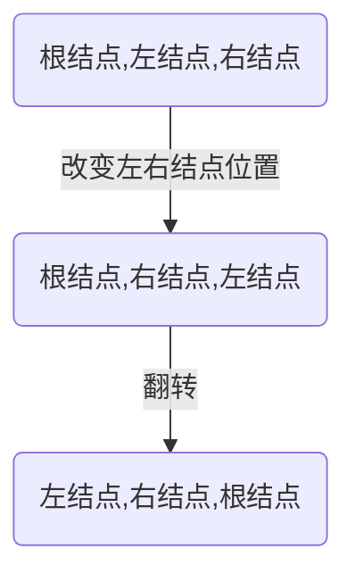

# 算法

#### 1. 数组

##### 1. 剑指Offer：数组旋转

1. **题目描述**：

把一个数组最开始的若干个元素搬到数组的末尾，我们称之为数组的旋转。**输入一个非递减排序的数组的一个旋转，输出旋转数组的最小元素**。例如数组{3,4,5,1,2}为{1,2,3,4,5}的一个旋转，该数组的最小值为1。
NOTE：给出的所有元素都大于0，若数组大小为0，请返回0。

原题传送门：[link](https://www.nowcoder.com/practice/9f3231a991af4f55b95579b44b7a01ba?tpId=13&tqId=11159&rp=1&ru=/ta/coding-interviews&qru=/ta/coding-interviews/question-ranking).

2. **关键词：**

二分查找

3. **思路**

* 利用二分查找的思路，将数组中间的元素和最右端元素对比大小。

 > int mid = low + (high - low) / 2;  

* 分情况讨论

1. 小部分旋转到后面的情况，array=【23451】时，mid=4，high=1。mid>high，最小的数字一定在后半部分，low=mid+1；

>//此时mid不可能是最小的数字

2. 大部分旋转到后面的情况，array=【51234】时，mid=2，high=4。mid<high，最小的数字一定在前半部分，high=mid；

> //此时mid有可能是最小的数

3. 特殊的情况，array=【11101】或array=【10111】时，mid=high=1。最小的数字一可能在前半部分也可能在后半部分，high=high-1。

>//保留了与high相等mid，排除high不影响。

4. 代码实现（Java）

```java
import java.util.ArrayList;
public class Solution {
    public int minNumberInRotateArray(int [] array) {
       int low = 0 ; int high = array.length - 1;   
        while(low < high){
            //mid为动态取值
            int mid = low + (high - low) / 2;        
            if(array[mid] > array[high]){
                low = mid + 1;
            }else if(array[mid] == array[high]){
                high = high - 1;
            }else{
                high = mid;
            }   
        }
        return array[low];
    }
}
```

5. **知识积累**

掌握二分查找

##### 2. 剑指Offer：调整数组顺序使奇数位于偶数前面

1. 题目描述 

输入一个整数数组，实现一个函数来调整该数组中数字的顺序，使得所有的奇数位于数组的前半部分，所有的偶数位于数组的后半部分，并保证奇数和奇数，偶数和偶数之间的相对位置不变。

NOTE：保证base和exponent不同时为0

原题传送门：[link](https://www.nowcoder.com/practice/beb5aa231adc45b2a5dcc5b62c93f593?tpId=13&tqId=11166&rp=1&ru=%2Fta%2Fcoding-interviews&qru=%2Fta%2Fcoding-interviews%2Fquestion-ranking&tPage=1).

2. 关键词

冒泡排序

3. 思路

* 我们可以借鉴冒泡排序的特点，让偶数不断向右边移动，而冒泡的过程本身也可以保证相对顺序的不变,最后所有的偶数都移动到了右边，最坏情况下外层循环需要进行array.size()次。

来自牛客网：[link](https://www.nowcoder.com/questionTerminal/beb5aa231adc45b2a5dcc5b62c93f593?answerType=1&f=discussion).

4. 代码实现（Java）

```java
public class Solution {
    public void reOrderArray(int [] array) {
        //每次至少会有一个偶数换到最后
        for(int len=array.length;len>0;len--){
           Boolean change=false;
           for(int i=0;i<array.length-1;i++)
           {
               if (array[i]%2==0&&array[i+1]%2==1){//若为偶数且下一个数为奇数
                   int temp=array[i];
                    array[i]=array[i+1];
                     array[i+1]=temp；
                    change = true;//结束条件是不发生交换
               }
           }
           if(!change){
               return;
           }
       } 
    }
}
```

时间复杂度为（**O^2**）

5. 知识积累

暂无

##### 3. 剑指Offer： 顺时针打印矩阵

1. 题目描述

输入一个矩阵，按照从外向里以顺时针的顺序依次打印出每一个数字，例如，如果输入如下4 X 4矩阵： 1 2 3 4 5 6 7 8 9 10 11 12 13 14 15 16 则依次打印出数字1,2,3,4,8,12,16,15,14,13,9,5,6,7,11,10.

原题传送门：[link](https://www.nowcoder.com/practice/9b4c81a02cd34f76be2659fa0d54342a?tpId=13&tqId=11172&tPage=1&rp=1&ru=%2Fta%2Fcoding-interviews&qru=%2Fta%2Fcoding-interviews%2Fquestion-ranking).

2. 关键词

 ArrayList

3. [链接：](https://www.nowcoder.com/questionTerminal/9b4c81a02cd34f76be2659fa0d54342a?answerType=1&f=discussion)
   **简单来说，就是不断地收缩矩阵的边界**
   定义四个变量代表范围，up、down、left、right

   1. 向右走存入整行的值，当存入后，该行再也不会被遍历，代表上边界的 up 加一，同时判断是否和代表下边界的 down 交错 
   2. 向下走存入整列的值，当存入后，该列再也不会被遍历，代表右边界的 right 减一，同时判断是否和代表左边界的 left 交错 
   3. 向左走存入整行的值，当存入后，该行再也不会被遍历，代表下边界的 down 减一，同时判断是否和代表上边界的 up 交错 
   4. 向上走存入整列的值，当存入后，该列再也不会被遍历，代表左边界的 left 加一，同时判断是否和代表右边界的 right 交错

   

* 暂无

4. 代码实现（Java）

```java
import java.util.ArrayList;
public class Solution {
    public ArrayList<Integer> printMatrix(int [][] matrix) {
       if(matrix==null)
           return null;
       ArrayList<Integer> list=new ArrayList<Integer> ();
       int left=0,top=0,right=matrix.length-1,bottom=matrix[0].length-1;
       while(left<=right&&top<=bottom){
           //从左向右
           for(int i=left;i<=right;i++){
               list.add(matrix[top][i]);
           }
           //从上到下（从下一行开始向下走）
           for(int j=top+1;j<=bottom;j++){
               list.add(matrix[j][right]);
           }
           //从右到左，有可能出现特殊的情况只有一行，为了避免重复访问
           if(top!=bottom){
               for(int k=right-1;k>=left;k--){
                   list.add(matrix[bottom][k]);
               }
           }
           //从下到上，有可能出现特殊的情况只有一列，为了避免重复访问
           if(left!=right){
               for(int l=bottom-1;l>top;l--){
                   list.add(matrix[l][left]);
               }
           } 
           //下一个正方形矩阵
           top++;left++;right--;bottom--;
             
       }
        return list; 
   }
}
```

5. 知识积累

* 数组：连续存储，索引速度快 缺点不好插入数据

* ArrayList：继承了IList类，插入删除方便快捷

##### 4. [剑指Offer: 数组中出现次数超过一半的数字](https://www.nowcoder.com/questionTerminal/e8a1b01a2df14cb2b228b30ee6a92163?answerType=1&f=discussion)

1. 题目描述

数组中有一个数字出现的次数超过数组长度的一半，请找出这个数字。例如输入一个长度为9的数组{1,2,3,2,2,2,5,4,2}。由于数字2在数组中出现了5次，超过数组长度的一半，因此输出2。如果不存在则输出0。

原题传送门：[link](https://www.nowcoder.com/practice/e8a1b01a2df14cb2b228b30ee6a92163?tpId=13&tqId=11181&rp=1&ru=/ta/coding-interviews&qru=/ta/coding-interviews/question-ranking).

2. 关键词

分形叶思想

3. 思路

* 如果有符合条件的数字，则它出现的次数比其他所有数字出现的次数和还要多。

* 在遍历数组时维护两个变量：**一是数组中一个数字，一是次数**。遍历下一个数字时，若它与之前保存的数字相同，则次数加1，否则次数减1；若次数为0，则保存下一个数字，并将次数置为1。

>1. 假设数组中有一个数字x出现的次数超过数组长度的一半。【1,2,3,4,5,6,6,6,6,6,6】中，x=6符合条件。
>2. 从数组中随机选择两个数。若相同，保留；若不同，抵消。那么6一定会保留下来。
>3. 所以上述方法可以达到此目的。

* 遍历结束后，所保存的数字即为所求，**他可能满足条件**。然后再判断它是否符合条件即可。

 >判断是否符合条件是必要的。比如数组【1,2,3]，最后会留下3，但是不符合条件！

4. 代码（Java）

```java
public class Solution
{
    public int MoreThanHalfNum_Solution(int [] array)
    {
        int count=0;
        int temp=0;
        for(int i=0;i<array.length;i++)
        {
            if(temp==array[i])
                count++;
            else if(count>0)
                count--;
            else
            {
                temp=array[i];
                count=1;
            }
        }  
        count=0;
        for(int i=0;i<array.length;i++)
        {
            if(temp==array[i])
             count ++;
        }
        return count>array.length/2?temp:0;
    }
}
```

5. 知识积累

* **另一种方法：将数组排个序，输出中间的元素，因为如果有出现次数超过一半的数值话，排完序后中间的那个元素肯定是它**。然后再遍历这个数组求其数量是否符合题意即可。
* 但样做的话排序的时间复杂度一般来说是O(NlogN)，本文算法时间复杂度为O(N)。

##### 5. 剑指Offer：丑数

1. 题目描述

把只包含质因子2、3和5的数称作丑数（Ugly Number）。例如6、8都是丑数，但14不是，因为它包含质因子7。 习惯上我们把1当做是第一个丑数。求按从小到大的顺序的第N个丑数。原题传送门：[link](https://www.nowcoder.com/practice/6aa9e04fc3794f68acf8778237ba065b?tpId=13&tqId=11186&tPage=2&rp=1&ru=%2Fta%2Fcoding-interviews&qru=%2Fta%2Fcoding-interviews%2Fquestion-ranking).

2. 关键词

 **丑数**

3. 思路

首先从丑数的定义我们知道，一个丑数的因子只有2,3,5，那么丑数p = 2 ^ x * 3 ^ y * 5 ^ z，换句话说一个丑数一定由另一个丑数乘以2或者乘以3或者乘以5得到，那么我们从1开始乘以2,3,5，就得到2,3,5三个丑数，在从这三个丑数出发乘以2,3,5就得到4，6,10,6，9,15,10,15,25九个丑数，我们发现这种方法得到重复的丑数，而且我们题目要求第N个丑数，这样的方法得到的丑数也是无序的。那么我们可以维护三个队列：
（1）丑数数组： 1
乘以2的队列：2
乘以3的队列：3
乘以5的队列：5
选择三个队列头最小的数2加入丑数数组，同时将该最小的数乘以2,3,5放入三个队列；
（2）丑数数组：1,2
乘以2的队列：4
乘以3的队列：3，6
乘以5的队列：5，10
选择三个队列头最小的数3加入丑数数组，同时将该最小的数乘以2,3,5放入三个队列；
（3）丑数数组：1,2,3
乘以2的队列：4,6
乘以3的队列：6,9
乘以5的队列：5,10,15
选择三个队列头里最小的数4加入丑数数组，同时将该最小的数乘以2,3,5放入三个队列；
（4）丑数数组：1,2,3,4
乘以2的队列：6，8
乘以3的队列：6,9,12
乘以5的队列：5,10,15,20
选择三个队列头里最小的数5加入丑数数组，同时将该最小的数乘以2,3,5放入三个队列；
（5）丑数数组：1,2,3,4,5
乘以2的队列：6,8,10，
乘以3的队列：6,9,12,15
乘以5的队列：10,15,20,25
选择三个队列头里最小的数6加入丑数数组，但我们发现，有两个队列头都为6，所以我们弹出两个队列头，同时将12,18,30放入三个队列；
……………………
疑问：
1.为什么分三个队列？
丑数数组里的数一定是有序的，因为我们是从丑数数组里的数乘以2,3,5选出的最小数，一定比以前未乘以2,3,5大，同时对于三个队列内部，按先后顺序乘以2,3,5分别放入，所以同一个队列内部也是有序的；
2.为什么比较三个队列头部最小的数放入丑数数组？
因为三个队列是有序的，所以取出三个头中最小的，等同于找到了三个队列所有数中最小的。
实现思路：
我们没有必要维护三个队列，只需要记录三个指针显示到达哪一步；“|”表示指针,arr表示丑数数组；
（1）1
|2
|3
|5
目前指针指向0,0,0，队列头arr[0] * 2 = 2,  arr[0] * 3 = 3,  arr[0] * 5 = 5
（2）1 2
2 |4
|3 6
|5 10
目前指针指向1,0,0，队列头arr[1] * 2 = 4,  arr[0] * 3 = 3, arr[0] * 5 = 5
（3）1 2 3
2| 4 6
3 |6 9
|5 10 15
目前指针指向1,1,0，队列头arr[1] * 2 = 4,  arr[1] * 3 = 6, arr[0] * 5 = 5
………………

4. 代码（Java）

```java
public class Solution {
    public int GetUglyNumber_Solution(int index) {
     
   if(index<=0)
            return 0;
        int[] result = new int[index];
        int count = 0;
        int i2 = 0;
        int i3 = 0;
        int i5 = 0;
        result[0] = 1;
        int tmp = 0;
        while (count < index-1) {
            tmp = min(result[i2] * 2, min(result[i3] * 3, result[i5] * 5));
            if(tmp==result[i2] * 2) i2++;//三条if防止值是一样的，不要改成else的
            if(tmp==result[i3] * 3) i3++;
            if(tmp==result[i5]*5) i5++;
            result[++count]=tmp;
        }
        return result[index - 1];
    }
    private int min(int a, int b) {
        return (a > b) ? b : a;
    }
}
```

5. 复杂度

* 暂无

6. 知识积累

* 暂无

##### 6. 剑指Offer: 数组中的逆序对

1. 题目描述

在数组中的两个数字，如果前面一个数字大于后面的数字，则这两个数字组成一个逆序对。输入一个数组,求出这个数组中的逆序对的总数P。并将P对1000000007取模的结果输出。 即输出P%100000000

> 题目保证输入的数组中没有的相同的数字数据范围：
>
> 对于%50的数据,size<=10^4	
>
> 对于%75的数据,size<=10^5
>
> 对于%100的数据,size<=2*10^5

2. 关键词：归并排序

3. 思路：归并排序的改进，把数据分成前后两个数组(递归分到每个数组仅有一个数据项)，合并数组，合并时，出现前面的数组值array[i]大于后面数组值array[j]时；则前面数组array[i]~array[mid]都是大于array[j]的，count += mid+1 - i。

4. 代码（Java）

```java
public class Solution {
    public int InversePairs(int [] array) {
        if(array==null||array.length==0)
        {
            return 0;
        }
        int[] copy = new int[array.length];
        for(int i=0;i<array.length;i++)
        {
            copy[i] = array[i];
        }
        int count = InversePairsCore(array,copy,0,array.length-1);//数值过大求余
        return count;
         
    }
    private int InversePairsCore(int[] array,int[] copy,int low,int high)
    {
        if(low==high)
        {
            return 0;
        }
        int mid = (low+high)>>1;
        int leftCount = InversePairsCore(array,copy,low,mid)%1000000007;
        int rightCount = InversePairsCore(array,copy,mid+1,high)%1000000007;
        int count = 0;
        int i=mid;
        int j=high;
        int locCopy = high;
        while(i>=low&&j>mid)
        {
            if(array[i]>array[j])
            {
                count += j-mid;
                copy[locCopy--] = array[i--];
                if(count>=1000000007)//数值过大求余
                {
                    count%=1000000007;
                }
            }
            else
            {
                copy[locCopy--] = array[j--];
            }
        }
        for(;i>=low;i--)
        {
            copy[locCopy--]=array[i];
        }
        for(;j>mid;j--)
        {
            copy[locCopy--]=array[j];
        }
        for(int s=low;s<=high;s++)
        {
            array[s] = copy[s];
        }
        return (leftCount+rightCount+count)%1000000007;
    }
}
```

5. 复杂度

6. 知识积累

* 暂无

##### 7. 剑指Offer: 扑克牌顺子

1. 题目描述

LL今天心情特别好,因为他去买了一副扑克牌,发现里面居然有2个大王,2个小王(一副牌原本是54张^_^)...他随机从中抽出了5张牌,想测测自己的手气,看看能不能抽到顺子,如果抽到的话,他决定去买体育彩票,嘿嘿！！“红心A,黑桃3,小王,大王,方片5”,“Oh My God!”不是顺子.....LL不高兴了,他想了想,决定大\小 王可以看成任何数字,并且A看作1,J为11,Q为12,K为13。上面的5张牌就可以变成“1,2,3,4,5”(大小王分别看作2和4),“So Lucky!”。LL决定去买体育彩票啦。 现在,要求你使用这幅牌模拟上面的过程,然后告诉我们LL的运气如何， 如果牌能组成顺子就输出true，否则就输出false。为了方便起见,你可以认为大小王是0。

原题传送门：[link](https://www.nowcoder.com/practice/762836f4d43d43ca9deb273b3de8e1f4?tpId=13&tqId=11198&rp=3&ru=/ta/coding-interviews&qru=/ta/coding-interviews/question-ranking).

2. 关键词

 ==翻转字符串==

3. 思路

* 将数组**排序** 
      例：排序前：【1，2，0，3，0  】排序后：【0，0，1，2，3】
* 遍历数组，在此期间期间
  1. 遇到数字“0”，统计0的个数记为**numOfZero**，并使用**continue**跳出此次循环（为的是不做其他任何处理）。
   2. 遇到数字非“0”，
      1） 如果有相同元素（排序后一定连续的），直接返回false（此时一定不是癞子）。
      2）记录相邻数字间的总间隔**numOfInterval**：【1，2】之间间隔记为“0”，【1，3】之间间隔数记为1。
   3. 如果numOfZero >= numOfInterval，则可以组成癞子，否则不能。（癞子可以填充一个空隙，故有"= "，并填充左右和数字中间，故有"> "）

4. 代码（Java）

```java
import java.util.Arrays;
public class Solution {
    public boolean isContinuous(int[] numbers) {
        int numOfZero = 0;
        int numOfInterval = 0;
        int length = numbers.length;
        if(length == 0){
           return false;
        }
        //必须先排序
        Arrays.sort(numbers);
        //遍历数组
        for (int i = 0; i < length - 1; i++) {
            // 计算癞子数量
            if (numbers[i] == 0) {
                numOfZero++;
                continue;
            }
            // 对子，直接返回
            if (numbers[i] == numbers[i + 1]) {
                return false;
            }
            //记录数字间的非正常间隔
            numOfInterval += numbers[i + 1] - numbers[i] - 1;
        }
        if (numOfZero >= numOfInterval) {
            return true;
        }
        return false;
    }
}
```

5. 复杂度

* 暂无

6. 知识积累

* 暂无

##### 8. 剑指Offer: 数组中重复的数字

1. 题目描述

在一个长度为n的数组里的所有数字都在0到n-1的范围内。 数组中某些数字是重复的，但不知道有几个数字是重复的。也不知道每个数字重复几次。请找出数组中任意一个重复的数字。 例如，如果输入长度为7的数组{2,3,1,0,2,5,3}，那么对应的输出是第一个重复的数字2。

原题传送门：[link](https://www.nowcoder.com/practice/623a5ac0ea5b4e5f95552655361ae0a8?tpId=13&tqId=11203&rp=3&ru=/ta/coding-interviews&qru=/ta/coding-interviews/question-ranking).

2. 关键词

 哈希表

3. 思路

* 因为是在一个长度为n的数组里的所有数字都在0到n-1的范围内，所以可以新建一个数组，使每个数字对应相应的数组下标，若出现一次在新数组对应索引下标里标记，再出现若检测到返回true。
* 第一个重复的数字，可以使用布尔类型的数组进行记录，可以节省空间。

4. 代码（Java）

```java
public class Solution {    
public boolean duplicate(int numbers[], int length, int[] duplication) {
        // boolean类型的变量,默认是false
        boolean[] k = new boolean[length];
        for (int i = 0; i < k.length; i++) {
            //如果内部有之前遇到过的
            if (k[numbers[i]] == true) {
                duplication[0] = numbers[i];
                return true;
            }
            //如果没有，则标记为true
            k[numbers[i]] = true;
        }
        return false;
    }
}
```

5.复杂度

* 暂无

6. 知识积累

* 暂无

##### 9. 剑指Offer: 构建乘积数组

1. 题目描述

给定一个数组A[0,1,...,n-1],请构建一个数组B[0,1,...,n-1],其中B中的元素B[i]=A[0]*A[1]*...*A[i-1]*A[i+1]*...*A[n-1]。不能使用除法。（注意：规定B[0] = A[1] * A[2] * ... * A[n-1]，B[n-1] = A[0] * A[1] * ... * A[n-2];）

原题传送门：[link](https://www.nowcoder.com/practice/94a4d381a68b47b7a8bed86f2975db46?tpId=13&tqId=11204&rp=2&ru=/ta/coding-interviews&qru=/ta/coding-interviews/question-ranking).

2. 关键词

 ==数组==

3. 思路

解析链接：https://www.nowcoder.com/profile/645151/codeBookDetail?submissionId=1516453

**B[i]的值可以看作下图的矩阵中每行的乘积。**

下三角用连乘可以很容求得，上三角，从下向上也是连乘。

因此我们的思路就很清晰了，先算下三角中的连乘，即我们先算出B[i]中的一部分，然后倒过来按上三角中的分布规律，把另一部分也乘进去。


4. 代码（Java）

```java
public class Solution {
    public int[] multiply(int[] A) {
        int length = A.length;
        int[] B = new int[length];
        if(length != 0 ){
            B[0] = 1;
            //计算下三角连乘
            for(int i = 1; i < length; i++){
                B[i] = B[i-1] * A[i-1];
            }
            int temp = 1;
            //计算上三角
            for(int j = length-2; j >= 0; j--){
                temp *= A[j+1];
                B[j] *= temp;
            }
        }
        return B;
    }
}
```

5. 复杂度

* 暂无

6. 知识积累

* 暂无

##### 10. [剑指Offer: 数据流中的中位数](https://sunweiguo.github.io/2019/03/18/%E5%89%91%E6%8C%87offer/%E3%80%90%E9%9D%A2%E8%AF%95%E9%A2%9863-%E6%95%B0%E6%8D%AE%E6%B5%81%E4%B8%AD%E7%9A%84%E4%B8%AD%E4%BD%8D%E6%95%B0%E3%80%91/)

题目描述
如何得到一个数据流中的中位数？如果从数据流中读出奇数个数值，那么中位数就是所有数值排序之后位于中间的数值。如果从数据流中读出偶数个数值，那么中位数就是所有数值排序之后中间两个数的平均值。我们使用Insert()方法读取数据流，使用GetMedian()方法获取当前读取数据的中位数。

解题思路
先用java集合PriorityQueue来设置一个小顶堆和大顶堆
主要的思想是：因为要求的是中位数，那么这两个堆，**大顶堆用来存较小的数，从大到小排列；**
**小顶堆存较大的数，从小到大的顺序排序**，显然中位数就是大顶堆的根节点与小顶堆的根节点和的平均数。
⭐保证：小顶堆中的元素都大于等于大顶堆中的元素，所以每次塞值，并不是直接塞进去，而是从另一个堆中poll出一个最大（最小）的塞值
⭐当数目为偶数的时候，将这个值插入大顶堆中，再将大顶堆中根节点（即最大值）插入到小顶堆中；
⭐当数目为奇数的时候，将这个值插入小顶堆中，再讲小顶堆中根节点（即最小值）插入到大顶堆中；
⭐取中位数的时候，如果当前个数为偶数，显然是取小顶堆和大顶堆根结点的平均值；如果当前个数为奇数，显然是取小顶堆的根节点
理解了上面所述的主体思想，下面举个例子辅助验证一下。

例如，传入的数据为：[5,2,3,4,1,6,7,0,8],那么按照要求，输出是"5.00 3.50 3.00 3.50 3.00 3.50 4.00 3.50 4.00 "

那么整个程序的执行流程应该是（用min表示小顶堆，max表示大顶堆）：

5先进入大顶堆，然后将大顶堆中最大值放入小顶堆中，此时min=[5],max=[无]，avg=[5.00]
2先进入小顶堆，然后将小顶堆中最小值放入大顶堆中，此时min=[5],max=[2],avg=[(5+2)/2]=[3.50]
3先进入大顶堆，然后将大顶堆中最大值放入小顶堆中，此时min=[3,5],max=[2],avg=[3.00]
4先进入小顶堆，然后将小顶堆中最小值放入大顶堆中，此时min=[4,5],max=[3,2],avg=[(4+3)/2]=[3.50]
1先进入大顶堆，然后将大顶堆中最大值放入小顶堆中，此时min=[3,4,5],max=[2,1]，avg=[3/00]
6先进入小顶堆，然后将小顶堆中最小值放入大顶堆中，此时min=[4,5,6],max=[3,2,1],avg=[(4+3)/2]=[3.50]
7先进入大顶堆，然后将大顶堆中最大值放入小顶堆中，此时min=[4,5,6,7],max=[3,2,1],avg=[4]=[4.00]
0先进入小顶堆，然后将小顶堆中最大值放入小顶堆中，此时min=[4,5,6,7],max=[3,2,1,0],avg=[(4+3)/2]=[3.50]
8先进入大顶堆，然后将大顶堆中最小值放入大顶堆中，此时min=[4,5,6,7,8],max=[3,2,1,0],avg=[4.00]

~~~java
import java.util.PriorityQueue;
import java.util.Comparator;
public class Solution {

    //小顶堆
    private PriorityQueue<Integer> minHeap = new PriorityQueue<>();
    //大顶堆
    private PriorityQueue<Integer> maxHeap = new PriorityQueue<Integer>(15, new Comparator<Integer>() {
        @Override
        public int compare(Integer o1, Integer o2) {
            return o2 - o1;
        }
    });
    
    //记录偶数个还是奇数个
    int count = 0;
    //每次插入小顶堆的是当前大顶堆中最大的数
    //每次插入大顶堆的是当前小顶堆中最小的数
    //这样保证小顶堆中的数永远大于等于大顶堆中的数
    //中位数就可以方便地从两者的根结点中获取了
    public void Insert(Integer num) {
        //个数为偶数的话，则先插入到大顶堆，然后将大顶堆中最大的数插入小顶堆中
        if(count % 2 == 0){
            //offer：插入一个元素，不能被立即执行的情况下会返回一个特殊的值
            maxHeap.offer(num);
            int max = maxHeap.poll();
            minHeap.offer(max);
        }else{
            //个数为奇数的话，则先插入到小顶堆，然后将小顶堆中最小的数插入大顶堆中
            minHeap.offer(num);
            int min = minHeap.poll();
            maxHeap.offer(min);
        }
        count++;
    }

    public Double GetMedian() {
        //当前为偶数个，则取小顶堆和大顶堆的堆顶元素求平均
        if(count % 2 == 0){
            return new Double(minHeap.peek() + maxHeap.peek())/2;
        }else{
            //当前为奇数个，则直接从小顶堆中取元素即可
            return new Double(minHeap.peek());
        }
    }
}
~~~

##### 11. 剑指Offer: 矩阵中的路径


**Dfs模板：**

~~~java
dfs(){

    // 第一步，检查下标是否满足条件
    // 第二步：检查是否被访问过，或者是否满足当前匹配条件
    // 第三步：检查是否满足返回结果条件
    // 第四步：都没有返回，说明应该进行下一步递归
    // 标记
    dfs(下一次)
    // 回溯
}  
main() {
    for (对所有可能情况) {
        dfs()
    }
}
~~~

基本思路:
\0. 根据给定数组，初始化一个标志位数组，初始化为false，表示未走过，true表示已经走过，不能走第二次

1. 根据行数和列数，遍历数组，先找到一个与str字符串的第一个元素相匹配的矩阵元素，进入hasPathCore
2. 根据col和row先确定一维数组的位置，因为给定的matrix是一个一维数组
3. 确定递归终止条件：越界，当前找到的矩阵值不等于数组对应位置的值，已经走过的，这三类情况，都直接false，说明这条路不通
4. 若pathLength，就是待判定的字符串str的索引已经判断到了最后一位，此时说明是匹配成功的
5. 下面就是本题的精髓，递归不断地寻找周围四个格子是否符合条件，只要有一个格子符合条件，就继续再找这个符合条件的格子的四周是否存在符合条件的格子，直到pathLength到达末尾或者不满足递归条件就停止。
6. 走到这一步，说明本次是不成功的，我们要还原一下标志位数组index处的标志位，进入下一轮的判断。

~~~java
/**
用一个状态数组保存之前访问过的字符，然后再分别按上，下，左，右递归
*/
public class Solution {
    public boolean hasPath(char[] matrix, int rows, int cols, char[] str) {
        //用一个状态数组保存之前访问过的字符
        int flag[] = new int[matrix.length];
        //遍历数组中的每个值
        for (int i = 0; i < rows; i++) {
            for (int j = 0; j < cols; j++) {
                if (helper(matrix, rows, cols, i, j, str, 0, flag))
                    return true;
            }
        }
        return false;
    }
    private boolean helper(char[] matrix, int rows, int cols, int i, int j, char[] str, int k, int[] flag) {
        int index = i * cols + j;
        //检查下标是否满足条件
        if (i < 0 || i >= rows || j < 0 || j >= cols || matrix[index] != str[k] || flag[index] == 1) return false;
        //若pathLength已经到str末尾,说明之前的匹配成功了,直接返回True即可;
        if(k == str.length - 1) return true;
        //标记当前位置
        flag[index] = 1;
        //只要存在通路，则返回ture
        if (helper(matrix, rows, cols, i - 1, j, str, k + 1, flag)
                || helper(matrix, rows, cols, i + 1, j, str, k + 1, flag)
                || helper(matrix, rows, cols, i, j - 1, str, k + 1, flag)
                || helper(matrix, rows, cols, i, j + 1, str, k + 1, flag)) {
            return true;
        }
        //如果此路不通，则将当前位置置0
        flag[index] = 0;
        return false;
    }
}
~~~

##### 

#### 2. 链表

##### 1. 剑指Offer：从尾到头打印链表

1. 题目描述

输入一个链表，按链表从尾到头的顺序返回一个ArrayList。

原题传送门：[link](https://www.nowcoder.com/practice/d0267f7f55b3412ba93bd35cfa8e8035?tpId=13&tqId=11156&rp=1&ru=%2Fta%2Fcoding-interviews&qru=%2Fta%2Fcoding-interviews%2Fquestion-ranking&tPage=1).

2. 关键词

**链表的头插法**

3. 思路

* 首先使用头插法逆置链表
* 然后将链表导入到数组里

4. 代码实现（Java）

```java
/**
*    public class ListNode {
*        int val;
*        ListNode next = null;
*
*        ListNode(int val) {
*            this.val = val;
*        }
*    }
*
*/
import java.util.ArrayList;
import java.util.Collections;
public class Solution {
    public ArrayList<Integer> printListFromTailToHead(ListNode listNode) {
      ListNode newhead= new ListNode(-1);
        while(listNode!=null){
            ListNode next=listNode.next;
            listNode.next=newhead.next;
            newhead.next=listNode;
            listNode=next;
        }
        next=newhead.next;//newhead的下一个结点才是要导出的第一个结点
        ArrayList<Integer> list = new ArrayList<Integer>(-1);
        while(next!=null){
            list.add[next.val];
            next=next.next;
        }   
        return list;
    }
}  
```

5. 知识积累

需掌握数组，链表的基本操作和内部结构。

##### 2. 剑指Offer: 链表中倒数第k个结点

1. 题目描述


输入一个链表，输出该链表中倒数第k个结点。

原题传送门：[link](https://www.nowcoder.com/practice/529d3ae5a407492994ad2a246518148a?tpId=13&tqId=11167&rp=1&ru=/ta/coding-interviews&qru=/ta/coding-interviews/question-ranking).

2. 关键词

 ==链表，倒数第k个==

3. 思路

* 链表长度无法直接输出，可遍历得出
* 本题使用快慢指针，使快指针与慢指针间始终相差k个节点
* 当快指针到达尾部后的null时，慢指针刚好在倒数第k个节点
* 要考虑数组长度小于k的情况，此时返回null

4. 代码实现（Java）

```java
/*
public class ListNode {
    int val;
    ListNode next = null;

    ListNode(int val) {
        this.val = val;
    }
}*/
public class Solution {
    public ListNode FindKthToTail(ListNode head,int k) {
      ListNode fast=head,slow=head;
        int i=0;
        while(fast!=null){
            i++;
            if(i>k){
                slow=slow.next;
            }
             
            fast=fast.next;
        } 
        return i<k?null:slow;
    }
}
```

5. 知识积累

暂无

##### 3. 剑指Offer: 反转链表

1. 题目描述

输入一个链表，反转链表后，输出新链表的表头。

原题传送门：[link](https://www.nowcoder.com/practice/75e878df47f24fdc9dc3e400ec6058ca?tpId=13&tqId=11168&rp=1&ru=/ta/coding-interviews&qru=/ta/coding-interviews/question-ranking).

2. 关键词

 ==反转链表==

3. 思路

* 头插法
* 返回头节点应该为newhead.next
* newhead应该被定义为链表
* 递归方法传送门：[link](https://blog.csdn.net/weixin_43518038/article/details/104946973).

4. 代码实现（Java）

```java
/*
public class ListNode {
    int val;
    ListNode next = null;

    ListNode(int val) {
        this.val = val;
    }
}*/
public class Solution {
    public ListNode ReverseList(ListNode head) {
     ListNode newhead= new ListNode(-1);
     newhead.next=null;
     while(head!=null){
        ListNode next=head.next;
         head.next=newhead.next;
         newhead.next=head;
         head=next;
     }
        return newhead.next;
    }
}
```

~~~java
/**
 * Definition for singly-linked list.
 * public class ListNode {
 *     int val;
 *     ListNode next;
 *     ListNode(int x) { val = x; }
 * }
 */
class Solution {
    public ListNode reverseList(ListNode head) {
    if(head==null||head.next==null){
        return head;
    }
    //ListNode next=head.next;
    ListNode newhead=reverseList(head.next);
    //必须使用head.next.next，而非newhead.next,因为只有第一次时head.next=newhead;
    head.next.next=head;
    //释放指针，否则会在链表尾部生成环：7 6 5 4 3 2 1 2 1 2  ...
    head.next=null;
    return newhead;
    }
}
~~~

1. 知识积累

暂无

##### 4. 剑指Offer: 合并两个排序的链表

1. 题目描述

将两个有序链表合并为一个新的有序链表并返回。新链表是通过拼接给定的两个链表的所有节点组成的。

**示例**：

**输入**：1->2->4, 1->3->4
**输出**：1->1->2->3->4->4

2. 关键词

 ==反转链表==

3. 思路

* 非递归
* 尾插法
* 递归传送门：[link](https://blog.csdn.net/weixin_43518038/article/details/104947810).

4. 代码实现（Java）

```java
/*
/*
public class ListNode {
    int val;
    ListNode next = null;

    ListNode(int val) {
        this.val = val;
    }
}*/
public class Solution {
    public ListNode Merge(ListNode list1,ListNode list2) {
        ListNode list3 = new ListNode (-1);
        ListNode root=list3;
        while(list1!=null&&list2!=null){
            if(list2.val>list1.val)
            {
                root.next=list1;
                list1=list1.next;
                root=root.next;                
            }else{
                root.next=list2;
                list2=list2.next;
                root=root.next;
            }
        }
        root.next=list1!=null?list1:list2;
        return list3.next;
    }
}
/**
 * 递归做法
 */
class Solution {
    public ListNode mergeTwoLists(ListNode l1, ListNode l2) {
    if(l1==null) return l2;
    if(l2==null) return l1;
    
    if(l1.val>l2.val)
    {
        l2.next=mergeTwoLists(l1,l2.next);//这是嵌套入口，
        return l2;
    }else{
        l1.next=mergeTwoLists(l1.next,l2);
        return l1;
    }
    }
}
```

5. 知识积累

暂无

##### 5. 剑指Offer: 复杂链表的复制

1. 题目描述

输入一个复杂链表（每个节点中有节点值，以及两个指针，一个指向下一个节点，另一个特殊指针指向任意一个节点），返回结果为复制后复杂链表的head。（注意，输出结果中请不要返回参数中的节点引用，否则判题程序会直接返回空）

原题传送门：[link](https://www.nowcoder.com/practice/f836b2c43afc4b35ad6adc41ec941dba?tpId=13&tqId=11178&rp=3&ru=/ta/coding-interviews&qru=/ta/coding-interviews/question-ranking).

2. 关键词

 ==复杂链表的复制==

3. 思路

* 在每一个结点后面插入复制的结点
* 对复制结点的random的链接进行赋值
* 拆分出复制的链表

4. 代码（Java）

```java
/*
public class RandomListNode {
    int label;
    RandomListNode next = null;
    RandomListNode random = null;

    RandomListNode(int label) {
        this.label = label;
    }
}
*/
public class Solution {
    public RandomListNode Clone(RandomListNode pHead)
    {
       RandomListNode p=pHead;
        RandomListNode t=pHead;
        //在每个节点后面插入一个节点并赋值
        while(p!=null){
            RandomListNode q=new RandomListNode(p.label);
            q.next=p.next;
            p.next=q;
            p=q.next;
        }
        //赋值random
        while(t!=null){
            RandomListNode q=t.next;
            if(t.random!=null)
            q.random=t.random.next;
            t=q.next;
             
        }
        //删除
        RandomListNode s=new RandomListNode(0);
        RandomListNode s1=s;
       while(pHead!=null){
           //定位，防止删除后找不到
           RandomListNode  q=pHead.next;
           //删除
           pHead.next=q.next;
           q.next=s.next;
           //插入
           s.next=q;
           s=s.next;
           //定位移动
           pHead=pHead.next;       
       }
        return s1.next;
    }
}
```

5. 知识积累

暂无

##### 6. 剑指Offer: 两个链表的第一个公共结点

1. 题目描述

输入两个链表，找出它们的第一个公共结点。（注意因为传入数据是链表，所以错误测试数据的提示是用其他方式显示的，保证传入数据是正确的）
原题传送门：[link](https://www.nowcoder.com/practice/6ab1d9a29e88450685099d45c9e31e46?tpId=13&tqId=11189&tPage=2&rp=1&ru=%2Fta%2Fcoding-interviews&qru=%2Fta%2Fcoding-interviews%2Fquestion-ranking).

2. 关键词

 ==哈希数组==

3. 思路

* 首先将两个指针全部遍历到链表的尾部，并且分别记录两个链表的长度
* 然后长链表的长度len1减去短链表len2的长度得len1-len2
* 然后设置短链表指针指针从头出发，长链表指针从len1-len2处出发
* 第一个交点便是他们第一个公共节点

4. 代码（Java）

```java
/*
public class ListNode {
    int val;
    ListNode next = null;

    ListNode(int val) {
        this.val = val;
    }
}*/
public class Solution {
    public ListNode FindFirstCommonNode(ListNode pHead1, ListNode pHead2) {
      if(pHead1==null||pHead2==null){
           return null;
       }
        ListNode head1=pHead1,head2=pHead2;
        int len1=0,len2=0;
        while(head1!=null){
            head1=head1.next;
            len1++;
        }
        while(head2!=null){
            head2=head2.next;
            len2++;
        }
        head1=pHead1;
        head2=pHead2;
        int sub_value1=len2-len1;
        int sub_value2=len1-len2;
        if(sub_value1>0){
            while(sub_value1>0){
             head2=head2.next;
            sub_value1--;  
            }
        }
        if(sub_value2>0){
           while(sub_value2>0){
             head1=head1.next;
            sub_value2--;  
            } 
        }
        while(head1!=null)
        {
            if(head1.val==head2.val){
                return head1;
            }
            head1=head1.next;
            head2=head2.next;
        }
       return null;
    }
}
```

5.复杂度

* 暂无

6. 知识积累

* 暂无

##### 7. 剑指Offer: 孩子们的游戏(圆圈中最后剩下的数)

1. 题目描述

每年六一儿童节,牛客都会准备一些小礼物去看望孤儿院的小朋友,今年亦是如此。HF作为牛客的资深元老,自然也准备了一些小游戏。其中,有个游戏是这样的:首先,让小朋友们围成一个大圈。然后,他随机指定一个数m,让编号为0的小朋友开始报数。每次喊到m-1的那个小朋友要出列唱首歌,然后可以在礼品箱中任意的挑选礼物,并且不再回到圈中,从他的下一个小朋友开始,继续0...m-1报数....这样下去....直到剩下最后一个小朋友,可以不用表演,并且拿到牛客名贵的“名侦探柯南”典藏版(名额有限哦!!^_^)。请你试着想下,哪个小朋友会得到这份礼品呢？(注：小朋友的编号是从0到n-1)

如果没有小朋友，请返回-1

原题传送门：[link](https://www.nowcoder.com/practice/f78a359491e64a50bce2d89cff857eb6?tpId=13&tqId=11199&rp=3&ru=/ta/coding-interviews&qru=/ta/coding-interviews/question-ranking).

2. 关键词

 ==**用线性表模拟环，取余**==

3. 思路

* 用线性表模拟环，为什么不用数组？因为数组增删不方便

4. 代码（Java）

```java
import java.util.LinkedList; 
public class Solution {
    public int LastRemaining_Solution(int n, int m) {
        if(n ==0 ) {
        return -1;}
        //加入第一个线性表
        LinkedList<Integer> list = new LinkedList<Integer>();
        for (int i = 0; i < n; i ++) {
            list.add(i);
        }
        //模拟环的操作，bt是从0开始的，bt= 0为第一个学生
        int bt = 0;
        while (list.size() > 1) {
            bt = (bt + m - 1) % list.size();//由于下标是从0开始的，所以这里要减去1
            list.remove(bt);
        }
         //当剩下一个小朋友，返回他的编号
        return list.get(0);
    }
}
```

5. 复杂度

* 暂无

6. 知识积累

* 暂无

##### 8. 剑指Offer: 链表中环的入口结点

1. 题目描述

给一个链表，若其中包含环，请找出该链表的环的入口结点，否则，输出null。

原题传送门：[link](https://www.nowcoder.com/practice/253d2c59ec3e4bc68da16833f79a38e4?tpId=13&tqId=11208&tPage=3&rp=3&ru=%2Fta%2Fcoding-interviews&qru=%2Fta%2Fcoding-interviews%2Fquestion-ranking).

2. 关键词

[link](https://blog.nowcoder.net/n/76e8af2d2fad49f990cde6e6b60a4d79?f=comment)

3. 思路

**如何找到环的交点：**

用快慢指针，慢指针每次走一步，快指针每次走两步，快指针与慢指针第一次相遇的的位置慢指针走了t步，快指针走了2t步，如果不相遇则没有环。

t=x+a，  2t=x+a+kc (c为环的结点数，k=1,2,3....)

可得到  2x+2a=x+a+kc，  x=kc-a， **x=(k-1)c+ c-a**

**这里的k-1无论是多少也不影响。环上的指针可能走了很多圈，但最后一定会在节点部分可另外一个指针相遇。**

可以得到，当两个指针相遇时，把一个指针的指向链表开头，两指针都以每次一步的速度走，两指针再次相遇时就是环的入口结点。


**为什么用快慢指针可以判断是否有环：**https://blog.csdn.net/mucaoyx/article/details/81395782

1. 代码（Java）

```java
/*
 public class ListNode {
    int val;
    ListNode next = null;

    ListNode(int val) {
        this.val = val;
    }
}
*/
public class Solution {
    public ListNode EntryNodeOfLoop(ListNode pHead)
    {
       if(pHead==null||pHead.next==null||pHead.next.next==null) return null;
       ListNode slow = pHead.next;//设置快慢指针
       ListNode fast = pHead.next.next;
       while(slow!=fast){
           if(slow==null||fast.next==null) return null;
           slow = slow.next;
           fast = fast.next.next;
 
       }//先通过快慢指针判断是否有环，然后再去找到入口结点
       slow=pHead;
       while(fast!=slow){
           fast=fast.next;
           slow=slow.next;
       }
       return fast;
   }
}
```

5.复杂度

*  暂无

6. 知识积累

* 暂无

##### 9.  剑指Offer: 删除链表中重复的结点

1. 题目描述

在一个排序的链表中，存在重复的结点，请删除该链表中重复的结点，重复的结点不保留，返回链表头指针。 例如，链表1->2->3->3->4->4->5 处理后为 1->2->5

原题传送门：[link](https://www.nowcoder.com/practice/fc533c45b73a41b0b44ccba763f866ef?tpId=13&tqId=11209&rp=3&ru=/ta/coding-interviews&qru=/ta/coding-interviews/question-ranking).

2. 关键词

 **三指针法**

3. 思路

4. 首先添加一个头节点，以方便碰到第一个，第二个节点就相同的情况
5. 设置 pre ，last 指针， **pre指针指向当前确定不重复的那个节点，所以使用一个空节点**，而last指针相当于工作指针，一直往后面搜索。

6. 代码（Java）

```java
/*
 public class ListNode {
    int val;
    ListNode next = null;

    ListNode(int val) {
        this.val = val;
    }
}
*/
public class Solution {
    public static ListNode delete(ListNode listNode) {
       ListNode  newhead=new ListNode(0);
       newhead.next=listNode;
       ListNode pre=newhead;
       ListNode last=listNode.next;
        //遍历
       while (last!=null){
           //如果相等
           if(last.val==listNode.val){
               //一直循环到不相等那个值
               while(last.val==listNode.val){
                   last=last.next;
               }
               //链接归位
               pre.next=last;
               listNode=last;
               last=last.next;
               pre=pre.next;
           }
           else{
               //全部后退
               listNode=listNode.next;
               last=last.next;
               pre=pre.next;
           }

       }
       return newhead.next;
    }

}
```

5.复杂度

*  暂无

6. 知识积累

* 暂无

##### 10. LeetCode：归并两个有序的链表 (递归) 

**题目描述**

将两个有序链表合并为一个新的有序链表并返回。新链表是通过拼接给定的两个链表的所有节点组成的。 

**示例**：

**输入**：1->2->4, 1->3->4
**输出**：1->1->2->3->4->4

**原题链接：**[link](https://leetcode-cn.com/problems/merge-two-sorted-lists/).

代码

```javascript
/**
 * Definition for singly-linked list.
 * public class ListNode {
 *     int val;
 *     ListNode next;
 *     ListNode(int x) { val = x; }
 * }
 */
class Solution {
    public ListNode mergeTwoLists(ListNode l1, ListNode l2) {
    if(l1==null) return l2;
    if(l2==null) return l1;
    if(l1.val>l2.val){
        l2.next=mergeTwoLists(l1,l2.next);，
        return l2;
    }else{
        l1.next=mergeTwoLists(l1.next,l2);
        return l1;
    }
  }
}
```

思路

1.先设置嵌套出口

当极端情况下：l1为空，返回l2；l2为空，返回l1。

```java
 if(l1==null) return l2;
 if(l2==null) return l1;
```

2.再设置嵌套入口

若l1.val>l2.val，那么l2是所需要的结点，故,
l2.next=mergeTwoLists(l1,l2.next)。

```java
if(l1.val>l2.val){
        l2.next=mergeTwoLists(l1,l2.next);
        //return l2;
    }else{
        l1.next=mergeTwoLists(l1.next,l2);
        //return l1;
    }
```

3.大问题化小问题

若l1.val>l2.val，那么l2是所需要的结点。故, return l2。
若l2.val>l1.val，那么l1是所需要的结点，故, return l1。

```java
if(l1.val>l2.val){
        l2.next=mergeTwoLists(l1,l2.next);
        return l2;
    }else{
        l1.next=mergeTwoLists(l1.next,l2);
        return l1;
    }
```

##### 11. LeetCode：[两两交换链表中的节点](https://leetcode-cn.com/problems/swap-nodes-in-pairs/)

给定一个链表，两两交换其中相邻的节点，并返回交换后的链表。

**你不能只是单纯的改变节点内部的值**，而是需要实际的进行节点交换。

```
给定 1->2->3->4, 你应该返回 2->1->4->3.
```

**思路：**

* 从链表的头节点 head 开始递归。
  每次递归都负责交换一对节点。由 firstNode 和 secondNode 表示要交换的两个节点。
  下一次递归则是传递的是下一对需要交换的节点。若链表中还有节点，则继续递归。
  交换了两个节点以后，返回 secondNode，因为它是交换后的新头。
  在所有节点交换完成以后，我们返回交换后的头，实际上是原始链表的第二个节点。

* 我们把链表分为两部分，即奇数节点为一部分，偶数节点为一部分，A 指的是交换节点中的前面的节点，B 指的是要交换节点中的后面的节点。在完成它们的交换，我们还得用 prevNode 记录 A 的前驱节点。

  

~~~java
package 数据结构与算法.链表;

import java.util.List;

//# 链表的两两翻转 # 给定链表:  1->2->3->4->5->6->7 # 返回结果：  2->1->4->3->6->5->7
public class 链表两两反转 {
    public static void main(String[] args) {
        ListNode headNode =new ListNode(1);
        ListNode node=new ListNode(2);
        ListNode node1=new ListNode(3);
        ListNode node2=new ListNode(4);
        ListNode node3=new ListNode(5);
        ListNode node4=new ListNode(6);
        ListNode node5=new ListNode(7);
        headNode.next=node;
        node.next=node1;
        node1.next=node2;
        node2.next=node3;
        node3.next=node4;
        node4.next=node5;
        ListNode next=headNode;
        System.out.print("正序打印结果:");
        while(next!=null){
            System.out.print(next.val+" ");
            next=next.next;
        }
        ListNode next1=swapPairs1(headNode);
        System.out.print("两两反转结果:");
        while(next1!=null){
            System.out.print(next1.val+" ");
            next1=next1.next;
        }
    }
    public static ListNode swapPairs(ListNode head) {
        // 1. 终止条件：当前没有节点或者只有一个节点，肯定就不需要交换了
        if (head == null || head.next == null) return head;

        // 2. 调用单元
        // 需要交换的两个节点是 head 和 head.next
        ListNode firstNode = head;
        ListNode secondNode = head.next;
        // firstNode 连接后面交换完成的子链表
        firstNode.next = swapPairs(secondNode.next);
        // secondNode 连接 firstNode
        secondNode.next = firstNode;

        // 3. 返回值：返回交换完成的子链表
        // secondNode 变成了头结点
        return secondNode;
    }
    //三指针法，并且用一个新建一个空结点指向头结点。
    public static ListNode swapPairs1(ListNode head) {
        ListNode pre = new ListNode(0);
        pre.next = head;
        ListNode temp = pre;
        while(temp.next != null && temp.next.next != null) {
            ListNode start = temp.next;
            ListNode end = temp.next.next;
            temp.next = end;
            start.next = end.next;
            end.next = start;
            temp = start;
        }
        return pre.next;
    }
}
~~~

https://leetcode-cn.com/problems/swap-nodes-in-pairs/solution/hua-jie-suan-fa-24-liang-liang-jiao-huan-lian-biao/

#### 3. 栈和队列

##### 1. 剑指Offer：用两个栈实现队列

1. 题目描述

用两个栈来实现一个队列，完成队列的Push和Pop操作。 队列中的元素为int类型。
原题传送门：[link](https://www.nowcoder.com/practice/54275ddae22f475981afa2244dd448c6?tpId=13&tqId=11158&rp=1&ru=/ta/coding-interviews&qru=/ta/coding-interviews/question-ranking).

2. 关键词

 栈，队列

3. 思路

* 暂无

4. 代码实现（Java）

```java
import java.util.Stack;

public class Solution {
    Stack<Integer> stack1 = new Stack<Integer>();
    Stack<Integer> stack2 = new Stack<Integer>();
    //入队时，将stack2的值压入stack1 后，压stack1栈
    public void push(int node) {
        stack1.push(node);
    }    
    
    //出队时，将stack1的值压入stack2 后，出stack2栈
    public int pop() {
        if(stack2.isEmpty()){
           while(!stack1.isEmpty()){
                stack2.push(stack1.pop());
           }
        }
        return stack2.pop();
    }
}
```

5. 知识积累

暂无

##### 2. 剑指Offer: 包含min函数的栈

1. 题目描述

定义栈的数据结构，请在该类型中实现一个能够得到栈中所含最小元素的min函数（时间复杂度应为O（1））。
注意：保证测试中不会当栈为空的时候，对栈调用pop()或者min()或者top()方法

原题传送门：[link](https://www.nowcoder.com/practice/4c776177d2c04c2494f2555c9fcc1e49?tpId=13&tqId=11173&rp=1&ru=/ta/coding-interviews&qru=/ta/coding-interviews/question-ranking).

2. 关键词

 ==栈==

3. 思路

* 看到这个问题, 我们最开始可能会想, 添加一个成员变量用于保存最小元素, 每次压栈时如果压栈元素比当前最小元素更小, 就更新最小元素. 

  但是这样会有一个问题, 如果最小元素被弹出了呢, 如何获得下一个最小元素呢? 分析到这里可以发现, 仅仅添加一个成员变量存放最小元素是不够的, 我们需要在最小元素弹出后还能得到次小元素, 次小的弹出后, 还要能得到次次小的. 

  因此, **用另一个栈来保存这些元素是再合适不过的了. 我们叫它最小元素栈.** 

  每次压栈操作时, 如果压栈元素比当前最小元素更小, 就把这个元素压入最小元素栈, 原本的最小元素就成了次小元素. 同理, 弹栈时, 如果弹出的元素和最小元素栈的栈顶元素相等, 就把最小元素的栈顶弹出.

4. 代码实现（Java）

```java
import java.util.Stack;
 
public class Solution {
    Stack<Integer> s1=new Stack<Integer>();
     Stack<Integer> s2=new Stack<Integer>();
    
    public void push(int node) {
        s1.push(node);
        //如果s2为空或者，node小于等于s2.peek()
        if(s2.isEmpty()||s2.peek()>=node)
            //入s2栈
            s2.add(node);
        else{
            //否则 s2从自己栈顶复制一个值入本栈
            s2.add(s2.peek());
        }
    }
     //这里也可以通过判断栈顶元素是否相同
    public void pop() {
        s1.pop();
        s2.pop();
    }
     
    public int top() {
        return s1.peek();
    }
     
    public int min() {
      return s2.peek();  
    }
}
```

5. 知识积累

暂无

##### 3. 剑指Offer：栈的压入、弹出序列

1. 题目描述

输入两个整数序列，第一个序列表示栈的压入顺序，请**判断第二个序列是否可能为该栈的弹出顺序**。
假设压入栈的所有数字均不相等。例如序列1,2,3,4,5是某栈的压入顺序，序列4,5,3,2,1是该压栈序列对应的一个弹出序列，但4,3,5,1,2就不可能是该压栈序列的弹出序列。（注意：这两个序列的长度是相等的）

原题传送门：[link](https://www.nowcoder.com/practice/d77d11405cc7470d82554cb392585106?tpId=13&rp=1&ru=%2Fta%2Fcoding-interviews&qru=%2Fta%2Fcoding-interviews%2Fquestion-ranking).

2. 关键词

 ==栈==

3. 思路

* 用一个栈来模拟压入弹出操作
* 假设**序列1**【1,2,3,4,5】是某栈的压入顺序，**序列2**【4,5,3,2,1】为某栈的弹出序列，具体操作：
  1) 序列1持续入栈：1,2,3,4
  1) 当序列1中的数值'**4**'等于序列2中的数值'**4**'，'**4**'出栈
  3) 重复**步骤1.**和**步骤2.**
  3) 当**栈空**时，则题目为真。

4. 代码实现（Java）

```java
import java.util.ArrayList;
import java.util.Stack;
public class Solution {
    public boolean IsPopOrder(int [] pushA,int [] popA) {
        int n=pushA.length;
        Stack<Integer> stack=new Stack<Integer>();
        for (int pushIndex=0,popIndex=0;pushIndex<n; pushIndex++){
            stack.push(pushA[pushIndex]);
                while(!stack.isEmpty()&&popIndex<n&&stack.peek()==popA[popIndex]){
                stack.pop();
                popIndex++;
            }
        }
        return stack.isEmpty();
    }
}
```

5. 知识积累

暂无

#### 4. 字符串

##### 1. 剑指Offer：替换空格

1. 题目描述

请实现一个函数，将一个**字符串**中的每个空格替换成“%20”。例如，当字符串为We Are Happy.则经过替换之后的字符串为We%20Are%20Happy。

原题传送门：[link](https://www.nowcoder.com/practice/4060ac7e3e404ad1a894ef3e17650423?tpId=13&tqId=11155&rp=1&ru=/ta/coding-interviews&qru=/ta/coding-interviews/question-ranking).

2. 关键词

字符串

3. 思路

问题1：替换字符串，是在原来的字符串上做替换，还是新开辟一个字符串做替换
问题2：在当前字符串替换，怎么替换才更有效率（不考虑java里现有的replace方法）。
      从前往后替换，后面的字符要不断往后移动，要多次移动，所以效率低下
      从后往前，先计算需要多少空间，然后从后往前移动，则每个字符只为移动一次，这样效率更高一点

>分析：由于函数返回为void，说明此题不能另外开辟数组，需要in-place操作。我们知道字符串的遍历无非是从左到右和从右到左两种。
>1）如果从左到右，会发现如果遇到空格，会将原来的字符覆盖。于是，此方法不行。
>2）那么就考虑从右向左，遇到空格，就填充“20%“，否则将原字符移动应该呆的位置。

4. 代码实现（Java）

```java
public class Solution {
    public String replaceSpace(StringBuffer str) {
        if(str==null){
            renturn null;
        }
        StringBuilder newStr=new StringBuilder();
        for(int i=0,i<str.length(),i++){
            if(Str.charAt(i)==''){
                newStr.append(%);
                newStr.append(2);
                newStr.append(0);
            }else{
                newStr.append(Str.charAt(i));
            }
        }
        return newStr.toString();
    }
}
```

5. 知识积累

* 考察String基本操作方法
  1、 获取字符串长度方法length()
  **int length = str.length();**
  2、获取字符串中的第i个字符方法charAt(i)
  **char ch = str.charAt(i);**  

  3、向字符串中添加字符
  **newStr.append(0);**

  4、获取指定位置的字符方法

  **getChars(indexBegin,indexEnd,array,arrayBegin)**

   1) indexBegin：需要复制的字符串的开始索引　

  2) indexEnd:    需要复制的字符串的结束索引，indexEnd-1

  3) array:  前面定义的char型数组的数组名　

  4) arrayBegin:数组array开始存储的位置索引号

* String，StringBuffer，StringBuilder区别：
  1、String类是**不可变类**，即一旦一个String对象被创建以后，包含在这个对象中的字符序列是不可改变的，直至这个对象被销毁。
  2、StringBuffer对象则代表一个**字符序列可变的字符串**，当一个StringBuffer被创建以后，通过StringBuffer提供的append()、insert()、reverse()、setCharAt()、setLength()等方法可以改变这个字符串对象的字符序列。一旦通过StringBuffer生成了最终想要的字符串，就可以调用它的toString()方法将其转换为一个String对象。
  3、StringBuilder类也代表**可变字符串对象**。实际上，StringBuilder和StringBuffer基本相似，两个类的构造器和方法也基本相同。不同的是：StringBuffer是线程安全的，而StringBuilder则没有实现线程安全功能，所以性能略高。
  注：StringBuilder类也代表可变字符串对象。实际上，StringBuilder和StringBuffer基本相似，两个类的构造器和方法也基本相同。不同的是：**StringBuffer是线程安全的，而StringBuilder则没有实现线程安全功能，所以性能略高。**

原文传送门：[link](https://blog.csdn.net/csxypr/article/details/92378336).

##### 2. 剑指Offer: 字符串的排列

1. 题目描述

输入一个字符串,按字典序打印出该字符串中字符的所有排列。例如输入字符串abc,则打印出由字符a,b,c所能排列出来的所有字符串abc,acb,bac,bca,cab和cba。

>输入描述:
>输入一个字符串,长度不超过9(可能有字符重复),字符只包括大小写字母。
>
>原题传送门：[link](https://www.nowcoder.com/practice/fe6b651b66ae47d7acce78ffdd9a96c7?tpId=13&tqId=11180&tPage=2&rp=1&ru=%2Fta%2Fcoding-interviews&qru=%2Fta%2Fcoding-interviews%2Fquestion-ranking).

2. 关键词

 ==打印字符串==

3. 思路

* [所在网站](https://www.nowcoder.com/questionTerminal/fe6b651b66ae47d7acce78ffdd9a96c7?answerType=1&f=discussion)//https://blog.csdn.net/qq_33575542/article/details/80825221

4. 代码（Java）

```java
/**
     * 1、递归算法
     *
     * 解析：http://www.cnblogs.com/cxjchen/p/3932949.html  (感谢该文作者！)
     *
     * 对于无重复值的情况
     *
     * 固定第一个字符，递归取得首位后面的各种字符串组合；
     * 再把第一个字符与后面每一个字符交换，并同样递归获得首位后面的字符串组合； *递归的出口，就是只剩一个字符的时候，递归的循环过程，就是从每个子串的第二个字符开始依次与第一个字符交换，然后继续处理子串。
     *
     * 假如有重复值呢？
     * *由于全排列就是从第一个数字起，每个数分别与它后面的数字交换，我们先尝试加个这样的判断——如果一个数与后面的数字相同那么这两个数就不交换了。
     * 例如abb，第一个数与后面两个数交换得bab，bba。然后abb中第二个数和第三个数相同，就不用交换了。
     * 但是对bab，第二个数和第三个数不 同，则需要交换，得到bba。
     * 由于这里的bba和开始第一个数与第三个数交换的结果相同了，因此这个方法不行。
     *
     * 换种思维，对abb，第一个数a与第二个数b交换得到bab，然后考虑第一个数与第三个数交换，此时由于第三个数等于第二个数，
     * 所以第一个数就不再用与第三个数交换了。再考虑bab，它的第二个数与第三个数交换可以解决bba。此时全排列生成完毕！
     *
     *
     * @param str
     * @return
     */
package 字符串;

import java.nio.charset.Charset;
import java.util.*;

/**
 * 输入一个字符串,按字典序打印出该字符串中字符的所有排列。
 * 例如输入字符串abc,则打印出由字符a,b,c所能排列出来的所有字符串abc,acb,bac,bca,cab和cba。
 * */
public class 字符串的排列 {
    public static void main(String[] args) {
        String str="abb";
        HashSet<String> charset=new HashSet<>();
        if(str!=null&&str.length()>0){
            helper(str.toCharArray(),charset,0);
        }

        Iterator<String> iterator = charset.iterator();//遍历器
        while(iterator.hasNext())System.out.print(iterator.next()+" ");//判断是否有，有就输出
    }
    private static void helper (char []chars,HashSet<String> charset, int i){
      //递归的出口，就是只剩一个字符的时候，递归的循环过程，就是从每个子串的第二个字符开始依次与第一个字符交换，然后继续处理子串。
        // for循环和swap的含义：对于“ABC”，
        // 第一次'A' 与 'A'交换，字符串为"ABC", pos为0， 相当于固定'A'
        // 第二次'A' 与 'B'交换，字符串为"BAC", pos为0， 相当于固定'B'
        // 第三次'A' 与 'C'交换，字符串为"CBA", pos为0， 相当于固定'C'
        if(i==chars.length-1){
          charset.add(String.valueOf(chars));
      }else{
            for(int j=i;j<chars.length;j++){
                    swap(chars,i,j);
                    helper(chars,charset,i+1);
                    swap(chars,j,i);
                }
            }
        }
    private static void  swap(char[] cs,int i,int j){
        char temp=cs[i];
        cs[i]=cs[j];
        cs[j]=temp;
    }
}

```

5. 知识积累

链接：https://www.nowcoder.com/questionTerminal/fe6b651b66ae47d7acce78ffdd9a96c7?answerType=1&f=discussion

~~~java
链接：https://www.nowcoder.com/questionTerminal/fe6b651b66ae47d7acce78ffdd9a96c7?answerType=1&f=discussion
来源：牛客网

//String的用法：
//java中String是只读的，没有办法进行变换，因此需要使用StringBuilder。
String.length() //获取字符串的长度
String.charAt(i) //获取第i个字符的内容
String.subString(start)   //获取[start,）的字符串
String.subString(start,end) //获取[start,end）中的字符串
char[] c = iniString.toCharArray() //将字符串转为char数组来进行改变字符内容
String.equal() //判断两个字符串是否相等

//StringBuilder的用法：
除了String中支持的方法外，StringBuilder支持字符的增、删、改。
stringBuilder.append("we");  //添加we在词尾
stringBuilder.insert(0,"we");//在0的位置加入后面的内容
stringBuilder.delete(0,1);  //删除[0,1)的数据
stringBuilder.deleteCharAt(0);
stringBuilder.setCharAt(0,'p'); //在某一个独特位置设置字符
char c = stringBuilder.charAt(i);//查询某个位置上的字符
System.out.println(stringBuilder);
new String(stringBuilder);//用stringBuilder来初始化String
~~~

##### 3. 剑指Offer：整数中1出现的次数

1. 题目描述

求出1-13的整数中1出现的次数,并算出100-1300的整数中1出现的次数？为此他特别数了一下1~13中包含1的数字有1、10、11、12、13因此共出现6次,但是对于后面问题他就没辙了。ACMer希望你们帮帮他,并把问题更加普遍化,可以很快的求出任意非负整数区间中1出现的次数（从1 到 n 中1出现的次数）。

原题传送门：[link](https://www.nowcoder.com/practice/bd7f978302044eee894445e244c7eee6?tpId=13&tqId=11184&rp=1&ru=/ta/coding-interviews&qru=/ta/coding-interviews/question-ranking).

2. 关键词

 ==字符串==

3. 思路

* 链接：https://www.nowcoder.com/questionTerminal/bd7f978302044eee894445e244c7eee6?answerType=1&f=discussion

  。统计某个位置上 1出现的次数。如34，1在十位上出现的次数是10次
  （10到19），1在个位上出现的次数是4次（1，11，21，31），因此34中1出现了14次。

  对于整数n，将这个整数分为三部分：当前位数字cur，更高位数字high，更低位数字low，如：对于n=21034，当位数是十位时，cur=3，high=210，low=4。
  **我们从个位到最高位 依次计算每个位置出现1的次数**：
  在计算时，会出现三种情况
  1）当前位的数字等于0时，例如n=21034，在百位上的数字cur=0，百位上是1的情况有：00100-00199，01100-01199，……，20100-20199。一共有21*100种情况，即high*100;
   2）当前位的数字等于1时，例如n=21034，在千位上的数字cur=1，千位上是1的情况有：01000-01999，11000-11999，21000-21034。一共有2*1000+（34+1）种情况，即high*1000+(low+1)。
  3）当前位的数字大于1时，例如n=21034，在十位上的数字cur=3，十位上是1的情况有：00010-00019，……，21010-21019。一共有(210+1)*10种情况，即(high+1)*10。

4. 代码（Java）

```java
public class Solution {
    public int NumberOf1Between1AndN_Solution(int n) {
        int count=0;
        for(int i=1;i<=n;i*=10){  //i代表位数
            int high=n/(i*10); //更高位数字
            int low=(n%i);  //更低位数字
            int cur=(n/i)%10;  //当前位数字
            if(cur==0){
                count+=high*i;
            }else if(cur==1){
                count+=high*i+(low+1);
            }else{
                count+=(high+1)*i;
            }
        }
        return count;
    }
}
```

5.复杂度

* 暂无

6. 知识积累

* 暂无

##### 4. 剑指Offer：把数组排成最小的数

1. 题目描述

输入一个正整数数组，把数组里所有数字拼接起来排成一个数，打印能拼接出的所有数字中最小的一个。例如输入数组{3，32，321}，则打印出这三个数字能排成的最小数字为321323
原题传送门：[link](https://www.nowcoder.com/practice/8fecd3f8ba334add803bf2a06af1b993?tpId=13&tqId=11185&rp=1&ru=/ta/coding-interviews&qru=/ta/coding-interviews/question-ranking).

2. 关键词

 ==字符串==

3. 思路

* 自定义一个比较大小的函数，比较两个字符串s1, s2大小的时候，
* 先将它们拼接起来，比较s1+s2,和s2+s1那个小,
* 由于求能排成的最小数字，所以如果s1+s2小，那说明s2应该放前面
* compareTo()是用来比较大小的，**a.compareTo(b)**，a>b 的情况返回1，a<b 的情况返回-1， a=b的情况返回0

4. 代码（Java）

```java
public String PrintMinNumber(int [] numbers) {
        if(numbers == null || numbers.length == 0) return "";
        int len = numbers.length;
        String[] str = new String[len];
        StringBuilder sb = new StringBuilder();
        for(int i = 0; i < len; i++){
// String.valueOf(numbers[i]) numbers[i] 转换成字符串 
            str[i] = String.valueOf(numbers[i]);
        }
    //实现了Arrays接口的sort方法，将集合元素按照compare方法的规则进行排序
        Arrays.sort(str,new Comparator<String>(){
            @Override
            public int compare(String s1, String s2) {
                String c1 = s1 + s2;
                String c2 = s2 + s1;
                return c1.compareTo(c2);
            }
        });
        for(int i = 0; i < len; i++){
            sb.append(str[i]);
        }
        return sb.toString();
    }
```

5. 复杂度

* 暂无

6. 知识积累

* 暂无

##### 5. 剑指Offer: 第一个只出现一次的字符

1. 题目描述

在一个字符串(0<=字符串长度<=10000，全部由字母组成)中找到第一个只出现一次的字符,并返回它的位置, 如果没有则返回 -1（需要区分大小写）.
原题传送门：[link](https://www.nowcoder.com/practice/1c82e8cf713b4bbeb2a5b31cf5b0417c?tpId=13&tqId=11187&rp=1&ru=/ta/coding-interviews&qru=/ta/coding-interviews/question-ranking).

2. 关键词

 ==哈希数组==

3. 思路

* 建立一个key为字符，val为次数（整数类型）的哈希map；
* 遍历字符串，将字符和次数插入到哈希map中；
* 规则为：定义time就是字符出现的次数，每出现一次加1；
* 再次从头到尾遍历字符串，配合hash表找出符合条件的字符。

4. 代码（Java）

```java
import java.util.HashMap;
public class Solution
{
    public int FirstNotRepeatingChar(String str)
    {
        //新建hashmap
        HashMap<Character,Integer> map=new HashMap<Character,Integer>();
        //遍历字符串
        for(int i=0;i<str.length();i++)
        {
            char c=str.charAt(i);
             //如果存在相同的key，覆盖
            if(map.containsKey(c))
            {
                int time=map.get(c);
                time++;
                map.put(c,time);
                 
            }
            //如果不存在相同的key,插入
            else
            {
                map.put(c,1);
            }
        }
        //再次从头遍历字符串，输出第一个为1的字符
       for(int i=0;i<str.length();i++)
       {
           char c=str.charAt(i);
          if(map.get(c)==1)
           return i;
       }
       return -1;
    }
}
```

```java
package 字符串;
/**
 * 在一个字符串(0<=字符串长度<=10000，全部由字母组成)中找到第一个只出现一次的字符,并返回它的位置,
 * 如果没有则返回 -1（需要区分大小写）.
 *
 * 遍历一次字符串，使用一个数组来保存他们的状态
 *
 * */
public class 第一个只出现一次的字符 {

    public static void main(String[] args) {
        String str ="ssadcasdassdad";
        System.out.println(helper(str));
    }
    private  static char helper(String str){
        int [] count =new int ['z'-'A'];

        for(int i=0;i<str.length();i++){
            count[str.charAt(i)-'A']++;
        }
        for(int i=0;i<str.length();i++){
            if(count[str.charAt(i)-'A']==1){
                return str.charAt(i);
            }
        }
        return 0;
    }
}
```

5.  复杂度

* 时间复杂度为O(n)
* 空间复杂度为O(n)

6. 知识积累

* 暂无

##### 6. 剑指Offer: 翻转单词顺序列

1. 题目描述

牛客最近来了一个新员工Fish，每天早晨总是会拿着一本英文杂志，写些句子在本子上。同事Cat对Fish写的内容颇感兴趣，有一天他向Fish借来翻看，但却读不懂它的意思。例如，“student. a am I”。后来才意识到，这家伙原来把句子单词的顺序翻转了，正确的句子应该是“I am a student.”。Cat对一一的翻转这些单词顺序可不在行，你能帮助他么？


原题传送门：[link](https://www.nowcoder.com/practice/3194a4f4cf814f63919d0790578d51f3?tpId=13&tqId=11197&tPage=3&rp=3&ru=%2Fta%2Fcoding-interviews&qru=%2Fta%2Fcoding-interviews%2Fquestion-ranking).

2. 关键词

 翻转字符串

3. 思路

* 先翻转整个句子，然后，依次翻转每个单词。
 * 依据空格来确定单词的起始和终止位置

4. 代码（Java）

```java
public class Solution {
    public String ReverseSentence(String str) {
        //将字符串转化为字符串数组
        char[] chars = str.toCharArray();
        //翻转整个字符串，需要自己写
        reverse(chars,0,chars.length - 1);
        int blank = -1;
        //依据空格来确定单词的起始和终止位置，依次翻转每个单词。
        for(int i = 0;i < chars.length;i++){
            if(chars[i] == ' '){ 
                int nextBlank = i;
                reverse(chars,blank + 1,nextBlank - 1);
                blank = nextBlank;
            }
        }
        //最后一个单词单独进行反转
        reverse(chars,blank + 1,chars.length - 1);
        return new String(chars);
         
    }
    //翻转字符串算法：使用两个指针指向表头和表尾，交换到指针相交时结束。
    public void reverse(char[] chars,int low,int high){
        while(low < high){
            char temp = chars[low];
            chars[low] = chars[high];
            chars[high] = temp;
            low++;
            high--;
        }
    }
}
```

5. 复杂度

* 暂无

6. 知识积累

* 暂无

##### 7. 剑指Offer: 把字符串转换成整数

1. 题目描述

将一个字符串转换成一个整数，要求不能使用字符串转换整数的库函数。 数值为0或者字符串不是一个合法的数值则返回0

原题传送门：[link](https://www.nowcoder.com/practice/1277c681251b4372bdef344468e4f26e?tpId=13&tqId=11202&tPage=3&rp=3&ru=%2Fta%2Fcoding-interviews&qru=%2Fta%2Fcoding-interviews%2Fquestion-ranking).

2. 关键词

 ==字符串==

3. 思路

暂无

4. 代码（Java）

```java
public class Solution
{
    public int StrToInt(String str)
    {
        if (str.equals("") || str.length() == 0)
            return 0;
        char[] a = str.toCharArray();
        int fuhao = 0;
        if (a[0] == '-')
            fuhao = 1;
        int sum = 0;
        for (int i = fuhao; i < a.length; i++)
        {
            if (a[i] == '+')
                continue;
            if (a[i] < 48 || a[i] > 57)
                return 0;
            sum = sum * 10 + a[i] - 48;
        }
        return fuhao == 0 ? sum : sum * -1;
    }
     
}
```

5. 复杂度

* 暂无

6. 知识积累

* 暂无

##### 8. 剑指Offer: 正则表达式匹配

1. 题目描述

请实现一个函数用来匹配包括'.'和'*'的正则表达式。模式中的字符'.'表示任意一个字符，而'*'表示它前面的字符可以出现任意次（包含0次）。 在本题中，匹配是指字符串的所有字符匹配整个模式。例如，字符串"aaa"与模式"a.a"和"ab*ac*a"匹配，但是与"aa.a"和"ab*a"均不匹配

原题传送门：[link](https://www.nowcoder.com/practice/45327ae22b7b413ea21df13ee7d6429c?tpId=13&tqId=11205&rp=2&ru=/ta/coding-interviews&qru=/ta/coding-interviews/question-ranking).

2. 关键词

 ==字符串==

3. 思路

* 暂无

4. 代码（Java）

```java
public class Solution {
public boolean match(char[] str, char[] pattern)
    {
        return matchTwo(str,0,str.length,pattern,0,pattern.length);
         
    }
private boolean matchTwo(char[] str, int i, int length1, char[] pattern,
            int j, int length2) {
        if(i==length1&&j==length2) {
            return true;
        }
        if(i==length1&&j!=length2) {
            while(j!=length2){
                if(pattern[j]!='*'&&(j+1>=length2||pattern[j+1]!='*')){
                    return false;
                }
                j++;
            }
            return true;
        }
    if(i!=length1&&j==length2) {
            return false;
        }
        if(j+1==length2){
            if(str[i]==pattern[j]||pattern[j]=='.')
                return matchTwo(str, i+1, length1, pattern, j+1, length2);
            else {
                return false;
            }
        }
        if((str[i]==pattern[j]||pattern[j]=='.')&&pattern[j+1]!='*')
            return matchTwo(str, i+1, length1, pattern, j+1, length2);
        if((str[i]==pattern[j]||pattern[j]=='.')&&pattern[j+1]=='*')
            return matchTwo(str, i, length1, pattern, j+2, length2)||matchTwo(str, i+1, length1, pattern, j, length2);
        if(pattern[j+1]=='*')
            return matchTwo(str, i, length1, pattern, j+2, length2);
        return false;
    }
}
```

5. 复杂度

* 暂无

6. 知识积累

* 暂无

##### 9. 剑指Offer: 表示数值的字符串

1. 题目描述

请实现一个函数用来判断字符串是否表示数值（包括整数和小数）。例如，字符串"+100","5e2","-123","3.1416"和"-1E-16"都表示数值。 但是"12e","1a3.14","1.2.3","+-5"和"12e+4.3"都不是。

原题传送门：[link](https://www.nowcoder.com/practice/6f8c901d091949a5837e24bb82a731f2?tpId=13&tqId=11206&rp=2&ru=/ta/coding-interviews&qru=/ta/coding-interviews/question-ranking).

2. 关键词

 ==字符串==

3. 思路

* 暂无

4. 代码（Java）

```java
//正则表达式解法
public class Solution {
    public boolean isNumeric(char[] str) {
        String string = String.valueOf(str);
        return string.matches("[\\+\\-]?\\d*(\\.\\d+)?([eE][\\+\\-]?\\d+)?");
    }
}
/*
以下对正则进行解释:
[\\+\\-]?            -> 正或负符号出现与否
\\d*                 -> 整数部分是否出现，如-.34 或 +3.34均符合
(\\.\\d+)?           -> 如果出现小数点，那么小数点后面必须有数字；
                        否则一起不出现
([eE][\\+\\-]?\\d+)? -> 如果存在指数部分，那么e或E肯定出现，+或-可以不出现，
                        紧接着必须跟着整数；或者整个部分都不出现
*/
 
 
//参见剑指offer
public class Solution {
    private int index = 0;
  
    public boolean isNumeric(char[] str) {
        if (str.length < 1)
            return false;
         
        boolean flag = scanInteger(str);
         
        if (index < str.length && str[index] == '.') {
            index++;
            flag = scanUnsignedInteger(str) || flag;
        }
         
        if (index < str.length && (str[index] == 'E' || str[index] == 'e')) {
            index++;
            flag = flag && scanInteger(str);
        }
         
        return flag && index == str.length;
         
    }
     
    private boolean scanInteger(char[] str) {
        if (index < str.length && (str[index] == '+' || str[index] == '-') )
            index++;
        return scanUnsignedInteger(str);
         
    }
     
    private boolean scanUnsignedInteger(char[] str) {
        int start = index;
        while (index < str.length && str[index] >= '0' && str[index] <= '9')
            index++;
        return start < index; //是否存在整数
    }
}

```

5. 复杂度

* 暂无

6. 知识积累

* 暂无

##### 10. 剑指Offer: 字符流中第一个不重复的字符（重要）

1. 题目描述

请实现一个函数用来找出字符流中第一个只出现一次的字符。例如，当从字符流中只读出前两个字符"go"时，第一个只出现一次的字符是"g"。当从该字符流中读出前六个字符“google"时，第一个只出现一次的字符是"l"。

原题传送门：[link](https://www.nowcoder.com/practice/6f8c901d091949a5837e24bb82a731f2?tpId=13&tqId=11206&rp=2&ru=/ta/coding-interviews&qru=/ta/coding-interviews/question-ranking).

2. 关键词

 ==字符串==

3. 思路

* 要遍历整个字符流才能知道一个字符是否只出现了一次。

1. 用一个256大小的数组统计每个字符出现的次数
2. 再次遍历字符串，找出第一个出现一次的字符。
3. 代码（Java）

```java
package 剑指offer;

import java.util.Scanner;

public class 找第一个不重复字符 {
    public static void main(String[] args) {
        //“google"中找“l”
        Scanner sc=new Scanner(System.in);
        String s=sc.next();
        int arr[]=new int[256];
        for(int i=0;i<s.length();i++){
            arr[s.charAt(i)-'a']++;
        }
        for(int i=0;i<s.length();i++){
            if(arr[s.charAt(i)-'a']==1) {
                System.out.println(s.charAt(i));
                break;
            }
        }
    }
}
```

5. 复杂度

*  暂无

6. 知识积累

* 暂无

##### 11. 数据结构与算法：KMP算法

前言

**【例】：主串ｓ：AAAABABABBBBB
     　　　模式串ｔ ：ABABABB**
     　　　
本文主要针对KMP算法的代码方式进行解析，首先我们要知道KMP算法的作用，是用来进行字符串匹配的，**即在s串中找出与t串完全匹配的字符串，并且返回起始位置**。

  1. 首先介绍字符串匹配的**暴力匹配算法**；
  2. 然后介绍有next数组的**KMP匹配算法**；
  3. 最后介绍**next数组**的求解算法；

 这是因为以上三种算法在形式上有一定的相似之处，且思想是是由简单到困难的。

1. 暴力匹配算法

2. 使用两个指针，一个指针i指向主串，一个指针j指向模式串。
3. 从主串和模式串的第一位（下标为0）开始，同时移动指针i，j，并且对比字符串是否匹配，如果匹配，则同时移动，直到某一个指针越界(i<s.length() && j<t.length())。
4. 如果不匹配，则i和j同时回退到原来的位置并前移一个位置后开始匹配。原来位置用k记录。
5. 最后判断，j是否等于t.length()。若等于则存在返回i-j(或者k)，否则匹配失败。

~~~java
    public static int index(String s, String t) {
        int i=0,j=0,k=0;
        while(i<s.length() && j<t.length()){
            if(s.charAt(i)==t.charAt(j)){
                i++;
                j++;
            }else{
                i=++k;
                j=0;
            }
        }
        if (j==t.length()){
            return i-j;
        }else{
            return 0;
        }
    }
~~~

2. KMP匹配算法

3. 同样，使用两个指针，一个指针i指向主串，一个指针j指向模式串。
4. 如果匹配成功则与暴力匹配算法相似：. 从主串和模式串的第一位（下标为0）开始，同时移动指针i，j，并且对比字符串是否匹配，如果匹配，则同时移动，直到某一个指针越界(i<s.length() && j<t.length())。
5. 若匹配失败，需要根据next数组重置j的下标，再进行匹配。若失败，则循环此步骤。

>**KMP算法与next数组：**
>KMP算法主串上的指针i不需要移动，若匹配失败则只需要移动模式串上的指针j与主串上i的字符进行比较就可以。next数组中存储的该位置字符串是匹配失败后，j需要移动到的位置。且next数组保证了j位置前的子串与模式串匹配！

4. 特殊情况，若移动到模式串的第一位仍然和主串不匹配。则i和j同时回退到原来的位置并前移一个位置后开始匹配。此时next数组中next[j]=0; 故，此时，i++；j++; 即可（因为）。
5. 最后判断，j是否等于t.length()。若等于则存在返回i-j，否则匹配失败。

我们可以先写出暴力的解法，然后再改为KMP算法！

~~~java
    public static int kmpMatch(String s, String t){
        int[] next = getNextArray(t);
        int i = 0, j = 0;
        while (i<s.length() && j<t.length()){
            if(j == 0 || s.charAt(i)==t.charAt(j)){   //此处与暴力解法不同
                i++;
                j++;
            }
            else
                j = next[j];  //此处与暴力解法不同
        }
        if(j == t.length())
            return i-j;
        else
            return 0;
    }
~~~

3. next数组求解算法

4. next数组求解算法只针对模式串，其代码相似度与KMP算法很像，因为其内部也使用了KMP算法的思想！

5. 若t.charAt(i)==t.charAt(j)，则next[i+1]=j+1; 

6. 若t.charAt(i)！=t.charAt(j)，则**使用KMP算法**，直到匹配，则使用步骤2; 

7. 特殊情况，若移动到模式串的第一位仍然和主串不匹配，此时j==0。则 next[i+1]=1; 所以写在一起就可以；

8. 最后返回的是next数组。

   ~~~java
    public static int[] getNextArray(String  t) {
        int[] next = new int[t.length()+1];
         int i=1,j=0; //这里的j存储的是next数组内的值，即t中的下标
         next[1]=0;
         while(i<t.length()){
             if(j==0||t.charAt(i)==t.charAt(j)){
                 next[i+1]=j+1;  //此处与KMP算法不同
                 i++;
                 j++;
             }else{
                 j=next[j];
             }
         }
        return next; //此处与KMP算法不同
    } 
   ~~~

##### 12. 数据结构与算法：Rabin-Karp算法

1. 题目描述

查找**目标字符串K**中是否有与**字符串L**匹配的**子串**（指纹字符串查找算法)。

2. 关键词

 ==哈希==

3. 思路

4. 当子串L的长度为m，目标字符串K的长度为n
5. 计算子串L的hash值
6. 使用滑动窗口，计算目标字符串K中每个长度为m的子串的hash值（共需要计算n-m+1次）
7. 依次比较hash值并且对997取余（在**不溢出**的情况下选择一个尽可能大的值）。

> 在计算机中，当要表示的数据超出计算机所使用的数据的表示范围时，则产生数据的溢出

5. 如果hash值不同，字符串必然不匹配，如果hash值相同，还需要使用朴素算法再次判断。
6. 时间及空间复杂度

**时间复杂度**：O(M+N)

**空间复杂度**：O(1)

5. 代码（Java）

```java
public class RabinKarp {
    private String pat;    
    private long patHash;   
    private int m;       
    private long q;       
    private int R;         
    private long RM;      
    //字符串hash值计算方法
    private long hash(String key, int m) {    
    long h = 0; 
    for (int j = 0; j < m; j++) 
        h = (R * h + key.charAt(j)) % q;
    return h;
}
    public RabinKarp(String pat) {
        this.pat = pat;
        R = 256;
        m = pat.length();
        q = longRandomPrime();
        RM = 1;
        for (int i = 1; i <= m-1; i++)
        RM = (R * RM) % q;
        patHash = hash(pat, m);
    } 
    private long hash(String key, int m) { 
        long h = 0; 
        for (int j = 0; j < m; j++) 
            h = (R * h + key.charAt(j)) % q;
        return h;
    }
    private boolean check(String txt, int i) {
        for (int j = 0; j < m; j++) 
            if (pat.charAt(j) != txt.charAt(i + j)) 
                return false; 
        return true;
    }
    public int search(String txt) {
        int n = txt.length(); 
        if (n < m) return n;
        long txtHash = hash(txt, m); 
        if ((patHash == txtHash) && check(txt, 0))
            return 0;
        for (int i = m; i < n; i++) {
            txtHash = (txtHash + q - RM*txt.charAt(i-m) % q) % q; 
            txtHash = (txtHash*R + txt.charAt(i)) % q; 
            int offset = i - m + 1;
            if ((patHash == txtHash) && check(txt, offset))
                return offset;
        }
        return n;
    }   
    private static long longRandomPrime() {
        BigInteger prime = BigInteger.probablePrime(31, new Random());
        return prime.longValue();
    }
}
```

##### 13. LeetCode：最长公共子序列

1. 题目描述

给定两个字符串 text1 和 text2，返回这两个字符串的最长公共子序列。一个字符串的 子序列 是指这样一个新的字符串：它是由原字符串在不改变字符的相对顺序的情况下删除某些字符（也可以不删除任何字符）后组成的新字符串。例如，"ace" 是 "abcde" 的子序列，但 "aec" 不是 "abcde" 的子序列。两个字符串的「公共子序列」是这两个字符串所共同拥有的子序列。

若这两个字符串没有公共子序列，则返回 0。
**示例 1:**

>**输入**：text1 = "abcde", text2 = "ace" 
>**输出**：3  
>**解释**：最长公共子序列是 "ace"，它的长度为 3。

**示例 2:**

>**输入**：text1 = "abc", text2 = "abc"
>**输出**：3
>**解释**：最长公共子序列是 "abc"，它的长度为 3。

**示例 3:**

>输入：text1 = "abc", text2 = "def"
>输出：0
>解释：两个字符串没有公共子序列，返回 0。


**提示:**

* 1 <= text1.length <= 1000
* 1 <= text2.length <= 1000
* 输入的字符串只含有小写英文字符。

来源：力扣（LeetCode）
原题传送门：[link](https://leetcode-cn.com/problems/longest-common-subsequence).

2. 关键词

 ==二维数组，动态规划==

3. 思路

   

   1. 首先创建一个二维数组，其长度行宽为s1.length() + 1，列宽为s2.length() + 1；

   2. 使用两个for循环遍历数组

   3. 分两种情况向内添加值，如果末端字符串相同，则此处值为对角线上的数字加1；如果末端字符串不同，则此处值等于上方与左方数字的最大值：
       

解析传送门：[link](https://leetcode-cn.com/problems/longest-common-subsequence/solution/chao-xiang-xi-dong-tai-gui-hua-jie-fa-by-shi-wei-h/).

4. 代码（Java）

```java
class Solution {
  public int longestCommonSubsequence(String text1, String text2) {
        char[] s1 = text1.toCharArray();
        char[] s2 = text2.toCharArray();
        int[][] dp = new int[s1.length + 1][s2.length + 1];
        for(int i = 1 ; i < s1.length + 1 ; i ++){
            for(int j = 1 ; j < s2.length + 1 ; j ++){
                //如果末端相同
                if(s1[i - 1] == s2[j - 1]){
                    dp[i][j] = dp[i-1][j-1] + 1;
                }else{
                //如果末端不同
                    dp[i][j] = Math.max(dp[i-1][j],dp[i][j-1]);
                }
            }
        }
        return dp[s1.length][s2.length];
    }
}
```

6. 知识积累

* 暂无

##### 14. LeetCode：字符串的排列及题目改进

1. 题目描述

给定两个字符串 s1 和 s2，写一个函数来判断 s2 是否**包含** s1 的排列。

换句话说，第一个字符串的排列之一是第二个字符串的子串。

**示例1:**

>输入: s1 = "ab" s2 = "eidbaooo"
>输出: True
>解释: s2 包含 s1 的排列之一 ("ba").


**示例2:**

>输入: s1= "ab" s2 = "eidboaoo"
>输出: False


**注意：**

>输入的字符串只包含小写字母
>两个字符串的长度都在 [1, 10,000] 之间


来源：力扣（LeetCode）
原题传送门：[link](https://leetcode-cn.com/problems/permutation-in-string).

2. 考察知识点

hash表，滑动窗口

3. 思路

* 由于长度固定，所以可以使用**滑动窗口**，由于时排列不同，如何判断呢？
* 如果说S1是S的排列之一，就等价于它们**每个字母出现的频率是相同的**。所以可以建一个**数组，数组索引对应字符，数组内的值记录字符出现的频率**。
* 当s2的滑动窗口内的字符串与s1的字符串**字符出现频率相同**时，说明匹配（可以用一个循环来对比）。
* 如果不相同，那么滑动下去（**字符的增加删除对应了数组内的频率增减**）。

链接：[link](https://leetcode-cn.com/problems/permutation-in-string/).
来源：力扣（LeetCode）

4. 代码（Java）

```java
public class Solution {
    public boolean checkInclusion(String s1, String s2) {
    //
        if (s1.length() > s2.length())
            return false;
//滑动字符串对应的数组初始化
        int[] s1map = new int[26];
        int[] s2map = new int[26];
        for (int i = 0; i < s1.length(); i++) {
            s1map[s1.charAt(i) - 'a']++;
            s2map[s2.charAt(i) - 'a']++;
        }
//滑动s2字符串上的窗口尝试找到同频率字符串
        for (int i = 0,j= s1.length(); j < s2.length(); i++,j++) {
            if (matches(s1map, s2map))
                return true;
            s2map[s2.charAt(j) - 'a']++;
            s2map[s2.charAt(i) - 'a']--;
        }
        return matches(s1map, s2map);
    }
//对比字符频率是否相同
    public boolean matches(int[] s1map, int[] s2map) {
        for (int i = 0; i < 26; i++) {
            if (s1map[i] != s2map[i])
                return false;
        }
        return true;
    }
}
```

~~~java
package 字符串;

import 美团笔试.Main;

/**
 * 给定两个字符串 s1 和 s2，写一个函数来判断 s2 是否包含s1的排列。
 * 换句话说，第一个字符串的排列之一是第二个字符串的子串。
 * */
public class 字符串的排列及题目改进 {
    public static void main(String[] args) {
        String str1="cba";
        String str2="abcdefg";

        System.out.println(checkInclusion(str1,str2));
    }

    public static  boolean checkInclusion (String s1,String s2){
        if(s1.length()>s2.length()){
            return false;
        }
        char[] chars1 =new char[26];
        char[] chars2=new char[26];
        for(int i=0;i<s1.length();i++){
            chars1[s1.charAt(i)-'a']++;
            chars2[s2.charAt(i)-'a']++;
        }

        for (int i=0;i<s2.length()-s1.length();i++){
            if(swap(chars1,chars2)){
                return true;
            }else{
                chars2[s2.charAt(i)-'a']--;
                chars2[s2.charAt(i+s1.length())-'a']++;
            }
        }
        return  false;
    }

    public static  boolean swap(char[] chars1,char[] chars2){

        for(int i=0;i<26;i++){
            if(chars1[i]!=chars2[i]){
                return false;
            }
        }
        return true;
    }
}
~~~

1. 时间及空间复杂度


6. 改进思路

* 上一种方法可以优化，如果不是比较每个更新的 s2map的哈希表的所有元素，而是对应于 s2 考虑的每个窗口，我们会跟踪先前哈希表中已经匹配的元素数量当我们向右移动窗口时，只更新匹配元素的数量。

* 为此，我们维护一个 count 变量，该变量存储字符频率对应的个数。当两个字符串字母频率完全不同时count =0；当两个字符串字母频率完全相同时count =26；s1内字符频率是相同的。当我们在s2内滑动窗口时，**如果增加最后一个字符ch_r**（ 对应数组的改变为：s2map[r]++）会导致两种情况：

1. 原来两字符串字符ch_r频率**不相同**，但是增加后频率**相同**(s2map[r] == s1map[r])，此时count++；
2. 原来两字符串字符ch_end频率**相同**，但是==因为增加后==频率**不相同** (s2map[r] == s1map[r] + 1)，此时count--；

>注意这里一定是因为增加引起的频率由相同到不相同的转变，才count--

**如果扣除第一个字符ch_i**（  对应数组的改变为：s2map[i]--）会导致以下情况：

1. 原来两字符串字符ch_i频率**不相同**，但是扣除后频率**相同**(s2map[i] == s1map[i])，此时count++；
2. 原来两字符串字符ch_end频率**相同**，但是==因为扣除后==频率**不相同** (s2map[i] == s1map[i] - 1)，此时count--；

>注意这里一定是因为扣除引起的频率由相同到不相同的转变，才count--

* 如果在移动窗口后，count的计算结果为26，则表示所有字符的频率完全匹配。所以，我们立即返回一个True。

```java
public class Solution {
    public boolean checkInclusion(String s1, String s2) {
        if (s1.length() > s2.length())
            return false;
        int[] s1map = new int[26];
        int[] s2map = new int[26];
        for (int i = 0; i < s1.length(); i++) {
            s1map[s1.charAt(i) - 'a']++;
            s2map[s2.charAt(i) - 'a']++;
        }
        int count = 0;
        for (int i = 0; i < 26; i++)
            if (s1map[i] == s2map[i])
                count++;
        for (int i = 0; i < s2.length() - s1.length(); i++) {
            int r = s2.charAt(i + s1.length()) - 'a', l = s2.charAt(i) - 'a';
            if (count == 26)
                return true;
            s2map[r]++;
            if (s2map[r] == s1map[r])
                count++;
            else if (s2map[r] == s1map[r] + 1)
                count--;
            s2map[l]--;
            if (s2map[l] == s1map[l])
                count++;
            else if (s2map[l] == s1map[l] - 1)
                count--;
        }
        return count == 26;
    }
}
```


**题目升级：s1不重复，如何快速查找？**

* **思路1**：查找s2中与s1**长度相同且字符不重复的子串**，然后将所以可能逐一对比，知道找到相同频率的字串。
* **思路2**：滑动窗口的过程中判断字符串的子串是否重复，如果重复不对比直接向下滑动。

```java
//1.滑动窗口不动，从前往后检测滑动窗口内第一个字符，使用mount=0计数，当mount=26时，退出，对滑动窗口内的字符串与s1进行比对。
//2.同时在数组内检索每个字符的频率，当频率为1时，mount++，窗口不动。
//3.当遇到频率大于1，滑动窗口的起点至此。mount=0
//对比字符频率是否相同
public class Solution {
    public boolean checkInclusion(String s1, String s2) {
    //
        if (s1.length() > s2.length())
            return false;
//滑动字符串对应的数组初始化
        int[] s1map = new int[26];
        int[] s2map = new int[26];
        for (int i = 0; i < s1.length(); i++) {
            s1map[s1.charAt(i) - 'a']++; 
            s2map[s2.charAt(i) - 'a']++;
        }
        int x=0;
        int count=0;
        int i = 0,j= s1.length();
//滑动s2字符串上的窗口尝试找到同频率字符串
        while(count!=26&&j<s2.length()){
            count=0;
            x++;
            if(s1map[s1.charAt(i)- 'a']==s2map[s1.charAt(i)- 'a']){
               count++; 
            }else{
             int y= x-i;
             while(y>0){
              y--; 
             s2map[s2.charAt(j) - 'a']++;
             s2map[s2.charAt(i) - 'a']--; 
              j++;
              i++;
                }
            }  
        }
        if(count==26) {
            return true; 
        }else{
        return false; 
            }      
   }
}         
```

##### 15. LeetCode：无重复字符的最长子串

1. 题目描述

给定一个字符串，请你找出其中不含有重复字符的 最长子串 的长度。

**示例 1:**

>输入: "abcabcbb"
>输出: 3 
>解释: 因为无重复字符的最长子串是 "abc"，所以其长度为 3。

**示例 2:**

>输入: "bbbbb"
>输出: 1
>解释: 因为无重复字符的最长子串是 "b"，所以其长度为 1。

**示例 3:**

>输入: "pwwkew"
>输出: 3
>解释: 因为无重复字符的最长子串是 "wke"，所以其长度为 3。

   请注意，你的答案必须是 子串 的长度，"pwke" 是一个子序列，不是子串。


来源：力扣（LeetCode）
原题传送门：[link](https://leetcode-cn.com/problems/longest-substring-without-repeating-characters).

2. 考察知识点

 ==字符串操作，滑动窗口==

3. 思路

这道题主要用到思路是：滑动窗口

**什么是滑动窗口？**
其实就是一个队列,比如例题中的 abcabcbb，进入这个队列（窗口）为 abc 满足题目要求，当再进入 a，队列变成了 abca，这时候不满足要求。所以，我们要移动这个队列！

**如何移动？**
我们只要把队列的左边的元素移出就行了，直到满足题目要求！
一直维持这样的队列，找出队列出现最长的长度时候，求出解！

**如何优化？**
上述的方法最多需要执行 2n 个步骤。事实上，它可以被进一步优化为仅需要 n 个步骤。我们可以定义字符到索引的映射，而不是使用集合来判断一个字符是否存在。 **当我们找到重复的字符时，我们可以立即跳过该窗口**。也就是说，如果 s[j] 在 [i, j)范围内有与 j重复的字符，我们不需要逐渐增加 i。 我们可以直接跳过 [i，j ′] 范围内的所有元素，并将 i 变为 j' + 1。
**当我们知道该字符集比较小的时侯，我们可以用一个整数数组作为直接访问表来替换 Map**
常用的表如下所示：
**int [26] 用于字母 ‘a’ - ‘z’ 或 ‘A’ - ‘Z’**
**int [128] 用于ASCII码**
**int [256] 用于扩展ASCII码**

作者：powcai
链接：[link](https://leetcode-cn.com/problems/longest-substring-without-repeating-characters/solution/hua-dong-chuang-kou-by-powcai/).
来源：力扣（LeetCode）

4. 代码（Java）

```java
import java.util.HashMap;
import java.util.Map;

/**
 * Created by xu on 2020/4/13.
 */
public class 最长不重复子串 {
    public static void main (String[] args){
        int temp=lengthOfLongestSubstring("sdadabcdefgasdasda");
        System.out.print(temp);

    }
        public static int lengthOfLongestSubstring(String s) {
            int n = s.length(), ans = 0;
             //使用一个hash表
            Map<Character, Integer> map = new HashMap<>(); // current index of character
            // try to extend the range [i, j]
            for (int j = 0, i = 0; j < n; j++) {
                //如果有重复字符，找出重复字符的位置（必须在[i, j)内）
                //******[i*******j'****]j**********
                //***************j'[i***j]**********
                if (map.containsKey(s.charAt(j))) {
                    i = Math.max(map.get(s.charAt(j))+1, i);
                }
                //实时记录最长长度
                ans = Math.max(ans, j - i + 1);
                //j入数组
                map.put(s.charAt(j), j);
            }
            return ans;
        }
}
```

5. 时间及空间复杂度

时间复杂度：O(n)，索引 j将会迭代 n 次。

空间复杂度（HashMap）：O(min(m,n))，与之前的方法相同。

空间复杂度（Table）：O(m)，m 是字符集的大小。

6. 知识积累

暂无

##### 16. LeetCode: 最长重复子串

1. 题目描述

给出一个字符串 S，考虑其所有重复子串（S 的连续子串，出现两次或多次，可能会有重叠）。
返回任何具有最长可能长度的重复子串。（如果 S 不含重复子串，那么答案为 ""。）

**示例 1：**

>**输入**："banana"
>**输出**："ana"

**示例 2：**

>**输入**："abcd"
>**输出**：""

**提示：**

2 <= S.length <= 10^5
S 由小写英文字母组成。

2. 关键词

 ==二分查找，Rabin-Karp 字符串编码==

3. 思路

4. 我们最能想到的方法是：找出所有可能的字符串情况，由于是找最长子串，那么可以从长往短找，然后进行使用滑动窗口与所有可能的字符串逐个对比。但是这种时间复杂度很高为O(n^3)，
5. 优化思路：如何尽可能快地找到最长字符串（二分查找）；如何快速匹配相同字符串（Rabin-Karp 字符串编码）。
6. 原理：

* 假设符合条件的最长重复字符串的**长度为L**，那么一定存在其子串长度为L0（**L0<L**）也符合条件，那么也一定不存在长度为L2（**L2>L**）的字符串符合条件（ 不然与已知条件冲突）
* 我们可以使用 Rabin-Karp 算法将整个字符串进行编码，这样只要有两个编码相同，就说明存在重复子串。而无需遍历两个字符串挨个字符对比。

4. 具体操作：见代码

4. 代码（Java）

```java
class Solution {
    /*
   使用滑动窗口Rabin-Karp。搜索至少发生2次的给定长度的子字符串。
   如果子字符串退出，则返回开始位置，否则返回-1。
        */
    public int search(int L, int a, long modulus, int n, int[] nums) {
        // 计算字符串S[：L]的散列
        long h = 0;
        for (int i = 0; i < L; ++i) h = (h * a + nums[i]) % modulus;
        // 已经看到长度为L的字符串的散列
        HashSet<Long> seen = new HashSet();
        seen.add(h);
        // 经常使用的值：a**L%模数
        long aL = 1;
        for (int i = 1; i <= L; ++i) aL = (aL * a) % modulus;

        for (int start = 1; start < n - L + 1; ++start) {
            // 在O(1)时间内计算滚动散列
            h = (h * a - nums[start - 1] * aL % modulus + modulus) % modulus;
            h = (h + nums[start + L - 1]) % modulus;
            if (seen.contains(h)) return start;
            seen.add(h);
        }
        return -1;
    }

    public String longestDupSubstring(String S) {
        int n = S.length();
        // 将字符串转换为整数数组
        // 实现恒定时间片
        int[] nums = new int[n];
        for (int i = 0; i < n; ++i) nums[i] = (int)S.charAt(i) - (int)'a';
        // 滚动散列函数的基值
        int a = 26;
        // modulus value for the rolling hash function to avoid overflow
        long modulus = (long)Math.pow(2, 32);
        // 二进制搜索，L=重复字符串长度
        int left = 1, right = n;
        int L;
        while (left != right) {
            L = left + (right - left) / 2;
            if (search(L, a, modulus, n, nums) != -1) left = L + 1;
            else right = L;
        }

        int start = search(left - 1, a, modulus, n, nums);
        return start != -1 ? S.substring(start, start + left - 1) : "";
    }
}
```

5. 时间及空间复杂度

**时间复杂度**：时间复杂度：O(NlogN)，二分查找的时间复杂度为O(logN)，Rabin-Karp 字符串编码的时间复杂度为O(N)。

**空间复杂度**：O(N)，用来存储字符串编码的集合。

#### 5. 树

##### 1. 剑指Offer：重建二叉树

1. 题目描述

输入某二叉树的前序遍历和中序遍历的结果，请重建出该二叉树。假设输入的前序遍历和中序遍历的结果中都不含重复的数字。例如输入前序遍历序列{1,2,4,7,3,5,6,8}和中序遍历序列{4,7,2,1,5,3,8,6}，则重建二叉树并返回。

原题传送门：[link](https://www.nowcoder.com/practice/8a19cbe657394eeaac2f6ea9b0f6fcf6?tpId=13&tqId=11157&rp=1&ru=/ta/coding-interviews&qru=/ta/coding-interviews/question-ranking).

2. 关键词

 ==重建二叉树，前序遍历，后序遍历==

3. 思路

因为是树的结构，一般都是用递归来实现。

* 用数学归纳法的思想就是，假设最后一步，就是root的左右子树都已经重建好了，那么我只要考虑将root的左右子树安上去即可。

* 根据前序遍历的性质，第一个元素必然就是root，那么下面的工作就是如何确定root的左右子树的范围。

* 根据中序遍历的性质，root元素前面都是root的左子树，后面都是root的右子树。那么我们只要找到中序遍历中root的位置，就可以确定好左右子树的范围。

* 正如上面所说，只需要将确定的左右子树安到root上即可。递归要注意出口，假设最后只有一个元素了，那么就要返回。

4. 代码

~~~java
import java.util.Arrays;
public class Solution {
    public TreeNode reConstructBinaryTree(int [] pre,int [] in) {
        //数组长度为0的时候要处理
        if(pre.length == 0){
            return null;
        }
 
        int rootVal = pre[0];
 
        //数组长度仅为1的时候就要处理
        if(pre.length == 1){
            return new TreeNode(rootVal);
        }
 
        //我们先找到root所在的位置，确定好前序和中序中左子树和右子树序列的范围
        TreeNode root = new TreeNode(rootVal);
        int rootIndex = 0;
        for(int i=0;i<in.length;i++){
            if(rootVal == in[i]){
                rootIndex = i;
                break;
            }
        }
 
        //递归，假设root的左右子树都已经构建完毕，那么只要将左右子树安到root左右即可
        //这里注意Arrays.copyOfRange(int[],start,end)是[)的区间
        root.left = reConstructBinaryTree(Arrays.copyOfRange(pre,1,rootIndex+1),Arrays.copyOfRange(in,0,rootIndex));
        root.right = reConstructBinaryTree(Arrays.copyOfRange(pre,rootIndex+1,pre.length),Arrays.copyOfRange(in,rootIndex+1,in.length));
 
 
        return root;
    }
}

//链接：https://www.nowcoder.com/questionTerminal/8a19cbe657394eeaac2f6ea9b0f6fcf6?f=discussion
//来源：牛客网

public class Solution {
    public TreeNode reConstructBinaryTree(int [] pre,int [] in) {
        TreeNode root=reConstructBinaryTree(pre,0,pre.length-1,in,0,in.length-1);
        return root;
    }
    //前序遍历{1,2,4,7,3,5,6,8}和中序遍历序列{4,7,2,1,5,3,8,6}
    private TreeNode reConstructBinaryTree(int [] pre,int startPre,int endPre,int [] in,int startIn,int endIn) {
         
        if(startPre>endPre||startIn>endIn)
            return null;
        TreeNode root=new TreeNode(pre[startPre]);
         
        for(int i=startIn;i<=endIn;i++)
            if(in[i]==pre[startPre]){
root.left=reConstructBinaryTree(pre,startPre+1,startPre+i-startIn,in,startIn,i-1);
root.right=reConstructBinaryTree(pre,i-startIn+startPre+1,endPre,in,i+1,endIn);
                      break;
            }
                 
        return root;
    }
}
~~~

5. 知识积累

```java
// 树结点
struct TreeNode {
    int val;
    TreeNode *left;
    TreeNode *right;
    TreeNode(int x) : val(x), left(nullptr), right(nullptr) { }
};
// 建树的伪代码
TreeNode* build(1...) {
    if (2...) return nullptr;
    TreeNode *root = new TreeNode(3...);
    root->left = build(4...); // 递归建立左子树
    root->right = build(5...); // 递归建立右子树
    return root;
}
```

如果大家知道了上述建树的伪代码后，那么括号应该填什么呢？
假设 1.是一个数组vector<int>，是需要建树的元素
那么 2.数组为空，然后 return nullptr.

3. 根结点的值
4. 左子树的数组元素
5. 右子树的数组元素</int>

##### 2. 剑指Offer: 树的子结构

1. 题目描述

输入两棵二叉树A，B，判断B是不是A的子结构。（ps：我们约定空树不是任意一个树的子结构）

原题传送门：[link](https://www.nowcoder.com/practice/6e196c44c7004d15b1610b9afca8bd88?tpId=13&tqId=11170&rp=1&ru=/ta/coding-interviews&qru=/ta/coding-interviews/question-ranking).

2. 关键词

 ==树的子结构==

3. 思路

>遍历A的每个根节点与B根节点对比，如果根节点相同进入另一个递归函数进行对比。
>
>另一个函数，遍历A,B左(右)节点，如果b遍历到最后**则匹配**，如果a遍历到最后b还有节点，则**不匹配**，如果节点值不同则**不匹配**。

* 首先设置标志位result = false，因为一旦匹配成功result就设为true，剩下的代码不会执行，如果匹配不成功，默认返回false
* 递归思想，如果根节点相同则递归调用DoesTree1HaveTree2（），如果根节点不相同，则判断tree1的左子树和tree2是否相同，再判断右子树和tree2是否相同
* 注意null的条件，HasSubTree中，如果两棵树都不为空才进行判断，DoesTree1HasTree2中，如果Tree2为空，则说明第二棵树遍历完了，即匹配成功，tree1为空有两种情况
  （1）如果tree1为空&&tree2不为空说明不匹配，
  （2）如果tree1为空，tree2为空，说明匹配。
* 牛客网传送门：[link](https://www.nowcoder.com/profile/562667/codeBookDetail?submissionId=1523155).

4. 代码实现（Java）

```java
public class Solution {
    public static boolean HasSubtree(TreeNode root1, TreeNode root2) {
        boolean result = false;
        //当Tree1和Tree2都不为零的时候，才进行比较。否则直接返回false
        if (root2 != null && root1 != null) {
            //如果找到了对应Tree2的根节点的点
            if(root1.val == root2.val){
                //以这个根节点为为起点判断是否包含Tree2
                result = doesTree1HaveTree2(root1,root2);
            }
            //如果找不到，那么就再去root的左儿子当作起点，去判断时候包含Tree2
            if (!result) {
                result = HasSubtree(root1.left,root2);
            }
             
            //如果还找不到，那么就再去root的右儿子当作起点，去判断时候包含Tree2
            if (!result) {
                result = HasSubtree(root1.right,root2);
               }
            }
            //返回结果
        return result;
    }
 
    public static boolean doesTree1HaveTree2(TreeNode node1, TreeNode node2) {
        //如果Tree2已经遍历完了都能对应的上，返回true
        if (node2 == null) {
            return true;
        }
        //如果Tree2还没有遍历完，Tree1却遍历完了。返回false
        if (node1 == null) {
            return false;
        }
        //如果其中有一个点没有对应上，返回false
        if (node1.val != node2.val) {  
                return false;
        }
          //如果根节点对应的上，那么就分别去子节点里面匹配
       return
doesTree1HaveTree2(node1.left,node2.left) && doesTree1HaveTree2(node1.right,node2.right);
    }
```

5. 知识积累

暂无

##### 3. 剑指Offer: 二叉树的镜像

1. 题目描述

操作给定的二叉树，将其变换为源二叉树的镜像。
输入描述:二叉树的镜像定义：源二叉树 

```
    	    8
    	   /  \
    	  6   10
    	 / \  / \
    	5  7 9 11
    	镜像二叉树
    	    8
    	   /  \
    	  10   6
    	 / \  / \
    	11 9 7  5
```

原题传送门：[link](https://www.nowcoder.com/practice/564f4c26aa584921bc75623e48ca3011?tpId=13&tqId=11171&tPage=1&rp=1&ru=%2Fta%2Fcoding-interviews&qru=%2Fta%2Fcoding-interviews%2Fquestion-ranking).

2. 关键词

 ==二叉树的镜像==

3. 思路

* 先前序遍历这棵树的每个结点，如果遍历到的结点有子结点，就交换它的两个子节点，
  当交换完所有的非叶子结点的左右子结点之后，就得到了树的镜像
* 递归方法的解题思路：
  1) 递归算法一定有一个**结束条件**，不然递归会一直进行下去
  2) 递归算法一定会**实现一定的功能**
  3) 递归算法一定有**入口**

4. 代码实现（Java）

```java
/* 先前序遍历这棵树的每个结点，如果遍历到的结点有子结点，就交换它的两个子节点，
当交换完所有的非叶子结点的左右子结点之后，就得到了树的镜像 */
/**
public class TreeNode {
    int val = 0;
    TreeNode left = null;
    TreeNode right = null;
    public TreeNode(int val) {
        this.val = val;
    }
}
*/
//递归方法1
class Solution {
    public TreeNode mirrorTree(TreeNode root) {
        if(root == null) return null;
        TreeNode tmp = root.left;
        root.left = mirrorTree(root.right);
        root.right = mirrorTree(tmp);
        return root;
    }
}
//递归方法2
public class Solution {
    public void Mirror(TreeNode root) {
        if(root == null){
            return;
        }
        TreeNode temp = root.left;
        root.left = root.right;
        root.right = temp;
        Mirror(root.left);
        Mirror(root.right);
    }
}
//使用辅助栈
class Solution {
    public TreeNode mirrorTree(TreeNode root) {
        if(root == null) return null;
        Stack<TreeNode> stack = new Stack<>() {{ add(root); }};
        while(!stack.isEmpty()) {
            TreeNode node = stack.pop();
            if(node.left != null) stack.add(node.left);
            if(node.right != null) stack.add(node.right);
            TreeNode tmp = node.left;
            node.left = node.right;
            node.right = tmp;
        }
        return root;
    }
}
```

5. 时间复杂度

两种方式的：
时间复杂度 O(N)
空间复杂度 O(N)

##### 4. 剑指Offer: 从上往下打印二叉树

1. 题目描述

从上往下打印出二叉树的每个节点，同层节点从左至右打印。

原题传送门：[link](https://www.nowcoder.com/practice/7fe2212963db4790b57431d9ed259701?tpId=13&tqId=11175&rp=3&ru=/ta/coding-interviews&qru=/ta/coding-interviews/question-ranking).

2. 关键词

 ==二叉树遍历==

3. 思路

* 使用队列来进行层次遍历

4. 代码实现（Java）

```java
import java.util.ArrayList;
/**
public class TreeNode {
    int val = 0;
    TreeNode left = null;
    TreeNode right = null;
    public TreeNode(int val) {
        this.val = val;
    }

}
*/
public class Solution {
    public ArrayList<Integer> PrintFromTopToBottom(TreeNode root) {
    ArrayList<Integer> list = new ArrayList<>();//新建一个线性表存储值
        ArrayList<TreeNode> queue = new ArrayList<>();//新建一个队列模拟遍历方式
        if (root == null) {
            return list;
        }///特殊情况判断
        queue.add(root);//
        while (queue.size() != 0) {//如果根节点不为0
            TreeNode temp = queue.remove(0);//提取结点
            //左右结点依次入队
            if (temp.left != null){
                queue.add(temp.left);
            }
            if (temp.right != null) {
                queue.add(temp.right);
            }
            list.add(temp.val);//出队
        }
        return list;
    }
}
```

5. 知识积累

**java队列——queue详细分析**：[link](https://www.cnblogs.com/lemon-flm/p/7877898.html).
**java中queue的使用**：[link](https://blog.csdn.net/zhu_xun/article/details/20457263?depth_1-utm_source=distribute.pc_relevant.none-task&utm_source=distribute.pc_relevant.none-task).

##### 5. 剑指Offer: 二叉搜索树的后序遍历

1. 题目描述

输入一个整数数组，判断该数组是不是某二叉搜索树的后序遍历的结果。如果是则输出Yes,否则输出No。假设输入的数组的任意两个数字都互不相同。

原题传送门：[link](https://www.nowcoder.com/practice/a861533d45854474ac791d90e447bafd?tpId=13&tqId=11176&rp=3&ru=/ta/coding-interviews&qru=/ta/coding-interviews/question-ranking).

2. 关键词

 ==二叉搜索树的后序遍历==

3. 思路


* 使用递归的方法
  1) 设置递归结束条件：

```java
if(end <= start) return true;
```

2) 设置递归功能：

```java
 for (; i < end; i++) {
        //遍历前半部分，一定比sequence[end]小
        if(sequence[i] > sequence[end]) break;
        }
        //遍历后半部分，一定比sequence[end]大
        for (int j = i; j < end; j++) {
            if(sequence[j] < sequence[end]) return false;
        }
```

3) 设置递归入口： 

```java
return IsTreeBST(sequence, start, i-1) && IsTreeBST(sequence, i, end-1); 
```

4. 代码实现（Java）

```java
public class Solution {
    public boolean VerifySquenceOfBST(int [] sequence) {
        if(sequence.length == 0) return false;
        return IsTreeBST(sequence, 0, sequence.length-1);
    }
    public boolean IsTreeBST(int [] sequence,int start,int end ){
        if(end <= start) return true;
        //合法性检测
        for (int i = start; i < end; i++) {
            if(sequence[i] > sequence[end]) break;
        }
        for (int j = i; j < end; j++) {
            if(sequence[j] < sequence[end]) return false;
        }
        return IsTreeBST(sequence, start, i-1) && IsTreeBST(sequence, i, end-1);
    }
}
```

5. 知识积累


* 二叉查找树（Binary Search Tree），又称：二叉搜索树，二叉排序树。它或者是一棵空树，或者是具有下列性质的二叉树： **(如上图所示)** 若它的左子树不空，则左子树上所有结点的值均小于它的根结点的值； 若它的右子树不空，则右子树上所有结点的值均大于它的根结点的值； 它的左、右子树也分别为二叉排序树。


* BST的后序序列（**左，右，根**）的合法序列是**(如上图所示)**，对于一个序列S，最后一个元素是x （也就是根），如果去掉最后一个元素的序列为T，那么T满足：T可以分成两段，前一段（左子树）小于x，后一段（右子树）大于x，且这两段（子树）都是合法的后序序列。

##### 6. 剑指Offer: 二叉树中和为某一值的路径

1. 题目描述

输入一颗二叉树的根节点和一个整数，打印出二叉树中结点值的和为输入整数的所有路径。路径定义为从树的根结点开始往下一直到叶结点所经过的结点形成一条路径。(注意: 在返回值的list中，数组长度大的数组靠前)

原题传送门：[link](https://www.nowcoder.com/practice/b736e784e3e34731af99065031301bca?tpId=13&tqId=11177&rp=3&ru=/ta/coding-interviews&qru=/ta/coding-interviews/question-ranking).

2. 关键词

 ==二叉树==

3. 思路


* 使用递归的方法
  1) 设置递归结束条件：

```java
if(root == null) return listAll;
```

2) 设置递归功能：

```java
 if(root == null) return listAll;
        list.add(root.val);
        target -= root.val;
        if(target == 0 && root.left == null && root.right == null)
            listAll.add(new ArrayList<Integer>(list));
```

3) 设置递归入口： 

```java
FindPath(root.left, target);
FindPath(root.right, target);
```

4. 代码实现（Java）

```java
public class Solution {
    private ArrayList<ArrayList<Integer>> listAll = new ArrayList<ArrayList<Integer>>();
    private ArrayList<Integer> list = new ArrayList<Integer>();
    public ArrayList<ArrayList<Integer>> FindPath(TreeNode root,int target) {
        //递归结束条件
        if(root == null) return listAll;
        //list内添加根节点
        list.add(root.val);
        //剩下要找的数字
        target -= root.val;
        //当target==0，表示找到了，并且他一定是根节点。
        if(target == 0 && root.left == null && root.right == null)
            //新建一个list插入到里面
            listAll.add(new ArrayList<Integer>(list));
        //遍历左右节点
        FindPath(root.left, target);
        FindPath(root.right, target);
        //执行到这说明，list不存在这奥路线
        list.remove(list.size()-1);
        return listAll;
    }
}
```

5. 知识积累

```java
private ArrayList<ArrayList<Integer>> listAll = new ArrayList<ArrayList<Integer>>();
private ArrayList<Integer> list = new ArrayList<Integer>();
```

 * listAll存储 list，示例

```java
list.add(1);
list.add(2);
listAll.add(list);
```

##### 7. 剑指Offer: 二叉搜索树与双向链表

1. 题目描述

输入一棵二叉搜索树，将该二叉搜索树转换成一个排序的双向链表。要求不能创建任何新的结点，只能调整树中结点指针的指向

原题传送门：[link](https://www.nowcoder.com/practice/947f6eb80d944a84850b0538bf0ec3a5?tpId=13&tqId=11179&tPage=2&rp=1&ru=%2Fta%2Fcoding-interviews&qru=%2Fta%2Fcoding-interviews%2Fquestion-ranking).

2. 关键词

 ==二叉搜索树==

3. 思路

用一个全局变量pre去保存前一个节点，然后再去创建节点之间的关系

//https://blog.nowcoder.net/n/17c95de2427e49abb207a6a9d37c602d?f=comment

4. 代码（Java）

```java
/**
public class TreeNode {
    int val = 0;
    TreeNode left = null;
    TreeNode right = null;
    public TreeNode(int val) {
        this.val = val;
    }
}
*/
public class Solution {
    TreeNode pre=null;
    public TreeNode Convert(TreeNode pRootOfTree) {
        if (pRootOfTree==null)
            return null;
        Convert(pRootOfTree.right);
        //当当前节点（中序遍历节点的顺序）依次与之前节点构成双向链表。
        if (pre!= null){
            pRootOfTree.right=pre;
            pre.left=pRootOfTree;
        }
        pre=pRootOfTree;
        Convert(pRootOfTree.left);
        return pre;
    }
}
```

5. 知识积累

暂无

##### 8. 剑指Offer: 二叉树的深度

1. 题目描述

输入一棵二叉树，求该树的深度。从根结点到叶结点依次经过的结点（含根、叶结点）形成树的一条路径，最长路径的长度为树的深度。
原题传送门：[link](https://www.nowcoder.com/practice/435fb86331474282a3499955f0a41e8b?tpId=13&tqId=11191&rp=1&ru=/ta/coding-interviews&qru=/ta/coding-interviews/question-ranking).

2. 关键词

 ==二叉树深度==

3. 思路

* 见注释

4. 代码（Java）

```java
/**
public class TreeNode {
    int val = 0;
    TreeNode left = null;
    TreeNode right = null;
    public TreeNode(int val) {
        this.val = val;
    }
}
*/
    public int TreeDepth(TreeNode root) {
        if(root==null){
        return 0;
        } 
        //统计左节点的数
        int LD=TreeDepth(root.left);
        //统计左节点的数
        int RD=TreeDepth(root.right);
        //到底端时h=1,每退出一层就返回对比左右子树最大深度并加1，最后返回的值就是最大的深度
        return (LD>RD?LD:RD)+1;
}
//非递归
import java.util.Queue;
import java.util.LinkedList;
 
public class Solution {
    public int TreeDepth(TreeNode pRoot)
    {
        if(pRoot == null){
            return 0;
        }
 //队列是一种特殊的线性表，它只允许在表的前端进行删除操作，而在表的后端进行插入操作。
//LinkedList类实现了Queue接口，因此我们可以把LinkedList当成Queue来用。
        Queue<TreeNode> queue = new LinkedList<TreeNode>();
        queue.add(pRoot);
        //出栈时count记录出栈结点数，记录nextCount记录本层结点数
        int depth = 0, count = 0, nextCount = 1;
        //因为，在循环外队列中已经放入了一个节点，所以循环结束的条件为队列为空
        while(queue.size()!=0){
        //count记录出队的节点数
            TreeNode top = queue.poll();
            count++;
            if(top.left != null){
                queue.add(top.left);
            }
            if(top.right != null){
                queue.add(top.right);
            }
            //满足条件则表示，本层节点出队完成，深度加1
            if(count == nextCount){
                // nextCount记录本层节点数
                nextCount = queue.size();
                count = 0;
                depth++;
            }
        }
        return depth;
    }
}
```

~~~java
package 树;

import java.util.Stack;

public class 二叉树的深度 {
    public  static  int  treeDeep1 (TreeNode root){
        if(root==null) return 0;
        int left=treeDeep1(root.left);
        int right=treeDeep1(root.right);
        return (left>right?left:right)+1;
    }
    public  static int treeDeep2(TreeNode root){
        Stack<TreeNode> stack1=new Stack<>();
        stack1.push(root);
        //记录本层的节点消耗
        int count=1;
        //记录深度
        int deep=0;
        //记录下层的节点数量
        int nextcount=0;
        while(!stack1.isEmpty()){
            TreeNode node=stack1.pop();
            count--;
            if(node.left!=null){
                stack1.push(node.left);
                nextcount++;
            }
            if(node.right!=null){
                stack1.push(node.right);
                nextcount++;
            }
            if(count==0){
                deep++;
                count=nextcount;
                nextcount=0;
            }
        }
        return deep;
    }
}
~~~

5. 复杂度

* 暂无

6. 知识积累

   **队列的基本操作**

　    **add**    增加一个元索           如果队列已满，则抛出一个IIIegaISlabEepeplian异常
　　**remove**  移除并返回队列头部的元素  如果队列为空，则抛出一个NoSuchElementException异常
　　**element** 返回队列头部的元素       如果队列为空，则抛出一个NoSuchElementException异常
　　**offer**    添加一个元素并返回true    如果队列已满，则返回false
　　**poll**     移除并返问队列头部的元素  如果队列为空，则返回null
　　**peek**    返回队列头部的元素       如果队列为空，则返回null
　　**put**     添加一个元素           如果队列满，则阻塞
　　**take**    移除并返回队列头部的元素   如果队列为空，则阻塞

##### 9. 剑指Offer: 平衡二叉树

1. 题目描述

输入一棵二叉树，判断该二叉树是否是平衡二叉树。
原题传送门：[link](https://www.nowcoder.com/practice/8b3b95850edb4115918ecebdf1b4d222?tpId=13&tqId=11192&tPage=2&rp=1&ru=%2Fta%2Fcoding-interviews&qru=%2Fta%2Fcoding-interviews%2Fquestion-ranking).

2. 关键词

二叉树深度

3. 思路

* 从下往上遍历，如果子树是平衡二叉树，则返回子树的高度；如果发现子树不是平衡二叉树，则直接停止遍历
* 之前是因为自己对平衡二叉树对定义不是很清楚：平衡二叉树的左右子树也是平衡二叉树，那么所谓**平衡就是左右子树的高度差不超过1**.

4. 代码（Java）

~~~java
public class Solution {
    boolean isBalanced=true;//用于判断的变量
    public boolean IsBalanced_Solution(TreeNode root) {
        TreeDepth(root);
        return isBalanced;
    }

    public int TreeDepth(TreeNode root) {
        if(root==null)
            return 0;
        int left=TreeDepth(root.left);
        int right=TreeDepth(root.right);
        //相对于求树的深度只多了这一步
        if(left-right>1 || right-left>1)
            isBalanced=false;
        return left>right?left+1:right+1;
    }
}
~~~

```java
public class Solution {
    public boolean IsBalanced_Solution(TreeNode root) {
        return getDepth(root) != -1;
    }
    //这里与求二叉树高度类似
    private int getDepth(TreeNode root) {
        if (root == null) return 0;
         //左子树和右子树有可能不平衡，不平衡就返回-1
        int left = getDepth(root.left);
        if (left == -1) return -1;
        int right = getDepth(root.right);
        if (right == -1) return -1;
        //Math.abs(x) 函数返回指定数字 “x“ 的绝对值
        //如果left - right，绝对值大于1则不是ASL树，返回值；若绝对值小于等于1，返回left，right中最大值。
        return Math.abs(left - right) > 1 ? -1 : 1 + Math.max(left, right);
    }
}
```

5.复杂度

* 暂无

6. 知识积累

* **什么是二叉排序（BST）树？**
  二叉树是空树或者满足一下条件：

1. 若它的左子树不为空，则左子树上的左节点的关键字的值均小于根节点关键字的值。
2. 若它的右子树不为空，则右子树上的左节点的关键字的值均大于根节点关键字的值。
3. 左右子树又分别是一颗二叉排序树

* **什么是平衡二叉（AVL）树？**
  平衡二叉树首先是二叉查找树，由于树越矮查找效率越高，就有了二叉查找树。二叉平衡树中所有平衡因子只能是-1，0，1三个值
* **什么是平衡因子？**
  一个结点的平衡因子为其左子树的高度减去右子树高度的差。
* **什么是红黑树？**
  红黑树是一颗二叉搜索树，它相对二叉搜索树增加了一个存储位来标识结点颜色，可以使 Red 或 Black。通过对任何一条从根到叶子的简单路径上各个结点的颜色进行约束，确保没有一条路径会比其他路径长出两倍。

##### 10. 剑指Offer: 二叉树的下一个结点

1. 题目描述

给定一个二叉树和其中的一个结点，请找出中序遍历顺序的下一个结点并且返回。注意，**树中的结点不仅包含左右子结点，同时包含指向父结点的指针**。

原题传送门：[link](https://www.nowcoder.com/practice/9023a0c988684a53960365b889ceaf5e?tpId=13&tqId=11210&rp=3&ru=/ta/coding-interviews&qru=/ta/coding-interviews/question-ranking).

2. 关键词

 ==二叉树==

3. 思路

   * **根据中序遍历的规则，当结点存在右子树的时候，中序遍历的下一个结点为右子树的最左节点。**
   * **但是当节点不存在右子树的时候，中序遍历的下一个结点必定为该节点的父辈节点**。但是究竟是哪一辈呢？

   * **根据中序遍历特性，左父结点一定已经被中序遍历访问过，所以下一个结点一定是在父节点路径上的第一个右父节点**。代码如下

4. 代码（Java）

```java
/*
public class TreeLinkNode {
    int val;
    TreeLinkNode left = null;
    TreeLinkNode right = null;
    TreeLinkNode next = null;

    TreeLinkNode(int val) {
        this.val = val;
    }
}
*/

public class Solution {
    public TreeLinkNode GetNext(TreeLinkNode pNode)
    {
        //如果它的右节点不为空，则为右节点的最左节点
        TreeLinkNode temp=null;
        if(pNode.right!=null){
            temp=pNode.right;
            while(temp.left!=null){
                temp=temp.left;
            }
            return temp;
        }
        temp=pNode;
        //如果它的右节点不为空
        //temp.next!=null非root节点,并且temp不是左节点
        while(temp.next!=null&&temp!=temp.next.left){
            temp=temp.next;
        }
        //如果是左节点，那么它的父节点就是
        return temp.next;
    }
}
```

5.复杂度

*  暂无

6. 知识积累

* 暂无

##### 11. 剑指Offer: 对称的二叉树

1. 题目描述

请实现一个函数，用来判断一颗二叉树是不是对称的。注意，如果一个二叉树同此二叉树的镜像是同样的，定义其为对称的。

原题传送门：[link](https://www.nowcoder.com/practice/ff05d44dfdb04e1d83bdbdab320efbcb?tpId=13&tqId=11211&rp=3&ru=/ta/coding-interviews&qru=/ta/coding-interviews/question-ranking).

2. 关键词

 ==字符串==

3. 思路

* 思路：首先根节点以及其左右子树，左子树的左子树和右子树的右子树相同
* 左子树的右子树和右子树的左子树相同即可，采用递归
* 非递归也可，采用栈或队列存取各级子树根节点

**如图**

根据上图可知：若满足对称二叉树，必须满足：

```
1. L->val == R->val
2. L->left->val == R->right->val
3. L->right->val == R->left->val
```

因此可以自顶向下，递归求解即可。

1. 设置一个递归函数`isSame(r1, r2)`,表示如果对称，返回`true`，否则返回`false` 
2. 递归终止条件：`r1==nullptr && r2==nulllptr`, 直接返回`true`，否则，如果只有一个为`nullptr`，返回`false` 
3. 下一步递归：如果`r1->val == r2->val, 则isSame(root1->left, root2->right) && isSame(root1->right, root2->left);`

4. 代码（Java）

```java
/*
public class TreeNode {
    int val = 0;
    TreeNode left = null;
    TreeNode right = null;

    public TreeNode(int val) {
        this.val = val;
    }
}
*/
public class Solution {
    boolean isSymmetrical(TreeNode pRoot)
    {
        if(pRoot == null){
            return true;
        }
        return comRoot(pRoot.left, pRoot.right);
    }
    private boolean comRoot(TreeNode left, TreeNode right) {
        //必须到根节点所以必须这么写
        //如果左节点为null，那么右节点为null,则返回真,否则返回false
        if(left == null) return right==null;
        //如果左节点不为null，右节点为null，返回假
        if(right == null) return false;
        if(left.val != right.val) return false;
        return comRoot(left.right, right.left) && comRoot(left.left, right.right);
    }
}
```

5. 复杂度

*  暂无

6. 知识积累

* 暂无

##### 12. 剑指Offer: 按之字形顺序打印二叉树

1. 题目描述

请实现一个函数按照之字形打印二叉树，即第一行按照从左到右的顺序打印，第二层按照从右至左的顺序打印，第三行按照从左到右的顺序打印，其他行以此类推。

原题传送门：[link](https://www.nowcoder.com/practice/91b69814117f4e8097390d107d2efbe0?tpId=13&tqId=11212&tPage=3&rp=3&ru=%2Fta%2Fcoding-interviews&qru=%2Fta%2Fcoding-interviews%2Fquestion-ranking).

2. 关键词

 ==二叉树遍历==

3. 思路

 * 用两个栈，s1存储奇数层序列，s2存偶数层节点；
 * s1打印时正向在s2中存储左右节点。s2打印时反向在s1中存储左右节点。

4. 代码（Java）

~~~java
//用一个栈和一个队列，分别代表左输出和右输出。
package 树;

import jdk.internal.org.objectweb.asm.tree.analysis.Value;

import java.util.ArrayList;
import java.util.LinkedList;
import java.util.Queue;
import java.util.Stack;

public class 之字型打印二叉树 {
    public static ArrayList<Integer> print (TreeNode root){
        Stack<TreeNode> stack=new Stack<>();
        Queue<TreeNode> queue=new LinkedList<>();
        ArrayList<Integer> list=new ArrayList<>();
        stack.push(root);
        //有一个不为空则继续
        while (!stack.isEmpty()||queue.size()!=0){
            //栈循环入队
            while (!stack.isEmpty()){
                TreeNode node=stack.pop();
                if(node.left!=null)queue.add(node.left);
                if(node.right!=null)queue.add(node.right);
                list.add(node.val);
            }
            //队循环入栈
            while (queue.size()!=0){
                TreeNode node=queue.remove();
                if(node.left!=null)stack.add(node.left);
                if(node.right!=null)stack.add(node.right);
                list.add(node.val);
            }
        }
        return list;
    }
}
~~~

```java
public static ArrayList<ArrayList<Integer>> Print(TreeNode pRoot) {
        int layer = 1;//记录奇偶性
        //s1存奇数层节点，s2存偶数层节点
        Stack<TreeNode> s1 = new Stack<TreeNode>();
        Stack<TreeNode> s2 = new Stack<TreeNode>();
        s1.push(pRoot);//预先存入一个节点
       //定义数组存储节点内的值
        ArrayList<ArrayList<Integer>> list = new ArrayList<ArrayList<Integer>>();
       //两个栈都不为空循环
        while (!s1.empty() || !s2.empty()) {
            if (layer%2 != 0) { //如果为奇
                ArrayList<Integer> temp = new ArrayList<Integer>();
                while (!s1.empty()) {
                    TreeNode node = s1.pop(); //出栈
                    if(node != null) {   //结点不为空
                        temp.add(node.val);  //栈不为空
                      //System.out.print(node.val + " ");
                        s2.push(node.left);  //结点不为空
                        s2.push(node.right);
                    }
                }
                if (!temp.isEmpty()) { //表不为空
                    list.add(temp);  //导入节点
                    layer++;   //记录为偶
                    //System.out.println();
                }
            } else {
                ArrayList<Integer> temp = new ArrayList<Integer>();
                while (!s2.empty()) {
                    TreeNode node = s2.pop();
                    if(node != null) {
                        temp.add(node.val);
                        //System.out.print(node.val + " ");
                        s1.push(node.right);
                        s1.push(node.left);
                    }
                }
                if (!temp.isEmpty()) {
                    list.add(temp);
                    layer++;
                    //System.out.println();
                }
            }
        }
        return list;
    }
```

~~~java
class Solution {
public:
    vector<vector<int> > Print(TreeNode* pRoot) {
        vector<vector<int>> ret;
        if (!pRoot) return ret;
        queue<TreeNode*> q;
        q.push(pRoot);
        int level = 0;
 
        while (!q.empty()) {
            int sz = q.size();
            vector<int> ans;
            while (sz--) {
                TreeNode *node = q.front();
                q.pop();
                ans.push_back(node->val);
 
                if (node->left) q.push(node->left);
                if (node->right) q.push(node->right);
            }
            ++level;
            if (!(level&1)) // 偶数层 反转一下
                reverse(ans.begin(), ans.end());
            ret.push_back(ans);
        }
        return ret;
    }
 
};
~~~

~~~java
//主要的方法与BFS写法没什么区别 

//BFS里是每次只取一个，而我们这里先得到队列长度size，这个size就是这一层的节点个数，然后通过for循环去//poll出这size个节点，这里和按行取值二叉树返回ArrayList<ArrayList<Integer>>这种题型的解法一样，之//字形取值的核心思路就是通过两个方法：

//- list.add(T): 按照索引顺序从小到大依次添加 
//- list.add(index, T): 将元素插入index位置，index索引后的元素依次后移,这就完成了每一行元素的倒序，或者使用Collection.reverse()方法倒序也可以

import java.util.LinkedList;
public class Solution {
    public ArrayList<ArrayList<Integer> > Print(TreeNode pRoot) {
        LinkedList<TreeNode> q = new LinkedList<>();
        ArrayList<ArrayList<Integer>> res = new ArrayList<>();
        boolean rev = true;
        q.add(pRoot);
        while(!q.isEmpty()){
            int size = q.size();
            ArrayList<Integer> list = new ArrayList<>();
            for(int i=0; i<size; i++){
                TreeNode node = q.poll();
                if(node == null){continue;}
                if(rev){
                    list.add(node.val);
                }else{
                    list.add(0, node.val);
                }
                q.offer(node.left);
                q.offer(node.right);
            }
            if(list.size()!=0){res.add(list);}
            rev=!rev;
        }
        return res;
    }
}
~~~


5.复杂度

*  暂无

6. 知识积累

* 暂无

##### 13. 剑指Offer: 把二叉树打印成多行

1. 题目描述

从上到下按层打印二叉树，同一层结点从左至右输出。每一层输出一行。
原题传送门：[link](https://www.nowcoder.com/practice/445c44d982d04483b04a54f298796288?tpId=13&tqId=11213&rp=3&ru=/ta/coding-interviews&qru=/ta/coding-interviews/question-ranking).

2. 关键词

 ==二叉树遍历==

3. 思路

链接：https://www.nowcoder.com/questionTerminal/445c44d982d04483b04a54f298796288?answerType=1&f=discussion
来源：牛客网


层次遍历打印二叉树，用队列实现。
有一句话，我觉得说的特别好：做题=解法+模板，意思就是说，对于一道题目，首先明白正确的解法已经解决该问题70%，剩下的就直接套模板。

所以BFS的模板为：

1. 如果不需要确定当前遍历到了哪一层，模板如下：

   ```
   void bfs() {
    vis[] = {0}; // or set
    queue<int> pq(start_val);
   
    while (!pq.empty()) {
        int cur = pq.front(); pq.pop();
        for (遍历cur所有的相邻节点nex) {
            if (nex节点有效 && vis[nex]==0){
                vis[nex] = 1;
                pq.push(nex)
            }
        } // end for
    } // end while
   }
   ```

上述是伪代码，不仅可用于二叉树，可针对所有用BFS解题。

1. 如果需要确定遍历到哪一层，模板如下；

   ```
   void bfs() {
    int level = 0;
    vis[] = {0}; // or set
    queue<int> pq(original_val);
    while (!pq.empty()) {
        int sz = pq.size();
   
        while (sz--) {
                int cur = pq.front(); pq.pop();
            for (遍历cur所有的相邻节点nex) {
                if (nex节点有效 && vis[nex] == 0) {
                    vis[nex] = 1;
                    pq.push(nex)
                }
            } // end for
        } // end inner while
        level++;
   
    } // end outer while
   }
   ```

所以此题可直接套用模板，代码如下：

```
class Solution {
public:
    vector<vector<int> > Print(TreeNode* pRoot) {
        vector<vector<int>> ret;
        queue<TreeNode*> q;
        q.push(pRoot);

        while (!q.empty()) {
            int sz = q.size();
            vector<int> ans;
            while (sz--) {
                TreeNode *node = q.front();
                q.pop();
                ans.push_back(node->val);

                if (node->left) q.push(node->left);
                if (node->right) q.push(node->right);
            }
            ret.push_back(ans):
        }
        return ret;
    }

};
```

4. 代码（Java）

```java
import java.util.ArrayList;
/*
public class TreeNode {
    int val = 0;
    TreeNode left = null;
    TreeNode right = null;

    public TreeNode(int val) {
        this.val = val;

    }

}
*/
public class Solution {
    ArrayList<ArrayList<Integer> > Print(TreeNode pRoot) {
        ArrayList<ArrayList<Integer>> list = new ArrayList<>();
        depth(pRoot, 1, list);
        return list;
    }
     
    private void depth(TreeNode root, int depth, ArrayList<ArrayList<Integer>> list) {
        if(root == null) return;
        if(depth > list.size())
            list.add(new ArrayList<Integer>());
        list.get(depth -1).add(root.val);
         
        depth(root.left, depth + 1, list);
        depth(root.right, depth + 1, list);
    }
}
```

- 

1. 复杂度

*  暂无

6. 知识积累

* 暂无


##### 14. 剑指Offer: 序列化二叉树

请实现两个函数，分别用来序列化和反序列化二叉树

二叉树的序列化是指：把一棵二叉树按照某种遍历方式的结果以某种格式保存为字符串，从而使得内存中建立起来的二叉树可以持久保存。序列化可以基于先序、中序、后序、层序的二叉树遍历方式来进行修改，序列化的结果是一个字符串，序列化时通过 某种符号表示空节点（#），以 ！ 表示一个结点值的结束（value!）。

二叉树的反序列化是指：根据某种遍历顺序得到的序列化字符串结果str，重构二叉树。

例如，我们可以把一个只有根节点为1的二叉树序列化为"1,"，然后通过自己的函数来解析回这个二叉树

~~~java
/*
public class TreeNode {
    int val = 0;
    TreeNode left = null;
    TreeNode right = null;
 
    public TreeNode(int val) {
        this.val = val;
 
    }
 
}
*/
public class Solution {
     
    String Serialize(TreeNode root) {
        if(root == null)
            return "";
        StringBuilder sb = new StringBuilder();
        Serialize2(root, sb);
        return sb.toString();
    }
     
    void Serialize2(TreeNode root, StringBuilder sb) {
        if(root == null) {
            sb.append("#,");
            return;
        }
        sb.append(root.val);
        sb.append(',');
        Serialize2(root.left, sb);
        Serialize2(root.right, sb);
    }
     
    int index = -1;
     
    TreeNode Deserialize(String str) {
        if(str.length() == 0)
            return null;
        String[] strs = str.split(",");
        return Deserialize2(strs);
    }  
     
    TreeNode Deserialize2(String[] strs) {
        index++;
        if(!strs[index].equals("#")) {
            TreeNode root = new TreeNode(0);     
            root.val = Integer.parseInt(strs[index]);
            root.left = Deserialize2(strs);
            root.right = Deserialize2(strs);
            return root;
        }
        return null;
    }
~~~

##### 15. 剑指Offer: 二叉搜索树的第k个结点

1. 题目描述

给定一棵二叉搜索树，请找出其中的第k小的结点。例如， （5，3，7，2，4，6，8）    中，按结点数值大小顺序第三小结点的值为4。

原题传送门：[link](https://www.nowcoder.com/practice/ef068f602dde4d28aab2b210e859150a?tpId=13&tqId=11215&rp=3&ru=/ta/coding-interviews&qru=/ta/coding-interviews/question-ranking).

2. 关键词

**二叉树的中序遍历**

3. 思路

* 思路：二叉搜索树按照中序遍历的顺序打印出来正好就是排序好的顺序。

  所以，按照中序遍历顺序找到第k个结点就是结果。

4. 代码（Java）

```java
/*
public class TreeNode {
    int val = 0;
    TreeNode left = null;
    TreeNode right = null;
 
    public TreeNode(int val) {
        this.val = val;
 
    }
 
}
*/
public class Solution {
    TreeNode KthNode(TreeNode pRoot, int k)
    {
        if(pRoot == null || k <= 0){
            return null;
        }
        TreeNode[] result = new TreeNode[1];
        KthNode(pRoot,k,new int[1],result);
        return result[0];
    }
     void KthNode(TreeNode pRoot, int k,int[] count,TreeNode[] result){
         if(result[0] != null || pRoot == null){
             return;
         }
         KthNode(pRoot.left,k,count,result);
         count[0]++;
         if(count[0] == k){
             result[0] = pRoot;
         }
         KthNode(pRoot.right,k,count,result);
     }
 
}
```

5.复杂度

*  暂无

6. 知识积累

* 暂无

##### 16. LeetCode：二叉树的直径

一. 题目描述

给定一棵二叉树，你需要计算它的直径长度。一棵二叉树的直径长度是任意两个结点路径长度中的最大值。这条路径可能穿过也可能不穿过根结点。


**示例 :**
给定二叉树

          1
         / \
        2   3
       / \     
      4   5    

返回 3, 它的长度是路径 [4,2,1,3] 或者 [5,2,1,3]。

注意：两结点之间的路径长度是以它们之间边的数目表示。

**来源：力扣（LeetCode）**
**原题链接：**[link](https://leetcode-cn.com/problems/diameter-of-binary-tree).

二. 思路及其代码

1. 首先我们知道一条路径的长度为该路径经过的节点数减一，所以求直径（即求路径长度的最大值）等效于求路径经过节点数的最大值减一。

2. 而任意一条路径均可以被看作由某个节点为起点，从其左儿子和右儿子向下遍历的路径拼接得到。

~~~java
/**
 * Definition for a binary tree node.
 * public class TreeNode {
 *     int val;
 *     TreeNode left;
 *     TreeNode right;
 *     TreeNode(int x) { val = x; }
 * }
 */
 class Solution {
    int maxd=0;
    public int diameterOfBinaryTree(TreeNode root) {
        depth(root);
        return maxd;
    }
    public int depth(TreeNode node){
        if(node==null){
            return 0;
        }
        int Left = depth(node.left); // 左儿子为根的子树的深度
        int Right = depth(node.right);// 右儿子为根的子树的深度
        maxd=Math.max(Left+Right,maxd);//将每个节点最大直径(左子树深度+右子树深度)当前最大值比较并取大者
        return Math.max(Left,Right)+1;//返回节点深度
    }
}
~~~

**4.复杂度：**

时间复杂度：O(n)。
空间复杂度：O(Height)。

##### 17. LeetCode：二叉树的中序遍历 （非递归）

一. 题目描述


给定一个二叉树，返回它的**中序**遍历。

**示例**:

**输入**: [1,null,2,3]

```
   1
    \
     2
    /
   3
```

**输出**: [1,3,2]

**原题链接：**[link](https://leetcode-cn.com/problems/binary-tree-inorder-traversal/).

二. 思路及其代码

~~~java
//首先展示二叉树节点的类结构
/*
 * public class TreeNode {
 *     int val;
 *     TreeNode left;
 *     TreeNode right;
 *     TreeNode(int x) { val = x; }
 * }
 */
~~~

**1，问题分解：**
通常我们知道，二叉树的中序遍历顺序为：**左**节点，**根**节点，**右**节点。故可以得知，**我们首先需要找到的二叉树的最左边节点**。我们首先写出符合此条件的代码：

~~~java
//如果节点的左节点不为空，则指向左节点。
TreeNode node=root;
 while(node!=null){
 node=node.left;
 }
~~~

**2，优化方法：**
但是**node==null**时才退出循环，**最左边节点丢失了**。故此处我们选用**栈**来存储**二叉树的节点**，用**数组**存储**二叉树的节点内的值**。

~~~java
 Stack<TreeNode> S= new Stack<TreeNode>();//new一个栈S
 List<Integer> L=new ArrayList<Integer>();//new一个数组L
~~~

*代码合并：*

~~~java
class Solution {
    public List<Integer> inorderTraversal(TreeNode root) {
    Stack<TreeNode> S= new Stack<TreeNode>();
    List<Integer> L=new ArrayList<Integer>();
    TreeNode node=root;
        while(node!=null){
            S.push(node);//入栈
            node=node.left;
        }
        TreeNode temp_node=S.pop();//创建新结点取栈顶
        L.add(temp_node.val);//存入新结点取栈顶
        }
      return L;  
    }
}
~~~

**3，放眼全体：**
此外需增加一个循环实现继续出栈，在出栈过程中**压入右节点**，以模拟中序遍历。此循环成立条件为**栈不为空**或者**结点不为空**（因为在出栈过程中会出现栈空但树未遍历完的状态）。

~~~java
class Solution {
    public List<Integer> inorderTraversal(TreeNode root) {
    Stack<TreeNode> S= new Stack<TreeNode>();
    List<Integer> L=new ArrayList<Integer>();
    TreeNode node=root;
    while(!S.isEmpty()||node!=null){//加入循环
        //TreeNode node=root;
        while(node!=null){
            S.push(node);
            node=node.left;
        }
        TreeNode tempnode=S.pop();
        L.add(tempnode.val);
        node=tempnode.right;//指向右节点
        }//循环结束
      return L;  
    }
}
    //**********非递归的中序遍历2**********
    public static void iterativeInOrder(TreeNode p) {
        if (p == null) return;
        Stack<TreeNode> stack = new Stack<TreeNode>();
        while (!stack.empty() || p != null) {
            while (p != null) {
                stack.push(p);
                p = p.left;
            }
            p = stack.pop();
            visit(p);
            p = p.right;
        }
    }
~~~~~~

**4.复杂度：**

时间复杂度：O(n)。
空间复杂度：O(n)。

##### 18. LeetCode：二叉树的前序及后序遍历 （非递归)

一. 题目描述


给定一个二叉树，返回它的 前序 遍历。

 **示例:**

**输入**: [1,null,2,3]  

```
   1
    \
     2
    /
   3 
```

**输出**: [1,2,3]


**原题链接：**[link](https://leetcode-cn.com/problems/binary-tree-preorder-traversal/).

二. 前序遍历代码

```java
/**
 * Definition for a binary tree node.
 * public class TreeNode {
 *     int val;
 *     TreeNode left;
 *     TreeNode right;
 *     TreeNode(int x) { val = x; }
 * }
 */
 //前序遍历顺序： 根结点，左结点，右结点.
class Solution {
  public List<Integer> preorderTraversal(TreeNode root) {
//创建一个栈s存储节点，利用栈先进后出的特点模拟二叉树的遍历过程
      Stack<TreeNode> s=new Stack<TreeNode>();
//创建一个数组l存储数值
      List<Integer> l=new ArrayList<Integer>();
//将根节点压入栈
      s.push(root);
// 当栈不为空的时候进行此循环,栈为空表示已经二叉树遍历完成
      while(!s.isEmpty())
      {
//节点出栈
      TreeNode node=s.pop();
//当节点为空,跳出此循环。
//1.只有一个根节点
//2.node为叶子结点
      if(node==null){
      continue;//仅结束本次循环
       }
//节点值存入数组
       l.add(node.val);
//右节点入栈
//由于栈是先进后出的特点，所以先进右节点以先取出左节点。
       s.push(node.right);
//左节点入栈  
       s.push(node.left);
       }
//Collections.reverse(l);
       return l;
     }
}
```

~~~java
    //**********非递归的先序遍历**********
    //栈的思想，按层次倒着进栈，利用后进先出解决顺序问题
    public static void iterativePreOrder_2(TreeNode p) {
        if (p == null) return;
        Stack<TreeNode> stack = new Stack<TreeNode>();
        //根节点入栈
        stack.push(p);
        while (!stack.empty()) {
            //出栈
            p = stack.pop();
            //访问
            visit(p);
            if (p.right != null) stack.push(p.right);
            if (p.left != null) stack.push(p.left);
        }
    }
    //**********非递归的后序遍历**********
    //栈的思想，按层次倒着进栈，利用后进先出解决顺序问题
    Collections.reverse(l);
    public static void iterativePreOrder_2(TreeNode p) {
        if (p == null) return;
        Stack<TreeNode> stack = new Stack<TreeNode>();
        //根节点入栈
        stack.push(p);
        while (!stack.empty()) {
            //出栈
            p = stack.pop();
            //访问
             visit(p);
            if (p.right != null) stack.push(p.left);
            if (p.left != null) stack.push(p.right);
        }    
    }
~~~


三. 思路拓展

----

**因为：**
前序遍历顺序： 根结点，左结点，右结点.
后序遍历顺序： 左结点，右结点，根结点.
对二叉树的**前序**遍历代码稍作改变，即可成为**后序**遍历代码。

----

**如何改变？见下图：**



----

**故：**
1.想要改变左右结点位置，便需要交换左右结点入栈的顺序，则交换程序中以下两行代码的位置即可：

```
s.push(node.right);//代码34行处
```

```
s.push(node.left);//代码36行处
```

2.最后反转数组，即得到所求结果。

```
Collections.reverse(l);//代码38行处
```

##### 19. LeetCode：二叉树的遍历（递归）

一. 题目描述

给定一个二叉树，返回它的前序遍历。

 **示例:**

**输入:** [1,null,2,3]  

```
   1
    \
     2
    /
   3 
```

**输出:** [1,2,3]

**原题链接：**[link](https://leetcode-cn.com/problems/binary-tree-preorder-traversal/).

二. 前序遍历代码

```java
/**
 * Definition for a binary tree node.
 * public class TreeNode {
 *     int val;
 *     TreeNode left;
 *     TreeNode right;
 *     TreeNode(int x) { val = x; }
 * }
 */
 //主函数：本题目需要在嵌套函数外新建一个数组，故创建此主函数
class Solution {
  public List<Integer> preorderTraversal(TreeNode root) {
   //new一个数组list.其中<Integer>为整型，ArrayList为数组.
   List<Integer> list = new ArrayList<Integer>();
   //调用函数helper
   helper(root,list);
    //return
   return list;  
   }
   //helper函数
   private void helper(TreeNode root, List<Integer> list){
       if(root==null) return;
       list.add(root.val);//位置1：前序遍历位置
           helper(root.left,list);
        //位置2：中序遍历位置
           helper(root.right,list);
       //位置3：后序遍历位置
   }
}
```

三. 思路

1.先设置嵌套出口

当极端情况下：root==null时，退出。

```
 if(root==null){
   return;
 }
```

2.再设置嵌套入口

```
 if(root.left!=null){//若root左节点存在，则进入左节点
     helper(root.left,list); //设置入口
 }
  if(root.right!=null){//若root右节点存在，则进入右节点
   helper(root.right,list);//设置入口
  }
```

3.问题处理

将结点root的值存入数组中。

```
 list.add(root.val);
```

四. 知识拓展

1. List

----

 ****四个集合：****

 **ArrayList :** 基于数组实现的非线程安全的集合。查询元素快，插入，删除中间元素慢。
**LinkedList :** 基于链表实现的非线程安全的集合。查询元素慢，插入，删除中间元素快。
**Vector :** 基于数组实现的线程安全的集合。线程同步（方法被synchronized修饰），性能比ArrayList差。
**CopyOnWriteArrayList :** 基于数组实现的线程安全的写时复制集合。线程安全（ReentrantLock加锁），性能比Vector高，适合读多写少的场景

____

****四种方法：****

 添加方法是：**.add(e)**；　
获取方法是：**.get(index)**；　　
删除方法是：**.remove(index)**； 
按照索引删除: **.remove(Object o)**； 

___

2. 中序及后序遍历

只需要改变下行代码的位置：

```
 list.add(root.val);
```

 见“**二. 前序遍历代码**”。位置1：前序遍历位置； 位置2：中序遍历位置； 位置3：后序遍历位置；

##### 20. [二叉树的遍历总结](https://blog.csdn.net/wayne566/article/details/79106372?utm_medium=distribute.pc_relevant.none-task-blog-BlogCommendFromMachineLearnPai2-4.compare&depth_1-utm_source=distribute.pc_relevant.none-task-blog-BlogCommendFromMachineLearnPai2-4.compare)

~~~java
package 数据结构;
import java.util.LinkedList;
import java.util.List;
import java.util.Queue;
import java.util.Stack;

/**
 * 列举了二叉树的前序、中序、后序的递归和非递归遍历方法，以及层次遍历、分层输出的层次遍历方法。
 * https://blog.csdn.net/wayne566/article/details/79106372?utm_medium=distribute.pc_relevant.none-task-blog-BlogCommendFromMachineLearnPai2-4.compare&depth_1-utm_source=distribute.pc_relevant.none-task-blog-BlogCommendFromMachineLearnPai2-4.compare
 */
public class 二叉树的遍历 {
    public static void main(String[] args) {
        //构造树结构测试用
        TreeNode a = new TreeNode(1);
        TreeNode b = new TreeNode(2);
        TreeNode c = new TreeNode(3);
        TreeNode d = new TreeNode(4);
        TreeNode e = new TreeNode(5);
        TreeNode f = new TreeNode(6);
        TreeNode g = new TreeNode(7);
        a.left = b;
        a.right = c;
        b.right = d;
        c.left = e;
        c.right = f;
        f.left = g;
        System.out.print("recursivePreOrder: ");
        recursivePreOrder(a);
        System.out.print('\n' + "recursiveInOrder: ");
        recursiveInOrder(a);
        System.out.print('\n' + "recursivePostOrder: ");
        recursivePostOrder(a);
        System.out.print('\n' + "iterativePreOrder: ");
        iterativePreOrder(a);
        System.out.print('\n' + "iterativePreOrder_2: ");
        iterativePreOrder_2(a);
        System.out.print('\n' + "iterativeInOrder: ");
        iterativeInOrder(a);
        System.out.print('\n' + "iterativePostOrder: ");
        iterativePostOrder(a);
        System.out.print('\n' + "iterativePostOrder_2: ");
        iterativePostOrder_2(a);
        System.out.print('\n' + "iterativePostOrder_3: ");
        iterativePostOrder_3(a);
        System.out.print('\n' + "iterativeLevelOrder: ");
        iterativeLevelOrder(a);
        System.out.print('\n' + "iterativeLevelOrder_2: " + '\n');
        iterativeLevelOrder_2(a);
        System.out.print('\n' + "recursiveLevelOrder: ");
        recurLevelOrder(a);
        System.out.print('\n' + "recursiveLevelOrderBottom: " + '\n');
        List<List<Integer>> lists = recursiveLevelOrderBottom(a);
        for (List<Integer> list : lists) {
            for (int p : list) {
                System.out.print(p + " ");
            }
            System.out.println();
        }
    }


    public static void visit(TreeNode p) {
        System.out.print(p.val + " ");
    }


    //**********递归的先序遍历**********
    public static void recursivePreOrder(TreeNode p) {
        if (p == null) return;
            visit(p);
            recursivePreOrder(p.left);
            recursivePreOrder(p.right);
    }


    //**********递归的中序遍历**********
    public static void recursiveInOrder(TreeNode p) {
        if (p == null) return;
        recursiveInOrder(p.left);
        visit(p);
        recursiveInOrder(p.right);
    }


    //**********递归的后序遍历**********
    public static void recursivePostOrder(TreeNode p) {
        if (p == null) return;
        recursivePostOrder(p.left);
        recursivePostOrder(p.right);
        visit(p);
    }


    //**********非递归的先序遍历**********
    //手算的思想，先变访问边找，找到最左下方的，然后向上再向访问右边的
    public static void iterativePreOrder(TreeNode p) {
        if (p == null) return;
        Stack<TreeNode> stack = new Stack<TreeNode>();
        while (!stack.empty() || p != null) {
            while (p != null) {
                visit(p);
                stack.push(p);
                p = p.left;
            }
            p = stack.pop();
            p = p.right;
        }
    }

    //**********非递归的先序遍历**********
    //栈的思想，按层次倒着进栈，利用后进先出解决顺序问题
    public static void iterativePreOrder_2(TreeNode p) {
        if (p == null) return;
        Stack<TreeNode> stack = new Stack<TreeNode>();
        //根节点入栈
        stack.push(p);
        while (!stack.empty()) {
            //出栈
            p = stack.pop();
            //访问
            visit(p);
            if (p.right != null) stack.push(p.right);
            if (p.left != null) stack.push(p.left);
        }
    }


    //**********非递归的中序遍历**********
    public static void iterativeInOrder(TreeNode p) {
        if (p == null) return;
        Stack<TreeNode> stack = new Stack<TreeNode>();
        while (!stack.empty() || p != null) {
            while (p != null) {
                stack.push(p);
                p = p.left;
            }
            p = stack.pop();
            visit(p);
            p = p.right;
        }
    }


    //**********非递归的后序遍历**********
    //注意prev的作用
    public static void iterativePostOrder(TreeNode p) {
        if (p == null) return;
        Stack<TreeNode> stack = new Stack<TreeNode>();
        TreeNode prev = p;
        while (!stack.empty() || p != null) {
            while (p != null) {
                stack.push(p);
                p = p.left;
            }
            p = stack.peek().right;
            if (p == null || p == prev) {
                //若栈顶节点的右节点为空或者已经visit过，则按顺序应该访问栈顶节点
                p = stack.pop();
                visit(p);
                //prev用来标记已经visit过这个节点
                prev = p;
                p = null;
            }
        }
    }


    //**********非递归的后序遍历**********
    //和上一种方法思想类似
    public static void iterativePostOrder_2(TreeNode p) {
        if (p == null) return;
        Stack<TreeNode> stack = new Stack<TreeNode>();
        TreeNode prev = p;
        while (p != null) {
            while (p.left != null) {
                stack.push(p);
                p = p.left;
            }
            while (p != null && (p.right == null || p.right == prev)) {
                visit(p);
                prev = p;
                if (stack.empty()) return;
                p = stack.pop();
            }
            stack.push(p);
            p = p.right;
        }
    }


    //**********非递归的后序遍历**********
    //双栈法，易于理解
    public static void iterativePostOrder_3(TreeNode p) {
        if (p == null) return;
        Stack<TreeNode> stack = new Stack<TreeNode>();
        Stack<TreeNode> result = new Stack<TreeNode>();
        while (!stack.empty() || p != null) {
            while (p != null) {
                stack.push(p);
                result.push(p);
                p = p.right;
            }
            if (!stack.empty()) p = stack.pop().left;
        }
        while (!result.empty()) {
            p = result.pop();
            visit(p);
        }
    }


    //**********非递归的层次遍历**********
    public static void iterativeLevelOrder(TreeNode p) {
        if (p == null) return;
        LinkedList<TreeNode> queue = new LinkedList<TreeNode>();
        queue.offer(p);
        while (!queue.isEmpty()) {
            p = queue.poll();
            if (p.left != null) queue.offer(p.left);
            if (p.right != null) queue.offer(p.right);
            visit(p);
        }
    }


    //**********非递归的分层输出的层次遍历**********
    public static void iterativeLevelOrder_1(TreeNode p) {
        if (p == null) return;
        Queue<TreeNode> queue = new LinkedList<TreeNode>();
        queue.offer(p);
        while (!queue.isEmpty()) {
            int levelNum = queue.size();
            for (int i = 0; i < levelNum; i++) {
                p = queue.poll();
                if (p.left != null) queue.offer(p.left);
                if (p.right != null) queue.offer(p.right);
                visit(p);
            }
            System.out.println();
        }
    }

    //**********非递归的分层输出的层次遍历**********
    //维护两个int，代表上一层和下一层的节点数量，上一层遍历结束之后lineUp = lineDown; lineDown = 0;
    public static void iterativeLevelOrder_2(TreeNode p) {
        if (p == null) return;
        LinkedList<TreeNode> queue = new LinkedList<TreeNode>();
        int lineUp = 1, lineDown = 0;
        queue.offer(p);
        while (!queue.isEmpty()) {
            p = queue.poll();
            visit(p);
            if (p.left != null){
                queue.offer(p.left);
                lineDown++;
            }
            if (p.right != null){
                queue.offer(p.right);
                lineDown++;
            }
            if (--lineUp == 0) {
                lineUp = lineDown;
                lineDown = 0;
                System.out.println();
            }
        }
    }


    //**********递归的层次遍历访问**********
    public static void recurLevelOrder(TreeNode root) {
        if (root == null) return;
        int depth = maxDepth(root);
        //如果要倒序访问只需修改此处顺序
        for (int i = 1; i <= depth; i++) visitNodeAtDepth(root, i);
    }
    //访问特定层的节点
    public static void visitNodeAtDepth(TreeNode p, int depth) {
        if (p == null || depth < 1) return;
        //因为要按顺序访问（打印），所以要规定必须到某一层才能visit
        if (depth == 1) {
            visit(p);
            return;
        }
        //每次都要遍历depth之上的所有层
        visitNodeAtDepth(p.left, depth - 1);
        visitNodeAtDepth(p.right, depth - 1);
    }
    //得到树的层数
    public static int maxDepth(TreeNode root) {
        if (root == null) return 0;
        return Math.max(maxDepth(root.left), maxDepth(root.right)) + 1;
    }


    //**********递归的倒序层次遍历并保存结果至list**********
    //LeetCode107
    //之所以用LinkedList是因为有addFirst()方法，可以逆序保存
    public static List<List<Integer>> recursiveLevelOrderBottom(TreeNode root) {
        LinkedList<List<Integer>> lists = new LinkedList<List<Integer>>();
        addToList(lists, root, 1);
        return lists;
    }
    //将depth层的p节点保存至list
    public static void addToList(LinkedList<List<Integer>> lists, TreeNode p, int depth) {
        if (p == null) return;
        if (lists.size() < depth) lists.addFirst(new LinkedList<Integer>());
        //由于不用输出只是保存，可以使用get控制保存在哪一层，所以不用规定层数
        lists.get(lists.size() - depth).add(p.val);
        addToList(lists, p.left, depth + 1);
        addToList(lists, p.right, depth + 1);
    }
}
~~~

#### 6. 图

#### 7. 排序

##### 1. 数据结构与算法：快速排序详解

快速排序原理： 

* 每一趟**选择**当前所有子序列中的一个**关键字作为枢纽**（一般情况下选数组第一个值），**将子序列中比枢纽小的移动到枢纽前面，比枢纽大的移动到枢纽后面**。 
* 当本趟所有子序列都被枢纽以上述规则划分完毕后会得到**新的两组更短的子序列**（位于枢纽的左右），他们将成为下一趟划分的初始序列集。
* 利用**递归的思想**，可最终完成排序。。

快速排序示例： 

**原始序列: 3， 1 ，6 ，2 ，5 ，8**
**位置：**&emsp;&emsp;**i**&emsp;&emsp;&emsp;&emsp;&emsp;&emsp;&emsp;&emsp;&emsp;**j**

* 下面进行第一趟排序，**将第一个元素3作为枢纽**：
  1) 使用 **j** ，从序列最右端开始向前扫描，直到遇到比枢纽3小的数2，停下。
  原始序列： 3， 1 ，6 ，2 ，5 ，8
  位置：&emsp;&emsp;&emsp;i&emsp;&emsp;&emsp;&emsp;&emsp;==j==

2) 将2**移动**到序列前端i的位置。
原始序列： ==2==， 1 ，6 ，==2== ，5 ，8
位置：&emsp;&emsp;&emsp;i&emsp;&emsp;&emsp;&emsp;&emsp;j
       
3) 使用 **i**，变换扫描方向，从前往后扫描，直到遇到比枢纽3大的数6，**i** 停下。
原始序列： 2， 1 ，6 ，2 ，5 ，8
位置：&emsp;&emsp;&emsp;&emsp;&emsp;&emsp;==i==&emsp;&emsp;j
      
4) 将6**移动**到 **j** 的位置。
原始序列： 2， 1 ，==6== ，==6== ，5 ，8
位置：&emsp;&emsp;&emsp;&emsp;&emsp;&emsp;i&emsp;&emsp;j
5) 使用 **j** ,从序列右端开始向前扫描，遇到 **i**，停下。
原始序列： 2， 1 ，6，6 ，5 ，8
位置：&emsp;&emsp;&emsp;&emsp;&emsp;&emsp;i==j==
6) 将枢纽3**移动**到 **ij** 的位置。
原始序列： 2， 1 ，==3== ，6 ，5 ，8
位置：&emsp;&emsp;&emsp;&emsp;&emsp;&emsp;ij

* 至此第一趟排序结束，**此时3左边的元素都比它小，右边的元素都比它大**。接下来按照同样的方法对 {2， 1} 和{ 6 ，5 ，8} 进行排序，直到得到一个有序的序列。

代码： 

~~~java
/**
 * Created by xu on 2020/4/12.
 */
public class 快速排序 {

    public static void main(String[] args) {
        int[] nums = {16,7,3,20,17,8};
        sortArray(nums,0,5);
        for (int num : nums) {
            System.out.print(num + " ");
        }
    }

    public static void sortArray(int[] nums,int low ,int hight) {
        int temp;
        int i=low,j=hight;
        if(low<hight){
            temp=nums[low];
            while(i!=j)
            {
                while(i<j&&nums[j]>=temp){
                    j--;
                }
                if(i<j){
                    nums[i]=nums[j];
                    i++;
                }
                while(i<j&&nums[i]<temp){
                    i++;
                }
                if(i<j){
                    nums[j]=nums[i];
                    j--;
                }
            }
            nums[i]=temp;
            sortArray(nums,low ,i-1);
            sortArray(nums,j+1,hight);
        }
    }
}
~~~

快速排序如何改进？

 快速排序法是应用最广泛的排序算法之一，最佳情况下时间复杂度是 O(nlogn)。但是最坏情况下可能达到O(n^2)。说明快速排序达到最坏情况的原因。并提出改善方案并实现之。

改进方案：改进选取枢轴的方法
1、选取随机数作为枢轴。
但是随机数的生成本身是一种代价，根本减少不了算法其余部分的平均运行时间。
2、使用左端，右端和中心的中值做为枢轴元。
经验得知，选取左端，右端，中心元素的中值会减少了快排大约 14%的比较。
3、每次选取数据集中的中位数做枢轴。
选取中位数的可以在 O(n)时间内完成。（证明见《算法导论（第二版） 》） P111 第九章中位数
和顺序统计学：在平均情况下，任何顺序统计量（特别是中位数）都可以在线性时间内得到。
————————————————
原文链接：https://blog.csdn.net/lingfengtengfei/article/details/12376889

- **枢纽元的选取策略**

1. **取第一个或者最后一个：**简单但**很傻**的选择（啊，9龙，上面这图？？？）。当输入序列是升序或者降序时，这时候就会导致S1集合为空，除枢纽元外所有元素在S2集合，这种做法，**最坏时间复杂度为O(N2)。**
2. **随机选择：**这是**比较安全**的做法。除非随机数发生器出现错误，并且连续产生劣质分割的概率比较低。但随机数生成开销较大，这样就增加了运行时间。
3. **三数中值分割法**：一组序列的**中值（中位数）是枢纽元最好的选择（因为可以将序列均分为两个子序列，[归并排序](https://www.cnblogs.com/9dragon/p/10790415.html)告诉我们，这时候是O(NlogN）**；但要计算一组数组的中位数就比较耗时，会减慢快排的效率。但**可以通过计算数组的第一个，中间位置，最后一个元素的中值来代替。**比如序列：[8，1，4，9，6，3，5，2，7，0]。第一个元素是8，中间(left+right)/2(向下取整)元素为6，最后一个元素为0。所以中位数是6，即枢纽元是6。显然使用三数分割法消除了预排序输入的坏情形，并且实际减少了14%的比较。
4. https://www.cnblogs.com/9dragon/p/10811316.html

##### 2. 剑指Offer：找出最小的k个数字

1. 题目描述

输入n个整数，找出其中最小的K个数。例如输入4,5,1,6,2,7,3,8这8个数字，则最小的4个数字是1,2,3,4,。

原题传送门：[link](https://www.nowcoder.com/practice/6a296eb82cf844ca8539b57c23e6e9bf?tpId=13&tqId=11182&rp=1&ru=%2Fta%2Fcoding-interviews&qru=%2Fta%2Fcoding-interviews%2Fquestion-ranking&tPage=2).

2. 关键词

 ==最小==

3. 思路

**经典常用的算法，快速排序的精髓利用快速排序划分的思想，每一次划分就会有一个数字位于以数组从小到达排列的的最终位置index；位于index左边的数字都小于index对应的值，右边都大于index指向的值；所以，当index > k-1时，表示k个最小数字一定在index的左边，此时，只需要对index的左边进行划分即可；当index < k - 1时，说明index及index左边数字还没能满足k个数字，需要继续对k右边进行划分**

4. 代码（Java）

```java
ublic ArrayList<Integer> getLeastNumbers(int nums[], int k){
	ArrayList<Integer> list = new ArrayList<Integer>();
	int lens = nums.length;
	if(nums == null || lens == 0 || k > lens || k <= 0){
		return list;
	}
	int start = 0;
	int end = lens - 1;
	int index = partition(nums, start, end);
	while(index != k-1){
		if(index > k-1){
			end = index - 1;
			index = partition(nums, start, end);
		}else{
			start = index + 1;
			index = partition(nums, start, end);
		}
	}
	for (int i = 0; i < k; i++) {
		list.add(nums[i]);
	}
	return list;
}

private int partition(int[] nums, int start, int end) { //快排
	int privotKey = nums[start];
	while(start < end){
		while(start < end && privotKey <= nums[end]){
			--end;
		}
		swap(nums, start, end);//交换位置，使大于privotkey的值位于数组右边
			
		while(start < end && privotKey >= nums[start]){
			++start;
		}
		swap(nums, start, end);//交换位置，使小于privotkey的值位于数组左边
	}
	return start;
}
private void swap(int[] nums, int start, int end) { //交换数组元素位置
	int temp = nums[start];
	nums[start] = nums[end];
	nums[end] = temp;
}
```

5. 知识积累

* 暂无

##### 3. 数据结构与算法：查找第k大的数字

https://blog.csdn.net/u013132035/article/details/80665655

1. 快速排序中确定基准值后，将数组分为两部分，基准元素前面的一定小于基准元素。后面的大于基准元素。
2. 如果基准元素前面的元素个数大于K个，则第K小的数一定在基准元素的前面，没必要进行后面的排序。否则就在后面，没必要前面的排序
3. 直到这个基准元素的位置刚好是K-1

 ~~~java
 /**
 * Created by xu on 2020/4/12.
 */
public class 快速排序找第k个大的数 {

    public static void main(String[] args) {
        int[] nums = {16,7,3,20,17,8,145,158,45,45,47,65,4,5,6,7};
        int k=14;
        sortArray(nums,0,nums.length-1,k-1);
    }
    public static void sortArray(int[] nums,int low ,int hight, int k) {
        int temp;
        int i=low,j=hight;
        /*
        此处需要格外注意，由于递归函数中进行了运算导致hight == low，且不会进入if中，所以要额外判断
         */
        if(hight == low ) {
            System.out.print(nums[low]);
            return;
        }
        if(low<hight){
            temp=nums[low];
            while(i!=j)
            {
                while(j>i&&nums[j]>=temp){
                    j--;
                }
                if(i<j){
                    nums[i]=nums[j];
                    i++;
                }
                while(j>i&&nums[i]<temp){
                    i++;
                }
                if(i<j){
                    nums[j]=nums[i];
                    j--;
                }
            }
            nums[i]=temp;
             /*
        由于此时i==j，基准nums[j]位置已经固定不会再动。并且将数组分为左、右两部分，左部分数小于nums[j],右部分数大于nums[j]，
        1. 如果j==k，那么说明枢纽j所在位置的值就为第k大的值
        2. 如果j>k，那么要求的位置一定在左部分，递归排序左部分即可
        3. 如果j<k，那么要求的位置一定在右部分，递归排序右部分即可
         */
            if(j==k){
            System.out.print(nums[j]);
            return;
            }
            else if(j>k){
                sortArray(nums,low ,j-1,k);
            }
            else{
                sortArray(nums,j+1,hight,k);
            }
        }
    }
}
 ~~~

##### 4.  数据结构与算法：归并排序

1. 题目描述

使用归并排序排序数组

2. 考察知识点

 ==归并排序==

3. 思路

   归并排序排序的基本思路为**将一个序列分为两半，对每一半进行归并排序，将得到两个有序的序列，然后将两个有序序列归并为一个序列即可**，此处运动了递归的思想，接下来需要写两个函数，分别为主函数，归并函数。

   主函数sort()，完成数组划分工作，并实现递归功能。值得注意的是，直到划分为每个数组的值为单个数字时（有序），才结束。

```java
public static int[] sort(int[] a,int low,int high){
        int mid = (low+high)/2;
        if(low<high){
            sort(a,low,mid);//归并排序前半段
            sort(a,mid+1,high);//归并排序后半段
            merge(a,low,mid,high);//归并操作
        }
        return a;
    }    
```

3.  归并函数merge（），实现归并功能。
    （1） 由于两个数组是有序的，对比两个数组第一个元素，把较小的数移到新数组中，就可以得到一个有序的数组
    （2）最后检测左数组和右数组是否还有元素，有的话移入新数组。
    （3）最后新数组覆盖原数组

4.  代码（Java）

```java
//主函数
public static int[] sort(int[] a,int low,int high){
        int mid = (low+high)/2;
        if(low<high){
            sort(a,low,mid);//归并排序前半段
            sort(a,mid+1,high);//归并排序后半段
            merge(a,low,mid,high);//归并操作
        }
        return a;
    }     
 //归并操作函数
    public static void merge(int[] a, int low, int mid, int high) {
        int[] temp = new int[high-low+1];
        int i= low;
        int j = mid+1;
        int k=0;
        // 对比两个数组第一个元素，把较小的数移到新数组中
        while(i<=mid && j<=high){
            if(a[i]<a[j]){
                temp[k++] = a[i++];
            }else{
                temp[k++] = a[j++];
            }
        }
        // 把左边剩余的数移入数组 
        while(i<=mid){
            temp[k++] = a[i++];
        }
        // 把右边边剩余的数移入数组
        while(j<=high){
            temp[k++] = a[j++];
        }
        // 把新数组中的数覆盖nums数组
        for(int x=0;x<temp.length;x++){
            a[x+low] = temp[x];
        }
    }
```

5. 时间及空间复杂度

**时间复杂度**：O(nlog2n)，执行次数为要归并的两个子序列中关键字个数之和。

**空间复杂度**：O(n)，因为需要转存整个待排序序列。

6. 知识积累

暂无

##### 5. 数据结构与算法：堆排序

1. 大顶堆与小顶堆

1.若父亲大孩子小，则这样的堆叫做大顶堆；
2.若父亲小孩子大，则这样的堆叫做小顶堆。

2. 堆排序的算法思路

假设一个序列如下所示：

 **元素**　【49，38，65，97，76，13，27，49】
 **索引**　【０，１，２，３，４，５，６，７　】
一. 首先将这个序列转化为堆，如下图所示，它具有如下特点：

  1. 根节点为这个序列的第一个元素；
  2. 非叶子结点都在序列左半部分，叶子结点都在序列的右半部分。求非叶子节点在序列中的位置代码为：

~~~java
//求序列中最后一个非叶子节点97在序列中的位置
 i = (list.length) / 2 - 1；
 //求所有非叶子结点的位置
for(i = (list.length) / 2 - 1；i>=0;i--){
save(i);//存储下所有非叶子结点
}
~~~

3. **假设某一个非叶子k,那么:**

   非叶子结点k的左节点序列位置为：index = 2 * k + 1;
   非叶子结点k的右节点序列位置为：index = 2 * k + 2（可能没有右节点： 2 * k + 2< len）;


二 . 然后将这个堆转化为大顶堆，规则为：

1. 遍历每个非叶子结点，对比他们的值和左右孩子结点的值，将最大的值交换到根节点上。

2. 第1步的交换可能引发被交换的孩子结点的值，不满足堆的定义。所以要对孩子结点所在堆进行同样操作，直到满足堆的定义。
3. **交换一个非叶子节点的值时候的操作**

 ~~~java
 //k存储根节点位置， temp根节点值，index存储左（或右）孩子结点位置或
 int k = i, temp, index = 2 * k + 1;
 //index记录当前结点的孩子结点在序列中的位置，且不越界，
//由于交换节点，可能引起子节点值的改变，所以使用一个while
 while (index < len) {
//下面先比较结点的左右孩子结点：
//右孩子节点存在且右孩子结点大于左节点，指针指向右节点。
    if (index + 1 < len&&list[index] < list[index + 1]) {
    index++;
    }
  //将大结点移动到根节点
    if (list[index] >  list[i]) {
    list[k] = list[index];
    list[index]= temp;
    k = index;               //k存储根节点位置
    index = 2 * k + 1;       //k存储根节点左孩子结点位置
    } else {                 //不发生移动直接终止本层循环体
    break;
  }  
 }  
 ~~~

三 . 然后每次最大的结点就在了序列前，将最大结点与叶子结点交换位置，即将序列第一个元素和最后一个元素交换，最大元素到达最终位置。无序序列中减少一个，有序数列中增加一个。**此时只有序列第一个元素不满足条件，对其进行调整**（因为其他都应经调整过了的）：

~~~java
        for (int i = list.length - 1; i >= 1; i--) {
            //以下三句换出了根结点的关键字，将其放进最终位置
            int temp = list[0];
            list[0] = list[i];
            list[i] = temp;
            headAdjust(list, i, 0);//每执行一次，一轮调整
        }
~~~

2. 堆排序的代码

~~~java
/**
 * @author: gethin
 * @create: 2018-05-23 16:21
 * @description: 常用排序算法
 **/
public class 堆排序 {
    public static void main(String[] args) {
        int[] nums = {16,7,3,20,17,8};
        headSort(nums);
        for (int num : nums) {
            System.out.print(num + " ");
        }
    }
   // 堆排序
    public static void headSort(int[] list) {
        //构造初始堆,从第一个非叶子节点开始调整,左右孩子节点中较大的交换到父节点中
        for (int i = (list.length) / 2 - 1; i >= 0; i--) {
            headAdjust(list, list.length, i); //每一轮调整一个结点
        }
        //排序，将最大的节点放在堆尾，然后从根节点重新调整
        for (int i = list.length - 1; i >= 1; i--) {
            //以下条命令换出了根结点的关键字，将其放进最终位置
            int temp = list[0];
            list[0] = list[i];
            list[i] = temp;
            headAdjust(list, i, 0);//每执行一次，一轮调整
        }
    }

    private static void headAdjust(int[] list, int len, int i) {
        //index指向的的是i的左节点位置
        int index = 2 * i + 1,temp;
        while (index < len) {
            //如果不越界，且右叶子结点更大，则指向更大的结点
            if (index + 1 < len&&list[index] < list[index + 1]) {
                    index++;
            }
            //如果最大的比根节点大，那么就交换
            if (list[index] > list[i]) {
                temp = list[i];
                list[i] = list[index];
                list[index] = temp;
                //存储下次循环需要比对的值
                i = index;
                index = 2 * i + 1;
            }
            //否则返回
            else {
                break;//break是跳出整个循环，continue是中止此次循环
            }
        }
    }
}
~~~

##### 6. 数据结构与算法：冒泡排序

一、冒泡排序基本思路 ：

* 首先第一个关键字和第二个关键字比较，如果第一个大，则两者交换，否则不交换；
  [ 注：通俗的讲，**比较过程中，较大的数字会后移**。]
* 然后第二个关键字和第三个关键字比较，如果第二个大，则两者交换，否则不交换....
* 直到**数组中最大的那个值被交换到了最后面**，一趟循环完成。
* 然后经多次排序，**大的数字依次上升**，数组变得有序。

二、冒泡排序示例 ：

**原始序列： 5， 3 ，4 ，2 ，1 ，7**

* 下面进行第一趟排序：
  1) 比较位置(1)和(2)， 5>3，交换。
  ==3==， ==5== ，4 ，2 ，1 ，7
  2) 比较位置(2)和(3)， 5>4，交换。
  3， ==4== ，==5== ，2 ，1 ，7
  3) 比较位置(3)和(4)， 5>2，交换。
  3， 4 ，==2== ，==5== ，1 ，7
  4) 比较位置(4)和(5)， 5>1，交换。
  3， 4 ，2 ，==1== ，==5== ，7
  5) 比较位置(5)和(6)， 5<7，不交换。
  3， 4 ，2 ，1，==5== ，==7==

**结果序列：3， 4 ，2 ，1，5 ，7**

* 至此第一趟排序完成，循环此过程，直到数组有序。另外，**冒泡排序算法的结束条件是一趟排序中没有进行过交换**。

三、代码实现 ：

~~~java
public int[] sortArray(int[] nums) {
    int N=nums.length,temp;//
    boolean M=false;//交换判别
    for(int i=N-1;i>0&&!M;i--){
    M=true;
    for(int j=0;j<i;j++){
        if(nums[j+1]>nums[j]){
            M=false;
            temp=nums[j+1];
            nums[j+1]=nums[j];
            nums[j]=temp;
        }
        if(M==true){
        return nums; 
        }
    }
}
     return nums;
}
~~~

##### 

##### 7. 面试：分别利用最大堆和快速排序找出k个最大数

~~~java
package 面试;

public class 找出最大的k个数 {
    public static void main(String[] args) {
        int[] nums={1,1,1,1,1,1,1,1,8,8,8,8,8,1,8,1,1};
        int k=6;
        int i=0;
        int j=nums.length-1;
        //helper1(nums,i,j,nums.length-1-k);
        helper2(nums,k);
    }
    public static  void helper1(int [] nums,int i ,int j ,int k){
        int temp=nums[i];
        int low=i;
        int high=j;
        //由于是递归，所以要有结束条件
        //为什么i=j，相当于只有一个数，则不必再判断退出，不然会越界
        if(i==k){
            for(int n=k;n<nums.length-1;n++){
                System.out.print(nums[n]);
            }
            return;
        }
        //这里有一个循环，当i=j时候才结束
        while(i!=j){
            //当i=j时候退出
            while(i<j&&nums[j]>temp){
                j--;
            }
            //当i=j时候退出
            if(i<j){
                nums[i]=nums[j];
                i++;
            }
            //当i=j时候退出
            while(i<j&&nums[i]<=temp){
                i++;
            }
            //当i=j时候退出
            if(i<j){
                nums[j]=nums[i];
                j--;
            }
        }
        nums[i]=temp;
        if(i>k){
            helper1(nums,low,i-1,k);
        }
        if(k>i){
            helper1(nums,i+1,high,k);
        }
    }
    //利用大顶堆查找k个最大的数
     public static  void helper2(int[] nums,int k){
        int[] arr=new int[k];
        System.arraycopy(nums,0,arr,0,k);
        //for(Integer i:arr){
        //    System.out.print(i);
        //}
         //注意边界条件，球球了
         //不要再把索引当成值了
         //球球你惹，细心点
         for(int i=(arr.length)/2-1;i>=0;i--){
             helper3(arr,i);
         }
        // helper3(arr,0);
//         for(Integer i:arr){
//             System.out.print(i);
//         }
         for(int j=k;j<nums.length;j++){
             if(nums[j]>arr[0]){
                 arr[0]=nums[j];
                 helper3(arr,0);
             }
         }
         for(Integer i:arr){
             System.out.print(i);
         }

     }
     //树调整函数
     public static  void helper3(int[] nums,int i ){
         int index=2*i+1;
         while(index<nums.length){
             //太粗心，下标能不能想好再做
             //nums[index+1]>nums[i]？？？？
             if(index+1<nums.length&&nums[index+1]<nums[index]){
                 index++;
             }
             if(nums[index]<nums[i]){
                 int temp=nums[i];
                 nums[i]=nums[index];
                 nums[index]=temp;
                 i=index;
                 index=2*i+1;
             }else{
                 break;
             }
         }
     }
}
~~~

#### 8. 查找

##### 1. 剑指Offer：二维数组中的查找

1. 题目描述

在一个二维数组中（每个一维数组的长度相同），每一行都按照从左到右递增的顺序排序，每一列都按照从上到下递增的顺序排序。请完成一个函数，输入这样的一个二维数组和一个整数，判断数组中是否含有该整数。

原题传送门：[link](https://www.nowcoder.com/practice/abc3fe2ce8e146608e868a70efebf62e?tpId=13&tqId=11154&tPage=1&rp=1&ru=/ta/coding-interviews&qru=/ta/coding-interviews/question-ranking).

2. 关键词

 ==升序，数组==

3. 思路

* 每次选取矩阵右上角的元素a[row][col]与target进行比较。
* 当target小于元素a[row][col]时，由于**此列向下递增**，那么此列一定不存在符合题意的数，排除，即col--；
* 当target大于元素a[row][col]时，由于**此行向左递减**，那么此行一定不存在符合题意的数，排除，即row++；

4. 代码实现（Java）

```java
public class Solution {
    public boolean Find(int target, int [][] array) {
        int i=array[0].length-1,j=0;
        while(i>0&&j<array[0].length-1){
        if(array[i][j]==target){
            return true;
        }
        else if (array[i][j]>target){
            i--;
        }else{
            j++;
        }
    }
        return false;
}
}
```

##### 2.  剑指Offer: 数字在排序数组中出现的次数

1. 题目描述

统计一个数字在排序数组中出现的次数。
原题传送门：[link](https://www.nowcoder.com/practice/70610bf967994b22bb1c26f9ae901fa2?tpId=13&tqId=11190&rp=1&ru=/ta/coding-interviews&qru=/ta/coding-interviews/question-ranking).

2. 关键词

 ==折半查找==

3. 思路

* 看到排序，想到折半查找；
* 由于是有序的，相同的数字一定是靠着，找到后左右寻找有几个相同的值。

4. 代码（Java）

```java
//排序数组，是关键,这是升序还是降序？默认升序吧，如果不是要加判断的
public class Solution {
    public int GetNumberOfK(int [] array , int k) {
    if(array.length==0){
        return 0;
    }
    int low=0,high=array.length-1;
    int mid=0;
    //非递归方法的折半查找
    while (low<=high){
        mid=(low+high)/2;
        if(k>array[mid]){
            low=mid+1;
        }else if(k==array[mid]){
            break;
        }
        else{
            high=mid-1;
        }
    }
      //如果不存在相同的值
    if(k!=array[mid]){
        return 0;
    }
      //笨方法的找左右是否有相同的值
    int i=mid-1;
    int j=mid+1;
    int sum=1; 
    if(i>=0){
    while(array[i]==array[mid]){
        sum++;
        i--;
        if(i<0){
        break; 
         }
    }  
    }
    if(j<=array.length-1){
    while(array[j]==array[mid]){
        sum++;
        j++;
        if(j>array.length-1){
        break; 
        }
    } 
    }
    return sum;
    }
}
```

5. 复杂度

* 暂无

6. 知识积累

* 暂无

##### 3. 数据结构与算法：折半查找

1. 题目描述

对一个有序数组查找一个值key

2. 考察知识点

 ==折半查找==

3. 思路

4. 折半查找只能查找**有序**的线性表
5. 基本思路为：**每一次查找，将查找的区间从中间分为两部分，通过中间值判断要查找的值key可能在哪一部分，再次进行这样的查找**。
6. 可以使用递归的方法或while的方法

7. 代码（Java）

参考网站: [link](https://blog.csdn.net/maoyuanming0806/article/details/78176957).
**递归实现：**

```
//输入参数 （原表，查找数字，要查找的表头，要查找的表尾）
public static int Search(int[] arr,int key,int low,int high){
		if(key < arr[low] || key > arr[high] || low > high){   //结束条件3种
			return -1;				
		}	
		int mid = (low + high) / 2;                            //初始中间位置
		if(arr[mid] > key){		                               //比关键字大则关键字在左区域  
			return Search(arr, key, low, mid - 1);
		}else if(arr[mid] < key){                              //比关键字小则关键字在右区域
			return Search(arr, key, mid+ 1, high);
		}else {
			return mid;
		}	
```

**非递归实现：**

~~~java
	public static int Search(int[] arr,int key){
		int low = 0;                                        //定义表头指针
		int high = arr.length - 1;                          //定义表尾指针
		int mid = 0;			                            //中间值定义mid	
		if(key < arr[low] || key > arr[high] || low > high){     //这三种情况下不可能有要查找的值
			return -1;				
		}	
		while(low <= high){                                 //当表长度大等于1时结束查找
			middle = (low + high) / 2;                      //取表中间的元素
			if(arr[mid] > key){                   //若中间值比关键字大，则关键字在左区域
				high = mid- 1;                              //查找左表
			}else if(arr[mid] < key){             //若中间值比关键字大，则关键字在左区域
				low = mid+ 1;                               //查找右表
			}else{
				return mid;                                 //如果等于，直接返回mid  
			}
		}	
		return -1;		            //表长度大等于1时仍然没有找到，说明表内没有此值，返回-1
    }
~~~

5. 时间及空间复杂度

**时间复杂度**：O(log2 N)

**空间复杂度**：递归：O(log2N )，非递归：O(1)。

6. 知识积累

暂无

#### 9. 贪心算法

#### 10. 分治思想

#### 11. 动态规划 （复习次数：1）


##### 1. 剑指Offer：连续子数组的最大和

1. 题目描述

{6,-3,-2,7,-15,1,2,2},连续子向量的最大和为8(从第0个开始,到第3个为止)。给一个数组，返回它的最大连续子序列的和。

原题传送门：[link](https://www.nowcoder.com/practice/459bd355da1549fa8a49e350bf3df484?tpId=13&tqId=11183&rp=1&ru=/ta/coding-interviews&qru=/ta/coding-interviews/question-ranking).

2. 关键词

动态规划

3. 思路

* 慢慢从1开始扩张数组，记录数组子序列的最大值。

4. 代码（Java）

```java
public class Solution {
    public int FindGreatestSumOfSubArray(int[] array) {
        int res=array[0];
        int max=array[0];
        for (int i = 1; i < array.length; i++) {
            //记录包含array[i]的连续数组最大值
            max=Math.max(max+array[i], array[i]);
            //记录当前所有子数组的和的最大值
            res=Math.max(max, res);
        }
        return res;
    }
}
```

5.复杂度

* 暂无

6. 知识积累

* 暂无

##### 2. 剑指Offer：剪绳子

题解：https://www.nowcoder.com/questionTerminal/57d85990ba5b440ab888fc72b0751bf8?answerType=1&f=discussion

1. 如果n <= 4, 显然back_track(n) = n，初始条件也就是我们不用计算就能得到的；
2. 下一步递归：对于长度n，我们需要减少递归参数n，如果第一段为1， 显然下一步递归为back_track(n-1),如果第一段为2， 则下一步递归为back_track(n-2)...因为要至少分2段，所以，最后一次可能的情况为最后一段为n-1, 下一步递归为back_track(1)，因此，每一步可能的结果为1 * back_track(n-1), 2 * back_track(n-2), ..., (n-1) * back_track(1),在n-1种情况中取一个最大值即可。 这里我们不用关系back_track(n-1)等的值为多少，因为最终会递归到我们的终止条件，因此绝对是可以求出来。
3. Exception in thread "main" java.lang.StackOverflowError 栈溢出

**暴力解法：**

~~~java
package 剑指offer;

public class 剪绳子_递归 {
    public static void main(String[] args) {
         int x=8;
        // number = 2 和 3 时，分 2 段和分 1 段的结果是不一样的，所以需要特判一下
        if (x == 2) {
            return 1;
        }
        else if (x == 3) {
            return 2;
        }
        System.out.println(backTrack(x));
    }
    public static int backTrack(int n){
    //当n<=4时，分一段最符合条件最长
    if(n<=4){
    return n;
   }
    int max=0;
    //当n<=4时，分一段最符合条件最长
        //当 i=1时，将n-i递归拆分，每次max取最大的数。
    for(int i=1;i<n;i++){
        max =Math.max(max,i*backTrack(n-i));
    }
        return max;
    }
}
~~~

**记忆递归：**

~~~java
package 剑指offer;

public class 剪绳子_记忆化递归 {
    public static void main(String[] args) {
        int x=8;
        // number = 2 和 3 时，分 2 段和分 1 段的结果是不一样的，所以需要特判一下
        if (x == 2) {
            System.out.println(1);

        }
        else if (x == 3) {
            System.out.println(2);
        }
        else{
            int[] mark=new int[x];
            for(int i=0;i<x;i++) {
                mark[i]=-1;
               // System.out.println(mark[i]);
            }
                System.out.println(backTrack(x,mark));
        }
    }
    public static int backTrack(int n,int[] mark){
        //当n<=4时，分一段最符合条件最长
        if(n<=4){
            return n;
        }
        if(mark[n-1]!=-1){
            return mark[n-1];
        }
        int max=0;
        //当n<=4时，分一段最符合条件最长
        for(int i=1;i<n;i++){
            max =Math.max(max,i*backTrack(n-i,mark));
        }
        mark[n-1]=max;
        return max;
    }
}

~~~

动态规划：

https://blog.nowcoder.net/n/1b27458e7ce54dd1b782f658b8294eb6?f=comment

https://blog.csdn.net/ustcer_93lk/article/details/80369712

~~~java
package 剑指offer;

public class 剪绳子_迭代方法的动态规划 {
    public static void main(String[] args) {
        int target =8;
        System.out.println(maxlen(target));
    }
    public static  int maxlen(int target){
        //定义一个dp数组，长度为len+1。下标为0位置不使用
        int len=target;
        int[] dp=new int[len+1];
        //这里初始化到3，是因为在3之前取自身便是最大
        dp[0]=-1;
        dp[1]=1;
        dp[2]=2;
        dp[3]=3;
        //由于n>1并且m>1，所以2，3要做特殊判别
        if(len==2){
            return 1;
        }else if(len==3){
            return 2;
        }else{
            //从小到大依次求出当前长度的最优解
            for(int i=4;i<=len;i++){
                int max=0;
               //无视线段拆分段数，最后的拆分可以成为仅两段线段的运算
                //动态规划在这里可以抛弃不需要要值并避免重复运算
                //只记录子结构中最优的解
                for(int j=1;j<i;j++){
                    max=Math.max(max,dp[j]*dp[i-j]);
                }
                dp[i]=max;
            }
        }
        return dp[len];
    }
}
~~~

Q:接下来，我们就可以开篇的问题了，什么样的题适合用动态规划？
A：一般，动态规划有以下几种分类：

1. 最值型动态规划，比如求最大，最小值是多少 
2. 计数型动态规划，比如换硬币，有多少种换法 
3. 坐标型动态规划，比如在m*n矩阵求最值型，计数型，一般是二维矩阵 
4. 区间型动态规划，比如在区间中求最值 

其实，根据此题的启发，我们可以换种想法，就是什么样的题适合用暴力递归？
显然就是，可能的情况很多，需要枚举所有种情况。只不过动态规划，只记录子结构中最优的解。

##### 3. LeetCode：买卖股票的最佳时机

> 找出最小的数，并找出最小的数后面最大的数，相减。

1. 题目描述

给定一个数组，它的第 i 个元素是一支给定股票第 i 天的价格。

如果你最多只允许完成一笔交易（即买入和卖出一支股票一次），设计一个算法来计算你所能获取的最大利润。

注意：你不能在买入股票前卖出股票。
**示例 1:**

>**输入**: [7,1,5,3,6,4]
>**输出**: 5
>**解释**: 在第 2 天（股票价格 = 1）的时候买入，在第 5 天（股票价格 = 6）的时候卖出，最大利润 = 6-1 = 5 。
>注意利润不能是 7-1 = 6, 因为卖出价格需要大于买入价格。

**示例 2:**

>输入: [7,6,4,3,1]
>输出: 0
>解释: 在这种情况下, 没有交易完成, 所以最大利润为 0。

来源：力扣（LeetCode）
原题传送门：[link](https://leetcode-cn.com/problems/best-time-to-buy-and-sell-stock).

2. 关键词

 ==无==

3. 思路

4. 遍历一次数组即可；
5. **使用一个变量储存最小值min**；
6. 每次将指针所指向位置的值减去最小值，num[i]-min，并记录差值的最大值；
7. 遍历结束后得到的就是所要求的结果。

8. 代码（Java）

```java
class Solution {
    public int maxProfit(int[] prices) {
    int min=prices[0];
    int max=0;
    for(int i=1;i<prices.length;i++){
        //动态存储最小的数
        if(min>prices[i]){
            min=prices[i];
        }
        else{
            max=Math.max(max,prices[i]-min);//返回给定的一组数字中的最大值。
        }
     } 
    return max;
    }
}
```

5.复杂度

时间复杂度：O(n)，只需要遍历一次。
空间复杂度：O(1)，只使用了常数个变量。

6. 知识积累

* 暂无

##### 4. LeetCode：[最长回文子串](https://leetcode-cn.com/problems/longest-palindromic-substring/)

1. 题目描述

给定一个字符串 `s`，找到 `s` 中最长的回文子串。你可以假设 `s` 的最大长度为 1000。

**示例 1：**

```
输入: "babad"
输出: "bab"
注意: "aba" 也是一个有效答案。
```

**示例 2：**

```
输入: "cbbd"
输出: "bb"
```

本题最容易想到的一种方法应该就是 **中心扩散法**。
中心扩散法怎么去找回文串？
从每一个位置出发，向两边扩散即可。遇到不是回文的时候结束。举个例子，str = acdbbdaastr=acdbbdaa 我们需要寻找从第一个 b（位置为 33）出发最长回文串为多少。怎么寻找？
**首先往左寻找与当期位置相同的字符，直到遇到不相等为止**。
**然后往右寻找与当期位置相同的字符，直到遇到不相等为止**。
**最后左右双向扩散，直到左和右不相等**。如下图所示：


每个位置向两边扩散都会出现一个窗口大小（len）。如果 len>maxLen(用来表示最长回文串的长度）。则更新 maxLen 的值。
因为我们最后要返回的是具体子串，而不是长度，因此，还需要记录一下 maxLen 时的起始位置（maxStart），即此时还要 maxStart=len。

```java
public String longestPalindrome1(String s) {

        if (s == null || s.length() == 0) {
            return "";
        }
        int strLen = s.length();
        int left = 0;
        int right = 0;
        int len = 1;
        int maxStart = 0;
        int maxLen = 0;
        //从左向右遍历字符串中的没个字符
        for (int i = 0; i < strLen; i++) {
            //左右坐标，防止越界
            left = i - 1;
            right = i + 1;
            //首先往左寻找与当期位置相同的字符，直到遇到不相等为止
            while (left >= 0 && s.charAt(left) == s.charAt(i)) {
                len++;
                left--;
            //然后往右寻找与当期位置相同的字符，直到遇到不相等为止
            while (right < strLen && s.charAt(right) == s.charAt(i)) {
                len++;
                right++;
            }
            //最后左右双向扩散，直到左和右不相等
            while (left >= 0 && right < strLen && s.charAt(right) == s.charAt(left)) {
                len = len + 2;
                left--;
                right++;
            }
             //记录最长子串的起始位置
            if (len > maxLen) {
                maxLen = len;
                maxStart = left;
            }
             //len重置为1   
            len = 1;
        }
            //返回最长子串
        return s.substring(maxStart + 1, maxStart + maxLen + 1);

    }
```

动态规划：

https://leetcode-cn.com/problems/longest-palindromic-substring/solution/5-zui-chang-hui-wen-zi-chuan-dong-tai-gui-hua-jie-/


接下来我们需要考虑base case，这里显而易见，当只有一个字母的时候肯定是回文子串，所以初始化的dp表应该如下图所示。遍历的方式呢我们可以按照右下角开始遍历。


但是这样会有一种情况通过不了例如给的例子中的“cbbd”


~~~java
import java.util.Arrays;
class Solution {
    public String longestPalindrome(String s) {
        if(s == null || s.equals("")){
            return s;
        }
        //建立二维dp数组
        boolean[][] dp = new boolean[s.length()][s.length()];
        //结果记录
        int[] result = new int[2];
        //初始化
        for(int i = 0; i<s.length(); i++) dp[i][i] = true;
        //i从左向右遍历
        for(int i = s.length()-1; i>=0; i--){
            //j跟随遍历
            for(int j = i+1; j<s.length(); j++){
                //如果相等一定是回文
                if(s.charAt(i) == s.charAt(j)) {
                    //i和j相邻的时候
                    if(j-i == 1){
                        dp[i][j] = true;
                    }
                    //否则，根据内部判断
                    else{
                        dp[i][j] = dp[i+1][j-1]; 
                    }
                }
                //否则，不相等直接为false
                else{
                    dp[i][j] = false;
                }
                //如果自身符合条件，且为最长，则记录开始与结束
                if(dp[i][j]){
                    if(result[1]-result[0] <= j - i){
                        result[0] = i;
                        result[1] = j;
                    }
                }
            }
        }
        return s.substring(result[0],result[1]+1);
        
    }
}
~~~

##### 5. 搞定算法：机器人走路问题

https://blog.csdn.net/pcwl1206/article/details/97389894

给定四个参数N、P、M、K。表示：
N : 一共有1～N个位置
P : 一共有P步要走
M : 机器人初始停留在M位置上
K : 机器人想要去的位置是K
题目：已知，如果机器人来到 1 位置，那么下一步一定会走到 2 位置。如果机器人来到 N 位置，那么下一步一定会走到 N - 1 位置；如果机器人在中间的位置，那么下一步既可以走向左，也可以走向右。请返回，机器人如果初始停留在 M 位置，经过 P 步之后，机器人来到 K 位置的走法有多少种。

**递归求法：**

~~~java
package 左神算法班;
//https://blog.csdn.net/pcwl1206/article/details/97389894
public class 机器人走路_递归实现 {
    public static void main(String[] args) {
        /**
         * @param N ：共N个位置
         * @param M ：开始位置
         * @param P ：可以走的步数
         * @param K ： 目标位置
         * @return
         **/
        int N=15;
        int M=5;
        int P=7;
        int K=10;
        System.out.println(walk(N,M,P,K));
    }
    public static int walk(int N,int M,int P,int K){
        //当步数为0并且达到终点时，返回1
        if(P==0){
            return M==K?1:0;
        }
        //开始位置和结束位置只能往一个方向走
        if(M==1) {
            return walk(N, M + 1, P - 1, K);
        }else if(M==N){
            return walk(N,M-1,P-1,K);
        }else{
            // 向左走和向右走两种选择，每次只能走一步
            return walk(N,M-1,P-1,K)+walk(N,M+1,P-1,K);
        }
    }
}
~~~

**动态规划实现**

~~~java
package 左神算法班;

public class 机器人走路_动态规划 {
    public static void main(String[] args) {
        /**
         * @param N ：共N个位置
         * @param M ：开始位置
         * @param P ：可以走的步数
         * @param K ： 目标位置
         * @return
         **/
        int N=15;
        int M=5;
        int P=7;
        int K=10;
        System.out.println(walkDP(N,M,P,K));
    }
    public static int walkDP(int N,int M,int P,int K){
        //有P,M两个变量
        int dp[][]=new  int[N+1][P+1];
        dp[K][0]=1;
        //最大步数
        for(int j=1;j<=P;j++)
            //最大范围
            for(int i=1;i<=N;i++){
                // 在第一个位置上
                if(i==1){
                dp[i][j]=dp[i+1][j-1];
                // 在最后一个位置上
                }else if(i==N){
                dp[i][j]=dp[i-1][j-1];
                // 想左向右两种选择
                }else{
                    dp[i][j]=dp[i+1][j-1]+dp[i-1][j-1];
                }
            }
        return dp[M][P];
    }
}
~~~

##### 6. 矩阵最小路径问题

https://blog.csdn.net/pcwl1206/article/details/89476314

**题目**：给你一个二维数组，二维数组中的每个数都是正数，要求从左上角走到右下角，每一步只能向右或者向下。沿途经过的数字要累加起来。返回最小的路径和。

**递归：**

~~~java
package 左神算法班;

public class 矩阵最小路径_递归 {
    public static void main(String[] args) {
    //int [][] matrix=new int[3][3];
    int matrix[][]={{1,2,3},{1,2,3},{1,2,3}};
    System.out.println(process(matrix,0,0));
    }
    public static int process(int [][] matrix,int i,int j){
        /**
         * @param matrix : 矩阵
         * @param i ： 当前位置的行号
         * @param j ：当前位置的列号
         * @return ：到达最后位置时的最小路径和
         */
        // 当前位置已经在右下角了
        if(i==matrix.length-1&&j==matrix[0].length-1){
            return matrix[i][j];
        }
        // 当前位置处在最后一行时，只能向右走
        if(i==matrix.length-1){
            return matrix[i][j]+ process(matrix,i,j+1);
        }
        // 当前位置处在最后一列时，只能向下走
        else if(j==matrix[0].length-1){
            return matrix[i][j]+ process(matrix,i+1,j);
        }else{
            int right=matrix[i][j]+ process(matrix,i,j+1);
            int down=matrix[i][j]+ process(matrix,i+1,j);
            return Math.min(right,down);
        }
    }
}
~~~

动态规划：

利用 baseCase（即：i == matrix.length - 1 && j == matrix[0].length - 1）可以直接得出图中状态表右下角的位置为6，然后再由 6 推出最后一行和最右一列的状态值，然后又可以利用刚才推出的值进行新的一轮推到.....最终将整个表的每个位置都填上其对应的状态值。如下图所示：左上角位置状态值为17，即代表从左上角到右下角位置最短路径值为：17

~~~java
package 左神算法班;

public class 矩阵最小路径_动态规划 {
    public static void main(String[] args) {
        //int [][] matrix=new int[3][3];
        int matrix[][]={{1,2,3},{1,2,3},{1,2,3}};
        System.out.println(process(matrix));
    }
    public static int process(int [][] matrix){
        /**
         * @param matrix : 矩阵
         * @param i ： 当前位置的行号
         * @param j ：当前位置的列号
         * @return ：到达最后位置时的最小路径和
         */
       // lastRow：代表最后一行的行号，所以要减1
        int lastRow = matrix.length - 1;    
        int lastCol = matrix[0].length - 1;
        // 构建可变参数为 i 和 j 的二维状态表,这里必须要+1，因为是矩阵的大小
        int[][] dp = new int[lastRow + 1][lastCol + 1];
        // 找递归过程的 baseCase,即不需要依赖其他状态的，即右下角位置
        // 右下位置到其本身的距离即为它本身的大小
        dp[lastRow][lastCol] = matrix[lastRow][lastCol];
        // 填充最后一行位置的 dp：从右往左推
        for(int i = lastRow, j = lastCol - 1; j >= 0; j--){
            // 左边位置的dp值等于右边位置的dp值加上自身的数值
            dp[lastRow][j] = matrix[lastRow][j] + matrix[lastRow][j + 1];
        }
        // 填充最后一列位置的 dp：从下往上推
        for(int i = lastRow, j = lastCol; i >= 0; i--){
            //
            dp[i][lastCol] = matrix[i][lastCol] + dp[i][lastCol];
        }
        // 填充一般位置的 dp（即：除最后一行和最后一列的位置）
        for(int i = lastRow - 1; i >= 0; i--){
            for(int j = lastCol - 1; j >= 0; j--){
                // 一般位置：当前位置值 + min(下边位置的dp值, 右边位置的dp值)
                dp[i][j] = matrix[i][j] + Math.min(dp[i + 1][j], dp[i][j + 1]);
            }
        }
        return dp[0][0];   // 返回目标位置的值
    }
}
~~~

##### **7. 最长连续子串**

#### 12. 斐波那契数列

##### 1. 剑指Offer: 斐波那契数列

1. 题目描述

大家都知道斐波那契数列，现在要求输入一个整数n，请你输出斐波那契数列的第n项（从0开始，第0项为0）。
n<=39

**斐波那契数列：0，1，1，2，3，.............**

原题传送门：[link](https://www.nowcoder.com/practice/c6c7742f5ba7442aada113136ddea0c3?tpId=13&tqId=11160&rp=1&ru=/ta/coding-interviews&qru=/ta/coding-interviews/question-ranking).

2. 关键词

 ==斐波那契数列==

3. 思路

* 递归

1. 递归一定有一个结束条件，不然会无限调用自己：

> if(n= =0) return 0;
> if(n= =1 || n= =2) return 1;

2. 递归一定有一个功能，我们只考虑第一层，斐波那契数列的结果一定是前一个加前前一个数字：

>  number= number(n-1)+ number(n-2);

3. 递归一定有入口和返回值：

 >   return Fibonacci(n-1)+Fibonacci(n-2);

4. 代码实现（Java）

```java
public class Solution {
    public int Fibonacci(int n) {
        if(n==0) return 0;
        if(n==1 || n==2) return 1;
        return Fibonacci(n-1)+Fibonacci(n-2);
    }
}
```

5. 知识积累

了解递归: [link](https://www.zhihu.com/question/31412436).

##### 2. 剑指Offer: 跳台阶

1. 题目描述

一只青蛙一次可以跳上1级台阶，也可以跳上2级。求该青蛙跳上一个n级的台阶总共有多少种跳法（先后次序不同算不同的结果）。

原题传送门：[link](https://www.nowcoder.com/practice/8c82a5b80378478f9484d87d1c5f12a4?tpId=13&tqId=11161&rp=1&ru=%2Fta%2Fcoding-interviews&qru=%2Fta%2Fcoding-interviews%2Fquestion-ranking&tPage=1).

2. 关键词

 ==青蛙，斐波那契数列==

3. 思路

* 斐波那契数列、递归

1. 递归一定有一个结束条件，不然会无限调用自己：

> if(target= =1) return 1;
> if(target= =2) return 2;

2. 递归一定有一个功能，我们只考虑第一层，斐波那契数列的结果一定是前一个加前前一个数字：

>  number= number(n-1)+ number(n-2);

3. 递归一定有入口和返回值：

 >   return JumpFloor(target-1)+JumpFloor(target-2);

4. 代码实现（Java）

```java
public class Solution {
    public int JumpFloor(int target) {
       if(target==1) return 1;
        if(target==2) return 2;
        return JumpFloor(target-1)+JumpFloor(target-2);
    }
}
```

5. 知识积累

青蛙: [link](https://baike.baidu.com/item/%E9%9D%92%E8%9B%99/35489?fr=aladdin).
了解递归: [link](https://www.zhihu.com/question/31412436).

#### 12. 滑动窗口

##### 1. 剑指Offer: 和为S的连续正数序列

1. 题目描述

小明很喜欢数学,有一天他在做数学作业时,要求计算出9~16的和,他马上就写出了正确答案是100。但是他并不满足于此,他在想究竟有多少种连续的正数序列的和为100(至少包括两个数)。没多久,他就得到另一组连续正数和为100的序列:18,19,20,21,22。现在把问题交给你,你能不能也很快的找出所有和为S的连续正数序列? Good Luck!

**输出描述：**

>输出所有和为S的连续正数序列。序列内按照从小至大的顺序，序列间按照开始数字从>小到大的顺序

原题传送门：[link](https://www.nowcoder.com/practice/c451a3fd84b64cb19485dad758a55ebe?tpId=13&tqId=11194&rp=1&ru=/ta/coding-interviews&qru=/ta/coding-interviews/question-ranking).

2. 关键词

 ==滑动窗口==

3. 思路

双指针技术：就是相当于有一个窗口，窗口的左右两边就是两个指针，我们根据窗口内值之和来确定窗口的位置和宽度。

* 链接：: [link](https://www.nowcoder.com/questionTerminal/c451a3fd84b64cb19485dad758a55ebe?f=discussion).

4. 代码（Java）

```java
import java.util.ArrayList;
public class Solution {
    public ArrayList<ArrayList<Integer> > FindContinuousSequence(int sum) {
        //存放结果
        ArrayList<ArrayList<Integer> > result = new ArrayList<>();
        //两个起点，相当于动态窗口的两边，根据其窗口内的值的和来确定窗口的位置和大小
        int plow = 1,phigh = 2;
        while(phigh > plow){
            //由于是连续的，差为1的一个序列，那么求和公式是(a0+an)*n/2
            int cur = (phigh + plow) * (phigh - plow + 1) / 2;
            //相等，那么就将窗口范围的所有数添加进结果集
            if(cur == sum){
                ArrayList<Integer> list = new ArrayList<>();
                for(int i=plow;i<=phigh;i++){
                    list.add(i);
                }
                result.add(list);
                plow++;
            //如果当前窗口内的值之和小于sum，那么右边窗口右移一下
            }else if(cur < sum){
                phigh++;
            }else{
            //如果当前窗口内的值之和大于sum，那么左边窗口右移一下
                plow++;
            }
        }
        return result;
    }
}
```

5.复杂度

* 暂无

6. 知识积累

* 暂无

##### 2. 剑指offer: 和为S的两个数字

1. 题目描述

输入一个递增排序的数组和一个数字S，在数组中查找两个数，使得他们的和正好是S，如果有多对数字的和等于S，输出两个数的乘积最小的。

**输出描述：**

>输出所有和为S的连续正数序列。序列内按照从小至大的顺序，序列间按照开始数字从>小到大的顺序

原题传送门：[link](https://www.nowcoder.com/practice/c451a3fd84b64cb19485dad758a55ebe?tpId=13&tqId=11194&rp=1&ru=/ta/coding-interviews&qru=/ta/coding-interviews/question-ranking).

2. 关键词

 ==滑动窗口==

3. 思路

* 数列满足递增，设两个头尾两个指针i和j，

1. 若ai + aj == sum，就是答案（相差越远乘积越小）
2. 若ai + aj > sum，aj肯定不是答案之一（前面已得出 i 前面的数已是不可能），j -= 1
3. 若ai + aj < sum，ai肯定不是答案之一（前面已得出 j 后面的数已是不可能），i += 1

* **辅助理解**：如果寻找 1，2，3，4，5中满足和是7的乘机最小的两个数。

  1. i=1，j=5。那么此时i=1和最大数之和都不能满足条件，那么i=1一定不符合条件。
  2. 所以i++，依次类推
   3. 最后得到答案

>**为什么：两个数相差越小乘积越大,两个数相差越大和越大。**
>设两个数为x,a-x
>y=x(a-x)=-x^2+ax
>是一个二次函数
>当x=-a/2时有最大值
>当x离-a/2越来越远时,y越来越小
>当两个数的积a一定时,设这两个数为x,a/x
>y=x+a/x
>y'=1-a/(x^2) 当x=√a,y'=0
>函数先递减后递增
>当两个数相差越大,y越来越大
>如果本题有什么不明白可以追问,

  1. 代码（Java）

```java
import java.util.ArrayList;
public class Solution {
    public ArrayList<Integer> FindNumbersWithSum(int [] array,int sum) {
        //定义线性表
        ArrayList<Integer> list = new ArrayList<Integer>();
        //定义
        if (array == null || array.length < 2) {
            
            return list;
        }
        //定义表头表尾两个指针
        int i=0,j=array.length-1;
        //表头表尾不重叠进行循环
        while(i<j){
            //因为相差越远乘积越小，如果出现第一个满足条件的就是答案，直接返回。
            if(array[i]+array[j]==sum){
            list.add(array[i]);
            list.add(array[j]);
                return list;
             //设定左右指针不能回头
             //如果和大于sum 表尾指针左移动，如果和小于sum 表头指针右移动。
           }else if(array[i]+array[j]>sum){
                j--;
            }else{
                i++;
            }
             
        }
        return list;
    }
}
```

5.复杂度

* O(n)

6. 知识积累

* 暂无

##### 3. 剑指Offer: 左旋转字符串

1. 题目描述

汇编语言中有一种移位指令叫做循环左移（ROL），现在有个简单的任务，就是用字符串模拟这个指令的运算结果。对于一个给定的字符序列S，请你把其循环左移K位后的序列输出。例如，字符序列S=”abcXYZdef”,要求输出循环左移3位后的结果，即“XYZdefabc”。是不是很简单？OK，搞定它！


原题传送门：[link](https://www.nowcoder.com/practice/12d959b108cb42b1ab72cef4d36af5ec?tpId=13&tqId=11196&rp=1&ru=/ta/coding-interviews&qru=/ta/coding-interviews/question-ranking).

2. 关键词

 ==滑动窗口==

3. 思路

4. 旋转：”abc”,为“cba”
5. 旋转："XYZdef"为"fedZYX"
6. 结合："cbafedZYX"
7. 再旋转：“XYZdefabc”

8. 代码（Java）

```java
public class Solution
{
    public String LeftRotateString(String str,int n)
    {
        char []c=str.toCharArray();
        if(c.length<n)return "";
        reverse(c,0,n-1);
        reverse(c,n,c.length-1);
        reverse(c,0,c.length-1);
        StringBuilder sb=new StringBuilder();
        for(char t:c)sb.append(t);
        return sb.toString();
         
    }
    public void reverse(char []c,int low,int high)
    {
        while(low<high)
        {
            char temp=c[low];
            c[low]=c[high];
            c[high]=temp;
            low++;
            high--;
        }
    }
}
```

5.复杂度

* 暂无

6. 知识积累

**String，Stringbuilder 和StringBuffer 区别（StringBuffer由于加了synchronized的buff所以线程安全）**

* String是只读字符串，所引用的字符串不能被改变，Stringbuffer和Stringbuilder定义的可以通过各种方法来达到简单的增删改；
* String和Stringbuilder在单线程环境下使用；StringBuffer在多线程环境下使用，可以保证线程同步；
* Stringbuilder 和StringBuffer 实现方法类似，均表示可变字符序列，不过StringBuffer 用synchronized关键字修饰（保证线程同步）

##### 5. 剑指Offer: 滑动窗口的最大值

1. 题目描述

给定一个数组和滑动窗口的大小，找出所有滑动窗口里数值的最大值。例如，如果输入数组{2,3,4,2,6,2,5,1}及滑动窗口的大小3，那么一共存在6个滑动窗口，他们的最大值分别为{4,4,6,6,6,5}； 针对数组{2,3,4,2,6,2,5,1}的滑动窗口有以下6个： {[2,3,4],2,6,2,5,1}， {2,[3,4,2],6,2,5,1}， {2,3,[4,2,6],2,5,1}， {2,3,4,[2,6,2],5,1}， {2,3,4,2,[6,2,5],1}， {2,3,4,2,6,[2,5,1]}。

原题传送门：[link](https://www.nowcoder.com/practice/1624bc35a45c42c0bc17d17fa0cba788?tpId=13&tqId=11217&tPage=4&rp=4&ru=/ta/coding-interviews&qru=/ta/coding-interviews/question-ranking).

2. 关键词

 ==滑动窗口，双端队列==

3. 思路

**双端队列可以用来找最大值！！！！！！！！！！！！！！！！！！！！！！！！！！**
题目：滑动窗口的最大值
思路：滑动窗口应当是队列，但为了得到滑动窗口的最大值，队列序可以从两端删除元素，因此使用双端队列。
原则：
1）遍历数组，并且尝试将值插入到双端队列的末端，如果队列中没值，则插入，若队列中有值，分为两种情况：

2）如果当前值大于队列末端的值，则删除队列末端的值，一直删到没有值，或者当前值小于末端的值，插入。如果小于则直接插入。

3）在此期间记录滑动窗口最大值，并且删除头部过期元素。

具体步骤：

1. 遍历数组的每一个元素， 

2. 如果容器为空，则直接将当前元素加入到容器中。 

3. 如果容器不为空，则让当前元素和容器的最后一个元素比较，如果大于，则将容器的最后一个元素删除，然后继续讲当前元素和容器的最后一个元素比较 

4. 如果当前元素小于容器的最后一个元素，则直接将当前元素加入到容器的末尾 

5. 如果容器头部的元素已经不属于当前窗口的边界，则应该将头部元素删除

来源：牛客网：https://www.nowcoder.com/questionTerminal/1624bc35a45c42c0bc17d17fa0cba788

4. 代码（Java）

```java
import java.util.*;
public class Solution {
    public ArrayList<Integer> maxInWindows(int [] num, int size) {
        if (num == null || num.length == 0 || size <= 0 || num.length < size) {
            return new ArrayList<Integer>();
        }
        //记录结果
        ArrayList<Integer> result = new ArrayList<>();
        //双端队列，用来记录每个窗口的最大值的下标
        LinkedList<Integer> qmax = new LinkedList<>();
        int index = 0;
        //遍历数组的每一个元素
        for (int i = 0; i < num.length; i++) {
//当容器不为空，则让当前元素大于容器的最后一个元素，则将容器的最后一个元素删除，然后删除符合这些条件的值。
            while (!qmax.isEmpty() && num[qmax.peekLast()] < num[i]) {
                qmax.pollLast();  
            }
            //如果容器为空，或小于容器的最后一个元素，则将当前元素下标加入到容器中。 
            //最终，qmax内部只存储最大值。2
            qmax.addLast(i);
            //判断队首元素是否过期
            if (qmax.peekFirst() == i - size) {
                qmax.pollFirst();
            }
            //判断是否成为了窗口
            if (i + 1 >= size) {
                result.add(num[qmax.peekFirst()]);//方法检索此deque队列的第一个元素(但不删除)
            }
        }
        return result;
    }
}
```

5. 复杂度

*  暂无

6. 知识积累

>ArrayList集合的增删查改操作；
>1.arr.add();是在集合的尾部添加数据; arr.add(0,"")是在指定位置添加数据,(0,"")不是覆 
>盖0下标的数据而是插在0下标的前面添加数据
>2.arr.get();通过arr集合的下标值来取值;也可和for循环结合遍历集合;将集合中的值都取出 
>来;
>3.arr.set(0,""):在指定位置修改arr集合中的值;
>4.arr.remove(i):删除指定位置上的arr集合的数值,通过集合下标来确定位置;
>5.arr.claer():是清除arr集合的数据,清除后数据没有了但是arr集合还存在

~~~java
package collections;

import java.util.Deque;
import java.util.LinkedList;

/**
 * @Package collections
 * @date 2017-11-28下午5:53:32
 */
public class DequeTest {

    /**
     * @param args
     */
    public static void main(String[] args) {
        
        Deque<String> deque = new LinkedList<String>();
        deque.add("d");
        deque.add("e");
        deque.add("f");
        
        //从队首取出元素，不会删除
        System.out.println("队首取出元素:"+deque.peek());
        System.out.println("队列为:"+deque);
        
        //从队首加入元素(队列有容量限制时用，无则用addFirst)
        deque.offerFirst("c");
        System.out.println("队首加入元素后为："+deque);
        //从队尾加入元素(队列有容量限制时用，无则用addLast)
        deque.offerLast("g");
        System.out.println("队尾加入元素后为："+deque);
        
        //队尾加入元素
        deque.offer("h");
        System.out.println("队尾加入元素后为："+deque);
        
        //获取并移除队列第一个元素,pollFirst()也是，区别在于队列为空时,removeFirst会抛出NoSuchElementException异常，后者返回null
        deque.removeFirst();
        System.out.println("获取并移除队列第一个元素后为:"+deque);
        
        //获取并移除队列第一个元素,此方法与pollLast 唯一区别在于队列为空时,removeLast会抛出NoSuchElementException异常，后者返回null
        deque.removeLast();
        System.out.println("获取并移除队列最后一个元素后为:"+deque);
        
        //获取队列第一个元素.此方法与 peekFirst 唯一的不同在于：如果此双端队列为空，它将抛出NoSuchElementException，后者返回null
        System.out.println("获取队列第一个元素为:"+deque.getFirst());
        System.out.println("获取队列第一个元素后为:"+deque);
        
        //获取队列最后一个元素.此方法与 peekLast 唯一的不同在于：如果此双端队列为空，它将抛出NoSuchElementException，后者返回null
        System.out.println("获取队列最后一个元素为:"+deque.getLast());
        System.out.println("获取队列第一个元素后为:"+deque);
        
        //循环获取元素并在队列移除元素
        while(deque.size()>0){
            System.out.println("获取元素为："+ deque.pop()+" 并删除");
        }
        System.out.println("队列为:"+deque);
    }

}
~~~

#### 13. 位运算

##### 1. 剑指Offer: 二进制中1的个数

1. 题目描述

输入一个整数，输出该数二进制表示中1的个数。其中负数用补码表示。

原题传送门：[link](https://www.nowcoder.com/practice/8ee967e43c2c4ec193b040ea7fbb10b8?tpId=13&tqId=11164&tPage=1&rp=1&ru=/ta/coding-interviews&qru=/ta/coding-interviews/question-ranking).

2. 关键词

 ==二进制，负数，补码==

3. 思路

* 链接: [link](https://www.nowcoder.com/questionTerminal/8ee967e43c2c4ec193b040ea7fbb10b8?f=discussion).

4. 代码实现（Java）

```java
ublic class Solution {
    public int JumpFloorII(int target) {
      int count = 0;
        while(n!= 0){
            count++;
            n = n & (n - 1); //与运算
         }
        return count;
    }
}
```

5. 知识积累

常识1：在计算机系统中，数值一律用补码来表示和存储。

常识2：正数的原码、反码、补码都是其本身。

深入了解计算机原码、反码、补码: [link](https://blog.csdn.net/afsvsv/article/details/94553228
).

##### 2. 剑指Offer：数值的整数次方

1. 题目描述

给定一个double类型的浮点数base和int类型的整数exponent。求base的exponent次方。

保证base和exponent不同时为0

原题传送门：[link](https://www.nowcoder.com/practice/1a834e5e3e1a4b7ba251417554e07c00?tpId=13&tqId=11165&rp=1&ru=/ta/coding-interviews&qru=/ta/coding-interviews/question-ranking).

2. 关键词

 ==浮点数，负数，补码==

3. 思路

1.全面考察指数的正负、底数是否为零等情况。
 2.写出指数的二进制表达，例如13表达为二进制1101。
3.通过&1和>>1来逐位读取1101，为1时将该位代表的乘数累乘到最终结果。

4. 代码实现（Java）

```java
public class Solution {
    public double Power(double base, int exponent) {
    double res = 1,curr = base;
    int n=exponent;
    if(n>0){
        exponent = n;
    }else if(n<0){
        if(base==0)
            throw new RuntimeException("分母不能为0"); 
        exponent = -n;
    }else{// n==0
        return 1;// 0的0次方
    }
    while(exponent!=0){
        if((exponent&1)==1)
            res*=curr;
        curr*=curr;// 翻倍
        exponent>>=1;// 右移一位
    }
    return n>=0?res:(1/res); 
  }
}
```

5. 知识积累

暂无

##### 3. 剑指Offer: 求1+2+3+...+n

1. 题目描述

求1+2+3+...+n，要求不能使用乘除法、for、while、if、else、switch、case等关键字及条件判断语句（A?B:C）。

原题传送门：[link](https://www.nowcoder.com/practice/7a0da8fc483247ff8800059e12d7caf1?tpId=13&tqId=11200&rp=3&ru=%2Fta%2Fcoding-interviews&qru=%2Fta%2Fcoding-interviews%2Fquestion-ranking&tPage=3).

2. 关键词

 ==递归==

3. 思路

* 难点为：如果使用嵌套的话无法定义嵌套终止条件
* 解题思路：

1. 需利用逻辑与的短路特性实现递归终止。
2. 当n==0时，(n>0)&&((sum+=Sum_Solution(n-1))>0)只执行前面的判断，为false，然后直接返回0；
3. 当n>0时，执行sum+=Sum_Solution(n-1)，实现递归计算Sum_Solution(n)。

4. 代码（Java）

```java
   public int Sum_Solution(int n) {
        int sum = n;
        boolean ans = (n>0)&&((sum+=Sum_Solution(n-1))>0);
        return sum;
    }
```

5.复杂度

* 暂无

6. 知识积累

* 暂无

##### 4.  剑指Offer: 不用加减乘除做加法

1. 题目描述

写一个函数，求两个整数之和，要求在函数体内不得使用+、-、*、/四则运算符号。

原题传送门：[link](https://www.nowcoder.com/practice/59ac416b4b944300b617d4f7f111b215?tpId=13&tqId=11201&rp=3&ru=/ta/coding-interviews&qru=/ta/coding-interviews/question-ranking).

2. 关键词

 ==运算==

3. 思路

4. 按位与是查看两个数哪些二进制位都为1，这些都是进位位，结果需左移一位，表示进位后的结果
5. 异或是查看两个数哪些二进制位只有一个为1，这些是非进位位，可以直接加、减，结果表示非进位位进行加操作后的结果
6. n1&n2是查看有没有进位位了，如果有，需要重复step1、step2；如果没有，保留n1、n2上二进制为1的部分，用或将之合为一个数，即为最后结果

7. 代码（Java）

```java
public class Solution {
    public int Add(int num1,int num2) {
        int result = 0;
        int carry = 0;
        do{
            result = num1 ^ num2;       //不带进位的加法
            carry = (num1 & num2) << 1; //进位
            num1 = result; 
            num2 = carry;  
        }while(carry != 0); // 进位不为0则继续执行加法处理进位
        return result;
    }
}
```

5. 复杂度

* 暂无

6. 知识积累

* 暂无

##### 5. 剑指Offer: 数组中只出现一次的数字

1. 题目描述

一个整型数组里除了两个数字之外，其他的数字都出现了两次。请写程序找出这两个只出现一次的数字。
原题传送门：[link](https://www.nowcoder.com/practice/e02fdb54d7524710a7d664d082bb7811?tpId=13&tqId=11193&rp=1&ru=/ta/coding-interviews&qru=/ta/coding-interviews/question-ranking).

2. 关键词

 异或运算

3. 思路

* 此题考察的是异或运算的特点：即两个相同的数异或结果为0。
* 此题用了两次异或运算特点：
  1）第一次使用异或运算，得到了两个只出现一次的数相异或的结果。
  2）因为两个只出现一次的数肯定不同，即他们的异或结果一定不为0，一定有一个位上有1。
* 另外一个此位上没有1，我们可以根据此位上是否有1，将整个数组重新划分成两部分，一部分此位上一定有1，另一部分此位上一定没有1，然后分别对每部分求异或，因为划分后的两部分有这样的特点：其他数都出现两次，只有一个数只出现一次。因此，我们又可以运用异或运算，分别得到两部分只出现一次的数。

4. 代码（Java）

```java
//num1,num2分别为长度为1的数组。传出参数
//将num1[0],num2[0]设置为返回结果
public class Solution {
    public void FindNumsAppearOnce(int[] array, int[] num1, int[] num2)    {
        int length = array.length;
        if(length == 2){
            num1[0] = array[0];
            num2[0] = array[1];
            return;
        }
        int bitResult = 0;
        for(int i = 0; i < length; ++i){
            bitResult ^= array[i];
        }
        int index = findFirst1(bitResult);
        for(int i = 0; i < length; ++i){
            if(isBit1(array[i], index)){
                num1[0] ^= array[i];
            }else{
                num2[0] ^= array[i];
            }
        }
    }
     
    private int findFirst1(int bitResult){
        int index = 0;
        while(((bitResult & 1) == 0) && index < 32){
            bitResult >>= 1;
            index++;
        }
        return index;
    }
     
    private boolean isBit1(int target, int index){
        return ((target >> index) & 1) == 1;
    }
}
```

5. 复杂度

* 时间复杂度： O(2N）-O(3N）之间

6. 知识积累

* 暂无

#### 14. 洗牌

##### 1. 使用混沌序列打乱数字

~~~java
public class 洗牌算法 {
    public static void main(String[] args) {

        int[] arr = {1,2,3,4,5,6,7,8,9,10,11,12,13,14,15,16};
        //混沌系统
        Double u=3.99;
        Double a[]=new Double[16];
        a[0]=0.8;
        for(int i=0;i<15;i++){
            a[i+1]=(u*a[i]*(1-a[i]))%1;
        }
        //Math.random()可以产生0-1之间的随机数
        int b[]=new int[16];
        for(int i=0;i<16;i++){
            b[i]=(int)(a[i]*16);
        }
        // ‘ascend’升序'descend‘降序’

        //费雪耶兹置乱
        for(int i=0;i<16;i++){
            int temp=arr[b[i]];
            arr[b[i]]= arr[i];
            arr[i]=temp;
        }
        for(int i=0;i<16;i++){
            System.out.println(arr[i]);
        }
    }
}
~~~

##### 2. 50张扑克中随机抽两张牌

java提供了Math.random()函数，返回一个double类型的随机数，也有util包里的Random类，可以生成double，int，float，long，bytes等随机数。

~~~java
package 面试;

public class 从有序数组中随机取两个值 {
    public static void main(String[] args) {
        int[] nums = {1,2,3,4,5,6,7,8,9,10};
        int a=(int)(Math.random()*nums.length);
        System.out.println(nums[a]);
    }
}
~~~

#### 15. 递归

##### 1.  如何理解递归？

https://www.zhihu.com/question/31412436

**第一要素：明确你这个函数想要干什么**

对于递归，我觉得很重要的一个事就是，**这个函数的功能是什么**，他要完成什么样的一件事，而这个，是完全由你自己来定义的。也就是说，我们先不管函数里面的代码什么，而是要先明白，你这个函数是要用来干什么。

例如，我定义了一个函数

```text
// 算 n 的阶乘(假设n不为0)
int f(int n){

}
```

这个函数的功能是算 n 的阶乘。好了，我们已经定义了一个函数，并且定义了它的功能是什么，接下来我们看第二要素。

**第二要素：寻找递归结束条件**

所谓递归，就是会在函数内部代码中，调用这个函数本身，所以，我们必须要找出**递归的结束条件**，不然的话，会一直调用自己，进入无底洞。也就是说，我们需要找出**当参数为啥时，递归结束，之后直接把结果返回**，请注意，这个时候我们必须能根据这个参数的值，能够**直接**知道函数的结果是什么。

例如，上面那个例子，当 n = 1 时，那你应该能够直接知道 f(n) 是啥吧？此时，f(1) = 1。完善我们函数内部的代码，把第二要素加进代码里面，如下

```text
// 算 n 的阶乘(假设n不为0)
int f(int n){
    if(n == 1){
        return 1;
    }
}
```

有人可能会说，当 n = 2 时，那我们可以直接知道 f(n) 等于多少啊，那我可以把 n = 2 作为递归的结束条件吗？

当然可以，**只要你觉得参数是什么时，你能够直接知道函数的结果，那么你就可以把这个参数作为结束的条件**，所以下面这段代码也是可以的。

```text
// 算 n 的阶乘(假设n>=2)
int f(int n){
    if(n == 2){
        return 2;
    }
}
```

注意我代码里面写的注释，假设 n >= 2，因为如果 n = 1时，会被漏掉，当 n <= 2时，f(n) = n，所以为了更加严谨，我们可以写成这样：

```text
// 算 n 的阶乘(假设n不为0)
int f(int n){
    if(n <= 2){
        return n;
    }
}
```

**第三要素：找出函数的等价关系式**

第三要素就是，我们要**不断缩小参数的范围**，缩小之后，我们可以通过一些辅助的变量或者操作，使原函数的结果不变。

例如，f(n) 这个范围比较大，我们可以让 f(n) = n * f(n-1)。这样，范围就由 n 变成了 n-1 了，范围变小了，并且为了原函数f(n) 不变，我们需要让 f(n-1) 乘以 n。

说白了，就是要找到原函数的一个等价关系式，f(n) 的等价关系式为 n * f(n-1)，即

f(n) = n * f(n-1)。

>  这个等价关系式的寻找，可以说是最难的一步了，如果你不大懂也没关系，因为你不是天才，你还需要多接触几道题，**我会在接下来的文章中，找 10 道递归题，让你慢慢熟悉起来**。

找出了这个等价，继续完善我们的代码，我们把这个等价式写进函数里。如下：

```text
// 算 n 的阶乘(假设n不为0)
int f(int n){
    if(n <= 2){
        return n;
    }
    // 把 f(n) 的等价操作写进去
    return f(n-1) * n;
}
```

至此，递归三要素已经都写进代码里了，所以这个 f(n) 功能的内部代码我们已经写好了。

这就是递归最重要的三要素，每次做递归的时候，你就强迫自己试着去寻找这三个要素。

##### 2. 递归函数模板

链接：https://www.nowcoder.com/questionTerminal/6e5207314b5241fb83f2329e89fdecc8?answerType=1&f=discussion
来源：牛客网

~~~java
链接：https://www.nowcoder.com/questionTerminal/6e5207314b5241fb83f2329e89fdecc8?answerType=1&f=discussion
来源：牛客网

dfs(){

    // 第一步，检查下标

    // 第二步：检查是否被访问过，或者是否满足当前匹配条件

    // 第三步：检查是否满足返回结果条件

    // 第四步：都没有返回，说明应该进行下一步递归
    // 标记
    dfs(下一次)
    // 回溯
}  
int main() {
    dfs(0, 0);
}
~~~

##### 3. 剑指Offer：机器人的运动范围

地上有一个m行和n列的方格。一个机器人从坐标0,0的格子开始移动，每一次只能向左，右，上，下四个方向移动一格，但是不能进入行坐标和列坐标的数位之和大于k的格子。 例如，当k为18时，机器人能够进入方格（35,37），因为3+5+3+7 = 18。但是，它不能进入方格（35,38），因为3+5+3+8 = 19。请问该机器人能够达到多少个格子？

**dfs:**

~~~java
package 剑指offer;

public class 机器人的运动范围_dfs {
    public static void main(String[] args) {
        //标记数组
        int matrix[][]=new int[5][5];
        boolean mark[][]=new boolean[matrix.length][matrix[0].length];
        //mark[0][0]=1;
        System.out.println(dfs(matrix,0,0,3,mark));
    }
    public static  int dfs(int matrix[][],int i,int j,int temp,boolean mark[][]) {
        /**
         * @param i ： 行数
         * @param j ： 列数
         * @param temp ： 阈值
         * @return 步数
         **/
        if (i < 0 || i >= matrix.length||j < 0||j >= matrix[0].length||mark[i][j] == true||check(i)+check(j)>temp) {
            return 0;
        } else{
            mark[i][j] = true;
        }
        //
        return dfs(matrix,i,j+1,temp,mark)
        +dfs(matrix,i+1,j,temp,mark)
        +dfs(matrix,i,j-1,temp,mark)
        +dfs(matrix,i-1,j,temp,mark)
         +1;

    }
    //求和
        public static int check(int n) {
            int sum = 0;
            do{
                sum += n%10;
            }while((n = n/10) > 0);
            return sum;
    }
}
~~~

**bfs暂时未实现**

#### 16. 面试算法总结

##### 1. 合并区间 

https://leetcode-cn.com/problems/merge-intervals/

给出一个区间的集合，请合并所有重叠的区间。

示例 1:

输入: [[1,3],[2,6],[8,10],[15,18]]
输出: [[1,6],[8,10],[15,18]]
解释: 区间 [1,3] 和 [2,6] 重叠, 将它们合并为 [1,6].
示例 2:

输入: [[1,4],[4,5]]
输出: [[1,5]]
解释: 区间 [1,4] 和 [4,5] 可被视为重叠区间。

**思路**

如果我们按照区间的左端点排序，那么在排完序的列表中，可以合并的区间一定是连续的。如下图所示，标记为蓝色、黄色和绿色的区间分别可以合并成一个大区间，它们在排完序的列表中是连续的：


~~~java
import com.sun.scenario.effect.Merge;

import java.util.ArrayList;
import java.util.Arrays;
import java.util.List;

/**
 * # 区间合并
 * # 给定一些数组，例如下面的格式，他们都表示一个区间，然后你需要将区间进行合并
 * [1,2],[2,4],[3,7],[8,11]
 * # 如上所示， [1,2] 和 [2,4] = [1,4]
 * # 然后 [1,4] 和 [3,7] = [1,7]
 * # 最后 [1,7] 和 [8,11] 无法合并，所以最后结果应该返回 [1,7],[8,11]
 */
public class 面试 {
    public static void main(String[] args) {
        int [][] num1={{1,2},{2,4},{3,7},{8,11}};
        int [][] num=merge(num1);
        for(int i=0;i<num.length;i++){
            //for(int j=0;j<num[0].length;j++){
                System.out.print(num[i][0]+" ");
                //j++;
                System.out.println(num[i][1]);
            //}
        }
    }
    public static  int[][] merge(int[][] intervals) {
        List<int[]> res = new ArrayList<>();
        if (intervals.length == 0 || intervals == null) return res.toArray(new int[0][]);
        // 对起点终点进行排序
        Arrays.sort(intervals, (a, b) -> a[0] - b[0]);
        int i = 0;
        while (i < intervals.length) {
            int left = intervals[i][0];
            int right = intervals[i][1];
            // 如果有重叠，循环判断哪个起点满足条件
            while (i < intervals.length - 1 && intervals[i + 1][0] <= right) {
                i++;
                right = Math.max(right, intervals[i][1]);
            }
            // 将现在的区间放进res里面
            res.add(new int[]{left, right});
            // 接着判断下一个区间
            i++;
        }
        return res.toArray(new int[0][]);
    }
}
~~~

##### 2. 相同数组内数字求和

~~~java
import java.util.HashMap;
import java.util.Scanner;
//        int[] arr1={2,3,2,5};
//        int[] arr2={3,2,8};
// 找出arr1和arr2中相同的的元素求和。
public class sum {
    public static void main(String[] args) {
        //Scanner in = new Scanner(System.in);
        //int a = in.nextInt();
        //System.out.println(a);
        HashMap <Integer,Integer> map =new HashMap<>();
        int[] arr1={2,3,2,5};
        int[] arr2={3,2,8};
        for(int i=0;i<arr1.length;i++){
            if(!map.containsKey(arr1[i])){
                map.put(arr1[i],1);
            }else{
                //这里用else
                map.put(arr1[i],map.get(arr1[i])+1);
            }
        }
        int sum=0;
        for(int j=0;j<arr2.length;j++){
            if(map.containsKey(arr2[j])){
                //计算数据下标，并不是计算值
                sum=sum+arr2[j]+map.get(arr2[j])*arr2[j];
                map.put(arr2[j],0);
            }
        }
        System.out.println(sum);
    }
}
~~~

##### 3. 有序数组去重

```java
package 面试;

public class 数组去重 {
    public static void main(String[] args) {
        //有序数组去重不可使用数据结构
        int[] nums={1,1,1,2,3,4,5,5,5,};
        int i=0;
        int j;
        for(j=0;j<nums.length;j++){
            if(nums[i]!=nums[j]){
                i++;
                nums[i]=nums[j];
            }
        }
        int[] arr= new int[i+1];
        //(被复制的数组，从几号下标开始复制，复制到哪个数组，复制到新数组第几号下标，复制长度)
        System.arraycopy(nums, 0, arr, 0, i+1);
        for(Integer n:arr){
            System.out.print(n);
        }
    }
}
```

##### [4. LRU缓存机制](https://leetcode-cn.com/problems/lru-cache/)

https://leetcode-cn.com/problems/lru-cache/solution/lru-ce-lue-xiang-jie-he-shi-xian-by-labuladong/

**运用你所掌握的数据结构，设计和实现一个 [LRU (最近最少使用) 缓存机制](https://baike.baidu.com/item/LRU)。它应该支持以下操作： 获取数据 `get` 和 写入数据 `put` 。**

获取数据 `get(key)` - 如果关键字 (key) 存在于缓存中，则获取关键字的值（总是正数），否则返回 -1。
写入数据 `put(key, value)` - 如果关键字已经存在，则变更其数据值；如果关键字不存在，则插入该组「关键字/值」。当缓存容量达到上限时，它应该在写入新数据之前删除最久未使用的数据值，从而为新的数据值留出空间。

https://leetcode-cn.com/problems/lru-cache/solution/yuan-yu-linkedhashmapyuan-ma-by-jeromememory/

**简单介绍LinkedHashMap（跟题目有关的知识点）**
HashMap 大家都清楚，底层是 数组 + 红黑树 + 链表 （不清楚也没有关系），同时其是无序的，而 LinkedHashMap 刚好就比 HashMap 多这一个功能，就是其提供有序，并且，LinkedHashMap的有序可以按两种顺序排列，一种是按照插入的顺序，一种是按照读取的顺序（这个题目的示例就是告诉我们要按照读取的顺序进行排序），而其内部是靠 建立一个双向链表 来维护这个顺序的，在每次插入、删除后，都会调用一个函数来进行 双向链表的维护 ，准确的来说，是有三个函数来做这件事，这三个函数都统称为 回调函数 ，这三个函数分别是：

**void afterNodeAccess(Node<K,V> p) { }**
其作用就是在访问元素之后，将该元素放到双向链表的尾巴处(所以这个函数只有在按照读取的顺序的时候才会执行)，之所以提这个，是建议大家去看看，如何优美的实现在双向链表中将指定元素放入链尾！
**void afterNodeRemoval(Node<K,V> p) { }**
其作用就是在删除元素之后，将元素从双向链表中删除，还是非常建议大家去看看这个函数的，很优美的方式在双向链表中删除节点！
**void afterNodeInsertion(boolean evict) { }**
这个才是我们题目中会用到的，在插入新元素之后，需要回调函数判断是否需要移除一直不用的某些元素！
其次，我再介绍一下 LinkedHashMap 的构造函数！
其主要是两个构造方法，一个是继承 HashMap ，一个是可以选择 accessOrder 的值(默认 false，代表按照插入顺序排序)来确定是按插入顺序还是读取顺序排序。

~~~java
/**
 * //调用父类HashMap的构造方法。
 * Constructs an empty insertion-ordered <tt>LinkedHashMap</tt> instance
 * with the default initial capacity (16) and load factor (0.75).
 */
public LinkedHashMap() {
    super();
    accessOrder = false;
}
// 这里的 accessOrder 默认是为false，如果要按读取顺序排序需要将其设为 true
// initialCapacity 代表 map 的 容量，loadFactor 代表加载因子 (默认即可)
public LinkedHashMap(int initialCapacity, float loadFactor, boolean accessOrder) {
    super(initialCapacity, loadFactor);
    this.accessOrder = accessOrder;
}

~~~

**思路 & 代码**
下面是我自己在分析 LinkedHashMap 源码时做的一些笔记，应该是比较清楚的，主体意思就是我们要继承 LinkedHashMap，然后复写 removeEldestEntry()函数，就能拥有我们自己的缓存策略！

~~~java
// 在插入一个新元素之后，如果是按插入顺序排序，即调用newNode()中的linkNodeLast()完成
// 如果是按照读取顺序排序，即调用afterNodeAccess()完成
// 那么这个方法是干嘛的呢，这个就是著名的 LRU 算法啦
// 在插入完成之后，需要回调函数判断是否需要移除某些元素！
// LinkedHashMap 函数部分源码

/**
 * 插入新节点才会触发该方法，因为只有插入新节点才需要内存
 * 根据 HashMap 的 putVal 方法, evict 一直是 true
 * removeEldestEntry 方法表示移除规则, 在 LinkedHashMap 里一直返回 false
 * 所以在 LinkedHashMap 里这个方法相当于什么都不做
 */
void afterNodeInsertion(boolean evict) { // possibly remove eldest
    LinkedHashMap.Entry<K,V> first;
    // 根据条件判断是否移除最近最少被访问的节点
    if (evict && (first = head) != null && removeEldestEntry(first)) {
        K key = first.key;
        removeNode(hash(key), key, null, false, true);
    }
}

// 移除最近最少被访问条件之一，通过覆盖此方法可实现不同策略的缓存
// LinkedHashMap是默认返回false的，我们可以继承LinkedHashMap然后复写该方法即可
// 例如 LeetCode 第 146 题就是采用该种方法，直接 return size() > capacity;
protected boolean removeEldestEntry(Map.Entry<K,V> eldest) {
    return false;
}
~~~

通过上述代码，我们就已经知道了只要复写 removeEldestEntry() 即可，而条件就是 map 的大小不超过 给定的容量，超过了就得使用 LRU 了！然后根据题目给定的语句构造和调用：

Java

/**

 * LRUCache 对象会以如下语句构造和调用:
 * LRUCache obj = new LRUCache(capacity);
 * int param_1 = obj.get(key);
 * obj.put(key,value);
   */
   很明显我们只需要直接继承父类的put函数即可，因为题目没有特殊要求，故可以不写！至于 get() 函数，题目是有要求的！

获取数据 get(key) - 如果密钥 (key) 存在于缓存中，则获取密钥的值（总是正数），否则返回 -1。

所以我们可以调用 LinkedHashMap 中的 getOrDefault()，完美符合这个要求，即当key不存在时会返回默认值 -1。

至此，我们就基本完成了本题的要求，只要写一个构造函数即可，答案的 super(capacity, 0.75F, true);，没看过源码的小伙伴可能不太清楚这个构造函数，这就是我上文讲的 LinkedHashMap 中的常用的第二个构造方法，具体大家可以看我上面代码的注释！

至此，大功告成！

~~~java
class LRUCache extends LinkedHashMap<Integer, Integer>{
    private int capacity;
    
    public LRUCache(int capacity) {
        super(capacity, 0.75F, true);
        this.capacity = capacity;
    }

    public int get(int key) {
        return super.getOrDefault(key, -1);
    }

    // 这个可不写
    public void put(int key, int value) {
        super.put(key, value);
    }

    @Override
    protected boolean removeEldestEntry(Map.Entry<Integer, Integer> eldest) {
        return size() > capacity; 
    }
}
~~~

#### [常用类及方法]

##### 0. Java Scanner 类

//https://www.runoob.com/java/java-scanner-class.html

java.util.Scanner 是 Java5 的新特征，我们可以通过 Scanner 类来获取用户的输入。

下面是创建 Scanner 对象的基本语法：

~~~java
Scanner s = new Scanner(System.in);
~~~

接下来我们演示一个最简单的数据输入，并通过 Scanner 类的 next() 与 nextLine() 方法获取输入的字符串，在读取前我们一般需要 使用 hasNext 与 hasNextLine 判断是否还有输入的数据：

**使用 next 方法：**

~~~java
import java.util.Scanner; 
 
public class ScannerDemo {
    public static void main(String[] args) {
        Scanner scan = new Scanner(System.in);
        // 从键盘接收数据
 
        // next方式接收字符串
        System.out.println("next方式接收：");
        // 判断是否还有输入
        if (scan.hasNext()) {
            String str1 = scan.next();
            System.out.println("输入的数据为：" + str1);
        }
        scan.close();
    }
}
~~~


**使用 nextLine 方法：**

~~~java
import java.util.Scanner;
 
public class ScannerDemo {
    public static void main(String[] args) {
        Scanner scan = new Scanner(System.in);
        // 从键盘接收数据
 
        // nextLine方式接收字符串
        System.out.println("nextLine方式接收：");
        // 判断是否还有输入
        if (scan.hasNextLine()) {
            String str2 = scan.nextLine();
            System.out.println("输入的数据为：" + str2);
        }
        scan.close();
    }
}
~~~


**next() 与 nextLine() 区别**

next():

- 1、一定要读取到有效字符后才可以结束输入。
- 2、对输入有效字符之前遇到的空白，next() 方法会自动将其去掉。
- 3、只有输入有效字符后才将其后面输入的空白作为分隔符或者结束符。
- next() 不能得到带有空格的字符串。

nextLine()：

- 1、以Enter为结束符,也就是说 nextLine()方法返回的是输入回车之前的所有字符。
- 2、可以获得空白。

>1. 对于next();
>输入： a  b  c 接受到的是：a
>输入： abc 接受到的是：abc
>2. 对于nextLine();
>输入： a  b  c 接受到的是：abc
>输入： abc 接受到的是：abc

如果要输入 int 或 float 类型的数据，在 Scanner 类中也有支持，但是在输入之前最好先使用 hasNextXxx() 方法进行验证，再使用 nextXxx() 来读取：

~~~java
import java.util.Scanner;
 
public class ScannerDemo {
    public static void main(String[] args) {
        Scanner scan = new Scanner(System.in);
        // 从键盘接收数据
        int i = 0;
        float f = 0.0f;
        System.out.print("输入整数：");
        if (scan.hasNextInt()) {
            // 判断输入的是否是整数
            i = scan.nextInt();
            // 接收整数
            System.out.println("整数数据：" + i);
        } else {
            // 输入错误的信息
            System.out.println("输入的不是整数！");
        }
        System.out.print("输入小数：");
        if (scan.hasNextFloat()) {
            // 判断输入的是否是小数
            f = scan.nextFloat();
            // 接收小数
            System.out.println("小数数据：" + f);
        } else {
            // 输入错误的信息
            System.out.println("输入的不是小数！");
        }
        scan.close();
    }
}
~~~


以下实例我们可以输入多个数字，并求其总和与平均数，每输入一个数字用回车确认，通过输入非数字来结束输入并输出执行结果：

~~~java
mport java.util.Scanner;
 
class ScannerDemo {
    public static void main(String[] args) {
        Scanner scan = new Scanner(System.in);
 
        double sum = 0;
        int m = 0;
 
        while (scan.hasNextDouble()) {
            double x = scan.nextDouble();
            m = m + 1;
            sum = sum + x;
        }
 
        System.out.println(m + "个数的和为" + sum);
        System.out.println(m + "个数的平均值是" + (sum / m));
        scan.close();
    }
}
~~~


##### 1. HashMap

1.put(K key, V value) 将键（key）/值（value）映射存放到Map集合中，向HashMap中添加元素

2.get(Object key) 返回指定键所映射的值，没有该key对应的值则返回 null

3.size()  返回Map集合中数据数量

4.clear() 清空Map集合

5.isEmpty () 判断Map集合中是否有数据，如果没有则返回true，否则返回false

6.remove(Object key) 删除Map集合中键为key的数据并返回其所对应value值。

7.values()  返回Map集合中所有value组成的以Collection数据类型格式数据。

8.containsKey(Object key)  判断集合中是否包含指定键，包含返回 true，否则返回false

9.containsValue(Object value)  判断集合中是否包含指定值，包含返回 true，否则返回false

10.keySet()  返回Map集合中所有key组成的Set集合

11.entrySet()  将Map集合每个key-value转换为一个Entry对象并返回由所有的Entry对象组成的Set集合

##### 2. string

1、 获取字符串长度方法length()
**int length = str.length();**
2、获取字符串中的第i个字符方法charAt(i)
**char ch = str.charAt(i);**  

3、向字符串中添加字符
**newStr.append(0);**

4、获取指定位置的字符方法

**getChars(indexBegin,indexEnd,array,arrayBegin)**

>indexOf()：返回指定字符的索引。
>
>charAt()：返回指定索引处的字符。
>
>replace()：字符串替换。
>
>trim()：去除字符串两端空白。
>
>split()：分割字符串，返回一个分割后的字符串数组。
>
>getBytes()：返回字符串的 byte 类型数组。
>
>length()：返回字符串长度。
>
>toLowerCase()：将字符串转成小写字母。
>
>toUpperCase()：将字符串转成大写字符。
>
>substring()：截取字符串。
>
>equals()：字符串比较。

##### 3. LinkedList

增加：
add(E e)：在链表后添加一个元素；   通用方法
addFirst(E e)：在链表头部插入一个元素；  特有方法
addLast(E e)：在链表尾部添加一个元素；  特有方法
push(E e)：与addFirst方法一致  
offer(E e)：在链表尾部插入一个元素                                                                                                                                                  add(int index, E element)：在指定位置插入一个元素。      
offerFirst(E e)：JDK1.6版本之后，在头部添加； 特有方法                                                                                                         offerLast(E e)：JDK1.6版本之后，在尾部添加； 特有方法

删除：
remove() ：移除链表中第一个元素;    通用方法  
remove(E e)：移除指定元素；   通用方法
removeFirst(E e)：删除头，获取元素并删除；  特有方法
removeLast(E e)：删除尾；  特有方法
pollFirst()：删除头；  特有方法
pollLast()：删除尾；  特有方法
pop()：和removeFirst方法一致，删除头。 
poll()：查询并移除第一个元素     特有方法    

查：
get(int index)：按照下标获取元素；  通用方法
getFirst()：获取第一个元素；  特有方法
getLast()：获取最后一个元素； 特有方法
**peek()：获取第一个元素，但是不移除；  特有方法**
peekFirst()：获取第一个元素，但是不移除； 
peekLast()：获取最后一个元素，但是不移除；
pollFirst()：查询并删除头；  特有方法
pollLast()：删除尾；  特有方法
poll()：查询并移除第一个元素     特有方法

##### 4. stack

1. top()：返回一个栈顶元素的引用，类型为 T&。如果栈为空，返回值未定义。
2. push(const T& obj)：可以将对象副本压入栈顶。这是通过调用底层容器的 push_back() 函数完成的。
3. push(T&& obj)：以移动对象的方式将对象压入栈顶。这是通过调用底层容器的有右值引用参数的 push_back() 函数完成的。
4. pop()：弹出栈顶元素，直接删除栈顶元素，并没有返回该值哦。
5. size()：返回栈中元素的个数。
6. empty()：在栈中没有元素的情况下返回 true。
7. emplace()：用传入的参数调用构造函数，在栈顶生成对象。
8. swap(stack & other_stack)：将当前栈中的元素和参数中的元素交换。参数所包含元素的类型必须和当前栈的相同。对于 stack 对象有一个特例化的全局函数 swap() 可以使用。

##### 5. ArrayList

1. **arr.add()**：是在集合的尾部添加数据; arr.add(0,"")是在指定位置添加数据,(0,"")不是覆 
   盖0下标的数据而是插在0下标的前面添加数据

2. **arr.get()**：通过arr集合的下标值来取值;也可和for循环结合遍历集合;将集合中的值都取出 
   来;

3. **arr.set(0,"")**：在指定位置修改arr集合中的值;

4. **arr.remove(i)**：删除指定位置上的arr集合的数值,通过集合下标来确定位置;

5. **arr.clear()**：是清除arr集合的数据,清除后数据没有了但是arr集合还存在

6. **arr.size()**：获取长度

7. **什么是优先级队列?**

   PriorityQueue

   https://baijiahao.baidu.com/s?id=1665383380422326763&wfr=spider&for=pc


##### **6.while 和for的区别**

一、循环bai的结构不同

for循环的表达du式为：zhifor（单次表达式;条件表达式;末尾循环体）{中间循环体；}。

while循环的表达式为：while（表达式）{循环体}。

·

二、执行条件的判断方式不同
for循环执行末尾循环体后将再次进行条件判断，若条件还成立，则继续重复上述循环，当条件不成立时则跳出当下for循环。

while循环当满足条件时进入循环，进入循环后，当条件不满足时，执行完循环体内全部语句后再跳出（而不是立即跳出循环）。

三、使用的目的不同

for循环的目的是为了**限制循环体的执行次数**，使结果更精确。

**while循环的目的是为了反复执行语句或代码块**。

四、语法不同

for循环的语法为：for (变量 = 开始值;变量 <= 结束值;变量 = 变量 + 步进值) {需执行的代码 }。

while循环的语法为：while (<条件>) {需执行的代码 }。

##### 7. HashSet常用方法

1、add(Object obj)：向Set集合中添加元素，添加成功返回true，否则返回false。

2、size()：返回Set集合中的元素个数。

3、remove(Object obj)： 删除Set集合中的元素，删除成功返回true，否则返回false。

4、isEmpty()：如果Set不包含元素，则返回 true ，否则返回false。

5、clear()： 移除此Set中的所有元素。

6、iterator()：返回在此Set中的元素上进行迭代的迭代器。

7、contains(Object o)：如果Set包含指定的元素，则返回 true，否则返回false。
————————————————
原文链接：https://blog.csdn.net/xiao_a_ruo_ya/article/details/98877865

https://blog.csdn.net/REfusing/article/details/80617783?utm_medium=distribute.pc_relevant_t0.none-task-blog-BlogCommendFromMachineLearnPai2-1.compare&depth_1-utm_source=distribute.pc_relevant_t0.none-task-blog-BlogCommendFromMachineLearnPai2-1.compare

##### 8. HashMap不能使用基本数据类型作为key

//https://blog.csdn.net/qq_38085240/article/details/87858972

之所以key不能为基本数据类型，则是因为基本数据类型不能调用其hashcode()方法和equals()方法，进行比较，所以HashMap集合的key只能为引用数据类型，不能为基本数据类型，可以使用基本数据类型的包装类，例如Integer Double等。

##### 9. HashSet的底层是HashMap，但map需要key、value两个值，为什么set只需存放一个值

问：HashSet的底层的底层是什么？

答：HashSet的底层当然是HashMap呀

问：你确定吗？map需要key、value两个值，但是set可是只需存放一个值

哎呀！猛的一听好像是这么回事呀。
但仔细一想自己不可能记错呀，源码都看过了，确实是map呀，那set是怎么把值存到map中的呢？
我们来看下面的源码，这是set的add方法，我们可以看到，这里把值放到了放到了map的key上面，而value是一个常量值

~~~java
public boolean add(E e) {
    return map.put(e, PRESENT)==null;
}
~~~

value是一个值为null的Object对象

~~~java
private static final Object PRESENT = new Object();
~~~

##### 10. Java中HashMap遍历的四种方式

https://blog.csdn.net/u010127245/article/details/50937384?utm_medium=distribute.pc_relevant.none-task-blog-BlogCommendFromMachineLearnPai2-1.compare&depth_1-utm_source=distribute.pc_relevant.none-task-blog-BlogCommendFromMachineLearnPai2-1.compare

##### 11. ASCII码

A-Z 65-90，a-z 97-122

**int [26] 用于字母 ‘a’ - ‘z’ 或 ‘A’ - ‘Z’**
**int [128] 用于ASCII码**
**int [256] 用于扩展ASCII码**

##### 12. java for循环的几种写法

https://blog.csdn.net/x356982611/article/details/21374341

https://www.cnblogs.com/wangcp-2014/p/5379208.html

##### 13 ArrayList和LinkedList遍历方式及性能对比分析

https://blog.csdn.net/lydong_/article/details/48939989

##### 14.queue

```
boolean  add(E e) //将指定的元素插入此队列（如果立即可行且不会违反容量限制），在成功时返回 true，如果当前没有可用的空间，则抛出 IllegalStateException。
E        element() //获取，但是不移除此队列的头。
boolean  offer(E e) //将指定的元素插入此队列（如果立即可行且不会违反容量限制），当使用有容量限制的队列时，此方法通常要优于 add(E)，后者可能无法插入元素，而只是抛出一个异常。
E        peek() //获取但不移除此队列的头；如果此队列为空，则返回 null。
E        poll() //获取并移除此队列的头，如果此队列为空，则返回 null。
E        remove() //获取并移除此队列的头。
```

https://www.runoob.com/java/data-queue.html

~~~java
mport java.util.LinkedList;
import java.util.Queue;
 
public class Main {
    public static void main(String[] args) {
        //add()和remove()方法在失败的时候会抛出异常(不推荐)
        Queue<String> queue = new LinkedList<String>();
        //添加元素
        queue.offer("a");
        queue.offer("b");
        queue.offer("c");
        queue.offer("d");
        queue.offer("e");
        for(String q : queue){
            System.out.println(q);
        }
        System.out.println("===");
        System.out.println("poll="+queue.poll()); //返回第一个元素，并在队列中删除
        for(String q : queue){
            System.out.println(q);
        }
        System.out.println("===");
        System.out.println("element="+queue.element()); //返回第一个元素 
        for(String q : queue){
            System.out.println(q);
        }
        System.out.println("===");
        System.out.println("peek="+queue.peek()); //返回第一个元素 
        for(String q : queue){
            System.out.println(q);
        }
    }
}
~~~

**offer，add 区别：**

一些队列有大小限制，因此如果想在一个满的队列中加入一个新项，多出的项就会被拒绝。

这时新的 offer 方法就可以起作用了。它不是对调用 add() 方法抛出一个 unchecked 异常，而只是得到由 offer() 返回的 false。

**poll，remove 区别：**

remove() 和 poll() 方法都是从队列中删除第一个元素。remove() 的行为与 Collection 接口的版本相似， 但是新的 poll() 方法在用空集合调用时不是抛出异常，只是返回 null。因此新的方法更适合容易出现异常条件的情况。

**peek，element区别：**

element() 和 peek() 用于在队列的头部查询元素。与 remove() 方法类似，在队列为空时， element() 抛出一个异常，而 peek() 返回 null。

##### 15.一维数组和二维数组的结构

在baijava中数组被看成是一个对象
在定义数组时，du有两种定义方法：int[] a 和int a[]；第二种zhi是C/C++对数组定dao义方式，对于JAVA建议采用第一种定义方式。
1 一维数组的定义
//定义包含三个元素的一维数组
int[] a = new int[3]; a = {1,2,3};//方法1，先new对象，然后赋值
int[] b = {1,2,3}; //方法2，直接赋值
int[] c = new int[]{1,2,3}; //方法3，new后直接赋值,注意不能制定长度
javascript中： String s = new Array("a","b"); 或者 String s = ["a","b"]; 或者 String s = new Array(); s.push("a");s.push("b");
注意：如果用new定义数组时，必须指定其维度，这样定义是错误的: int[] d = new int[];
如果无法确定其元素个数，可以这样定义:int[] e = {};
这样也是错误的： int[] c = new int[3]{1,2,3}; 因为初始化时候已经赋值为0；只能为
int[] c = new int[]{1,2,3};
2 二维数组的定义
//定义一个3行5列的二维数组
int[][] a = new int[3][5];
a = {{"a","a","a","a","a"}, {"b","b","b","b","b"}, {"c","c","c","c","c"} }; //方法1
int[][] b = {
{"a","a","a","a","a"},
{"b","b","b","b","b"},
{"c","c","c","c","c"}

##### 16.一维数组和二维数组的结构

Iterator遍历集合的整个过程。当遍历集合时，首先通过调用t集合的iterator()方法获得迭代器对象，然后使用hashNext()方法判断集合中是否存在下一个元素，如果存在，则调用next()方法将元素取出，否则说明已到达了集合末尾，停止遍历元素。

Iterator迭代器对象在遍历集合时，内部采用指针的方式来跟踪集合中的元素：

在调用Iterator的next方法之前，迭代器的索引位于第一个元素之前，不指向任何元素，当第一次调用迭代器的next方法后，迭代器的索引会向后移动一位，指向第一个元素并将该元素返回，当再次调用next方法时，迭代器的索引会指向第二个元素并将该元素返回，依此类推，直到hasNext方法返回false，表示到达了集合的末尾，终止对元素的遍历。

~~~java
public static void main(String[] args) {
        // 使用多态方式 创建对象
        Collection<String> coll = new ArrayList<String>();

        // 添加元素到集合
        coll.add("串串星人");
        coll.add("吐槽星人");
        coll.add("汪星人");
        //遍历
        //使用迭代器 遍历   每个集合对象都有自己的迭代器
        Iterator<String> it = coll.iterator();
        //  泛型指的是 迭代出 元素的数据类型
        while(it.hasNext()){ //判断是否有迭代元素
            String s = it.next();//获取迭代出的元素
            System.out.println(s);
        }
      }
~~~

~~~java
       for(Integer n:nums){
            System.out.print(n);
        }
        for(Student stu:list){
        System.out.println(stu);
        }
~~~

##### 17. [检测链表是否存在环的算法证明](https://www.cnblogs.com/persistentsnail/p/3294917.html)

1.给你一个单向链表判断是否有环；2.求出环的长度；3.给出环的开始节点。

算法是这样：**让两个指针指向表头，一个每次移动一步，叫做慢指针，一个每次移动两步，叫做快指针，一直循环移动，如果最后两者都碰到NULL指针则表示没有环，如果最后两者指向同一个节点表示有环**。至于问题2，3则是可以扩展得到，从快慢指针相遇的那个节点开始，令一个新的指针开始遍历，他从起点回到起点所经历过的步数就是所求长度length，而环的开始节点可以这样求，让一个指针p1指向链表头，另一个p2指向离他length步的节点，p1,p2同时往前步步移动，他们相遇的节点既是环的起点。

问题2，3依赖问题1，且显而易见，但是问题1的解法怎么用准确的数学方法来证明，在存在环的情况下快指针一定会和慢指针相遇吗？

**证明过程大致如下：**

pSlow = x

pFast = 2(x+1)

当pSlow到达m时pFast = 2(m+2), 这时候pSlow与pFast都在环上移动，当pSlow移动了t步后

pSlow = m + t ==> m + t %n

pFast = 2*(m + t ) ==> m + (m + 2t)%n

现在,当且仅当m +t%n = m +(m+2t)%n 时 pSlow = pFast，快慢指针相遇，解这个等式：

m +t%n = m +(m+2t)%n ==> t%n = (m+2t)%n ==> (m+t)%n = 0

m是非负整数，n是正整数，t是正整数，显然对于任意的m,n必然存在一个t使得等式成立。

**如何找到环的交点：**

用快慢指针，慢指针每次走一步，快指针每次走两步，快指针与慢指针第一次相遇的的位置慢指针走了t步，快指针走了2t步，如果不相遇则没有环。

t=x+a，  2t=x+a+kc (c为环的结点数，k=1,2,3....)

可得到  2x+2a=x+a+kc，  x=kc-a， **x=(k-1)c+ c-a**

**这里的k-1无论是多少也不影响。环上的指针可能走了很多圈，但最后一定会在节点部分可另外一个指针相遇。**

可以得到，当两个指针相遇时，把一个指针的指向链表开头，两指针都以每次一步的速度走，两指针再次相遇时就是环的入口结点。


##### 18. Java中Math函数的使用

**算术计算**
Math.sqrt() : 计算平方根
Math.cbrt() : 计算立方根
Math.pow(a, b) : 计算a的b次方
Math.max( , ) : 计算最大值
Math.min( , ) : 计算最小值
Math.abs() : 取绝对值

~~~java
System.out.println(Math.sqrt(16)); // 4.0
System.out.println(Math.cbrt(8)); // 2.0
System.out.println(Math.pow(3, 2)); // 9.0
System.out.println(Math.max(2.3, 4.5));// 4.5
System.out.println(Math.min(2.3, 4.5));// 2.3

/**

 * abs求绝对值
   */
System.out.println(Math.abs(-10.4)); // 10.4
System.out.println(Math.abs(10.1)); // 10.1
~~~

Math.ceil(): 天花板的意思，就是逢余进一
Math.floor() : 地板的意思，就是逢余舍一
Math.rint(): 四舍五入，返回double值。注意.5的时候会取偶数
Math.round(): 四舍五入，float时返回int值，double时返回long值

~~~java
/**

* ceil天花板的意思，就是逢余进一
  */
  System.out.println(Math.ceil(-10.1)); // -10.0
  System.out.println(Math.ceil(10.7)); // 11.0
  System.out.println(Math.ceil(-0.7)); // -0.0
  System.out.println(Math.ceil(0.0)); // 0.0
  System.out.println(Math.ceil(-0.0)); // -0.0
  System.out.println(Math.ceil(-1.7)); // -1.0

System.out.println("-------------------");

/**

 * floor地板的意思，就是逢余舍一
   */
   System.out.println(Math.floor(-10.1)); // -11.0
   System.out.println(Math.floor(10.7)); // 10.0
   System.out.println(Math.floor(-0.7)); // -1.0
   System.out.println(Math.floor(0.0)); // 0.0
   System.out.println(Math.floor(-0.0)); // -0.0

System.out.println("-------------------");

/**

 * rint 四舍五入，返回double值 注意.5的时候会取偶数 异常的尴尬=。=
   */
   System.out.println(Math.rint(10.1)); // 10.0
   System.out.println(Math.rint(10.7)); // 11.0
   System.out.println(Math.rint(11.5)); // 12.0
   System.out.println(Math.rint(10.5)); // 10.0
   System.out.println(Math.rint(10.51)); // 11.0
   System.out.println(Math.rint(-10.5)); // -10.0
   System.out.println(Math.rint(-11.5)); // -12.0
   System.out.println(Math.rint(-10.51)); // -11.0
   System.out.println(Math.rint(-10.6)); // -11.0
   System.out.println(Math.rint(-10.2)); // -10.0

System.out.println("-------------------");
/**

 * round 四舍五入，float时返回int值，double时返回long值
   */
   System.out.println(Math.round(10)); // 10
   System.out.println(Math.round(10.1)); // 10
   System.out.println(Math.round(10.7)); // 11
   System.out.println(Math.round(10.5)); // 11
   System.out.println(Math.round(10.51)); // 11
   System.out.println(Math.round(-10.5)); // -10
   System.out.println(Math.round(-10.51)); // -11
   System.out.println(Math.round(-10.6)); // -11
   System.out.println(Math.round(-10.2)); // -10
~~~

【注意】这里有一个非常需要注意的一点是：这里所有进位的方法的入参都要保证是float或者double类型，否则进位方法将毫无意义。例如如下我们经常犯的错误：

~~~java
int a = 1300, b = 1000;
System.out.println(Math.ceil(a / b));  // 1  表达式A(错误使用)
System.out.println(Math.ceil(a / (float)b));  // 2 表达式B(正确使用)
~~~

看上去表达式A和表达式B没有什么区别，可仔细分析可知：a / b = 1 ，而 a / (float)b = 1.3， 实际上表达式A的Math.ceil()根本起不了任何作用。

##### 19. **随机数**

Math.random(): 取得一个[0, 1)范围内的随机数

~~~java
System.out.println(Math.random()); // [0, 1)的double类型的数
System.out.println(Math.random() * 2);//[0, 2)的double类型的数
System.out.println(Math.random() * 2 + 1);// [1, 3)的double类型的数
~~~

java.util.Arrays类能方便地操作数组，它提供的所有方法都是静态的。具有以下功能：

1、给数组赋值：通过fill方法。

2、 对数组排序：通过sort方法,按升序。

3、比较数组：通过equals方法比较数组中元素值是否相等。

4、查找数组元素：通过binarySearch方法能对排序好的数组进行二分查找法操作。

