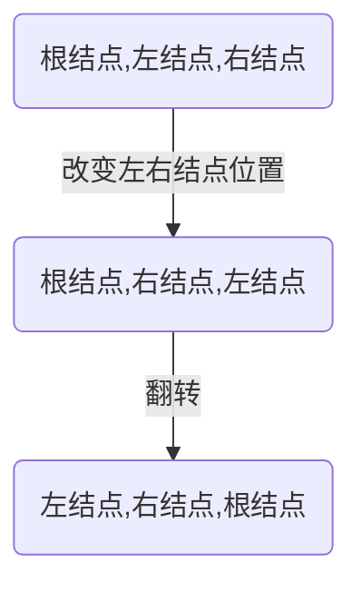

[TOC]

# [专题总结(100题)](https://labuladong.gitbook.io/algo)

## 【必会代码】

### 一、树

##### 1. 二叉树的遍历非递归

##### 2. 二叉树的深度

##### 3. 二叉树的路径和

#### 二、链表

##### 1. 翻转链表

##### 2. 链表归并

##### 3. 相交链表

##### 4. 链表的环

##### 5. 倒数结点

#### 三、数组

##### 1. 两数之和

##### 2. 顺时针打印数组

##### 3. 移动0

#### 四、排序

##### 1. 冒泡排序

##### 2. 快速排序

##### 3. 归并排序

##### 4. 堆排序

#### 五、字符串

##### 1. 最长子串

##### 2. 是否存在字符串的排列

##### 3. 最长公共子串

#### 五、动态规划

#### 六、滑动窗口

#### 七、DFS

#### 八 10亿个数中找出最大的10000个数

**海量数据处理（top K问题）**

**op K问题**

​    在大规模数据处理中，经常会遇到的一类问题：在海量数据中找出出现频率最好的前k个数，或者从海量数据中找出最大的前k个数，这类问题通常被称为top K问题。例如，在搜索引擎中，统计搜索最热门的10个查询词；在歌曲库中统计下载最高的前10首歌等。

​    针对top K类问题，通常比较好的方案是**分治+Trie树/hash+小顶堆**（就是上面提到的最小堆），即先将数据集按照Hash方法分解成多个小数据集，然后使用Trie树活着Hash统计每个小数据集中的query词频，之后用小顶堆求出每个数据集中出现频率最高的前K个数，最后在所有top K中求出最终的top K。

**eg：有1亿个浮点数，如果找出期中最大的10000个？**

​    最容易想到的方法是将数据全部排序，然后在排序后的集合中进行查找，最快的排序算法的时间复杂度一般为O（nlogn），如快速排序。但是在32位的机器上，每个float类型占4个字节，1亿个浮点数就要占用400MB的存储空间，对于一些可用内存小于400M的计算机而言，很显然是不能一次将全部数据读入内存进行排序的。其实即使内存能够满足要求（我机器内存都是8GB），该方法也并不高效，因为题目的目的是寻找出最大的10000个数即可，而排序却是将所有的元素都排序了，做了很多的无用功。

​    第二种方法为局部淘汰法，该方法与排序方法类似，用一个容器保存前10000个数，然后将剩余的所有数字——与容器内的最小数字相比，如果所有后续的元素都比容器内的10000个数还小，那么容器内这个10000个数就是最大10000个数。如果某一后续元素比容器内最小数字大，则删掉容器内最小元素，并将该元素插入容器，最后遍历完这1亿个数，得到的结果容器中保存的数即为最终结果了。此时的时间复杂度为O（n+m^2），其中m为容器的大小，即10000。

​    **第三种方法是分治法**，将1亿个数据分成100份，每份100万个数据，找到每份数据中最大的10000个，最后在剩下的100*10000个数据里面找出最大的10000个。如果100万数据选择足够理想，那么可以过滤掉1亿数据里面99%的数据。100万个数据里面查找最大的10000个数据的方法如下：用快速排序的方法，将数据分为2堆，如果大的那堆个数N大于10000个，继续对大堆快速排序一次分成2堆，如果大的那堆个数N大于10000个，继续对大堆快速排序一次分成2堆，如果大堆个数N小于10000个，就在小的那堆里面快速排序一次，找第10000-n大的数字；递归以上过程，就可以找到第1w大的数。参考上面的找出第1w大数字，就可以类似的方法找到前10000大数字了。此种方法需要每次的内存空间为10^6*4=4MB，一共需要101次这样的比较。

​    **第四种方法是Hash法**。如果这1亿个书里面有很多重复的数，先通过Hash法，把这1亿个数字去重复，这样如果重复率很高的话，会减少很大的内存用量，从而缩小运算空间，然后通过分治法或最小堆法查找最大的10000个数。

​    **第五种方法采用最小堆**。首先读入前10000个数来创建大小为10000的最小堆，建堆的时间复杂度为O（mlogm）（m为数组的大小即为10000），然后遍历后续的数字，并于堆顶（最小）数字进行比较。如果比最小的数小，则继续读取后续数字；如果比堆顶数字大，则替换堆顶元素并重新调整堆为最小堆。整个过程直至1亿个数全部遍历完为止。然后按照中序遍历的方式输出当前堆中的所有10000个数字。该算法的时间复杂度为O（nmlogm），空间复杂度是10000（常数）。

**实际运行：**

​    实际上，最优的解决方案应该是最符合实际设计需求的方案，在时间应用中，可能有足够大的内存，那么直接将数据扔到内存中一次性处理即可，也可能机器有多个核，这样可以采用多线程处理整个数据集。

​    下面针对不容的应用场景，分析了适合相应应用场景的解决方案。

（1）单机+单核+足够大内存

​    如果需要查找10亿个查询次（每个占8B）中出现频率最高的10个，考虑到每个查询词占8B，则10亿个查询次所需的内存大约是10^9 * 8B=8GB内存。如果有这么大内存，直接在内存中对查询次进行排序，顺序遍历找出10个出现频率最大的即可。这种方法简单快速，使用。然后，也可以先用HashMap求出每个词出现的频率，然后求出频率最大的10个词。

（2）单机+多核+足够大内存

​    这时可以直接在内存总使用Hash方法将数据划分成n个partition，每个partition交给一个线程处理，线程的处理逻辑同（1）类似，最后一个线程将结果归并。

​    该方法存在一个瓶颈会明显影响效率，即数据倾斜。每个线程的处理速度可能不同，快的线程需要等待慢的线程，最终的处理速度取决于慢的线程。而针对此问题，解决的方法是，将数据划分成c×n个partition（c>1），每个线程处理完当前partition后主动取下一个partition继续处理，知道所有数据处理完毕，最后由一个线程进行归并。

（3）单机+单核+受限内存

​    这种情况下，需要将原数据文件切割成一个一个小文件，如次啊用hash(x)%M，将原文件中的数据切割成M小文件，如果小文件仍大于内存大小，继续采用Hash的方法对数据文件进行分割，知道每个小文件小于内存大小，这样每个文件可放到内存中处理。采用（1）的方法依次处理每个小文件。

（4）多机+受限内存

​    这种情况，为了合理利用多台机器的资源，可将数据分发到多台机器上，每台机器采用（3）中的策略解决本地的数据。可采用hash+socket方法进行数据分发。

​    从实际应用的角度考虑，（1）（2）（3）（4）方案并不可行，因为在大规模数据处理环境下，作业效率并不是首要考虑的问题，算法的扩展性和容错性才是首要考虑的。算法应该具有良好的扩展性，以便数据量进一步加大（随着业务的发展，数据量加大是必然的）时，在不修改算法框架的前提下，可达到近似的线性比；算法应该具有容错性，即当前某个文件处理失败后，能自动将其交给另外一个线程继续处理，而不是从头开始处理。
​    top K问题很适合采用MapReduce框架解决，用户只需编写一个Map函数和两个Reduce 函数，然后提交到Hadoop（采用Mapchain和Reducechain）上即可解决该问题。具体而言，就是首先根据数据值或者把数据hash(MD5)后的值按照范围划分到不同的机器上，最好可以让数据划分后一次读入内存，这样不同的机器负责处理不同的数值范围，实际上就是Map。得到结果后，各个机器只需拿出各自出现次数最多的前N个数据，然后汇总，选出所有的数据中出现次数最多的前N个数据，这实际上就是Reduce过程。对于Map函数，采用Hash算法，将Hash值相同的数据交给同一个Reduce task；对于第一个Reduce函数，采用HashMap统计出每个词出现的频率，对于第二个Reduce 函数，统计所有Reduce task，输出数据中的top K即可。
​    直接将数据均分到不同的机器上进行处理是无法得到正确的结果的。因为一个数据可能被均分到不同的机器上，而另一个则可能完全聚集到一个机器上，同时还可能存在具有相同数目的数据。

**以下是一些经常被提及的该类问题。**

（1）有10000000个记录，这些查询串的重复度比较高，如果除去重复后，不超过3000000个。一个查询串的重复度越高，说明查询它的用户越多，也就是越热门。请统计最热门的10个查询串，要求使用的内存不能超过1GB。
（2）有10个文件，每个文件1GB，每个文件的每一行存放的都是用户的query，每个文件的query都可能重复。按照query的频度排序。
（3）有一个1GB大小的文件，里面的每一行是一个词，词的大小不超过16个字节，内存限制大小是1MB。返回频数最高的100个词。
（4）提取某日访问网站次数最多的那个IP。
（5）10亿个整数找出重复次数最多的100个整数。
（6）搜索的输入信息是一个字符串，统计300万条输入信息中最热门的前10条，每次输入的一个字符串为不超过255B，内存使用只有1GB。
（7）有1000万个身份证号以及他们对应的数据，身份证号可能重复，找出出现次数最多的身份证号。

**重复问题**

​    在海量数据中查找出重复出现的元素或者去除重复出现的元素也是常考的问题。针对此类问题，一般可以通过位图法实现。例如，已知某个文件内包含一些电话号码，每个号码为8位数字，统计不同号码的个数。
​    本题最好的解决方法是通过使用位图法来实现。8位整数可以表示的最大十进制数值为99999999。如果每个数字对应于位图中一个bit位，那么存储8位整数大约需要99MB。因为1B=8bit，所以99Mbit折合成内存为99/8=12.375MB的内存，即可以只用12.375MB的内存表示所有的8位数电话号码的内容。

#### 九 最小生成树的两种方法（Kruskal算法和Prim算法）

关于图的几个概念定义：

- **连通图**：在无向图中，若任意两个顶点vivi与vjvj都有路径相通，则称该无向图为连通图。
- **强连通图**：在有向图中，若任意两个顶点vivi与vjvj都有路径相通，则称该有向图为强连通图。
- **连通网**：在连通图中，若图的边具有一定的意义，每一条边都对应着一个数，称为权；权代表着连接连个顶点的代价，称这种连通图叫做连通网。
- **生成树**：一个连通图的生成树是指一个连通子图，它含有图中全部n个顶点，但只有足以构成一棵树的n-1条边。一颗有n个顶点的生成树有且仅有n-1条边，如果生成树中再添加一条边，则必定成环。
- **最小生成树**：在连通网的所有生成树中，所有边的代价和最小的生成树，称为最小生成树。 
  

------

下面介绍两种求最小生成树算法

**1.Kruskal算法**

此算法可以称为“加边法”，初始最小生成树边数为0，每迭代一次就选择一条满足条件的最小代价边，加入到最小生成树的边集合里。 
\1. 把图中的所有边按代价从小到大排序； 
\2. 把图中的n个顶点看成独立的n棵树组成的森林； 
\3. 按权值从小到大选择边，所选的边连接的两个顶点ui,viui,vi,应属于两颗不同的树，则成为最小生成树的一条边，并将这两颗树合并作为一颗树。 
\4. 重复(3),直到所有顶点都在一颗树内或者有n-1条边为止。


**2.Prim算法**

此算法可以称为“加点法”，每次迭代选择代价最小的边对应的点，加入到最小生成树中。算法从某一个顶点s开始，逐渐长大覆盖整个连通网的所有顶点。

1. 图的所有顶点集合为VV；初始令集合u={s},v=V−uu={s},v=V−u;
2. 在两个集合u,vu,v能够组成的边中，选择一条代价最小的边(u0,v0)(u0,v0)，加入到最小生成树中，并把v0v0并入到集合u中。
3. 重复上述步骤，直到最小生成树有n-1条边或者n个顶点为止。

由于不断向集合u中加点，所以最小代价边必须同步更新；需要建立一个辅助数组closedge,用来维护集合v中每个顶点与集合u中最小代价边信息，：

```
struct
{
  char vertexData   //表示u中顶点信息
  UINT lowestcost   //最小代价
}closedge[vexCounts]
```


#### 十 如何把IP地址保存到Int类型变量中

如何把IP地址保存到Int型变量中，之前看过类似的文章，但是属于走马观花，没有对细节进行理解。这两天抽空重新复习了下二进制和Java运算符，事后把这个问题当作对自己的考核来对待吧。

想搞明白为什么要存到Int类型的变量中，首先要理解什么是Int和熟悉运算符的使用。

**什么是Int**

Int是java的原始数据类型，JDK定义Int有4个字节共32位。因为int类型存在正数和负数，32位中有一位是来标识正负数的，所以int类型的变量最大和最小值是：0111....11和1111...11（二进制），转化为十进制也就是-2147483648和2147483648

**Java运算符**

位与运算符（&）：两个数都转为二进制，然后从高位开始比较，如果两个数都为1则为1，否则为0。

位或运算符（ |）：两个数都转为二进制，然后从高位开始比较，两个数只要有一个为1则为1，否则就为0。

左移运算符（<<）：value << num，num 是要向左左移动的位数，丢弃最高位，0补最低位。

右移运算符（>>）：value << num，num 是要向右 移动的位数，符号位不变，左边补上符号位（正数0负数1）。

无符号右移运算符（>>>）：无符号右移规则和右移运算是一样的，只不过忽略了符号位扩展，0补最高位。

正数的位移没有涉及到符号，而且正数的原码、反码、补码都是一样的，所以相对简单，但是对于负整数的位移，往往容易混淆。例如对整数-3进行<<  >> >>>运算做说明：


移位运算符案列

**实现原理**

ipv4的地址可分解为4段，每段范围0-255；int类型的变量同样也有4个字节，每个字节的上限也是255（11111111）且每个字节有8位，结合这两个特性，可以把IP的地址的每一段分别对应到int的每一个字节当中，因为要存储到一个int变量中，所以要在存储时要依次位移8位，这样的话一个IP便可保存在一个int型变量中。

原理搞明白后，编码的话就容易了许多。

```csharp
    public static void main(String[] args)
    {
        String ip = "172.185.255.233";

        //step1: 分解IP字符串，并对应写对字节数组
        byte[] ip1 = ipToBytes(ip);

        //step2: 对字节数组里的每个字节进行左移位处理，分别对应到整型变量的4个字节
        int ip2 = bytesToInt(ip1);
        System.out.println("整型ip ----> " + ip2);
        
        //对整型变量进行右位移处理，恢复IP字符串
        String ip3 = intToIp(ip2);
        System.out.println("字符串ip---->"+ip3);

    }

    /**
     * 第一步，把IP地址分解为一个btye数组
     * 
     * @param ipAddr
     * @return int
     */
    public static byte[] ipToBytes(String ipAddr)
    {
        //初始化字节数组，定义长度为4
        byte[] ret = new byte[4];
        try
        {
            //使用关键字"." 分割字符串数组
            String[] ipArr = ipAddr.split("\\.");
            
            //将字符串数组依次写入字节数组
            ret[0] = (byte) (Integer.parseInt(ipArr[0]));
            ret[1] = (byte) (Integer.parseInt(ipArr[1]));
            ret[2] = (byte) (Integer.parseInt(ipArr[2]));
            ret[3] = (byte) (Integer.parseInt(ipArr[3]));
            return ret;
        } catch (Exception e)
        {
            throw new IllegalArgumentException("invalid IP : "+ipAddr);
        }
    }

    /**
     * 根据位运算把 byte[] -> int
     * 
     * 原理：将每个字节强制转化为8位二进制码，然后依次左移8位，对应到Int变量的4个字节中
     * 
     * @param bytes
     * @return int
     */
    public static int bytesToInt(byte[] bytes)
    {
        int addr = 0;               //初始化Int变量addr=0
        addr |= (bytes[0] & 0xFF);  //强制转化为8位二进制码，比如原码是101，强转后00000101
        addr = addr << 8;           //左移8位，得到00000101 00000000，给下个字节的拼接创造环境（预留8位0，方便用|进行拼接）
        addr |=(bytes[1] & 0xFF);   //强制转化为8位二进制码，比如原码是10101，强转后00010101,和00000101 00000000进行或运算后得到00000101 00010101
        addr = addr << 8;           //左移8位，得到00000101 00010101 00000000
        addr |= (bytes[2] & 0xFF);  //强制转化为8位二进制码，比如原码是111，强转后00000111,和00000101 00010101 00000000进行或运算后得到00000101 00010101 00000111 
        addr = addr << 8;           //左移8位，得到00000101 00010101 00000111 00000000
        addr |= ((bytes[3]) & 0xFF);//强制转化为8位二进制码，比如原码是1，强转后00000001,和00000101 00010101 00000111 00000000进行或运算后得到00000101 00010101 00000111 00000001
        return addr;                //拼接结束，返回int变量

//      优化之后的写法，原理相同，不过是先移位后直接强转的同时指定位数
//      int addr = bytes[3] & 0xFF;
//      addr |= ((bytes[2] << 8) & 0xFF00);
//      addr |= ((bytes[1] << 16) & 0xFF0000);
//      addr |= ((bytes[0] << 24) & 0xFF000000);
//      return addr;
        
    }
    

    /** 
     * 把int->string地址 
     * @param ipInt 
     * @return String 
     */  
    public static String intToIp(int ipInt) {  
        return new StringBuilder()
                .append(((ipInt >> 24) & 0xFF)).append('.')   //右移3个字节（24位），得到IP地址的第一段也就是int变量的第一个字节（从左边算起）
                .append((ipInt >> 16) & 0xFF).append('.')     //右移2字节（16位），得到int变量的第一和第二个字节（从左边算起），经过&0xFF处理得到后8位也就是byte[1]
                .append((ipInt >> 8) & 0xFF).append('.')      //同理如上
                .append((ipInt & 0xFF))                       //同理如上
                .toString();  

//        第二种，先强转二进制，再进行移位处理
//        return new StringBuilder()
//                .append(((ipInt & 0xFF000000) >> 24) & 0xFF).append('.')   //右移3个字节（24位），得到IP地址的第一段也就是byte[0],为了防止符号位是1也就是负数，最后再一次& 0xFF
//                .append((ipInt & 0xFF0000) >> 16).append('.')
//                .append((ipInt & 0xFF00) >> 8).append('.')
//                .append((ipInt & 0xFF))  
//                .toString();  
    } 
```

**总结**

二进制，是计算技术中广泛采用的一种数制，虽然平时用的不多，但是熟练掌握后，有助于加强我们对机器语言的理解和提升我们的编码水平，特别是面对资源紧张（运存）的场景时，有助于我们分析和优化问题。

## 【代码规范】

**一、三种常见的命名规范：**

1. 驼峰命名法：驼峰命名法就是当变量名或函数名是由一个或多个单词连结在一起时，**第一个单词以小写字母开始；从第二个单词开始以后的每个单词的首字母都采用大写字母。**（例如：myName，hisBoyfriend）

2. 帕斯卡命名法：帕斯卡命名法就是当变量名或函数名是由一个或多个单词连结在一起时，***\*每个单词\**的首字母都采用大写字母。**（例如：MyName，HisBoyfriend）
3. 下划线命名法：**所有字母均小写，每个单词间以下划线分割。**（例如：my_name,his_name）

在使用上，这样的命名规范都十分清晰明了。具体而言，我们一般给函数名、全局变量和结构体名等通用性强的采用帕斯卡命名法，局部变量、函数形参采用驼峰命名法或下划线命名法。

**二、代码结构清晰：**

~~~java
/*------错误示范-------*/
#include<stdio.h>
 int main()
{double a,b;
scanf("%lf%lf",&a,&b);
if(a>b)
printf("%lf",a);
else printf("%lf",b);
return 0;}
/*------正确示范-------*/
#include <stdio.h>         ///空格最好加上
int main()                 ///nt前面不要加空格
{                          ///每出现一个'{'后代码要向后缩进直到遇到'}'，语句不要直接放在'{'后面
    double a,b;
    scanf("%lf%lf",&a,&b);
    if(a>b)
    {
        printf("%lf",a);
    }
    else                   ///像if，else这类后面要接语句的关键词，后面最好加复合语句，以方便以后修改
    {
        printf("%lf",b);
    }
    return 0;
}
~~~

**三、注解清晰：**

~~~java
//单行注释
 
/*多行注释
巴拉巴拉
以这个结尾->*/
~~~

## 【树】

#### <序>

解决树的问题无非就两种方法：**DFS**（深度优先遍历）和**BFS**（广度优先遍历）。

**DFS框架：**

~~~java
/* 基本的二叉树节点 */
class TreeNode {
    int val;
    TreeNode left, right;
}

void traverse(TreeNode root) {
    //前序
    traverse(root.left)
    //中序
    traverse(root.right)
    //后序
}
~~~

**BFS框架：**

~~~java
// 计算从起点 start 到终点 target 的最近距离
int BFS(Node start, Node target) {
    Queue<Node> q; // 核心数据结构
    Set<Node> visited; // 避免走回头路

    q.offer(start); // 将起点加入队列
    visited.add(start);
    int step = 0; // 记录扩散的步数

    while (q not empty) {
        int sz = q.size();
        /* 将当前队列中的所有节点向四周扩散 */
        for (int i = 0; i < sz; i++) {
            Node cur = q.poll();
            /* 划重点：这里判断是否到达终点 */
            if (cur is target)
                return step;
            /* 将 cur 的相邻节点加入队列 */
            for (Node x : cur.adj())
                if (x not in visited) {
                    q.offer(x);
                    visited.add(x);
                }
        }
        /* 划重点：更新步数在这里 */
        step++;
    }
}
~~~

####  1   [二叉树的前、中、后序遍历（递归） ](https://leetcode-cn.com/problems/binary-tree-inorder-traversal)

**题目描述：**给定一个二叉树，返回它的前序遍历。原题链接：[link](https://leetcode-cn.com/problems/binary-tree-preorder-traversal/).

 **思路：**二叉树是最适合使用递归的数据结构，根据二叉树递归的模板即可写出。

 **代码：**

~~~java
    //**********递归的先序遍历**********
    public static void recursivePreOrder(TreeNode p) {
        if (p == null) return;
            visit(p);
            recursivePreOrder(p.left);
            recursivePreOrder(p.right);
    }


    //**********递归的中序遍历**********
    public static void recursiveInOrder(TreeNode p) {
        if (p == null) return;
        recursiveInOrder(p.left);
        visit(p);
        recursiveInOrder(p.right);
    }


    //**********递归的后序遍历**********
    public static void recursivePostOrder(TreeNode p) {
        if (p == null) return;
        recursivePostOrder(p.left);
        recursivePostOrder(p.right);
        visit(p);
    }
~~~

**拓展：递归思路**

1.先设置嵌套出口

当极端情况，没有节点的时候：root==null时，退出。

```
 if(root==null){
   return;
 }
```

2.再设置嵌套入口

```
 if(root.left!=null){//若root左节点存在，则进入左节点，这里可以不写，在进入下次循环是判断
     helper(root.left,list); //设置入口
 }
  if(root.right!=null){//若root右节点存在，则进入右节点
   helper(root.right,list);//设置入口
  }
```

3.问题处理

将结点root的值存入数组中。

```
 list.add(root.val);
```

#### 2    [二叉树的前、中、后序遍历（非递归） ](https://leetcode-cn.com/problems/binary-tree-inorder-traversal)

**题目**：给定一个二叉树，返回它的*中序* 遍历。

**思路：**二叉树的前，中，后序遍历都可以使用栈进行，其中他们都可以使用手算的思想，其中前序遍历可以哦利用栈的特性，后序遍历可以利用前序遍历的特性。

**前序遍历顺序： 根结点，左结点，右结点。**创建一个栈s存储节点，利用栈先进后出的特点模拟二叉树的遍历过程，首先将根节点压入栈，当栈不为空的时候进行此循环,栈为空表示已经二叉树遍历完成。取出根节点，并访问。由于栈是先进后出的特点，所以先进右节点以先取出左节点。

**中序遍历顺序：左结点 ，根结点，右结点。**我们首先需要找到的二叉树的最左边节点，然后下一个结点是右节点的最左结点，直到右节点没有左节点，即遍历它。需增加一个循环实现继续出栈，在出栈过程中**压入右节点**，以模拟中序遍历。此循环成立条件为**栈不为空**或者**结点不为空**（因为在出栈过程中会出现栈空但树未遍历完的状态，而且更重要的是）。

**后序遍历顺序：左结点，右结点，根结点。**因为：前序遍历顺序： 根结点，左结点，右结点.，后序遍历顺序： 左结点，右结点，根结点.
对二叉树的**前序**遍历代码稍作改变，即可成为**后序**遍历代码。

----

**如何改变？见下图：**



----

**故：**
1.想要改变左右结点位置，便需要交换左右结点入栈的顺序，则交换程序中以下两行代码的位置即可：

```
s.push(node.right);
```

```
s.push(node.left);
```

2.最后反转数组，即得到所求结果。

```
Collections.reverse(l);
```

**建议使用手算的思想**，首先走到最左边结点，当它没有右节点，或者右节点被遍历过，则遍历它。否则使用prev用来标记已经visit过的这个节点。

**代码：**

~~~java
  /* 基本的二叉树节点 */
class TreeNode {
    int val;
    TreeNode left, right;
}
//**********非递归的先序遍历**********  
   //前序遍历手算的思想，先变访问边找，找到最左下方的，然后向上再向访问右边的
    public static void iterativePreOrder_1(TreeNode p) {
        if (p == null) return;
        Stack<TreeNode> stack = new Stack<TreeNode>();
        while (!stack.empty() || p != null) {
            while (p != null) {
                System.out.println(p.val);
                stack.push(p);
                p = p.left;
            }
            p = stack.pop();
            p = p.right;
        }
    }
/*-----------------全是细节的手算非递归中序遍历-------------------------------------*/
    public  static List<Integer> inorderTraversal(TreeNode root) {
        List<Integer> list =new ArrayList<>();
        Stack<TreeNode> stack=new Stack<>();
        //当处理根节点时，stack会为空，但是此时root.right!=null，则需要继续      
        while(!stack.isEmpty()||root!=null){
     //如何解决重复搜索？root!=null是精髓，如果右结点为null，则不继续下面循环，可以防止重复遍历，也可以作为遍历条件
            while(root!=null){
                stack.push(root);
                root=root.left;
            }
            root=stack.pop();
            list.add(root.val);
            //此处判断右节点是否为null,全是细节啊！！！！！！ 
            root=root.right;
        }
        return  list;
    }
    //**********基于手算非递归的后序遍历**********
    //注意prev的作用
    public static void iterativePostOrder(TreeNode p) {
        if (p == null) return;
        Stack<TreeNode> stack = new Stack<TreeNode>();
        TreeNode prev = p;
        while (!stack.empty() || p != null) {
            while (p != null) {
                stack.push(p);
                p = p.left;
            }
            p = stack.peek().right;
            //当它没有右节点，或者右节点被遍历过，则遍历它
            if (p == null || p == prev) {
                p = stack.pop();
                visit(p);
                //prev用来标记已经visit过这个节点
                prev = p;
                //防止死循环，查找栈顶的右节点
                p = null;
            }
        }
    }
~~~

**拓展：**

~~~java
//**********非递归的先序遍历*************************************//  
    //栈的思想，按层次倒着进栈，利用后进先出解决顺序问题
    public static void iterativePreOrder_2(TreeNode p) {
        if (p == null) return;
        Stack<TreeNode> stack = new Stack<TreeNode>();
        //根节点入栈
        stack.push(p);
        while (!stack.empty()) {
            //出栈
            p = stack.pop();
            //访问
            visit(p);
            //由于栈是先进后出的特点，所以先进右节点以先取出左节点。
            if (p.right != null) stack.push(p.right);
            if (p.left != null) stack.push(p.left);
        }
    }   
//**********基于前序遍历的非递归的后序遍历**********
    //栈的思想，按层次倒着进栈，利用后进先出解决顺序问题
    Collections.reverse(l);
    public static void iterativePreOrder_2(TreeNode p) {
        if (p == null) return;
        Stack<TreeNode> stack = new Stack<TreeNode>();
        //根节点入栈
        stack.push(p);
        while (!stack.empty()) {
            //出栈
            p = stack.pop();
            //访问
             visit(p);
            if (p.right != null) stack.push(p.left);
            if (p.left != null) stack.push(p.right);
        }    
    }

   //**********非递归的后序遍历**********
    //双栈法，易于理解
    public static void iterativePostOrder_3(TreeNode p) {
        if (p == null) return;
        Stack<TreeNode> stack = new Stack<TreeNode>();
        Stack<TreeNode> result = new Stack<TreeNode>();
        while (!stack.empty() || p != null) {
            while (p != null) {
                stack.push(p);
                result.push(p);
                p = p.right;
            }
            if (!stack.empty()) p = stack.pop().left;
        }3
        while (!result.empty()) {
            p = result.pop();
            visit(p);
        }
    }
~~~

#### 3 二叉树的层次遍历（BFS）

**题目**：从上到下按层打印二叉树，同一层结点从左至右输出。每一层输出一行。原题传送门：[link](https://www.nowcoder.com/practice/445c44d982d04483b04a54f298796288?tpId=13&tqId=11213&rp=3&ru=/ta/coding-interviews&qru=/ta/coding-interviews/question-ranking).

**思路：**BFS的模板为：

1. 如果不需要确定当前遍历到了哪一层，模板如下：

   ```
   void bfs() {
    vis[] = {0}; // or set
    queue<int> pq(start_val);
   
    while (!pq.empty()) {
        int cur = pq.front(); pq.pop();
        for (遍历cur所有的相邻节点nex) {
            if (nex节点有效 && vis[nex]==0){
                vis[nex] = 1;
                pq.push(nex)
            }
        } // end for
    } // end while
   }
   ```

上述是伪代码，不仅可用于二叉树，可针对所有用BFS解题。

1. 如果需要确定遍历到哪一层，模板如下；

   ```
   void bfs() {
    int level = 0;
    vis[] = {0}; // or set
    queue<int> pq(original_val);
    while (!pq.empty()) {
        int sz = pq.size();
   
        while (sz--) {
                int cur = pq.front(); pq.pop();
            for (遍历cur所有的相邻节点nex) {
                if (nex节点有效 && vis[nex] == 0) {
                    vis[nex] = 1;
                    pq.push(nex)
                }
            } // end for
        } // end inner while
        level++;
   
    } // end outer while
   }
   ```

**代码：**

~~~java
/**
 * Definition for a binary tree node.
 * public class TreeNode {
 *     int val;
 *     TreeNode left;
 *     TreeNode right;
 *     TreeNode(int x) { val = x; }
 * }
 */
/*--------------------------二叉树层序打印------------------------------*/
public static ArrayList<Integer> PrintFromTopToBottom(TreeNode root) {
       ArrayList<Integer> list=new ArrayList<>();
        ArrayList<TreeNode> queue = new ArrayList<>();
        queue.add(root);
       while(queue.size() != 0){
           TreeNode node=queue.remove(0);
           if(node.left!=null) queue.add(node.left);
           if(node.right!=null) queue.add(node.right);
           list.add(node.val);
        }
        return  list ;
    }
/*--------------------------二叉树分行打印------------------------------*/
class Solution {
    public List<List<Integer>> levelOrder(TreeNode root) {
     List<List<Integer>> lists =new ArrayList<>();
     if(root==null) return lists;
     //List<Integer> list=new ArraryList<>();
     List<Integer> list = new ArrayList<Integer>();
     //使用一个队列
      //Queue<TreeNode> q=new Linkedlist<TreeNode>(); 
      Queue<TreeNode> q=new LinkedList<>();
      q.add(root);
      int size=1;
      while(q.size()!=0){
        //队列的基本操作
        root=q.remove();
        list.add(root.val);
        size--;
        if(root.left!=null) q.add(root.left);
        if(root.right!=null) q.add(root.right);
        if(size==0){
          lists.add(list);//如果需要之字形打印，这里加Collections.reverse(List); 
          list= new ArrayList<Integer>();
          size=q.size();
        }
      }
      return lists;
    }
}
/*--------------------------之字型打印二叉树------------------------------*/
//思路:用两个栈，s1存储奇数层序列，s2存偶数层节点；s1打印时正向在s2中存储左右节点。s2打印时反向在s1中存储左右节点。
   public static ArrayList<Integer> print (TreeNode root){
        Stack<TreeNode> stack=new Stack<>();
        Queue<TreeNode> queue=new LinkedList<>();
        ArrayList<Integer> list=new ArrayList<>();
        stack.push(root);
        //有一个不为空则继续
        while (!stack.isEmpty()||queue.size()!=0){
            //栈循环入队
            while (!stack.isEmpty()){
                TreeNode node=stack.pop();
                if(node.left!=null)queue.add(node.left);
                if(node.right!=null)queue.add(node.right);
                list.add(node.val);
            }
            //队循环入栈
            while (queue.size()!=0){
                TreeNode node=queue.remove();
                if(node.left!=null)stack.add(node.left);
                if(node.right!=null)stack.add(node.right);
                list.add(node.val);
            }
        }
        return list;
    }
/*--------------------------之字型打印二叉树2------------------------------*/
 public ArrayList<ArrayList<Integer> > Print(TreeNode pRoot) {
        LinkedList<TreeNode> q = new LinkedList<>();
        ArrayList<ArrayList<Integer>> res = new ArrayList<>();
        boolean rev = true;
        q.add(pRoot);
        while(!q.isEmpty()){
            int size = q.size();
            ArrayList<Integer> list = new ArrayList<>();
            for(int i=0; i<size; i++){
                TreeNode node = q.poll();
                if(node == null){continue;}
                if(rev){
                    list.add(node.val);
                }else{
                    list.add(0, node.val);
                }
                q.offer(node.left);
                q.offer(node.right);
            }
            if(list.size()!=0){res.add(list);}
            rev=!rev;
        }
        return res;
    }
/*--------------------------之字型打印二叉树3------------------------------*/
public static ArrayList<ArrayList<Integer>> Print(TreeNode pRoot) {
        int layer = 1;//记录奇偶性
        //s1存奇数层节点，s2存偶数层节点
        Stack<TreeNode> s1 = new Stack<TreeNode>();
        Stack<TreeNode> s2 = new Stack<TreeNode>();
        s1.push(pRoot);//预先存入一个节点
       //定义数组存储节点内的值
        ArrayList<ArrayList<Integer>> list = new ArrayList<ArrayList<Integer>>();
       //两个栈都不为空循环
        while (!s1.empty() || !s2.empty()) {
            if (layer%2 != 0) { //如果为奇
                ArrayList<Integer> temp = new ArrayList<Integer>();
                while (!s1.empty()) {
                    TreeNode node = s1.pop(); //出栈
                    if(node != null) {   //结点不为空
                        temp.add(node.val);  //栈不为空
                      //System.out.print(node.val + " ");
                        s2.push(node.left);  //结点不为空
                        s2.push(node.right);
                    }
                }
                if (!temp.isEmpty()) { //表不为空
                    list.add(temp);  //导入节点
                    layer++;   //记录为偶
                    //System.out.println();
                }
            } else {
                ArrayList<Integer> temp = new ArrayList<Integer>();
                while (!s2.empty()) {
                    TreeNode node = s2.pop();
                    if(node != null) {
                        temp.add(node.val);
                        //System.out.print(node.val + " ");
                        s1.push(node.right);
                        s1.push(node.left);
                    }
                }
                if (!temp.isEmpty()) {
                    list.add(temp);
                    layer++;
                    //System.out.println();
                }
            }
        }
        return list;
    }
/**
 * Definition for a binary tree node.
 * public class TreeNode {
 *     int val;
 *     TreeNode left;
 *     TreeNode right;
 *     TreeNode(int x) { val = x; }
 * }
 */
/*--------------------------之字型打印二叉树4------------------------------*/
class Solution {
    public List<List<Integer>> levelOrder(TreeNode root) {
    List<List<Integer>> lists =new ArrayList<>();
     if(root==null) return lists;
     //List<Integer> list=new ArraryList<>();
     List<Integer> list = new ArrayList<Integer>();
     //使用一个队列
      //Queue<TreeNode> q=new Linkedlist<TreeNode>(); 
      Queue<TreeNode> q=new LinkedList<>();
      q.add(root);
      int size=1;
      int deep=1;
      while(q.size()!=0){
        //队列的基本操作
        root=q.remove();
        list.add(root.val);
        size--;
        if(root.left!=null) q.add(root.left);
        if(root.right!=null) q.add(root.right);
        if(size==0){
            if(deep%2==0){
             Collections.reverse(list);
             lists.add(list);
            }else{
                lists.add(list);
            } 
         //如果需要之字形打印，这里加Collections.reverse(List); 
          list= new ArrayList<Integer>();
          size=q.size();
          deep++;
        }
      }
      return lists;
    }
 }
~~~

#### 5  [**翻转二叉树** ](https://leetcode-cn.com/problems/invert-binary-tree)

~~~java
    /*---------------------DFS-----------------------*/
    public static TreeNode invertTree(TreeNode root) {
        //寻找结束结点
        if(root==null){
            return null;
        }
        //遍历左右模板
        invertTree(root.left);
        invertTree(root.right);
        //后序进行交换
        TreeNode temp=root.left;
        root.left=root.right;
        root.right=temp;
        return root;
    }
~~~

**剑指Offer: 二叉树的镜像**

1. 题目描述

操作给定的二叉树，将其变换为源二叉树的镜像。
输入描述:二叉树的镜像定义：源二叉树 

```
    	    8
    	   /  \
    	  6   10
    	 / \  / \
    	5  7 9 11
    	镜像二叉树
    	    8
    	   /  \
    	  10   6
    	 / \  / \
    	11 9 7  5
```

原题传送门：[link](https://www.nowcoder.com/practice/564f4c26aa584921bc75623e48ca3011?tpId=13&tqId=11171&tPage=1&rp=1&ru=%2Fta%2Fcoding-interviews&qru=%2Fta%2Fcoding-interviews%2Fquestion-ranking).

2. 关键词

 ==二叉树的镜像==

3. 思路

* 先前序遍历这棵树的每个结点，如果遍历到的结点有子结点，就交换它的两个子节点，
  当交换完所有的非叶子结点的左右子结点之后，就得到了树的镜像
* 递归方法的解题思路：
  1) 递归算法一定有一个**结束条件**，不然递归会一直进行下去
  2) 递归算法一定会**实现一定的功能**
  3) 递归算法一定有**入口**

4. 代码实现（Java）

```java
/* 先前序遍历这棵树的每个结点，如果遍历到的结点有子结点，就交换它的两个子节点，
当交换完所有的非叶子结点的左右子结点之后，就得到了树的镜像 */
/**
public class TreeNode {
    int val = 0;
    TreeNode left = null;
    TreeNode right = null;
    public TreeNode(int val) {
        this.val = val;
    }
}
*/
//递归方法1
class Solution {
    public TreeNode mirrorTree(TreeNode root) {
        if(root == null) return null;
        TreeNode tmp = root.left;
        root.left = mirrorTree(root.right);
        root.right = mirrorTree(tmp);
        return root;
    }
}
//递归方法2
public class Solution {
    public void Mirror(TreeNode root) {
        if(root == null){
            return;
        }
        TreeNode temp = root.left;
        root.left = root.right;
        root.right = temp;
        Mirror(root.left);
        Mirror(root.right);
    }
}
//使用辅助栈
class Solution {
    public TreeNode mirrorTree(TreeNode root) {
        if(root == null) return null;
        Stack<TreeNode> stack = new Stack<>() {{ add(root); }};
        while(!stack.isEmpty()) {
            TreeNode node = stack.pop();
            if(node.left != null) stack.add(node.left);
            if(node.right != null) stack.add(node.right);
            TreeNode tmp = node.left;
            node.left = node.right;
            node.right = tmp;
        }
        return root;
    }
}
```

5. 时间复杂度

两种方式的：
时间复杂度 O(N)
空间复杂度 O(N)

#### 6 [**二叉树的最大深度** ](https://leetcode-cn.com/problems/maximum-depth-of-binary-tree)

~~~java
   /*-------------------递归----------------------*/
    public static  int maxDepth(TreeNode root) {
         if(root==null){
             return 0;
         }
         //当需要携带值时候使用参数
         int left=maxDepth(root.left);
         int right=maxDepth(root.right);

         return Math.max(left,right)+1;
    }
    /*-------------------迭代----------------------*/
    public static  int maxDepth1(TreeNode root) {
        if(root==null) return 0;
        Queue<TreeNode> node=new LinkedList<>();
        node.add(root);
        int deep=0;
        int size=1;
        while(!node.isEmpty()){
            TreeNode temp=node.poll();
            size--;
            if(temp.right!=null) node.add(temp.right);
            if(temp.left!=null) node.add(temp.left);
            if(size==0){
                deep++;
                size=node.size();
            }
        }
        return deep;
    }
~~~

**代码拓展（Java）**

```java
/**
public class TreeNode {
    int val = 0;
    TreeNode left = null;
    TreeNode right = null;
    public TreeNode(int val) {
        this.val = val;
    }
}
*/
    public int TreeDepth(TreeNode root) {
        if(root==null){
        return 0;
        } 
        //统计左节点的数
        int LD=TreeDepth(root.left);
        //统计左节点的数
        int RD=TreeDepth(root.right);
        //到底端时h=1,每退出一层就返回对比左右子树最大深度并加1，最后返回的值就是最大的深度
        return (LD>RD?LD:RD)+1;
}
//非递归
import java.util.Queue;
import java.util.LinkedList;
 
public class Solution {
    public int TreeDepth(TreeNode pRoot)
    {
        if(pRoot == null){
            return 0;
        }
 //队列是一种特殊的线性表，它只允许在表的前端进行删除操作，而在表的后端进行插入操作。
//LinkedList类实现了Queue接口，因此我们可以把LinkedList当成Queue来用。
        Queue<TreeNode> queue = new LinkedList<TreeNode>();
        queue.add(pRoot);
        //出栈时count记录出栈结点数，记录nextCount记录本层结点数
        int depth = 0, count = 0, nextCount = 1;
        //因为，在循环外队列中已经放入了一个节点，所以循环结束的条件为队列为空
        while(queue.size()!=0){
        //count记录出队的节点数
            TreeNode top = queue.poll();
            count++;
            if(top.left != null){
                queue.add(top.left);
            }
            if(top.right != null){
                queue.add(top.right);
            }
            //满足条件则表示，本层节点出队完成，深度加1
            if(count == nextCount){
                // nextCount记录本层节点数
                nextCount = queue.size();
                count = 0;
                depth++;
            }
        }
        return depth;
    }
}
```

~~~java
package 树;

import java.util.Stack;

public class 二叉树的深度 {
    public  static  int  treeDeep1 (TreeNode root){
        if(root==null) return 0;
        int left=treeDeep1(root.left);
        int right=treeDeep1(root.right);
        return (left>right?left:right)+1;
    }
    public  static int treeDeep2(TreeNode root){
        Stack<TreeNode> stack1=new Stack<>();
        stack1.push(root);
        //记录本层的节点消耗
        int count=1;
        //记录深度
        int deep=0;
        //记录下层的节点数量
        int nextcount=0;
        while(!stack1.isEmpty()){
            TreeNode node=stack1.pop();
            count--;
            if(node.left!=null){
                stack1.push(node.left);
                nextcount++;
            }
            if(node.right!=null){
                stack1.push(node.right);
                nextcount++;
            }
            if(count==0){
                deep++;
                count=nextcount;
                nextcount=0;
            }
        }
        return deep;
    }
}
~~~

##### **N叉树的最大深度**

~~~java
/*
// Definition for a Node.
class Node {
    public int val;
    public List<Node> children;

    public Node() {}

    public Node(int _val) {
        val = _val;
    }

    public Node(int _val, List<Node> _children) {
        val = _val;
        children = _children;
    }
};
*/     
class Solution {
     public int maxDepth(Node root) {    //DFS递归写法
        if(root == null)
            return 0;
        int depth = 0;
        //
        for(int i = 0;i<root.children.size();i++){
            depth = Math.max(depth,maxDepth(root.children.get(i)));
        }
        return depth+1;
    }
}
/=======================二叉树的最大深度============================/
/**
 * Definition for a binary tree node.
 * public class TreeNode {
 *     int val;
 *     TreeNode left;
 *     TreeNode right;
 *     TreeNode(int x) { val = x; }
 * }
 */
class Solution {
    public int maxDepth(TreeNode root) {
     if(root==null) return 0;
     int depth=0;
     depth=Math.max(maxDepth(root.left),maxDepth(root.right));
     return depth+1;
    }
}
~~~

#### 7 平衡二叉树

**题目描述**：输入一棵二叉树，判断该二叉树是否是平衡二叉树。原题传送门：[link](https://www.nowcoder.com/practice/8b3b95850edb4115918ecebdf1b4d222?tpId=13&tqId=11192&tPage=2&rp=1&ru=%2Fta%2Fcoding-interviews&qru=%2Fta%2Fcoding-interviews%2Fquestion-ranking).

**关键词**：二叉树深度

**思路**

* 从下往上遍历，如果子树是平衡二叉树，则返回子树的高度；如果发现子树不是平衡二叉树，则直接停止遍历
* 之前是因为自己对平衡二叉树对定义不是很清楚：平衡二叉树的左右子树也是平衡二叉树，那么所谓**平衡就是每一个节点的左右子树的高度差不超过1**.

4. 代码（Java）

~~~java
public class Solution {
    boolean isBalanced=true;
    public boolean IsBalanced_Solution(TreeNode root) {
      getDepth(root);
      return  isBalanced;
    }
     
    private int getDepth(TreeNode root) {
        if(root==null) return 0;
        int left=getDepth(root.left);
        int right=getDepth(root.right);
        //和二叉树的深度只多了这一步
        if(Math.abs(left-right)>1) isBalanced=false;
        return Math.max(left,right)+1;
    }
}
~~~

5.复杂度

* 暂无

6. 知识积累

* **什么是二叉排序（BST）树？**
  二叉树是空树或者满足一下条件：

1. 若它的左子树不为空，则左子树上的左节点的关键字的值均小于根节点关键字的值。
2. 若它的右子树不为空，则右子树上的左节点的关键字的值均大于根节点关键字的值。
3. 左右子树又分别是一颗二叉排序树

* **什么是平衡二叉（AVL）树？**
  平衡二叉树首先是二叉查找树，由于树越矮查找效率越高，就有了二叉查找树。二叉平衡树中所有平衡因子只能是-1，0，1三个值
* **什么是平衡因子？**
  一个结点的平衡因子为其左子树的高度减去右子树高度的差。
* **什么是红黑树？**
  红黑树是一颗二叉搜索树，它相对二叉搜索树增加了一个存储位来标识结点颜色，可以使 Red 或 Black。通过对任何一条从根到叶子的简单路径上各个结点的颜色进行约束，确保没有一条路径会比其他路径长出两倍。

#### 9 [**二叉树的直径** ](https://leetcode-cn.com/problems/diameter-of-binary-tree)

**题目**：给定一棵二叉树，你需要计算它的直径长度。一棵二叉树的直径长度是任意两个结点路径长度中的最大值。这条路径可能穿过也可能不穿过根结点。

**思路**

1. 首先我们知道一条路径的长度为该路径经过的节点数减一，所以求直径（即求路径长度的最大值）等效于求路径经过节点数的最大值减一。
2. 而任意一条路径均可以被看作由某个节点为起点，从其左儿子和右儿子向下遍历的路径拼接得到。
3. **遍历二叉树每个结点，统计左右子树最大深度**。

**代码**

~~~java
  //不一定经过根节点
    //首先我们知道一条路径的长度为该路径经过的节点数减一，所以求直径（即求路径长度的最大值）等效于求路径经过节点数的最大值减一。
    //而任意一条路径均可以被看作由某个节点为起点，从其左儿子和右儿子向下遍历的路径拼接得到。
~~~

~~~java
/**
 * Definition for a binary tree node.
 * public class TreeNode {
 *     int val;
 *     TreeNode left;
 *     TreeNode right;
 *     TreeNode(int x) { val = x; }
 * }
 */
 class Solution {
    int maxd=0;
    public int diameterOfBinaryTree(TreeNode root) {
        depth(root);
        return maxd;
    }
    public int depth(TreeNode node){
        if(node==null){
            return 0;
        }
        int Left = depth(node.left); // 左儿子为根的子树的深度
        int Right = depth(node.right);// 右儿子为根的子树的深度
        maxd=Math.max(Left+Right,maxd);//将每个节点最大直径(左子树深度+右子树深度)当前最大值比较并取大者
        return Math.max(Left,Right)+1;//返回节点深度
    }
} 
~~~

#### 4  [**合并二叉树** ](https://leetcode-cn.com/problems/merge-two-binary-trees)（双树）

**题目**：给定两个二叉树，想象当你将它们中的一个覆盖到另一个上时，两个二叉树的一些节点便会重叠。

你需要将他们合并为一个新的二叉树。合并的规则是如果两个节点重叠，那么将他们的值相加作为节点合并后的新值，否则不为 NULL 的节点将直接作为新二叉树的节点。

~~~java
//递归写法
/**
 * Definition for a binary tree node.
 * public class TreeNode {
 *     int val;
 *     TreeNode left;
 *     TreeNode right;
 *     TreeNode(int x) { val = x; }
 * }
 */
public class Solution {
    public TreeNode mergeTrees(TreeNode t1, TreeNode t2) {
        //关键点：如果某一个为空，则直接返回另外一个，另外一个不管为不为空都可以
        if (t1 == null)
            return t2;
         //关键点：如果某一个为空，则直接返回另外一个，另外一个不管为不为空都可以
        if (t2 == null)
            return t1;
        t1.val += t2.val;//精髓，两个相加，都不为空的话
        t1.left = mergeTrees(t1.left, t2.left);
        t1.right = mergeTrees(t1.right, t2.right);
        return t1;
    }
}
//关键点位置其实是简写
           if(t1==null){
            if(t2==null){
                return t2;
            }else{
                return t2;
            }
        }
        if(t2==null){
            if(t1==null){
                return t1;
            }else{
                return t1;
            }
        }
        if(t1!=null&&t2!=null){
            t1.val=t1.val+t2.val;
        }
//
~~~

~~~java
    /*---------------------------迭代----------------------------*/
    public static  TreeNode mergeTrees2(TreeNode t1, TreeNode t2) {
        Stack<TreeNode[]> stack =new Stack<>();
        stack.push(new TreeNode[]{t1,t2});
        while(!stack.isEmpty()){
            TreeNode[] node =stack.pop();
            //关键点：如果此时t2为null，说明不会再相加了。
            if(node[0]==null||node[1]==null){
                continue;
            }
            node[0].val=node[0].val+node[1].val;
            //如果为空，则直接赋值t2对应结点
            if(node[0].left==null){
                node[0].left=node[1].left;
            //否则，要入栈继续迭代
            }else{
                stack.push(new TreeNode[]{node[0].left,node[1].left});
            }
            if(node[0].right==null){
                node[0].right=node[1].right;
            }else{
                stack.push(new TreeNode[]{node[0].right,node[1].right});
            }
        }
        return t1;
    }
~~~

#### 8 [**对称二叉树** ](https://leetcode-cn.com/problems/symmetric-tree)（双树）

**题目描述**

请实现一个函数，用来判断一颗二叉树是不是对称的。注意，如果一个二叉树同此二叉树的镜像是同样的，定义其为对称的。原题传送门：[link](https://www.nowcoder.com/practice/ff05d44dfdb04e1d83bdbdab320efbcb?tpId=13&tqId=11211&rp=3&ru=/ta/coding-interviews&qru=/ta/coding-interviews/question-ranking).

**思路**

* 思路：首先根节点以及其左右子树，左子树的左子树和右子树的右子树相同
* 左子树的右子树和右子树的左子树相同即可，采用递归
* 非递归也可，采用栈或队列存取各级子树根节点

**如图**

根据上图可知：若满足对称二叉树，必须满足：

```
1. L->val == R->val
2. L->left->val == R->right->val
3. L->right->val == R->left->val
```

因此可以自顶向下，递归求解即可。

1. 设置一个递归函数`isSame(r1, r2)`,表示如果对称，返回`true`，否则返回`false` 
2. 递归终止条件：`r1==nullptr && r2==nulllptr`, 直接返回`true`，否则，如果只有一个为`nullptr`，返回`false` 
3. 下一步递归：如果`r1->val == r2->val, 则isSame(root1->left, root2->right) && isSame(root1->right, root2->left);`

4. 代码（Java）

```java
/*
public class TreeNode {
    int val = 0;
    TreeNode left = null;
    TreeNode right = null;

    public TreeNode(int val) {
        this.val = val;
    }
}
*/
public class Solution {
    boolean isSymmetrical(TreeNode pRoot)
    {
        if(pRoot == null){
            return true;
        }
        return comRoot(pRoot.left, pRoot.right);
    }
    //这里有些难度
    private boolean comRoot(TreeNode left, TreeNode right) {
        //必须到根节点所以必须这么写
        //如果左节点为null，那么右节点为null,则返回真,否则返回false
        // 四种情况：
        // left == null &&right==null return true
        //left == null &&right!=null return false
        //上边都不满足，那么left一定不为null
        // right==null  return false;
        // right!=null  判断，如果不等直接返回true
        if(left == null) return right==null;
        //如果左节点不为null，右节点为null，返回假
        if(right == null) return false;
        if(left.val != right.val) return false;
        return comRoot(left.right, right.left) && comRoot(left.left, right.right);
    }
}
```

**代码拓展：**

~~~java
  //1. 它们的两个根结点具有相同的值
    //2. 每个树的右子树都与另一个树的左子树镜像对称
    /*---------------------DFS------------------------*/
    public static boolean isSymmetric(TreeNode root) {
        return check(root,root);
    }
    public static boolean check(TreeNode p, TreeNode q) {
        //如果都没有结点，自然为true
        if(p==null&&q==null){
            return  true;
        }
        //如果有一个为null时，另一个一定不为null，则false
        if(p==null||q==null){
            return  false;
        }
        //否则判断值&&左结点的左结点值和右结点的右结点值&&左结点的右结点值和右结点的左结点值
        return  p.val==q.val&&check(p.left,q.right)&&check(p.right,q.left);
    }
//首先我们引入一个队列，这是把递归程序改写成迭代程序的常用方法。初始化时我们把根节点入队两次。每次提取两个结点并比较它们的值（队列中每两个连续的结点应该是相等的，而且它们的子树互为镜像），然后将两个结点的左右子结点按相反的顺序插入队列中。当队列为空时，或者我们检测到树不对称（即从队列中取出两个不相等的连续结点）时，该算法结束。
    /*---------------------BFS------------------------*/
    public static boolean isSymmetric1(TreeNode root) {
        return check1(root,root);
    }
    public static boolean check1(TreeNode p, TreeNode q) {
        //先存入一个队列中
        Queue<TreeNode> queue=new LinkedList<>();
        //
        queue.add(p);
        queue.add(q);
        while(!queue.isEmpty()){
            //出队比较
            TreeNode left=queue.poll();
            TreeNode right=queue.poll();
            //此时为true，这里continue;
            if(left==null&&right==null){
                continue;
            }
            //这三种情况下为false
            if(left==null||right==null||left.val!=right.val){
                return  false;
            }
            //插入1
            queue.add(left.left);
            queue.add(right.right);
            //插入2
            queue.add(left.right);
            queue.add(right.left);
        }
        return  true;
    }
~~~

#### 9 [二叉树展开为链表 ](https://leetcode-cn.com/problems/flatten-binary-tree-to-linked-list)

**题目：**给定一个二叉树，[原地](https://baike.baidu.com/item/原地算法/8010757)将它展开为一个单链表。

**思路：**递归，**递归思想原来是这样！**

**题解：**


分为三步：

- 首先将根节点的左子树变成链表
- 其次将根节点的右子树变成链表
- 最后将变成链表的右子树放在变成链表的左子树的最右边

~~~java
class Solution {
    public void flatten(TreeNode root) {
        if(root == null){
            return ;
        }
        //将根节点的左子树变成链表
        flatten(root.left);
        //将根节点的右子树变成链表
        flatten(root.right);
        TreeNode temp = root.right;
        //把树的右边换成左边的链表
        root.right = root.left;
        //记得要将左边置空
        root.left = null;
        //找到树的最右边的节点
        while(root.right != null) root = root.right;
        //把右边的链表接到刚才树的最右边的节点
        root.right = temp;
    }
}
~~~

#### 10 [二叉树的最近公共祖先 ](https://leetcode-cn.com/problems/lowest-common-ancestor-of-a-binary-tree) 【较难】

~~~markdown
1. 第一遍，看题目，想解法，如果十几分分想不出来直接看题解，看看别人的解法，最好能够默写出来
2. 第二遍，自己尝试写出
3. 第三遍，隔几天后再次写一下，体会+上自己的优化
4. 第四遍，一周过去后，再来一一遍
5. 第五遍，复习，例如面试前。 (不一定是五遍，而是要做出来自己的体会和思考才是最重要的。) 如果有小手指，帮忙点点。上面的方法是收到，覃超老师的指导的方法。
~~~

**思路：在下面找好再，向上传递祖先**

**步骤：**如何返回公共祖先？


~~~java
/*------------深度遍历每个结点，根据要求判断是否为最近公共子节点-----------------------*/
class Solution {
    public TreeNode lowestCommonAncestor(TreeNode root, TreeNode p, TreeNode q) {
        //这三种情况返回root即可
        if(root == null || root == p || root == q) return root;
        //如果这个结点左子树p，则返回p,否则返回null;
        TreeNode left = lowestCommonAncestor(root.left, p, q);
        TreeNode right = lowestCommonAncestor(root.right, p, q);
        //这种情况说明root是公共结点，返回root
        if(left != null &&right != null) return root;
        //当left不为null，返回left。否则返回right
        //这也包含了left和right同时为null的情况，返回null
        return  left!=null?left:right;      
    }
}
~~~

#### 11 二叉树的右视图

* **当第一次到达次深度，则记录**

~~~java
public class 二叉树的右视图 {
    public static void main(String[] args) {
        //构造树1
        int[] nums1={1,2,5,3,4};
        int[] nums2={2,5,1,3,4};
        TreeNode node1=createTree.buildTree(nums1,nums2);
        TreeOperation.show(node1);
        List<Integer> list=rightSideView(node1);
        for(Integer n:list){
            System.out.println(n);
        }

    }
    /*-------------------------DFS----------------------------*/
    static  ArrayList<Integer> res = new ArrayList<>();
    public static  List<Integer> rightSideView(TreeNode root) {
          dfs(root, 0); // 从根节点开始访问，根节点深度是0
          return res;
     }
     private static void dfs(TreeNode root, int depth) {
          if (root == null)  return;
        // 先访问 当前节点，再递归地访问 右子树 和 左子树。
      if (depth == res.size()) {   // 如果当前节点所在深度还没有出现在res里，说明在该深度下当前节点是第一个被访问的节点，因此将当前节点加入res中。
        res.add(root.val);
        }
         depth++;
      //System.out.println(depth);
      dfs(root.right, depth);
      dfs(root.left, depth);
       }
  }
~~~

####  14 二叉树的下一个结点

**题目描述**：给定一个二叉树和其中的一个结点，请找出**中序遍历**顺序的下一个结点并且返回。注意，**树中的结点不仅包含左右子结点，同时包含指向父结点的指针**。原题传送门：[link](https://www.nowcoder.com/practice/9023a0c988684a53960365b889ceaf5e?tpId=13&tqId=11210&rp=3&ru=/ta/coding-interviews&qru=/ta/coding-interviews/question-ranking).

**思路**

* **根据中序遍历的规则，当结点存在右子树的时候，中序遍历的下一个结点为右子树的最左节点。**
* **但是当节点不存在右子树的时候，中序遍历的下一个结点必定为该节点的父辈节点**。但是究竟是哪一辈呢？

* **根据中序遍历特性，左父结点一定已经被中序遍历访问过，所以下一个结点一定是在父节点路径上的第一个右父节点**。代码如下

4. 代码（Java）

```java
/*
public class TreeLinkNode {
    int val;
    TreeLinkNode left = null;
    TreeLinkNode right = null;
    TreeLinkNode next = null;

    TreeLinkNode(int val) {
        this.val = val;
    }
}
*/

public class Solution {
    public TreeLinkNode GetNext(TreeLinkNode pNode)
    {
        //如果它的右节点不为空，则为右节点的最左节点
        TreeLinkNode temp=null;
        if(pNode.right!=null){
            temp=pNode.right;
            while(temp.left!=null){
                temp=temp.left;
            }
            return temp;
        }
        temp=pNode;
        //如果它的右节点为空，中序遍历的下一个结点必定为父节点路径上的第一个右父节点
        //temp.next!=null非root节点,并且temp不是左节点
        while(temp.next!=null&&temp!=temp.next.left){
            temp=temp.next;
        }
        //当temp==temp.next.left那么它的父节点就是
        return temp.next;
    }
}
```

#### 15 树的子结构【双重递归】

**题目描述**：输入两棵二叉树A，B，判断B是不是A的子结构。（ps：我们约定空树不是任意一个树的子结构）原题传送门：[link](https://www.nowcoder.com/practice/6e196c44c7004d15b1610b9afca8bd88?tpId=13&tqId=11170&rp=1&ru=/ta/coding-interviews&qru=/ta/coding-interviews/question-ranking).

**思路**

>遍历A的每个根节点与B根节点对比，如果**根节点相同**进入另一个递归函数进行对比。
>
>另一个函数，遍历A,B左(右)节点，如果b遍历到最后**则匹配**，如果a遍历到最后b还有节点，则**不匹配**，如果节点值不同则**不匹配**。

* 首先设置标志位result = false，因为一旦匹配成功result就设为true，剩下的代码不会执行，如果匹配不成功，默认返回false
* 递归思想，如果根节点相同则递归调用DoesTree1HaveTree2（），如果根节点不相同，则判断tree1的左子树和tree2是否相同，再判断右子树和tree2是否相同
* 注意null的条件，HasSubTree中，如果两棵树都不为空才进行判断，DoesTree1HasTree2中，如果Tree2为空，则说明第二棵树遍历完了，即匹配成功，tree1为空有两种情况
  （1）如果tree1为空&&tree2不为空说明不匹配，
  （2）如果tree1为空，tree2为空，说明匹配。
* 牛客网传送门：[link](https://www.nowcoder.com/profile/562667/codeBookDetail?submissionId=1523155).

**代码实现**（Java）

```java
public class Solution {
    public static boolean HasSubtree(TreeNode root1, TreeNode root2) {
        boolean result = false;
        //当Tree1和Tree2都不为零的时候，才进行比较。否则直接返回false
        if (root2 != null && root1 != null) {
            //如果找到了对应Tree2的根节点的点
            if(root1.val == root2.val){
                //以这个根节点为为起点判断是否包含Tree2
                result = doesTree1HaveTree2(root1,root2);
            }
            //如果找不到，那么就再去root的左儿子当作起点，去判断时候包含Tree2
            if (!result) {
                result = HasSubtree(root1.left,root2);
            }
             
            //如果还找不到，那么就再去root的右儿子当作起点，去判断时候包含Tree2
            if (!result) {
                result = HasSubtree(root1.right,root2);
               }
            }
            //返回结果
        return result;
    }
  //两个树是否相等->每个结点
    public static boolean doesTree1HaveTree2(TreeNode node1, TreeNode node2) {
        //如果Tree2已经遍历完了都能对应的上，返回true
        if (node2 == null) {
            return true;
        }
        //如果Tree2还没有遍历完，Tree1却遍历完了。返回false
        if (node1 == null) {
            return false;
        }
        //如果其中有一个点没有对应上，返回false
        if (node1.val != node2.val) {  
                return false;
        }
          //如果根节点对应的上，那么就分别去子节点里面匹配
       return
doesTree1HaveTree2(node1.left,node2.left) && doesTree1HaveTree2(node1.right,node2.right);
    }
```

#### 22 从前序与中序遍历序列构造二叉树【Hash映射】


~~~java
/**
 * Definition for a binary tree node.
 * public class TreeNode {
 *     int val;
 *     TreeNode left;
 *     TreeNode right;
 *     TreeNode(int x) { val = x; }
 * }
 */
class Solution {
    private Map<Integer, Integer> indexMap;

    public TreeNode myBuildTree(int[] preorder, int[] inorder, int preorder_left, int preorder_right, int inorder_left, int inorder_right) {
        if (preorder_left > preorder_right) {
            return null;
        }

        // 前序遍历中的第一个节点就是根节点
        int preorder_root = preorder_left;
        // 在中序遍历中定位根节点
        int inorder_root = indexMap.get(preorder[preorder_root]);
        
        // 先把根节点建立出来
        TreeNode root = new TreeNode(preorder[preorder_root]);
        // 得到左子树中的节点数目
        int size_left_subtree = inorder_root - inorder_left;
        // 递归地构造左子树，并连接到根节点
        // 先序遍历中「从 左边界+1 开始的 size_left_subtree」个元素就对应了中序遍历中「从 左边界 开始到 根节点定位-1」的元素
        root.left = myBuildTree(preorder, inorder, preorder_left + 1, preorder_left + size_left_subtree, inorder_left, inorder_root - 1);
        // 递归地构造右子树，并连接到根节点
        // 先序遍历中「从 左边界+1+左子树节点数目 开始到 右边界」的元素就对应了中序遍历中「从 根节点定位+1 到 右边界」的元素
        root.right = myBuildTree(preorder, inorder, preorder_left + size_left_subtree + 1, preorder_right, inorder_root + 1, inorder_right);
        return root;
    }

    public TreeNode buildTree(int[] preorder, int[] inorder) {
        int n = preorder.length;
        // 构造哈希映射，帮助我们快速定位根节点
        indexMap = new HashMap<Integer, Integer>();
        for (int i = 0; i < n; i++) {
            indexMap.put(inorder[i], i);
        }
        return myBuildTree(preorder, inorder, 0, n - 1, 0, n - 1);
    }
}
~~~

#### 13 [二叉树中的最大路径和 ](https://leetcode-cn.com/problems/binary-tree-maximum-path-sum)

~~~java
/**
 * Definition for a binary tree node.
 * public class TreeNode {
 *     int val;
 *     TreeNode left;
 *     TreeNode right;
 *     TreeNode(int x) { val = x; }
 * }
 */
class Solution {
    int max=Integer.MIN_VALUE;
    public int maxPathSum(TreeNode root) {
        if(root==null) return 0;
        helper(root);
        return max;
    }
    private int helper(TreeNode root){
       if(root==null) return 0;
       int left =Math.max(0,helper(root.left));
       int right=Math.max(0,helper(root.right));
        //二叉树的直径问题
       max=Math.max(max,left+right+root.val);
       return Math.max(left,right)+root.val;
    }
}
~~~

#### 12 二叉树路径总和

> 路径总和：[link](https://leetcode-cn.com/problems/path-sum/)
>
> 路径总和 II：[link](https://leetcode-cn.com/problems/path-sum-ii/)
>
> 路径总和 III：[link](https://leetcode-cn.com/problems/path-sum-iii/solution/437-lu-jing-zong-he-iiishuang-zhong-dfs-by-sunny_s/)

**题目**：给定一个二叉树，它的每个结点都存放着一个整数值。

找出路径和等于给定数值的路径总数。

路径不需要从根节点开始，也不需要在叶子节点结束，但是路径方向必须是向下的（只能从父节点到子节点）。

二叉树不超过1000个节点，且节点数值范围是 [-1000000,1000000] 的整数。

**思路：**
①先序递归遍历每个节点
②以每个节点作为起始节点DFS寻找满足条件的路径

**1. 路径总和：[link](https://leetcode-cn.com/problems/path-sum/)**

给定一个二叉树和一个目标和，判断该树中是否存在根节点到叶子节点的路径，这条路径上所有节点值相加等于目标和。

**思路及算法**：观察要求我们完成的函数，我们可以归纳出它的功能：询问是否存在从**当前节点 root** 到**叶子节点**的路径，满足其路径和为 **sum**。

假定从根节点到当前节点的值之和为 val，我们可以将这个大问题转化为一个小问题：**是否存在从当前节点的子节点到叶子的路径，满足其路径和为 sum - val**。

不难发现这满足递归的性质，若当前节点就是叶子节点，那么我们直接判断 sum 是否等于 val 即可（因为路径和已经确定，就是当前节点的值，我们只需要判断该路径和是否满足条件）。若当前节点不是叶子节点，我们只需要递归地询问它的子节点是否能满足条件即可。

~~~java
/**
 * Definition for a binary tree node.
 * public class TreeNode {
 *     int val;
 *     TreeNode left;
 *     TreeNode right;
 *     TreeNode(int x) { val = x; }
 * }
 */
//清晰递归
class Solution {
    public boolean hasPathSum(TreeNode root, int sum) {
        //当到达root==null时，仍然无法满足，则返回fasle;
        if (root == null) {
            return false;
        }
        //如何判断是根节点？当到达根节点时进行判断
        if (root.left == null && root.right == null) {
            return sum == root.val;
        }
        sum=sum-root.val;
        boolean left=hasPathSum(root.left, sum);
        boolean right=hasPathSum(root.right, sum);
        if(left||right) return true;
        return false;
    }
}
//简化递归
class Solution {
    public boolean hasPathSum(TreeNode root, int sum) {
        if (root == null) {
            return false;
        }
        if (root.left == null && root.right == null) {
            return sum == root.val;
        }
        return hasPathSum(root.left, sum - root.val) || hasPathSum(root.right, sum - root.val);
    }
}
//BFS
//首先我们可以想到使用广度优先搜索的方式，记录从根节点到当前节点的路径和，以防止重复计算。
//这样我们使用两个队列，分别存储将要遍历的节点，以及根节点到这些节点的路径和即可。
    public boolean hasPathSum(TreeNode root, int sum) {
        if (root == null) {
            return false;
        }
        Queue<TreeNode> queNode = new LinkedList<TreeNode>();
        Queue<Integer> queVal = new LinkedList<Integer>();
        queNode.offer(root);
        queVal.offer(root.val);
        while (!queNode.isEmpty()) {
            TreeNode now = queNode.poll();
            int temp = queVal.poll();
            if (now.left == null && now.right == null) {
                if (temp == sum) {
                    return true;
                }
                continue;
            }
            if (now.left != null) {
                queNode.offer(now.left);
                queVal.offer(now.left.val + temp);
            }
            if (now.right != null) {
                queNode.offer(now.right);
                queVal.offer(now.right.val + temp);
            }
        }
        return false;
    }
}

~~~

**路径总和 II：[link](https://leetcode-cn.com/problems/path-sum-ii/)**

给定一个二叉树和一个目标和，找到所有从根节点到叶子节点路径总和等于给定目标和的路径。

~~~java
/**
 * Definition for a binary tree node.
 * public class TreeNode {
 *     int val;
 *     TreeNode left;
 *     TreeNode right;
 *     TreeNode(int x) { val = x; }
 * }
 */
class Solution {
    //List<List<Integer>> lists= new ArraryList<>();
    List<List<Integer>> lists = new ArrayList<>();
    List<Integer> list=new ArrayList<>();
    public List<List<Integer>> pathSum(TreeNode root, int sum) {
        if(root==null) return lists;
        helper(root,sum);
        return lists;
    }
    private void helper(TreeNode root,int sum){
        if(root==null) return;
        //主要操作
        sum=sum-root.val;
        list.add(root.val);
        //满足条件
        if(root.left==null&&root.right==null&&sum==0){
              lists.add(new ArrayList<>(list));
              //回溯
              list.remove(list.size()-1);
              return;
        }
        helper(root.left,sum);
        helper(root.right,sum);
        //回溯
        list.remove(list.size()-1);
    }
}
~~~

**路径总和 III：[link](https://leetcode-cn.com/problems/path-sum-iii/solution/437-lu-jing-zong-he-iiishuang-zhong-dfs-by-sunny_s/)**【**双重DFS**】

给定一个二叉树，它的每个结点都存放着一个整数值。找出路径和等于给定数值的路径总数。路径不需要从根节点开始，也不需要在叶子节点结束，但是路径方向必须是向下的（只能从父节点到子节点）。

```java
/**
 * Definition for a binary tree node.
 * public class TreeNode {
 *     int val;
 *     TreeNode left;
 *     TreeNode right;
 *     TreeNode() {}
 *     TreeNode(int val) { this.val = val; }
 *     TreeNode(int val, TreeNode left, TreeNode right) {
 *         this.val = val;
 *         this.left = left;
 *         this.right = right;
 *     }
 * }
 */
class Solution {
    int ans=0;
    //前序遍历每个结点
    public int pathSum(TreeNode root, int sum) {
        if(root==null) return ans;
        //双重递归:以此节点为树的根节点，进行查找
        dfs(root,sum);
        pathSum(root.left,sum);
        pathSum(root.right,sum);
        return ans;
    }
    //以此节点为起点，查找符合条件的路径
    private void dfs(TreeNode root,int sum){
        if(root==null) return;
        sum=sum-root.val;
        if(sum==0) ans++;
        dfs(root.left,sum);
        dfs(root.right,sum);
    }
}
```

~~~java
class Solution {
    // key：从根节点到某一节点的路径和 value：路径和为key的路径数目
    private Map<Integer,Integer> prefixSumCount;
    private int target;
    public int pathSum(TreeNode root, int sum) {
        prefixSumCount = new HashMap<>();
        // curPathSum-target为0说明当前路径和就是target，找的了一条符合要求的路径
        prefixSumCount.put(0,1);
        this.target = sum;
        return dfs(root,0);
    }
    private int dfs(TreeNode root,int preSum){
        if(root == null){
            return 0;
        }
        int curPathSum = preSum + root.val;
        int curRes = 0;
        // 如果在前缀路径和中发现有值为curPathSum-target的（可能会>1，即多条前缀路径）
        // 那么路径和为curPathSum的路径的最后一个节点的下一个节点到当前节点的和等于targe（画个图就知道了）
        //          root->  o 10               prefixSumCount有 10:1 15:1
        //                  |                     curPathSum  为  18
        //                  o 5              curPathSum-target 为 18-8 = 10 
        //                 /              因此路径和为10的路径的最后一个节点（10）的下一个节
        //       cur->    o 3             点（5）到cur（3）为一条满足和为target（8）的路径  
        curRes += prefixSumCount.getOrDefault(curPathSum-target,0);
        // 进入左右子树前，先把 本路径的和 的计数器更新（+1）（这个路径会是左右子树的前缀）
        prefixSumCount.put(curPathSum,prefixSumCount.getOrDefault(curPathSum,0)+1);
        curRes += dfs(root.left,curPathSum);
        curRes += dfs(root.right,curPathSum);
        // 左右子树遍历完后，把 本路径的和 的计数器更新（-1）（因为这个路径不可能是别的路径的前缀了）
        prefixSumCount.replace(curPathSum,prefixSumCount.get(curPathSum)-1);
        return curRes;
    }
~~~

#### 17  [验证二叉搜索树 ](https://leetcode-cn.com/problems/validate-binary-search-tree)

**中序遍历为升序**

~~~java
class Solution {
    //使用long 防止测试用例太极限
    long pre=Long.MIN_VALUE;
    public boolean isValidBST(TreeNode root) {
        if(root==null) return true;
        //如果只左子树不成立则直接返回
         if(!isValidBST(root.left)) return false;
         if(root.val<=pre) return false; 
         pre=root.val;
         return isValidBST(root.right);
    }
}
~~~

#### 18 二叉搜索树与双向链表

1. 题目描述

输入一棵二叉搜索树，将该二叉搜索树转换成一个排序的双向链表。要求不能创建任何新的结点，只能调整树中结点指针的指向

原题传送门：[link](https://www.nowcoder.com/practice/947f6eb80d944a84850b0538bf0ec3a5?tpId=13&tqId=11179&tPage=2&rp=1&ru=%2Fta%2Fcoding-interviews&qru=%2Fta%2Fcoding-interviews%2Fquestion-ranking).

2. 关键词

 ==二叉搜索树==

3. 思路

用一个全局变量pre去保存前一个节点，然后再去创建节点之间的关系

//https://blog.nowcoder.net/n/17c95de2427e49abb207a6a9d37c602d?f=comment

4. 代码（Java）

```java
/**
public class TreeNode {
    int val = 0;
    TreeNode left = null;
    TreeNode right = null;
    public TreeNode(int val) {
        this.val = val;
    }
}
*/
public class Solution {
    TreeNode pre=null;
    public TreeNode Convert(TreeNode pRootOfTree) {
        if (pRootOfTree==null)
            return null;
        Convert(pRootOfTree.right);
        //当当前节点（中序遍历节点的顺序）依次与之前节点构成双向链表。
        if (pre!= null){
            pRootOfTree.right=pre;
            pre.left=pRootOfTree;
        }
        pre=pRootOfTree;
        Convert(pRootOfTree.left);
        return pre;
    }
}
```

5. 知识积累

暂无

#### 19 [**把二叉搜索树转换为累加树** ](https://leetcode-cn.com/problems/convert-bst-to-greater-tree)

**题目：**给定一个二叉搜索树（Binary Search Tree），把它转换成为累加树（Greater Tree)，使得每个节点的值是原来的节点值加上所有大于它的节点值之和。

**代码：**

~~~java
    /*----------------------DFS------------------------*/
    static int num=0;
    public static TreeNode convertBST(TreeNode root) {
        if(root==null) return null;

        convertBST(root.right);
        //中序遍历是有序的，如果想要倒序，则反转左右节点的遍历顺顺序
        //左中右->右中左
        //注意，这里遍历的都是根节点
        root.val=num+root.val;
        num=root.val;

        convertBST(root.left);
        return root;
    }
    /*----------------------BFS------------------------*/
    public static TreeNode convertBST1(TreeNode root) {
        Stack<TreeNode> stack=new Stack<>();
        int num1=0;
        TreeNode temp=root;
        while(!stack.isEmpty()||root!=null){
            //将中序遍历的代码改为右中左的顺序
            while(root!=null){
                stack.push(root);
                root=root.right;
            }
            root=stack.pop();
            //这里进行累加
            root.val=root.val+num1;
            num1=root.val;
            
            root=root.left;
        }
        return temp;
    }
~~~

#### 20二叉搜索树的第k个结点

1. 题目描述

给定一棵二叉搜索树，请找出其中的第k小的结点。例如， （5，3，7，2，4，6，8）    中，按结点数值大小顺序第三小结点的值为4。

原题传送门：[link](https://www.nowcoder.com/practice/ef068f602dde4d28aab2b210e859150a?tpId=13&tqId=11215&rp=3&ru=/ta/coding-interviews&qru=/ta/coding-interviews/question-ranking).

2. 关键词

**二叉树的中序遍历**

3. 思路

* 思路：二叉搜索树按照中序遍历的顺序打印出来正好就是排序好的顺序。

  所以，按照中序遍历顺序找到第k个结点就是结果。

4. 代码（Java）

```java
/*
public class TreeNode {
    int val = 0;
    TreeNode left = null;
    TreeNode right = null;
 
    public TreeNode(int val) {
        this.val = val;
 
    }
 
}
*/
public class Solution {
    TreeNode KthNode(TreeNode pRoot, int k)
    {
        if(pRoot == null || k <= 0){
            return null;
        }
        TreeNode[] result = new TreeNode[1];
        KthNode(pRoot,k,new int[1],result);
        return result[0];
    }
     void KthNode(TreeNode pRoot, int k,int[] count,TreeNode[] result){
         if(result[0] != null || pRoot == null){
             return;
         }
         KthNode(pRoot.left,k,count,result);
         count[0]++;
         if(count[0] == k){
             result[0] = pRoot;
         }
         KthNode(pRoot.right,k,count,result);
     }
 
}
```

#### 21 [不同的二叉搜索树 ](https://leetcode-cn.com/problems/unique-binary-search-trees)

~~~java
class Solution {
    public int numTrees(int n) {
        int[] G = new int[n + 1];
        G[0] = 1;
        G[1] = 1;

        for (int i = 2; i <= n; ++i) {
            for (int j = 1; j <= i; ++j) {
                G[i] += G[j - 1] * G[i - j];
            }
        }
        return G[n];
    }
~~~

#### 23 [二叉树的序列化与反序列化 ](https://leetcode-cn.com/problems/serialize-and-deserialize-binary-tree)【Hard】

#### 24 重建二叉树【Hard】

1. 题目描述

输入某二叉树的前序遍历和中序遍历的结果，请重建出该二叉树。假设输入的前序遍历和中序遍历的结果中都不含重复的数字。例如输入前序遍历序列{1,2,4,7,3,5,6,8}和中序遍历序列{4,7,2,1,5,3,8,6}，则重建二叉树并返回。

原题传送门：[link](https://www.nowcoder.com/practice/8a19cbe657394eeaac2f6ea9b0f6fcf6?tpId=13&tqId=11157&rp=1&ru=/ta/coding-interviews&qru=/ta/coding-interviews/question-ranking).

2. 关键词

 ==重建二叉树，前序遍历，后序遍历==

3. 思路

因为是树的结构，一般都是用递归来实现。

* 用数学归纳法的思想就是，假设最后一步，就是root的左右子树都已经重建好了，那么我只要考虑将root的左右子树安上去即可。

* 根据前序遍历的性质，第一个元素必然就是root，那么下面的工作就是如何确定root的左右子树的范围。

* 根据中序遍历的性质，root元素前面都是root的左子树，后面都是root的右子树。那么我们只要找到中序遍历中root的位置，就可以确定好左右子树的范围。

* 正如上面所说，只需要将确定的左右子树安到root上即可。递归要注意出口，假设最后只有一个元素了，那么就要返回。

4. 代码

~~~java
import java.util.Arrays;
public class Solution {
    public TreeNode reConstructBinaryTree(int [] pre,int [] in) {
        //数组长度为0的时候要处理
        if(pre.length == 0){
            return null;
        }
 
        int rootVal = pre[0];
 
        //数组长度仅为1的时候就要处理
        if(pre.length == 1){
            return new TreeNode(rootVal);
        }
 
        //我们先找到root所在的位置，确定好前序和中序中左子树和右子树序列的范围
        TreeNode root = new TreeNode(rootVal);
        int rootIndex = 0;
        for(int i=0;i<in.length;i++){
            if(rootVal == in[i]){
                rootIndex = i;
                break;
            }
        }
 
        //递归，假设root的左右子树都已经构建完毕，那么只要将左右子树安到root左右即可
        //这里注意Arrays.copyOfRange(int[],start,end)是[)的区间
        root.left = reConstructBinaryTree(Arrays.copyOfRange(pre,1,rootIndex+1),Arrays.copyOfRange(in,0,rootIndex));
        root.right = reConstructBinaryTree(Arrays.copyOfRange(pre,rootIndex+1,pre.length),Arrays.copyOfRange(in,rootIndex+1,in.length));
 
 
        return root;
    }
}

//链接：https://www.nowcoder.com/questionTerminal/8a19cbe657394eeaac2f6ea9b0f6fcf6?f=discussion
//来源：牛客网

public class Solution {
    public TreeNode reConstructBinaryTree(int [] pre,int [] in) {
        TreeNode root=reConstructBinaryTree(pre,0,pre.length-1,in,0,in.length-1);
        return root;
    }
    //前序遍历{1,2,4,7,3,5,6,8}和中序遍历序列{4,7,2,1,5,3,8,6}
    private TreeNode reConstructBinaryTree(int [] pre,int startPre,int endPre,int [] in,int startIn,int endIn) {
         
        if(startPre>endPre||startIn>endIn)
            return null;
        TreeNode root=new TreeNode(pre[startPre]);
         
        for(int i=startIn;i<=endIn;i++)
            if(in[i]==pre[startPre]){
root.left=reConstructBinaryTree(pre,startPre+1,startPre+i-startIn,in,startIn,i-1);
root.right=reConstructBinaryTree(pre,i-startIn+startPre+1,endPre,in,i+1,endIn);
                      break;
            }
                 
        return root;
    }
}
~~~

5. 知识积累

```java
// 树结点
struct TreeNode {
    int val;
    TreeNode *left;
    TreeNode *right;
    TreeNode(int x) : val(x), left(nullptr), right(nullptr) { }
};
// 建树的伪代码
TreeNode* build(1...) {
    if (2...) return nullptr;
    TreeNode *root = new TreeNode(3...);
    root->left = build(4...); // 递归建立左子树
    root->right = build(5...); // 递归建立右子树
    return root;
}
```

如果大家知道了上述建树的伪代码后，那么括号应该填什么呢？
假设 1.是一个数组vector<int>，是需要建树的元素
那么 2.数组为空，然后 return nullptr.

3. 根结点的值
4. 左子树的数组元素
5. 右子树的数组元素</int>

#### 25  [实现 Trie (前缀树) ](https://leetcode-cn.com/problems/implement-trie-prefix-tree)【Hard】

## 【链表】

####  1 反转链表

**题目描述** 输入一个链表，反转链表后，输出新链表的表头 原题传送门：[link](https://www.nowcoder.com/practice/75e878df47f24fdc9dc3e400ec6058ca?tpId=13&tqId=11168&rp=1&ru=/ta/coding-interviews&qru=/ta/coding-interviews/question-ranking).

**思路**

* 头插法
* 返回头节点应该为newhead.next
* newhead应该被定义为链表
* 递归方法传送门：[link](https://blog.csdn.net/weixin_43518038/article/details/104946973).

**代码**

~~~java
/*------------------------头插法---------------------*/
public static ListNode reverseList(ListNode head) {
    //这里需要一个新节点
    ListNode newhead=new ListNode(-1);
    newhead.next=null;
    while(head!=null){
        //标记
        ListNode next=head.next;
        //头插法
        head.next=newhead.next;
        newhead.next=head;
        //后退
        head=next;
    }
    return newhead.next;
}
/*------------------------递归---------------------*/
public static ListNode reverseList2(ListNode head) {
    //假设链表没有结点或者只有1个节点
    if(head==null||head.next==null){
        return head;
    }
    //假设链表有2个以上结点
    ListNode newhead=reverseList2(head.next);
    // //必须使用head.next.next，而非newhead.next,因为只有第一次时head.next=newhead;
    head.next.next=head;
    //释放指针，否则会在链表尾部生成环：7 6 5 4 3 2 1 2 1 2  ...
    head.next=null;
    //newhead不能动
    return newhead;
}
~~~

**拓展：为什么要设置链表头结点？**

数据结构中，在单链表的开始结点之前附设一个类型相同的结点，称之为头结点。头结点的数据域可以不存储任何信息，头结点的指针域存储指向开始结点的指针（即第一个元素结点的存储位置）。

**作用**

1、防止单链表是空的而设的.当链表为空的时候,带头结点的头指针就指向头结点.如果当链表为空的时候,单链表没有带头结点,那么它的头指针就为NULL.

2、**是为了方便单链表的特殊操作,插入在表头或者删除第一个结点.这样就保持了单链表操作的统一性**!

3、单链表加上头结点之后，无论单链表是否为空，头指针始终指向头结点，因此空表和非空表的处理也统一了，方便了单链表的操作，也减少了程序的复杂性和出现bug的机会。

4、对单链表的多数操作应明确对哪个结点以及该结点的前驱。不带头结点的链表对首元结点、中间结点分别处理等；而带头结点的链表因为有头结点，首元结点、中间结点的操作相同 ,从而减少分支，使算法变得简单 ,流程清晰。对单链表进行插入、删除操作时，如果在首元结点之前插入或删除的是首元结点，不带头结点的单链表需改变头指针的值，在C 算法的函数形参表中头指针一般使用指针的指针(在C+ +中使用引用 &)；**而带头结点的单链表不需改变头指针的值，函数参数表中头结点使用指针变量即可。**

#### 2  [ 反转链表 II](https://leetcode-cn.com/problems/reverse-linked-list-ii/)

反转从位置 *m* 到 *n* 的链表。请使用一趟扫描完成反转。

~~~java
Class Solution {
public:
    //思路：head表示需要反转的头节点，pre表示需要反转头节点的前驱节点
    //我们需要反转n-m次，我们将head的next节点移动到需要反转链表部分的首部，需要反转链表部分剩余节点依旧保持相对顺序即可
    //比如1->2->3->4->5,m=1,n=5
    //第一次反转：1(head) 2(next) 3 4 5 反转为 2 1 3 4 5
    //第二次反转：2 1(head) 3(next) 4 5 反转为 3 2 1 4 5
    //第三次发转：3 2 1(head) 4(next) 5 反转为 4 3 2 1 5
    //第四次反转：4 3 2 1(head) 5(next) 反转为 5 4 3 2 1
/**
 * Definition for singly-linked list.
 * public class ListNode {
 *     int val;
 *     ListNode next;
 *     ListNode(int x) { val = x; }
 * }
 */
class Solution {
    public ListNode reverseBetween(ListNode head, int m, int n) {
               ListNode dummy=new ListNode(-1);
         dummy.next=head;
         //前驱结点
         ListNode pre=dummy;
         //找到p的前驱结点
         for(int i=1;i<m;i++) pre=pre.next;
        head=pre.next;
         for(int i=m;i<n;i++){
             ListNode nxt=head.next;
             //head的next节点移动到需要反转链表部分的首部
             head.next=nxt.next;
             nxt.next=pre.next;
             pre.next=nxt;
         }
         return dummy.next;
    }
}
~~~

#### 2 合并两个排序的链表

1. 题目描述

将两个有序链表合并为一个新的有序链表并返回。新链表是通过拼接给定的两个链表的所有节点组成的。

**示例**：

**输入**：1->2->4, 1->3->4
**输出**：1->1->2->3->4->4

2. 关键词

 ==反转链表==

3. 思路

* 非递归
* 尾插法
* 递归传送门：[link](https://blog.csdn.net/weixin_43518038/article/details/104947810).

4. 代码实现（Java）

```java
/*
/*
public class ListNode {
    int val;
    ListNode next = null;

    ListNode(int val) {
        this.val = val;
    }
}*/
public class Solution {
    public ListNode Merge(ListNode list1,ListNode list2) {
        ListNode list3 = new ListNode (-1);
        ListNode root=list3;
        while(list1!=null&&list2!=null){
            if(list2.val>list1.val)
            {
                root.next=list1;
                list1=list1.next;
                root=root.next;                
            }else{
                root.next=list2;
                list2=list2.next;
                root=root.next;
            }
        }
        root.next=list1!=null?list1:list2;
        return list3.next;
    }
}
/**
 * 递归做法
 */
class Solution {
    public ListNode mergeTwoLists(ListNode l1, ListNode l2) {
    
    //极限情况下，返回存在的结点即可
     if(l1==null) return l2;
    if(l2==null) return l1;
    //如果l1.val>l2.val，那么需要l2，return l2
    if(l1.val>l2.val)
    {   //l2继续进行判断
        l2.next=mergeTwoLists(l1,l2.next);//这是嵌套入口，
        return l2;
    }else{
        //l1继续进行判断
        l1.next=mergeTwoLists(l1.next,l2);
        return l1;
    }
    }
}
```

递归思路

1.先设置嵌套出口

当极端情况下：l1为空，返回l2；l2为空，返回l1。

```java
 if(l1==null) return l2;
 if(l2==null) return l1;
```

2.再设置嵌套入口

若l1.val>l2.val，那么l2是所需要的结点，故,
l2.next=mergeTwoLists(l1,l2.next)。

```java
if(l1.val>l2.val){
        l2.next=mergeTwoLists(l1,l2.next);
        //return l2;
    }else{
        l1.next=mergeTwoLists(l1.next,l2);
        //return l1;
    }
```

3.大问题化小问题

若l1.val>l2.val，那么l2是所需要的结点。故, return l2。
若l2.val>l1.val，那么l1是所需要的结点，故, return l1。

```java
if(l1.val>l2.val){
        l2.next=mergeTwoLists(l1,l2.next);
        return l2;
    }else{
        l1.next=mergeTwoLists(l1.next,l2);
        return l1;
    }
```

#### 3 K个一组翻转链表

~~~java
/**
 * Definition for singly-linked list.
 * public class ListNode {
 *     int val;
 *     ListNode next;
 *     ListNode(int x) { val = x; }
 * }
 */
class Solution {
    public ListNode reverseKGroup(ListNode head, int k) {
     //创建总的哑结点
     ListNode dummy=new ListNode(0);
     //这里指向head，而不是null
     dummy.next=head;
     //使用一个头结点，和尾结点
     ListNode pre= dummy;
     ListNode tail=dummy;
     while(true){
         int count=0;
         //当count==k时，可翻转；tail==null不需要翻转
         while(count!=k&&tail!=null){
         count++;
         tail=tail.next;
         }
         if(tail==null) return dummy.next;
         //存储下一个头结点
         ListNode nextpre=pre.next;
         //尾插法，依次把cur移到tail后面
        while(pre.next!=tail){
            ListNode cur= pre.next;
            pre.next=cur.next;
            cur.next=tail.next;
            tail.next=cur;  
        }
        pre=nextpre;
        tail=nextpre;
     }
    }
}  
~~~

#### 4 相交链表

**题目**：编写一个程序，找到两个单链表相交的起始节点。

**类型：**双指针法

**思路**：当它


最终两个指针分别走过的路径为：
**指针A** :a+c+b
**指针B** :b+c+a

~~~java
    public  static  ListNode getIntersectionNode(ListNode headA, ListNode headB) {
        //这是高手！！！！
        ListNode pA = headA, pB = headB;
        while (pA != pB) {
            //思想就是当一个链表到达null时，就从另一条链表的开头走
            pA = pA == null ? headB : pA.next;
            pB = pB == null ? headA : pB.next;
        }
        return pA;
    }
~~~

#### 5  链表中环的入口结点

**题目描述**：给一个链表，若其中包含环，请找出该链表的环的入口结点，否则，输出null。原题传送门：[link](https://www.nowcoder.com/practice/253d2c59ec3e4bc68da16833f79a38e4?tpId=13&tqId=11208&tPage=3&rp=3&ru=%2Fta%2Fcoding-interviews&qru=%2Fta%2Fcoding-interviews%2Fquestion-ranking).

思路

**如何找到环的交点：**

用快慢指针，慢指针每次走一步，快指针每次走两步，快指针与慢指针第一次相遇的的位置慢指针走了t步，快指针走了2t步，如果不相遇则没有环。

t=x+a，  2t=x+a+kc (c为环的结点数，k=1,2,3....)

可得到  2x+2a=x+a+kc，  x=kc-a， **x=(k-1)c+ c-a**

**这里的k-1无论是多少也不影响。环上的指针可能走了很多圈，但最后一定会在节点部分可另外一个指针相遇。**

可以得到，当两个指针相遇时，把一个指针的指向链表开头，两指针都以每次一步的速度走，两指针再次相遇时就是环的入口结点。


**为什么用快慢指针可以判断是否有环：**https://blog.csdn.net/mucaoyx/article/details/81395782

**代码（Java）**

```java
/**
 * Definition for singly-linked list.
 * class ListNode {
 *     int val;
 *     ListNode next;
 *     ListNode(int x) {
 *         val = x;
 *         next = null;
 *     }
 * }
 */
public class Solution {
    public ListNode detectCycle(ListNode head) {
        //设置快慢指针起始位置
        ListNode slow= head;
        ListNode fast=head;
        //结束条件
        while(fast!=null){
            slow=slow.next;
            //防止空指针异常
            if(fast.next==null){
                return null;
            }
            fast=fast.next.next;
            //有环条件
            if(slow==fast){
                break;
            }
        }
        //判断是否有环
        if(fast==null){
            return null;
        }else {
            //无环则找出他们的交点
            slow=head;
            while(slow!=fast){
                slow=slow.next;
                fast=fast.next;
            }
        }
        return slow;
    }
}
```

#### 6 链表中倒数第k个结点

**题目描述**：输入一个链表，输出该链表中倒数第k个结点。原题传送门：[link](https://www.nowcoder.com/practice/529d3ae5a407492994ad2a246518148a?tpId=13&tqId=11167&rp=1&ru=/ta/coding-interviews&qru=/ta/coding-interviews/question-ranking).

**思路**：快慢指针。

**代码实现**（Java）

```java
/*
public class ListNode {
    int val;
    ListNode next = null;

    ListNode(int val) {
        this.val = val;
    }
}*/
public class Solution {
    public ListNode FindKthToTail(ListNode head,int k) {
     //设置快慢指针
      ListNode fast=head,slow=head;
      //int len=head.length-k;
        int i=0;
        while(fast!=null){
            fast=fast.next;
            //i代表指针间距离 
            i++;
            if(i>k){
                slow=slow.next;
            }
        } 
        return i>=k?slow:null;
    }
}
```

#### 7孩子们的游戏

1. 题目描述

每年六一儿童节,牛客都会准备一些小礼物去看望孤儿院的小朋友,今年亦是如此。HF作为牛客的资深元老,自然也准备了一些小游戏。其中,有个游戏是这样的:首先,让小朋友们围成一个大圈。然后,他随机指定一个数m,让编号为0的小朋友开始报数。每次喊到m-1的那个小朋友要出列唱首歌,然后可以在礼品箱中任意的挑选礼物,并且不再回到圈中,从他的下一个小朋友开始,继续0...m-1报数....这样下去....直到剩下最后一个小朋友,可以不用表演,并且拿到牛客名贵的“名侦探柯南”典藏版(名额有限哦!!^_^)。请你试着想下,哪个小朋友会得到这份礼品呢？(注：小朋友的编号是从0到n-1)

如果没有小朋友，请返回-1

原题传送门：[link](https://www.nowcoder.com/practice/f78a359491e64a50bce2d89cff857eb6?tpId=13&tqId=11199&rp=3&ru=/ta/coding-interviews&qru=/ta/coding-interviews/question-ranking).

2. 关键词

 ==**用线性表模拟环，取余**==

3. 思路

* 用线性表模拟环，为什么不用数组？因为数组增删不方便

4. 代码（Java）

```java
import java.util.LinkedList; 
public class Solution {
    public int LastRemaining_Solution(int n, int m) {
        if(n ==0 ) {
        return -1;}
        //加入第一个线性表
        LinkedList<Integer> list = new LinkedList<Integer>();
        for (int i = 0; i < n; i ++) {
            list.add(i);
        }
        //模拟环的操作，bt是从0开始的，bt= 0为第一个学生
        int bt = 0;
        while (list.size() > 1) {
            bt = (bt + m - 1) % list.size();//由于下标是从0开始的，所以这里要减去1
            list.remove(bt);
        }
         //当剩下一个小朋友，返回他的编号
        return list.get(0);
    }
}
```

5. 复杂度

* 暂无

6. 知识积累

* 暂无

简单选择

#### 8  删除链表中重复的结点

**题目描述**：在一个排序的链表中，存在重复的结点，请删除该链表中重复的结点，重复的结点不保留，返回链表头指针。 例如，链表1->2->3->3->4->4->5 处理后为 1->2->5

思路： **三指针法**

4. 首先添加一个头节点，以方便碰到第一个，第二个节点就相同的情况
5. 设置 pre ，last 指针， **pre指针指向当前确定不重复的那个节点，所以使用一个空节点**，而last指针相当于工作指针，一直往后面搜索。

6. 代码（Java）

```java
/*
 public class ListNode {
    int val;
    ListNode next = null;

    ListNode(int val) {
        this.val = val;
    }
}
*/
public class Solution {
    public static ListNode delete(ListNode listNode) {
        //这里使用哑结点
       ListNode  newhead=new ListNode(0);
        //
       newhead.next=listNode;
       ListNode pre=newhead;
       ListNode last=listNode.next;
        //遍历
       while (last!=null){
           //如果相等
           if(last.val==listNode.val){
               //一直循环到不相等那个值
               while(last.val==listNode.val){
                   last=last.next;
               }
               //链接归位
               pre.next=last;
               listNode=last;
               last=last.next;
               pre=pre.next;
           }
           else{
               //全部后退
               listNode=listNode.next;
               last=last.next;
               pre=pre.next;
           }

       }
       return newhead.next;
    }

}
```

#### 9 [两两交换链表中的节点](https://leetcode-cn.com/problems/swap-nodes-in-pairs/)

给定一个链表，两两交换其中相邻的节点，并返回交换后的链表。

**你不能只是单纯的改变节点内部的值**，而是需要实际的进行节点交换。

```
给定 1->2->3->4, 你应该返回 2->1->4->3.
```

**思路：**

* 从链表的头节点 head 开始递归。
  每次递归都负责交换一对节点。由 firstNode 和 secondNode 表示要交换的两个节点。
  下一次递归则是传递的是下一对需要交换的节点。若链表中还有节点，则继续递归。
  交换了两个节点以后，返回 secondNode，因为它是交换后的新头。
  在所有节点交换完成以后，我们返回交换后的头，实际上是原始链表的第二个节点。

* 我们把链表分为两部分，即奇数节点为一部分，偶数节点为一部分，A 指的是交换节点中的前面的节点，B 指的是要交换节点中的后面的节点。在完成它们的交换，我们还得用 prevNode 记录 A 的前驱节点。


~~~java
package 数据结构与算法.链表;

import java.util.List;

//# 链表的两两翻转 # 给定链表:  1->2->3->4->5->6->7 # 返回结果：  2->1->4->3->6->5->7
public class 链表两两反转 {
    public static void main(String[] args) {
        ListNode headNode =new ListNode(1);
        ListNode node=new ListNode(2);
        ListNode node1=new ListNode(3);
        ListNode node2=new ListNode(4);
        ListNode node3=new ListNode(5);
        ListNode node4=new ListNode(6);
        ListNode node5=new ListNode(7);
        headNode.next=node;
        node.next=node1;
        node1.next=node2;
        node2.next=node3;
        node3.next=node4;
        node4.next=node5;
        ListNode next=headNode;
        System.out.print("正序打印结果:");
        while(next!=null){
            System.out.print(next.val+" ");
            next=next.next;
        }
        ListNode next1=swapPairs1(headNode);
        System.out.print("两两反转结果:");
        while(next1!=null){
            System.out.print(next1.val+" ");
            next1=next1.next;
        }
    }
    public static ListNode swapPairs(ListNode head) {
        // 1. 终止条件：当前没有节点或者只有一个节点，肯定就不需要交换了
        if (head == null || head.next == null) return head;

        // 2. 调用单元
        // 需要交换的两个节点是 head 和 head.next
        ListNode firstNode = head;
        ListNode secondNode = head.next;
        // firstNode 连接后面交换完成的子链表
        firstNode.next = swapPairs(secondNode.next);
        // secondNode 连接 firstNode
        secondNode.next = firstNode;

        // 3. 返回值：返回交换完成的子链表
        // secondNode 变成了头结点
        return secondNode;
    }
    //三指针法，并且用一个新建一个空结点指向头结点。
    public static ListNode swapPairs1(ListNode head) {
        ListNode pre = new ListNode(0);
        pre.next = head;
        ListNode temp = pre;
        while(temp.next != null && temp.next.next != null) {
            ListNode start = temp.next;
            ListNode end = temp.next.next;
            temp.next = end;
            start.next = end.next;
            end.next = start;
            temp = start;
        }
        return pre.next;
    }
}
~~~

https://leetcode-cn.com/problems/swap-nodes-in-pairs/solution/hua-jie-suan-fa-24-liang-liang-jiao-huan-lian-biao/


#### 10 从尾到头打印链表

1. 题目描述

输入一个链表，按链表从尾到头的顺序返回一个ArrayList。

原题传送门：[link](https://www.nowcoder.com/practice/d0267f7f55b3412ba93bd35cfa8e8035?tpId=13&tqId=11156&rp=1&ru=%2Fta%2Fcoding-interviews&qru=%2Fta%2Fcoding-interviews%2Fquestion-ranking&tPage=1).

2. 关键词

**链表的头插法**

3. 思路

* 首先使用头插法逆置链表
* 然后将链表导入到数组里

4. 代码实现（Java）

```java
/**
*    public class ListNode {
*        int val;
*        ListNode next = null;
*
*        ListNode(int val) {
*            this.val = val;
*        }
*    }
*
*/
import java.util.ArrayList;
import java.util.Collections;
public class Solution {
    public ArrayList<Integer> printListFromTailToHead(ListNode listNode) {
      ListNode newhead= new ListNode(-1);
        while(listNode!=null){
            ListNode next=listNode.next;
            listNode.next=newhead.next;
            newhead.next=listNode;
            listNode=next;
        }
        next=newhead.next;//newhead的下一个结点才是要导出的第一个结点
        ArrayList<Integer> list = new ArrayList<Integer>(-1);
        while(next!=null){
            list.add[next.val];
            next=next.next;
        }   
        return list;
    }
}  
```

5. 知识积累

需掌握数组，链表的基本操作和内部结构。

#### 11 合并K个排序链表  

**类型：**分治，**类似于归并排序**

~~~java
class Solution {
    //主函数
   public ListNode mergeKLists(ListNode[] lists) {
        if (lists == null || lists.length == 0) return null;
       //归并排序中的分值策略
        return merge(lists, 0, lists.length - 1);
    }
    private ListNode merge(ListNode[] lists, int left, int right) {
        //
        if (left == right) return lists[left];
        int mid = left + (right - left) / 2;
        //左边
        ListNode l1 = merge(lists, left, mid);
        //右边
        ListNode l2 = merge(lists, mid + 1, right);
        return mergeTwoLists(l1, l2);
    }

    private ListNode mergeTwoLists(ListNode l1, ListNode l2) {
        if (l1 == null) return l2;
        if (l2 == null) return l1;
        if (l1.val < l2.val) {
            l1.next = mergeTwoLists(l1.next, l2);
            return l1;
        } else {
            l2.next = mergeTwoLists(l1,l2.next);
            return l2;
        }
    }
}
~~~


#### 12 复杂链表的复制

1. 题目描述

输入一个复杂链表（每个节点中有节点值，以及两个指针，一个指向下一个节点，另一个特殊指针指向任意一个节点），返回结果为复制后复杂链表的head。（注意，输出结果中请不要返回参数中的节点引用，否则判题程序会直接返回空）

原题传送门：[link](https://www.nowcoder.com/practice/f836b2c43afc4b35ad6adc41ec941dba?tpId=13&tqId=11178&rp=3&ru=/ta/coding-interviews&qru=/ta/coding-interviews/question-ranking).

2. 关键词

 ==复杂链表的复制==

3. 思路

* 在每一个结点后面插入复制的结点
* 对复制结点的random的链接进行赋值
* 拆分出复制的链表

4. 代码（Java）

```java
/*
public class RandomListNode {
    int label;
    RandomListNode next = null;
    RandomListNode random = null;

    RandomListNode(int label) {
        this.label = label;
    }
}
*/
public class Solution {
    public RandomListNode Clone(RandomListNode pHead)
    {
       RandomListNode p=pHead;
        RandomListNode t=pHead;
        //在每个节点后面插入一个节点并赋值
        while(p!=null){
            RandomListNode q=new RandomListNode(p.label);
            q.next=p.next;
            p.next=q;
            p=q.next;
        }
        //赋值random
        while(t!=null){
            RandomListNode q=t.next;
            if(t.random!=null)
            q.random=t.random.next;
            t=q.next;
             
        }
        //删除
        RandomListNode s=new RandomListNode(0);
        RandomListNode s1=s;
       while(pHead!=null){
           //定位，防止删除后找不到
           RandomListNode  q=pHead.next;
           //删除
           pHead.next=q.next;
           q.next=s.next;
           //插入
           s.next=q;
           s=s.next;
           //定位移动
           pHead=pHead.next;       
       }
        return s1.next;
    }
}
```

#### 13 [ 排序链表](https://leetcode-cn.com/problems/sort-list/)

**题目：**在 *O*(*n* log *n*) 时间复杂度和常数级空间复杂度下，对链表进行排序。

**类型：**归并排序，先递归分割，然后归并

~~~java
class Solution {
    public ListNode sortList(ListNode head) {
        if (head == null || head.next == null)
            return head;
        ListNode fast = head.next, slow = head;
        while (fast != null && fast.next != null) {
            slow = slow.next;
            fast = fast.next.next;
        }
        ListNode tmp = slow.next;
        slow.next = null;
        ListNode left = sortList(head);
        ListNode right = sortList(tmp);
        ListNode h = new ListNode(0);
        ListNode res = h;
        while (left != null && right != null) {
            if (left.val < right.val) {
                h.next = left;
                left = left.next;
            } else {
                h.next = right;
                right = right.next;
            }
            h = h.next;
        }
        h.next = left != null ? left : right;
        return res.next;
    }
}
~~~

#### 14 链表删除重复数据

#### 15 链表求和

给定两个用链表表示的整数，每个节点包含一个数位。

这些数位是反向存放的，也就是个位排在链表首部。

编写函数对这两个整数求和，并用链表形式返回结果。

~~~
输入：(7 -> 1 -> 6) + (5 -> 9 -> 2)，即617 + 295
输出：2 -> 1 -> 9，即912
~~~

~~~java
/**
 * Definition for singly-linked list.
 * public class ListNode {
 *     int val;
 *     ListNode next;
 *     ListNode(int x) { val = x; }
 * }
 */
class Solution {
    public ListNode addTwoNumbers(ListNode l1, ListNode l2) {
		int carray = 0;
		ListNode head = new ListNode(-1);
		ListNode pre = head;
		while(l1 != null || l2 != null || carray != 0) {
			int sum = carray;
			if(l1 != null) {
				sum += l1.val;
				l1 = l1.next;
			}
			if(l2 != null) {
				sum += l2.val;
				l2 = l2.next;
			}
			pre.next = new ListNode(sum%10);
			pre = pre.next;
			carray = sum/10;
			
		}
		return head.next;
    }
}
~~~


## 【字符串】

#### <序>

**String的用法：**
//java中String是只读的，没有办法进行变换，因此需要使用StringBuilder。
String.length() //获取字符串的长度
String.charAt(i) //获取第i个字符的内容
String.subString(start)   //获取[start,）的字符串
String.subString(start,end) //获取[start,end）中的字符串
char[] c = iniString.toCharArray() //将字符串转为char数组来进行改变字符内容
String.equal() //判断两个字符串是否相等

**StringBuilder的用法：**
除了String中支持的方法外，StringBuilder支持字符的增、删、改。
stringBuilder.append("we");  //添加we在词尾
stringBuilder.insert(0,"we");//在0的位置加入后面的内容
stringBuilder.delete(0,1);  //删除[0,1)的数据
stringBuilder.deleteCharAt(0);
stringBuilder.setCharAt(0,'p'); //在某一个独特位置设置字符
char c = stringBuilder.charAt(i);//查询某个位置上的字符
System.out.println(stringBuilder);
new String(stringBuilder);//用stringBuilder来初始化String


#### 1 替换空格

**题目描述**：请实现一个函数，将一个**字符串**中的每个空格替换成“%20”。例如，当字符串为We Are Happy.则经过替换之后的字符串为We%20Are%20Happy。原题传送门：[link](https://www.nowcoder.com/practice/4060ac7e3e404ad1a894ef3e17650423?tpId=13&tqId=11155&rp=1&ru=/ta/coding-interviews&qru=/ta/coding-interviews/question-ranking).

**思路**

问题1：替换字符串，是在原来的字符串上做替换，还是新开辟一个字符串做替换
问题2：在当前字符串替换，怎么替换才更有效率（不考虑java里现有的replace方法）。
      从前往后替换，后面的字符要不断往后移动，要多次移动，所以效率低下
      从后往前，先计算需要多少空间，然后从后往前移动，则每个字符只为移动一次，这样效率更高一点

>分析：由于函数返回为void，说明此题不能另外开辟数组，需要in-place操作。我们知道字符串的遍历无非是从左到右和从右到左两种。
>1）如果从左到右，会发现如果遇到空格，会将原来的字符覆盖。于是，此方法不行。
>2）那么就考虑从右向左，遇到空格，就填充“20%“，否则将原字符移动应该呆的位置。

**代码实现（Java）**

```java
public class Solution {
    public String replaceSpace(StringBuffer str) {
        if(str==null){
            renturn null;
        }
        StringBuilder newStr=new StringBuilder();
        for(int i=0,i<str.length(),i++){
            if(Str.charAt(i)==''){
                newStr.append(%);
                newStr.append(2);
                newStr.append(0);
            }else{
                newStr.append(Str.charAt(i));
            }
        }
        return newStr.toString();
    }
}
```

5. 知识积累

* 考察String基本操作方法
  1、 获取字符串长度方法length()
  **int length = str.length();**
  2、获取字符串中的第i个字符方法charAt(i)
  **char ch = str.charAt(i);**  

  3、向字符串中添加字符
  **newStr.append(0);**

  4、获取指定位置的字符方法

  **getChars(indexBegin,indexEnd,array,arrayBegin)**

   1) indexBegin：需要复制的字符串的开始索引　

  2) indexEnd:    需要复制的字符串的结束索引，indexEnd-1

  3) array:  前面定义的char型数组的数组名　

  4) arrayBegin:数组array开始存储的位置索引号

* String，StringBuffer，StringBuilder区别：
  1、String类是**不可变类**，即一旦一个String对象被创建以后，包含在这个对象中的字符序列是不可改变的，直至这个对象被销毁。
  2、StringBuffer对象则代表一个**字符序列可变的字符串**，当一个StringBuffer被创建以后，通过StringBuffer提供的append()、insert()、reverse()、setCharAt()、setLength()等方法可以改变这个字符串对象的字符序列。一旦通过StringBuffer生成了最终想要的字符串，就可以调用它的toString()方法将其转换为一个String对象。
  3、StringBuilder类也代表**可变字符串对象**。实际上，StringBuilder和StringBuffer基本相似，两个类的构造器和方法也基本相同。不同的是：StringBuffer是线程安全的，而StringBuilder则没有实现线程安全功能，所以性能略高。
  注：StringBuilder类也代表可变字符串对象。实际上，StringBuilder和StringBuffer基本相似，两个类的构造器和方法也基本相同。不同的是：**StringBuffer是线程安全的，而StringBuilder则没有实现线程安全功能，所以性能略高。**

原文传送门：[link](https://blog.csdn.net/csxypr/article/details/92378336).

#### 2 字符串的排列

**题目描述**：输入一个字符串,按字典序打印出该字符串中字符的所有排列。例如输入字符串abc,则打印出由字符a,b,c所能排列出来的所有字符串abc,acb,bac,bca,cab和cba。

>输入描述:
>输入一个字符串,长度不超过9(可能有字符重复),字符只包括大小写字母。
>
>原题传送门：[link](https://www.nowcoder.com/practice/fe6b651b66ae47d7acce78ffdd9a96c7?tpId=13&tqId=11180&tPage=2&rp=1&ru=%2Fta%2Fcoding-interviews&qru=%2Fta%2Fcoding-interviews%2Fquestion-ranking).

**思路**：

* 递归并且剪枝

**代码（Java）**

```java
import java.util.*;
public class Solution {
    ArrayList<String> list =new ArrayList<>();
    char[] c;
    public ArrayList<String> Permutation(String str) {
      // 记住此方法str.toCharArray()
       c = str.toCharArray();
       dfs(0);
       return list;
    }
    private void dfs(int x){
      if(x==c.length-1){
          //记住此方法String.valueOf(c)，将数组转换为为字符串
        list.add(String.valueOf(c));
        return;
      }
      HashSet<Character> set = new HashSet<>();
      for(int i=x;i<c.length;i++){
       if(set.contains(c[i])) continue; // 重复，因此剪枝
       set.add(c[i]);
        swap(i,x);
        dfs(x+1);
        swap(i,x);
        
      }
      
    }
    private void swap(int a,int b){
      char temp=c[a];
      c[a]=c[b];
      c[b]=temp;
    }
  
}
```

####  3 左旋转字符串

**题目描述**：汇编语言中有一种移位指令叫做循环左移（ROL），现在有个简单的任务，就是用字符串模拟这个指令的运算结果。对于一个给定的字符序列S，请你把其循环左移K位后的序列输出。例如，字符序列S=”abcXYZdef”,要求输出循环左移3位后的结果，即“XYZdefabc”。是不是很简单？OK，搞定它！


原题传送门：[link](https://www.nowcoder.com/practice/12d959b108cb42b1ab72cef4d36af5ec?tpId=13&tqId=11196&rp=1&ru=/ta/coding-interviews&qru=/ta/coding-interviews/question-ranking).

**思路**

1. 旋转：”abc”,为“cba”
2. 旋转："XYZdef"为"fedZYX"
3. 结合："cbafedZYX"
4. 再旋转：“XYZdefabc”

**代码（Java）**

```java
public class Solution
{
    public String LeftRotateString(String str,int n)
    {
        char []c=str.toCharArray();
        if(c.length<n)return "";
        reverse(c,0,n-1);
        reverse(c,n,c.length-1);
        reverse(c,0,c.length-1);
        StringBuilder sb=new StringBuilder();
        for(char t:c)sb.append(t);
        return sb.toString();
         
    }
    public void reverse(char []c,int low,int high)
    {
        while(low<high)
        {
            char temp=c[low];
            c[low]=c[high];
            c[high]=temp;
            low++;
            high--;
        }
    }
}
```

**知识积累**

**String，Stringbuilder 和StringBuffer 区别（StringBuffer由于加了synchronized的buff所以线程安全）**

* String是只读字符串，所引用的字符串不能被改变，Stringbuffer和Stringbuilder定义的可以通过各种方法来达到简单的增删改；
* String和Stringbuilder在单线程环境下使用；StringBuffer在多线程环境下使用，可以保证线程同步；
* Stringbuilder 和StringBuffer 实现方法类似，均表示可变字符序列，不过StringBuffer 用synchronized关键字修饰（保证线程同步）

#### 4 把字符串转换成整数

**题目描述**：将一个字符串转换成一个整数，要求不能使用字符串转换整数的库函数。 数值为0或者字符串不是一个合法的数值则返回0

原题传送门：[link](https://www.nowcoder.com/practice/1277c681251b4372bdef344468e4f26e?tpId=13&tqId=11202&tPage=3&rp=3&ru=%2Fta%2Fcoding-interviews&qru=%2Fta%2Fcoding-interviews%2Fquestion-ranking).

**代码（Java）**

```java
public class Solution
{
    public int StrToInt(String str)
    {
        if (str.equals("") || str.length() == 0)
            return 0;
        char[] a = str.toCharArray();
        int fuhao = 0;
        if (a[0] == '-')
            fuhao = 1;
        int sum = 0;
        for (int i = fuhao; i < a.length; i++)
        {
            if (a[i] == '+')
                continue;
            if (a[i] < 48 || a[i] > 57)
                return 0;
            sum = sum * 10 + a[i] - 48;
        }
        return fuhao == 0 ? sum : sum * -1;
    }
     
}
```

#### 5 翻转单词顺序列

**题目描述**牛客最近来了一个新员工Fish，每天早晨总是会拿着一本英文杂志，写些句子在本子上。同事Cat对Fish写的内容颇感兴趣，有一天他向Fish借来翻看，但却读不懂它的意思。例如，“student. a am I”。后来才意识到，这家伙原来把句子单词的顺序翻转了，正确的句子应该是“I am a student.”。Cat对一一的翻转这些单词顺序可不在行，你能帮助他么？


原题传送门：[link](https://www.nowcoder.com/practice/3194a4f4cf814f63919d0790578d51f3?tpId=13&tqId=11197&tPage=3&rp=3&ru=%2Fta%2Fcoding-interviews&qru=%2Fta%2Fcoding-interviews%2Fquestion-ranking).

**思路**

* 先翻转整个句子，然后，依次翻转每个单词。
 * 依据空格来确定单词的起始和终止位置

**代码（Java）**

```java
public class Solution {
    public String ReverseSentence(String str) {
        //将字符串转化为字符串数组
        char[] chars = str.toCharArray();
        //翻转整个字符串，需要自己写
        reverse(chars,0,chars.length - 1);
        int blank = -1;
        //依据空格来确定单词的起始和终止位置，依次翻转每个单词。
        for(int i = 0;i < chars.length;i++){
            if(chars[i] == ' '){ 
                int nextBlank = i;
                reverse(chars,blank + 1,nextBlank - 1);
                blank = nextBlank;
            }
        }
        //最后一个单词单独进行反转
        reverse(chars,blank + 1,chars.length - 1);
        return new String(chars);
         
    }
    //翻转字符串算法：使用两个指针指向表头和表尾，交换到指针相交时结束。
    public void reverse(char[] chars,int low,int high){
        while(low < high){
            char temp = chars[low];
            chars[low] = chars[high];
            chars[high] = temp;
            low++;
            high--;
        }
    }
}
```

5. 复杂度

* 暂无

6. 知识积累

* 暂无

#### 6 第一个不重复的字符

**题目描述**

在一个字符串(0<=字符串长度<=10000，全部由字母组成)中找到第一个只出现一次的字符,并返回它的位置, 如果没有则返回 -1（需要区分大小写）.
原题传送门：[link](https://www.nowcoder.com/practice/1c82e8cf713b4bbeb2a5b31cf5b0417c?tpId=13&tqId=11187&rp=1&ru=/ta/coding-interviews&qru=/ta/coding-interviews/question-ranking).

**思路**

* 建立一个key为字符，val为次数（整数类型）的哈希map；
* 遍历字符串，将字符和次数插入到哈希map中；
* 规则为：定义time就是字符出现的次数，每出现一次加1；
* 再次从头到尾遍历字符串，配合hash表找出符合条件的字符。

**代码（Java）**

```java
import java.util.*;
public class Solution {
    public int FirstNotRepeatingChar(String str) {
        HashMap<Character,Integer> map= new HashMap<>();
       for(int i=0;i<str.length();i++){
         if(map.containsKey(str.charAt(i))){
           map.put(str.charAt(i),map.get(str.charAt(i))+1);
         }else{
           map.put(str.charAt(i),1);
         }
        }
        for(int j=0;j<str.length();j++){
          if(map.get(str.charAt(j))==1){
            return j;
          }
        }
        return -1;
    }
}
```

```java
package 字符串;
/**
 * 在一个字符串(0<=字符串长度<=10000，全部由字母组成)中找到第一个只出现一次的字符,并返回它的位置,
 * 如果没有则返回 -1（需要区分大小写）.
 *
 * 遍历一次字符串，使用一个数组来保存他们的状态
 *
 * */
public class 第一个只出现一次的字符 {

    public static void main(String[] args) {
        String str ="ssadcasdassdad";
        System.out.println(helper(str));
    }
    private  static char helper(String str){
        int [] count =new int ['z'-'A'];

        for(int i=0;i<str.length();i++){
            count[str.charAt(i)-'A']++;
        }
        for(int i=0;i<str.length();i++){
            if(count[str.charAt(i)-'A']==1){
                return str.charAt(i);
            }
        }
        return 0;
    }
}
```

**复杂度**

* 时间复杂度为O(n)
* 空间复杂度为O(n)

**拓展：第一个不重复的字符**

**题目描述**：请实现一个函数用来找出字符流中第一个只出现一次的字符。例如，当从字符流中只读出前两个字符"go"时，第一个只出现一次的字符是"g"。当从该字符流中读出前六个字符“google"时，第一个只出现一次的字符是"l"。

原题传送门：[link](https://www.nowcoder.com/practice/6f8c901d091949a5837e24bb82a731f2?tpId=13&tqId=11206&rp=2&ru=/ta/coding-interviews&qru=/ta/coding-interviews/question-ranking).

**思路**

* 要遍历整个字符流才能知道一个字符是否只出现了一次。

1. 用一个256大小的数组统计每个字符出现的次数
2. 再次遍历字符串，找出第一个出现一次的字符。

**代码（Java）**

```java
package 剑指offer;

import java.util.Scanner;

public class 找第一个不重复字符 {
    public static void main(String[] args) {
        //“google"中找“l”
        Scanner sc=new Scanner(System.in);
        String s=sc.next();
        int arr[]=new int[256];
        for(int i=0;i<s.length();i++){
            arr[s.charAt(i)-'a']++;
        }
        for(int i=0;i<s.length();i++){
            if(arr[s.charAt(i)-'a']==1) {
                System.out.println(s.charAt(i));
                break;
            }
        }
    }
}
```

#### 7 无重复字符的最长子串（滑动窗口）

1. 题目描述

给定一个字符串，请你找出其中不含有重复字符的 最长子串 的长度。

**示例 1:**

>输入: "abcabcbb"
>输出: 3 
>解释: 因为无重复字符的最长子串是 "abc"，所以其长度为 3。

**示例 2:**

>输入: "bbbbb"
>输出: 1
>解释: 因为无重复字符的最长子串是 "b"，所以其长度为 1。

**示例 3:**

>输入: "pwwkew"
>输出: 3
>解释: 因为无重复字符的最长子串是 "wke"，所以其长度为 3。

   请注意，你的答案必须是 子串 的长度，"pwke" 是一个子序列，不是子串。

来源：力扣（LeetCode）
原题传送门：[link](https://leetcode-cn.com/problems/longest-substring-without-repeating-characters).

2. 考察知识点

 ==字符串操作，滑动窗口==

3. 思路

这道题主要用到思路是：滑动窗口

**什么是滑动窗口？**
其实就是一个队列,比如例题中的 abcabcbb，进入这个队列（窗口）为 abc 满足题目要求，当再进入 a，队列变成了 abca，这时候不满足要求。所以，我们要移动这个队列！

**如何移动？**
我们只要把队列的左边的元素移出就行了，直到满足题目要求！
一直维持这样的队列，找出队列出现最长的长度时候，求出解！

**如何优化？**
上述的方法最多需要执行 2n 个步骤。事实上，它可以被进一步优化为仅需要 n 个步骤。我们可以定义字符到索引的映射，而不是使用集合来判断一个字符是否存在。 **当我们找到重复的字符时，我们可以立即跳过该窗口**。也就是说，如果 s[j] 在 [i, j)范围内有与 j重复的字符，我们不需要逐渐增加 i。 我们可以直接跳过 [i，j ′] 范围内的所有元素，并将 i 变为 j' + 1。
**当我们知道该字符集比较小的时侯，我们可以用一个整数数组作为直接访问表来替换 Map**
常用的表如下所示：
**int [26] 用于字母 ‘a’ - ‘z’ 或 ‘A’ - ‘Z’**
**int [128] 用于ASCII码**
**int [256] 用于扩展ASCII码**

作者：powcai
链接：[link](https://leetcode-cn.com/problems/longest-substring-without-repeating-characters/solution/hua-dong-chuang-kou-by-powcai/).
来源：力扣（LeetCode）

4. 代码（Java）

```java
import java.util.HashMap;
import java.util.Map;

/**
 * Created by xu on 2020/4/13.
 */
public class 最长不重复子串 {
    public static void main (String[] args){
        int temp=lengthOfLongestSubstring("sdadabcdefgasdasda");
        System.out.print(temp);

    }
        public static int lengthOfLongestSubstring(String s) {
            int n = s.length(), ans = 0;
             //使用一个hash表
            Map<Character, Integer> map = new HashMap<>(); // current index of character
            // try to extend the range [i, j]
            for (int j = 0, i = 0; j < n; j++) {
                //如果有重复字符，找出重复字符的位置（必须在[i, j)内）
                //******[i*******j'****]j**********
                //***************j'[i***j]**********
                if (map.containsKey(s.charAt(j))) {
                    i = Math.max(map.get(s.charAt(j))+1, i);
                }
                //实时记录最长长度
                ans = Math.max(ans, j - i + 1);
                //j入数组
                map.put(s.charAt(j), j);
            }
            return ans;
        }
}
```

5. 时间及空间复杂度

时间复杂度：O(n)，索引 j将会迭代 n 次。

空间复杂度（HashMap）：O(min(m,n))，与之前的方法相同。

空间复杂度（Table）：O(m)，m 是字符集的大小。

6. 知识积累


#### 8 字符串的排列（滑动窗口）

1. 题目描述

给定两个字符串 s1 和 s2，写一个函数来判断 s2 是否**包含** s1 的排列。

换句话说，第一个字符串的排列之一是第二个字符串的子串。

**示例1:**

>输入: s1 = "ab" s2 = "eidbaooo"
>输出: True
>解释: s2 包含 s1 的排列之一 ("ba").


**示例2:**

>输入: s1= "ab" s2 = "eidboaoo"
>输出: False


**注意：**

>输入的字符串只包含小写字母
>两个字符串的长度都在 [1, 10,000] 之间


来源：力扣（LeetCode）
原题传送门：[link](https://leetcode-cn.com/problems/permutation-in-string).

2. 考察知识点

hash表，滑动窗口

3. 思路

* 由于长度固定，所以可以使用**滑动窗口**，由于时排列不同，如何判断呢？
* 如果说S1是S的排列之一，就等价于它们**每个字母出现的频率是相同的**。所以可以建一个**数组，数组索引对应字符，数组内的值记录字符出现的频率**。
* 当s2的滑动窗口内的字符串与s1的字符串**字符出现频率相同**时，说明匹配（可以用一个循环来对比）。
* 如果不相同，那么滑动下去（**字符的增加删除对应了数组内的频率增减**）。

链接：[link](https://leetcode-cn.com/problems/permutation-in-string/).
来源：力扣（LeetCode）

4. 代码（Java）

```java
public class Solution {
    public boolean checkInclusion(String s1, String s2) {
    //
        if (s1.length() > s2.length())
            return false;
//滑动字符串对应的数组初始化
        int[] s1map = new int[26];
        int[] s2map = new int[26];
        for (int i = 0; i < s1.length(); i++) {
            s1map[s1.charAt(i) - 'a']++;
            s2map[s2.charAt(i) - 'a']++;
        }
//滑动s2字符串上的窗口尝试找到同频率字符串
        for (int i = 0,j= s1.length(); j < s2.length(); i++,j++) {
            if (matches(s1map, s2map))
                return true;
            s2map[s2.charAt(j) - 'a']++;
            s2map[s2.charAt(i) - 'a']--;
        }
        return matches(s1map, s2map);
    }
//对比字符频率是否相同
    public boolean matches(int[] s1map, int[] s2map) {
        for (int i = 0; i < 26; i++) {
            if (s1map[i] != s2map[i])
                return false;
        }
        return true;
    }
}
```

1. 时间及空间复杂度


**改进思路**

* 上一种方法可以优化，如果不是比较每个更新的 s2map的哈希表的所有元素，而是对应于 s2 考虑的每个窗口，我们会跟踪先前哈希表中已经匹配的元素数量当我们向右移动窗口时，只更新匹配元素的数量。

* 为此，我们维护一个 count 变量，该变量存储字符频率对应的个数。当两个字符串字母频率完全不同时count =0；当两个字符串字母频率完全相同时count =26；s1内字符频率是相同的。当我们在s2内滑动窗口时，**如果增加最后一个字符ch_r**（ 对应数组的改变为：s2map[r]++）会导致两种情况：

1. 原来两字符串字符ch_r频率**不相同**，但是增加后频率**相同**(s2map[r] == s1map[r])，此时count++；
2. 原来两字符串字符ch_end频率**相同**，但是==因为增加后==频率**不相同** (s2map[r] == s1map[r] + 1)，此时count--；

>注意这里一定是因为增加引起的频率由相同到不相同的转变，才count--

**如果扣除第一个字符ch_i**（  对应数组的改变为：s2map[i]--）会导致以下情况：

1. 原来两字符串字符ch_i频率**不相同**，但是扣除后频率**相同**(s2map[i] == s1map[i])，此时count++；
2. 原来两字符串字符ch_end频率**相同**，但是==因为扣除后==频率**不相同** (s2map[i] == s1map[i] - 1)，此时count--；

>注意这里一定是因为扣除引起的频率由相同到不相同的转变，才count--

* 如果在移动窗口后，count的计算结果为26，则表示所有字符的频率完全匹配。所以，我们立即返回一个True。

```java
public class Solution {
    public boolean checkInclusion(String s1, String s2) {
        if (s1.length() > s2.length())
            return false;
        int[] s1map = new int[26];
        int[] s2map = new int[26];
        for (int i = 0; i < s1.length(); i++) {
            s1map[s1.charAt(i) - 'a']++;
            s2map[s2.charAt(i) - 'a']++;
        }
        int count = 0;
        for (int i = 0; i < 26; i++)
            if (s1map[i] == s2map[i])
                count++;
        for (int i = 0; i < s2.length() - s1.length(); i++) {
            int r = s2.charAt(i + s1.length()) - 'a', l = s2.charAt(i) - 'a';
            if (count == 26)
                return true;
            s2map[r]++;
            if (s2map[r] == s1map[r])
                count++;
            else if (s2map[r] == s1map[r] + 1)
                count--;
            s2map[l]--;
            if (s2map[l] == s1map[l])
                count++;
            else if (s2map[l] == s1map[l] - 1)
                count--;
        }
        return count == 26;
    }
}
```


#### 13 [最小覆盖子串](https://leetcode-cn.com/problems/minimum-window-substring/)（滑动窗口）

**题目**：给你一个字符串 S、一个字符串 T 。请你设计一种算法，可以在 O(n) 的时间复杂度内，从字符串 S 里面找出：包含 T 所有字符的最小子串。

~~~java
class Solution {
    public String minWindow(String s, String t) {
        if (s == null || t == null || s.length() == 0 || t.length() == 0) return "";
        // 定义一个数字，用来记录字符串 t 中出现字符的频率，也就是窗口内需要匹配的字符和相应的频率
        int[] map = new int[128];
        for (char c : t.toCharArray()) {
            map[c]++;
        }
        int left = 0, right = 0;
        int match = 0;  // 匹配字符的个数
        int minLen = s.length() + 1;   // 最大的子串的长度
        // 子串的起始位置 子串结束的位置(如果不存在这样的子串的话，start，end 都是 0，s.substring 截取就是 “”
        int start = 0, end = 0;
        while (right < s.length()){
            char charRight = s.charAt(right); // 右边界的那个字符
            //此时为不匹配状态,那么下一步操作，一定会匹配一个
            if (map[charRight] > 0){
                match++;
            } 
             map[charRight]--; 
            right++;  // 右边界右移，这样下面就变成了 [)，方便计算窗口大小
            // 只要窗口内匹配的字符达到了要求，右边界固定，左边界收缩
            while (match == t.length()){
                int size = right - left;
                if (size < minLen){
                    minLen = size;
                    start = left;
                    end = right;
                }
                char charLeft = s.charAt(left);  // 左边的那个字符
                 // 左边的字符要移出窗口
                // 不在 t 中出现的字符，移出窗口，最终能够达到的最大值 map[charLeft] = 0
                // 此时为匹配状态，那么移出一定会造成不匹配，此时 match--
                if (map[charLeft] >=0) match--;
                 map[charLeft]++; 
                left++;  // 左边界收缩
            }
        }
        return s.substring(start, end);
    }
}
~~~

#### 11 [最长回文子串](https://leetcode-cn.com/problems/longest-palindromic-substring/)（动态规划）

>根据回文串的定义，正着和反着读一样，那我们是不是把原来的字符串倒置了，然后找最长的公共子串就可以了。例如 S = "caba" ，S = "abac"，最长公共子串是 "aba"，所以原字符串的最长回文串就是 "aba"。
>链接：https://leetcode-cn.com/problems/longest-palindromic-substring/solution/xiang-xi-tong-su-de-si-lu-fen-xi-duo-jie-fa-bao-gu/

**题目描述**

给定一个字符串 `s`，找到 `s` 中最长的回文子串。你可以假设 `s` 的最大长度为 1000。

**示例 1：**

```
输入: "babad"
输出: "bab"
注意: "aba" 也是一个有效答案。
```

**示例 2：**

```
输入: "cbbd"
输出: "bb"
```

本题最容易想到的一种方法应该就是 **中心扩散法**。
中心扩散法怎么去找回文串？
从每一个位置出发，向两边扩散即可。遇到不是回文的时候结束。举个例子，str = acdbbdaastr=acdbbdaa 我们需要寻找从第一个 b（位置为 33）出发最长回文串为多少。怎么寻找？
**首先往左寻找与当期位置相同的字符，直到遇到不相等为止**。
**然后往右寻找与当期位置相同的字符，直到遇到不相等为止**。
**最后左右双向扩散，直到左和右不相等**。如下图所示：


每个位置向两边扩散都会出现一个窗口大小（len）。如果 len>maxLen(用来表示最长回文串的长度）。则更新 maxLen 的值。
因为我们最后要返回的是具体子串，而不是长度，因此，还需要记录一下 maxLen 时的起始位置（maxStart），即此时还要 maxStart=len。

```java
public String longestPalindrome1(String s) {

        if (s == null || s.length() == 0) {
            return "";
        }
        int strLen = s.length();
        int left = 0;
        int right = 0;
        int len = 1;
        int maxStart = 0;
        int maxLen = 0;
        //从左向右遍历字符串中的没个字符
        for (int i = 0; i < strLen; i++) {
            //左右坐标，防止越界
            left = i - 1;
            right = i + 1;
            //首先往左寻找与当期位置相同的字符，直到遇到不相等为止
            while (left >= 0 && s.charAt(left) == s.charAt(i)) {
                len++;
                left--;
            //然后往右寻找与当期位置相同的字符，直到遇到不相等为止
            while (right < strLen && s.charAt(right) == s.charAt(i)) {
                len++;
                right++;
            }
            //最后左右双向扩散，直到左和右不相等
            while (left >= 0 && right < strLen && s.charAt(right) == s.charAt(left)) {
                len = len + 2;
                left--;
                right++;
            }
             //记录最长子串的起始位置
            if (len > maxLen) {
                maxLen = len;
                maxStart = left;
            }
             //len重置为1   
            len = 1;
        }
            //返回最长子串
        return s.substring(maxStart + 1, maxStart + maxLen + 1);

    }
```

**动态规划：**

https://leetcode-cn.com/problems/longest-palindromic-substring/solution/5-zui-chang-hui-wen-zi-chuan-dong-tai-gui-hua-jie-/


接下来我们需要考虑base case，这里显而易见，当只有一个字母的时候肯定是回文子串，所以初始化的dp表应该如下图所示。遍历的方式呢我们可以按照右下角开始遍历。


但是这样会有一种情况通过不了例如给的例子中的“cbbd”


~~~java
import java.util.Arrays;
class Solution {
    public String longestPalindrome(String s) {
        if(s == null || s.equals("")){
            return s;
        }
        //建立二维dp数组
        boolean[][] dp = new boolean[s.length()][s.length()];
        //结果记录
        int[] result = new int[2];
        //初始化
        for(int i = 0; i<s.length(); i++) dp[i][i] = true;
        //我们可以按照右下角开始遍历
        for(int i = s.length()-1; i>=0; i--){
            //j跟随遍历
            for(int j = i+1; j<s.length(); j++){
                //如果相等一定是回文
                if(s.charAt(i) == s.charAt(j)) {
                    //i和j相邻的时候
                    if(j-i == 1){
                        dp[i][j] = true;
                    }
                    //否则，根据内部子串判断
                    else{
                        dp[i][j] = dp[i+1][j-1]; 
                    }
                }
                //否则，不相等直接为false
                else{
                    dp[i][j] = false;
                }
                //如果自身符合条件，且为最长，则记录开始与结束
                if(dp[i][j]){
                    if(result[1]-result[0] <= j - i){
                        result[0] = i;
                        result[1] = j;
                    }
                }
            }
        }
        return s.substring(result[0],result[1]+1);
    }
}
~~~

#### 12 最长公共子串（动态规划）

**题目描述**：给定两个字符串 text1 和 text2，返回这两个字符串的最长公共子序列。一个字符串的 子序列 是指这样一个新的字符串：它是由原字符串在不改变字符的相对顺序的情况下删除某些字符（也可以不删除任何字符）后组成的新字符串。例如，"ace" 是 "abcde" 的子序列，但 "aec" 不是 "abcde" 的子序列。两个字符串的「公共子序列」是这两个字符串所共同拥有的子序列。若这两个字符串没有公共子序列，则返回 0。

> https://leetcode-cn.com/problems/longest-common-subsequence/solution/chao-xiang-xi-dong-tai-gui-hua-jie-fa-by-shi-wei-h/

**示例 1:**

>**输入**：text1 = "abcde", text2 = "ace" 
>**输出**：3  
>**解释**：最长公共子序列是 "ace"，它的长度为 3。

**示例 2:**

>**输入**：text1 = "abc", text2 = "abc"
>**输出**：3
>**解释**：最长公共子序列是 "abc"，它的长度为 3。

**示例 3:**

>输入：text1 = "abc", text2 = "def"
>输出：0
>解释：两个字符串没有公共子序列，返回 0。


**提示:**

* 1 <= text1.length <= 1000
* 1 <= text2.length <= 1000
* 输入的字符串只含有小写英文字符。

来源：力扣（LeetCode）
原题传送门：[link](https://leetcode-cn.com/problems/longest-common-subsequence).

**思路**


1. 首先创建一个二维数组，其长度行宽为s1.length() + 1，列宽为s2.length() + 1；

2. 使用两个for循环遍历数组

3. 分两种情况向内添加值，如果末端字符串相同，则此处值为对角线上的数字加1；如果末端字符串不同，则此处值等于上方与左方数字的最大值：
    


解析传送门：[link](https://leetcode-cn.com/problems/longest-common-subsequence/solution/chao-xiang-xi-dong-tai-gui-hua-jie-fa-by-shi-wei-h/).

**代码（Java）**

```java
class Solution {
  public int longestCommonSubsequence(String text1, String text2) {
        char[] s1 = text1.toCharArray();
        char[] s2 = text2.toCharArray();
        int[][] dp = new int[s1.length + 1][s2.length + 1];
        for(int i = 1 ; i < s1.length + 1 ; i ++){
            for(int j = 1 ; j < s2.length + 1 ; j ++){
                //如果末端相同
                if(s1[i - 1] == s2[j - 1]){
                    dp[i][j] = dp[i-1][j-1] + 1;
                }else{
                //如果末端不同
                    dp[i][j] = Math.max(dp[i-1][j],dp[i][j-1]);
                }
            }
        }
        return dp[s1.length][s2.length];
    }
}
```

#### 13 字符串的全排列（递归）

**题目**
输入一个字符串,按字典序打印出该字符串中字符的所有排列。例如输入字符串abc,则打印出由字符a,b,c所能排列出来的所有字符串abc,acb,bac,bca,cab和cba。
**解题思路**
这是经典的DFS题目
大致思想是，先确定第i个字符（从i到最后完成遍历枚举），然后对i+1~N-1个字符递归使用全排列（缩小范围）。

**源代码**

```java
import java.util.ArrayList;
import java.util.Collections;

public class Permutation {
    public static void main(String[] args) {
        System.out.println(Permutation("abc"));
    }

    public static ArrayList<String> Permutation(String str) {
        ArrayList<String> res = new ArrayList<>();
        if (str == null || str.length() == 0) {
            return res;
        }
        char[] chars = str.toCharArray();
        findPermutation(res, chars, 0);
        Collections.sort(res);
        return res;
    }

    //对chs[i~length-1]范围内的字符数组完成全排列,并将结果存入res中
    private static void findPermutation(ArrayList<String> res, char[] chars, int i) {
        if (i == chars.length) {
            res.add(new String(chars));
            return;
        }
        //从[i~length-1]枚举确定i位置的字符
        for (int j = i; j < chars.length; j++) {
            //交换
            swap(chars, i, j);
            //确定好i的位置,对[i+1~length-1]范围内的字符数组完成全排列
            findPermutation(res, chars, i + 1);
            //恢复原数组
            swap(chars, i, j);
        }
    }

    private static void swap(char[] chars, int i, int j) {
        char temp = chars[i];
        chars[i] = chars[j];
        chars[j] = temp;
    }
}
```

#### 14 最长重复子串【Hard，折半查找】

**题目描述**：给出一个字符串 S，考虑其所有重复子串（S 的连续子串，出现两次或多次，可能会有重叠）。返回任何具有最长可能长度的重复子串。（如果 S 不含重复子串，那么答案为 ""。）

**示例 1：**

>**输入**："banana"
>**输出**："ana"

**示例 2：**

>**输入**："abcd"
>**输出**：""

**提示：**

2 <= S.length <= 10^5
S 由小写英文字母组成。

**思路**

1. 我们最能想到的方法是：找出所有可能的字符串情况，由于是找最长子串，那么可以从长往短找，然后进行使用滑动窗口与所有可能的字符串逐个对比。但是这种时间复杂度很高为O(n^3)，
2. 优化思路：如何尽可能快地找到最长字符串（**数量上的二分查找**）；如何快速匹配相同字符串（Rabin-Karp **字符串编码**）。
3. 原理：

* 假设符合条件的最长重复字符串的**长度为L**，那么一定存在其子串长度为L0（**L0<L**）也符合条件，那么也一定不存在长度为L2（**L2>L**）的字符串符合条件（ 不然与已知条件冲突）
* 我们可以使用 Rabin-Karp 算法将整个字符串进行编码，这样只要有两个编码相同，就说明存在重复子串。而无需遍历两个字符串挨个字符对比。

**代码（Java）**

```java
class Solution {
    /*使用滑动窗口Rabin-Karp。搜索至少发生2次的给定长度的子字符串。
   如果子字符串退出，则返回开始位置，否则返回-1。*/
    public int search(int L, int a, long modulus, int n, int[] nums) {
        // 计算字符串S[：L]的散列
        long h = 0;
        for (int i = 0; i < L; ++i) h = (h * a + nums[i]) % modulus;
        // 已经看到长度为L的字符串的散列
        HashSet<Long> seen = new HashSet();
        seen.add(h);
        // 经常使用的值：a**L%模数
        long aL = 1;
        for (int i = 1; i <= L; ++i) aL = (aL * a) % modulus;

        for (int start = 1; start < n - L + 1; ++start) {
            // 在O(1)时间内计算滚动散列
            h = (h * a - nums[start - 1] * aL % modulus + modulus) % modulus;
            h = (h + nums[start + L - 1]) % modulus;
            if (seen.contains(h)) return start;
            seen.add(h);
        }
        return -1;
    }

    public String longestDupSubstring(String S) {
        int n = S.length();
        // 将字符串转换为整数数组
        // 实现恒定时间片
        int[] nums = new int[n];
        for (int i = 0; i < n; ++i) nums[i] = (int)S.charAt(i) - (int)'a';
        // 滚动散列函数的基值
        int a = 26;
        // modulus value for the rolling hash function to avoid overflow
        long modulus = (long)Math.pow(2, 32);
        // 二进制搜索，L=重复字符串长度
        int left = 1, right = n;
        int L;
        while (left != right) {
            L = left + (right - left) / 2;
            if (search(L, a, modulus, n, nums) != -1) left = L + 1;
            else right = L;
        }

        int start = search(left - 1, a, modulus, n, nums);
        return start != -1 ? S.substring(start, start + left - 1) : "";
    }
}
```

**时间及空间复杂度**

**时间复杂度**：时间复杂度：O(NlogN)，二分查找的时间复杂度为O(logN)，Rabin-Karp 字符串编码的时间复杂度为O(N)。

**空间复杂度**：O(N)，用来存储字符串编码的集合。

#### 15 正则表达式匹配【Hard】

**题目描述**：请实现一个函数用来匹配包括'.'和'*'的正则表达式。模式中的字符'.'表示任意一个字符，而'*'表示它前面的字符可以出现任意次（包含0次）。 在本题中，匹配是指字符串的所有字符匹配整个模式。例如，字符串"aaa"与模式"a.a"和"ab*ac*a"匹配，但是与"aa.a"和"ab*a"均不匹配

原题传送门：[link](https://www.nowcoder.com/practice/45327ae22b7b413ea21df13ee7d6429c?tpId=13&tqId=11205&rp=2&ru=/ta/coding-interviews&qru=/ta/coding-interviews/question-ranking).

**代码（Java）**

```java
public class Solution {
public boolean match(char[] str, char[] pattern)
    {
        return matchTwo(str,0,str.length,pattern,0,pattern.length);
         
    }
private boolean matchTwo(char[] str, int i, int length1, char[] pattern,
            int j, int length2) {
        if(i==length1&&j==length2) {
            return true;
        }
        if(i==length1&&j!=length2) {
            while(j!=length2){
                if(pattern[j]!='*'&&(j+1>=length2||pattern[j+1]!='*')){
                    return false;
                }
                j++;
            }
            return true;
        }
    if(i!=length1&&j==length2) {
            return false;
        }
        if(j+1==length2){
            if(str[i]==pattern[j]||pattern[j]=='.')
                return matchTwo(str, i+1, length1, pattern, j+1, length2);
            else {
                return false;
            }
        }
        if((str[i]==pattern[j]||pattern[j]=='.')&&pattern[j+1]!='*')
            return matchTwo(str, i+1, length1, pattern, j+1, length2);
        if((str[i]==pattern[j]||pattern[j]=='.')&&pattern[j+1]=='*')
            return matchTwo(str, i, length1, pattern, j+2, length2)||matchTwo(str, i+1, length1, pattern, j, length2);
        if(pattern[j+1]=='*')
            return matchTwo(str, i, length1, pattern, j+2, length2);
        return false;
    }
}
```

#### 16 表示数值的字符串【Hard】

**题目描述**：请实现一个函数用来判断字符串是否表示数值（包括整数和小数）。例如，字符串"+100","5e2","-123","3.1416"和"-1E-16"都表示数值。 但是"12e","1a3.14","1.2.3","+-5"和"12e+4.3"都不是。

原题传送门：[link](https://www.nowcoder.com/practice/6f8c901d091949a5837e24bb82a731f2?tpId=13&tqId=11206&rp=2&ru=/ta/coding-interviews&qru=/ta/coding-interviews/question-ranking).

**代码（Java）**

```java
//正则表达式解法
public class Solution {
    public boolean isNumeric(char[] str) {
        String string = String.valueOf(str);
        return string.matches("[\\+\\-]?\\d*(\\.\\d+)?([eE][\\+\\-]?\\d+)?");
    }
}
/*
以下对正则进行解释:
[\\+\\-]?            -> 正或负符号出现与否
\\d*                 -> 整数部分是否出现，如-.34 或 +3.34均符合
(\\.\\d+)?           -> 如果出现小数点，那么小数点后面必须有数字；
                        否则一起不出现
([eE][\\+\\-]?\\d+)? -> 如果存在指数部分，那么e或E肯定出现，+或-可以不出现，
                        紧接着必须跟着整数；或者整个部分都不出现
*/
 
 
//参见剑指offer
public class Solution {
    private int index = 0;
  
    public boolean isNumeric(char[] str) {
        if (str.length < 1)
            return false;
         
        boolean flag = scanInteger(str);
         
        if (index < str.length && str[index] == '.') {
            index++;
            flag = scanUnsignedInteger(str) || flag;
        }
         
        if (index < str.length && (str[index] == 'E' || str[index] == 'e')) {
            index++;
            flag = flag && scanInteger(str);
        }
         
        return flag && index == str.length;
         
    }
     
    private boolean scanInteger(char[] str) {
        if (index < str.length && (str[index] == '+' || str[index] == '-') )
            index++;
        return scanUnsignedInteger(str);
         
    }
     
    private boolean scanUnsignedInteger(char[] str) {
        int start = index;
        while (index < str.length && str[index] >= '0' && str[index] <= '9')
            index++;
        return start < index; //是否存在整数
    }
}

```

#### 17 KMP算法【Hard】

前言

**【例】：主串ｓ：AAAABABABBBBB
     　　　模式串ｔ ：ABABABB**
     　　　
本文主要针对KMP算法的代码方式进行解析，首先我们要知道KMP算法的作用，是用来进行字符串匹配的，**即在s串中找出与t串完全匹配的字符串，并且返回起始位置**。

    1. 首先介绍字符串匹配的**暴力匹配算法**；
    2. 然后介绍有next数组的**KMP匹配算法**；
    3. 最后介绍**next数组**的求解算法；

 这是因为以上三种算法在形式上有一定的相似之处，且思想是是由简单到困难的。

1. 暴力匹配算法

2. 使用两个指针，一个指针i指向主串，一个指针j指向模式串。
3. 从主串和模式串的第一位（下标为0）开始，同时移动指针i，j，并且对比字符串是否匹配，如果匹配，则同时移动，直到某一个指针越界(i<s.length() && j<t.length())。
4. 如果不匹配，则i和j同时回退到原来的位置并前移一个位置后开始匹配。原来位置用k记录。
5. 最后判断，j是否等于t.length()。若等于则存在返回i-j(或者k)，否则匹配失败。

~~~java
    public static int index(String s, String t) {
        int i=0,j=0,k=0;
        while(i<s.length() && j<t.length()){
            if(s.charAt(i)==t.charAt(j)){
                i++;
                j++;
            }else{
                i=++k;
                j=0;
            }
        }
        if (j==t.length()){
            return i-j;
        }else{
            return 0;
        }
    }
~~~

2. KMP匹配算法

3. 同样，使用两个指针，一个指针i指向主串，一个指针j指向模式串。
4. 如果匹配成功则与暴力匹配算法相似：. 从主串和模式串的第一位（下标为0）开始，同时移动指针i，j，并且对比字符串是否匹配，如果匹配，则同时移动，直到某一个指针越界(i<s.length() && j<t.length())。
5. 若匹配失败，需要根据next数组重置j的下标，再进行匹配。若失败，则循环此步骤。

>**KMP算法与next数组：**
>KMP算法主串上的指针i不需要移动，若匹配失败则只需要移动模式串上的指针j与主串上i的字符进行比较就可以。next数组中存储的该位置字符串是匹配失败后，j需要移动到的位置。且next数组保证了j位置前的子串与模式串匹配！

4. 特殊情况，若移动到模式串的第一位仍然和主串不匹配。则i和j同时回退到原来的位置并前移一个位置后开始匹配。此时next数组中next[j]=0; 故，此时，i++；j++; 即可（因为）。
5. 最后判断，j是否等于t.length()。若等于则存在返回i-j，否则匹配失败。

我们可以先写出暴力的解法，然后再改为KMP算法！

~~~java
    public static int kmpMatch(String s, String t){
        int[] next = getNextArray(t);
        int i = 0, j = 0;
        while (i<s.length() && j<t.length()){
            if(j == 0 || s.charAt(i)==t.charAt(j)){   //此处与暴力解法不同
                i++;
                j++;
            }
            else
                j = next[j];  //此处与暴力解法不同
        }
        if(j == t.length())
            return i-j;
        else
            return 0;
    }
~~~

3. next数组求解算法

4. next数组求解算法只针对模式串，其代码相似度与KMP算法很像，因为其内部也使用了KMP算法的思想！

5. 若t.charAt(i)==t.charAt(j)，则next[i+1]=j+1; 

6. 若t.charAt(i)！=t.charAt(j)，则**使用KMP算法**，直到匹配，则使用步骤2; 

7. 特殊情况，若移动到模式串的第一位仍然和主串不匹配，此时j==0。则 next[i+1]=1; 所以写在一起就可以；

8. 最后返回的是next数组。

   ~~~java
    public static int[] getNextArray(String  t) {
        int[] next = new int[t.length()+1];
         int i=1,j=0; //这里的j存储的是next数组内的值，即t中的下标
         next[1]=0;
         while(i<t.length()){
             if(j==0||t.charAt(i)==t.charAt(j)){
                 next[i+1]=j+1;  //此处与KMP算法不同
                 i++;
                 j++;
             }else{
                 j=next[j];
             }
         }
        return next; //此处与KMP算法不同
    } 
   ~~~

#### 18 Rabin-Karp算法【Hard】

**题目描述**：查找**目标字符串K**中是否有与**字符串L**匹配的**子串**（指纹字符串查找算法)。

**思路**

1. 当子串L的长度为m，目标字符串K的长度为n
2. 计算子串L的hash值
3. 使用滑动窗口，计算目标字符串K中每个长度为m的子串的hash值（共需要计算n-m+1次）
4. 依次比较hash值并且对997取余（在**不溢出**的情况下选择一个尽可能大的值）。

> 在计算机中，当要表示的数据超出计算机所使用的数据的表示范围时，则产生数据的溢出

5. 如果hash值不同，字符串必然不匹配，如果hash值相同，还需要使用朴素算法再次判断。

**代码（Java）**

```java
public class RabinKarp {
    private String pat;    
    private long patHash;   
    private int m;       
    private long q;       
    private int R;         
    private long RM;      
    //字符串hash值计算方法
    private long hash(String key, int m) {    
    long h = 0; 
    for (int j = 0; j < m; j++) 
        h = (R * h + key.charAt(j)) % q;
    return h;
}
    public RabinKarp(String pat) {
        this.pat = pat;
        R = 256;
        m = pat.length();
        q = longRandomPrime();
        RM = 1;
        for (int i = 1; i <= m-1; i++)
        RM = (R * RM) % q;
        patHash = hash(pat, m);
    } 
    private long hash(String key, int m) { 
        long h = 0; 
        for (int j = 0; j < m; j++) 
            h = (R * h + key.charAt(j)) % q;
        return h;
    }
    private boolean check(String txt, int i) {
        for (int j = 0; j < m; j++) 
            if (pat.charAt(j) != txt.charAt(i + j)) 
                return false; 
        return true;
    }
    public int search(String txt) {
        int n = txt.length(); 
        if (n < m) return n;
        long txtHash = hash(txt, m); 
        if ((patHash == txtHash) && check(txt, 0))
            return 0;
        for (int i = m; i < n; i++) {
            txtHash = (txtHash + q - RM*txt.charAt(i-m) % q) % q; 
            txtHash = (txtHash*R + txt.charAt(i)) % q; 
            int offset = i - m + 1;
            if ((patHash == txtHash) && check(txt, offset))
                return offset;
        }
        return n;
    }   
    private static long longRandomPrime() {
        BigInteger prime = BigInteger.probablePrime(31, new Random());
        return prime.longValue();
    }
}
```

**时间及空间复杂度**

**时间复杂度**：O(M+N)

**空间复杂度**：O(1)

## 【数组】

#### 1 数组旋转

**题目描述**：把一个数组最开始的若干个元素搬到数组的末尾，我们称之为数组的旋转。**输入一个非递减排序的数组的一个旋转，输出旋转数组的最小元素**。例如数组{3,4,5,1,2}为{1,2,3,4,5}的一个旋转，该数组的最小值为1。
NOTE：给出的所有元素都大于0，若数组大小为0，请返回0。

原题传送门：[link](https://www.nowcoder.com/practice/9f3231a991af4f55b95579b44b7a01ba?tpId=13&tqId=11159&rp=1&ru=/ta/coding-interviews&qru=/ta/coding-interviews/question-ranking).

**关键词：**二分查找

**思路**

* 利用二分查找的思路，将数组中间的元素和最右端元素对比大小。

 > int mid = low + (high - low) / 2;  

* 分情况讨论

1. 小部分旋转到后面的情况，array=【23451】时，mid=4，high=1。mid>high，最小的数字一定在后半部分，low=mid+1；

>//此时mid不可能是最小的数字

2. 大部分旋转到后面的情况，array=【51234】时，mid=2，high=4。mid<high，最小的数字一定在前半部分，high=mid；

> //此时mid有可能是最小的数，比如110 23

3. 特殊的情况，array=【11101】或array=【10111】时，mid=high=1。最小的数字一可能在前半部分也可能在后半部分，high=high-1。

>//保留了与high相等mid，排除high不影响。

**代码实现（Java）**

```java
import java.util.ArrayList;
public class Solution {
    public int minNumberInRotateArray(int [] array) {
       int low = 0 ; int high = array.length - 1;   
        while(low < high){
            //mid为动态取值
            int mid = low + (high - low) / 2;        
            if(array[mid] > array[high]){
                low = mid + 1;
            }else if(array[mid] == array[high]){
                high = high - 1;
            }else{
                high = mid;
            }   
        }
        return array[low];
    }
}
```

#### 2. 调整数组顺序使奇数位于偶数前面

**题目描述** ：输入一个整数数组，实现一个函数来调整该数组中数字的顺序，使得所有的奇数位于数组的前半部分，所有的偶数位于数组的后半部分，并保证奇数和奇数，偶数和偶数之间的相对位置不变。

NOTE：保证base和exponent不同时为0

原题传送门：[link](https://www.nowcoder.com/practice/beb5aa231adc45b2a5dcc5b62c93f593?tpId=13&tqId=11166&rp=1&ru=%2Fta%2Fcoding-interviews&qru=%2Fta%2Fcoding-interviews%2Fquestion-ranking&tPage=1).

**关键词**：冒泡排序

**思路**

* 我们可以借鉴冒泡排序的特点，让偶数不断向右边移动，而冒泡的过程本身也可以保证相对顺序的不变,最后所有的偶数都移动到了右边，最坏情况下外层循环需要进行array.size()次。

来自牛客网：[link](https://www.nowcoder.com/questionTerminal/beb5aa231adc45b2a5dcc5b62c93f593?answerType=1&f=discussion).

**代码实现（Java）**

```java
public class Solution {
    public void reOrderArray(int [] array) {
        //每次至少会有一个偶数换到最后
        for(int len=array.length;len>0;len--){
           Boolean change=false;
           for(int i=0;i<array.length-1;i++)
           {
               if (array[i]%2==0&&array[i+1]%2==1){//若为偶数且下一个数为奇数
                   int temp=array[i];
                    array[i]=array[i+1];
                     array[i+1]=temp；
                    change = true;//结束条件是不发生交换
               }
           }
           if(!change){
               return;
           }
       } 
    }
}
```

时间复杂度为（**O^2**）

#### 3 [数组中出现次数超过一半的数字](https://www.nowcoder.com/questionTerminal/e8a1b01a2df14cb2b228b30ee6a92163?answerType=1&f=discussion)

题目描述：数组中有一个数字出现的次数超过数组长度的一半，请找出这个数字。例如输入一个长度为9的数组{1,2,3,2,2,2,5,4,2}。由于数字2在数组中出现了5次，超过数组长度的一半，因此输出2。如果不存在则输出0。

原题传送门：[link](https://www.nowcoder.com/practice/e8a1b01a2df14cb2b228b30ee6a92163?tpId=13&tqId=11181&rp=1&ru=/ta/coding-interviews&qru=/ta/coding-interviews/question-ranking).

**关键词**：投票算法

**思路**

* 如果有符合条件的数字，则它出现的次数比其他所有数字出现的次数和还要多。

* 在遍历数组时维护两个变量：**一是数组中一个数字，一是次数**。遍历下一个数字时，若它与之前保存的数字相同，则次数加1，否则次数减1；若次数为0，则保存下一个数字，并将次数置为1。

>1. 假设数组中有一个数字x出现的次数超过数组长度的一半。【1,2,3,4,5,6,6,6,6,6,6】中，x=6符合条件。
>2. 从数组中随机选择两个数。若相同，保留；若不同，抵消。那么6一定会保留下来。
>3. 所以上述方法可以达到此目的。

* 遍历结束后，所保存的数字即为所求，**他可能满足条件**。然后再判断它是否符合条件即可。

 >判断是否符合条件是必要的。比如数组【1,2,3]，最后会留下3，但是不符合条件！

**代码（Java）**

```java
public class Solution
{
    public int MoreThanHalfNum_Solution(int [] array)
    {
        int count=0;
        int temp=0;
        for(int i=0;i<array.length;i++)
        {
            if(temp==array[i])
                count++;
            else if(count>0)
                count--;
            else
            {
                temp=array[i];
                count=1;
            }
        }  
        count=0;
        for(int i=0;i<array.length;i++)
        {
            if(temp==array[i])
             count ++;
        }
        return count>array.length/2?temp:0;
    }
}
```

**知识积累**

* **另一种方法：将数组排个序，输出中间的元素，因为如果有出现次数超过一半的数值话，排完序后中间的那个元素肯定是它**。然后再遍历这个数组求其数量是否符合题意即可。
* 但样做的话排序的时间复杂度一般来说是O(NlogN)，本文算法时间复杂度为O(N)。

#### 4 扑克牌顺子

**题目描述**

LL今天心情特别好,因为他去买了一副扑克牌,发现里面居然有2个大王,2个小王(一副牌原本是54张^_^)...他随机从中抽出了5张牌,想测测自己的手气,看看能不能抽到顺子,如果抽到的话,他决定去买体育彩票,嘿嘿！！“红心A,黑桃3,小王,大王,方片5”,“Oh My God!”不是顺子.....LL不高兴了,他想了想,决定大\小 王可以看成任何数字,并且A看作1,J为11,Q为12,K为13。上面的5张牌就可以变成“1,2,3,4,5”(大小王分别看作2和4),“So Lucky!”。LL决定去买体育彩票啦。 现在,要求你使用这幅牌模拟上面的过程,然后告诉我们LL的运气如何， 如果牌能组成顺子就输出true，否则就输出false。为了方便起见,你可以认为大小王是0。

原题传送门：[link](https://www.nowcoder.com/practice/762836f4d43d43ca9deb273b3de8e1f4?tpId=13&tqId=11198&rp=3&ru=/ta/coding-interviews&qru=/ta/coding-interviews/question-ranking).

**关键词**：翻转字符串

**思路**

* 将数组**排序** 
      例：排序前：【1，2，0，3，0  】排序后：【0，0，1，2，3】
* 遍历数组，在此期间期间
  1. 遇到数字“0”，统计0的个数记为**numOfZero**，并使用**continue**跳出此次循环（为的是不做其他任何处理）。
   2. 遇到数字非“0”，
      1） 如果有相同元素（排序后一定连续的），直接返回false（此时一定不是癞子）。
      2）记录相邻数字间的总间隔**numOfInterval**：【1，2】之间间隔记为“0”，【1，3】之间间隔数记为1。
   3. 如果numOfZero >= numOfInterval，则可以组成癞子，否则不能。（癞子可以填充一个空隙，故有"= "，并填充左右和数字中间，故有"> "）

**代码（Java）**

```java
import java.util.Arrays;
public class Solution {
    public boolean isContinuous(int[] numbers) {
        int numOfZero = 0;
        int numOfInterval = 0;
        int length = numbers.length;
        if(length == 0){
           return false;
        }
        //必须先排序
        Arrays.sort(numbers);
        //遍历数组
        for (int i = 0; i < length - 1; i++) {
            // 计算癞子数量
            if (numbers[i] == 0) {
                numOfZero++;
                continue;
            }
            // 对子，直接返回
            if (numbers[i] == numbers[i + 1]) {
                return false;
            }
            //记录数字间的非正常间隔
            numOfInterval += numbers[i + 1] - numbers[i] - 1;
        }
        if (numOfZero >= numOfInterval) {
            return true;
        }
        return false;
    }
}
```

5. 复杂度

* 暂无

6. 知识积累

* 暂无

#### 5. 数组中重复的数字

1. 题目描述

在一个长度为n的数组里的所有数字都在0到n-1的范围内。 数组中某些数字是重复的，但不知道有几个数字是重复的。也不知道每个数字重复几次。请找出数组中任意一个重复的数字。 例如，如果输入长度为7的数组{2,3,1,0,2,5,3}，那么对应的输出是第一个重复的数字2。

原题传送门：[link](https://www.nowcoder.com/practice/623a5ac0ea5b4e5f95552655361ae0a8?tpId=13&tqId=11203&rp=3&ru=/ta/coding-interviews&qru=/ta/coding-interviews/question-ranking).

**关键词**：哈希表

**思路**

* 因为是在一个长度为n的数组里的所有数字都在0到n-1的范围内，所以可以新建一个数组，使每个数字对应相应的数组下标，若出现一次在新数组对应索引下标里标记，再出现若检测到返回true。
* 第一个重复的数字，可以使用布尔类型的数组进行记录，可以节省空间。

**代码（Java）**

```java
public class Solution {    
public boolean duplicate(int numbers[], int length, int[] duplication) {
        // boolean类型的变量,默认是false
        boolean[] k = new boolean[length];
        for (int i = 0; i < k.length; i++) {
            //如果内部有之前遇到过的
            if (k[numbers[i]] == true) {
                duplication[0] = numbers[i];
                return true;
            }
            //如果没有，则标记为true
            k[numbers[i]] = true;
        }
        return false;
    }
}
```

5.复杂度

* 暂无

6. 知识积累

* 暂无

#### 6 数字在排序数组中出现的次数

**题目描述**

统计一个数字在排序数组中出现的次数。原题传送门：[link](https://www.nowcoder.com/practice/70610bf967994b22bb1c26f9ae901fa2?tpId=13&tqId=11190&rp=1&ru=/ta/coding-interviews&qru=/ta/coding-interviews/question-ranking).

**思路**

* 看到排序，想到**折半查找**；
* 由于是有序的，相同的数字一定是靠着，找到后左右寻找有几个相同的值。

**代码（Java）**

```java
//排序数组，是关键,这是升序还是降序？默认升序吧，如果不是要加判断的
public class Solution {
    public int GetNumberOfK(int [] array , int k) {
    if(array.length==0){
        return 0;
    }
    int low=0,high=array.length-1;
    int mid=0;
    //非递归方法的折半查找
    while (low<=high){
        mid=(low+high)/2;
        if(k>array[mid]){
            low=mid+1;
        }else if(k==array[mid]){
            break;
        }
        else{
            high=mid-1;
        }
    }
      //如果不存在相同的值
    if(k!=array[mid]){
        return 0;
    }
      //笨方法的找左右是否有相同的值
    int i=mid-1;
    int j=mid+1;
    int sum=1; 
    if(i>=0){
    while(array[i]==array[mid]){
        sum++;
        i--;
        if(i<0){
        break; 
         }
    }  
    }
    if(j<=array.length-1){
    while(array[j]==array[mid]){
        sum++;
        j++;
        if(j>array.length-1){
        break; 
        }
    } 
    }
    return sum;
    }
}
```

#### 7 相同数组内数字求和

~~~java
import java.util.HashMap;
import java.util.Scanner;
//        int[] arr1={2,3,2,5};
//        int[] arr2={3,2,8};
// 找出arr1和arr2中相同的的元素求和。
public class sum {
    public static void main(String[] args) {
        //Scanner in = new Scanner(System.in);
        //int a = in.nextInt();
        //System.out.println(a);
        HashMap <Integer,Integer> map =new HashMap<>();
        int[] arr1={2,3,2,5};
        int[] arr2={3,2,8};
        for(int i=0;i<arr1.length;i++){
            if(!map.containsKey(arr1[i])){
                map.put(arr1[i],1);
            }else{
                //这里用else
                map.put(arr1[i],map.get(arr1[i])+1);
            }
        }
        int sum=0;
        for(int j=0;j<arr2.length;j++){
            if(map.containsKey(arr2[j])){
                //计算数据下标，并不是计算值
                sum=sum+arr2[j]+map.get(arr2[j])*arr2[j];
                map.put(arr2[j],0);
            }
        }
        System.out.println(sum);
    }
}
~~~

#### 8 有序数组去重

```java
package 面试;

public class 数组去重 {
    public static void main(String[] args) {
        //有序数组去重不可使用数据结构
        int[] nums={1,1,1,2,3,4,5,5,5,};
        int i=0;
        int j;
        for(j=0;j<nums.length;j++){
            if(nums[i]!=nums[j]){
                i++;
                nums[i]=nums[j];
            }
        }
        int[] arr= new int[i+1];
        //(被复制的数组，从几号下标开始复制，复制到哪个数组，复制到新数组第几号下标，复制长度)
        System.arraycopy(nums, 0, arr, 0, i+1);
        for(Integer n:arr){
            System.out.print(n);
        }
    }
}
```

#### 9  移动0

> https://leetcode-cn.com/problems/move-zeroes

**题目：**给定一个数组 `nums`，编写一个函数将所有 `0` 移动到数组的末尾，同时保持非零元素的相对顺序。

**类型：**双指针

~~~java
    /*-----------将不为0的数字移动到数组前面----------------*/
    public void moveZeroes(int[] nums) {
        int head = 0;
        for(int tail = 0; tail < nums.length; ++tail){
            if(nums[tail] != 0){
                int num = nums[head];
                nums[head] = nums[tail];
                nums[tail] = num;
                head++;
            }
        }
    }
    /*-----------将不为0的数字移动到数组前面----------------*/
    private static void moveZeroes(int[] nums) {
        int index=0;
        for(int i=0;i<nums.length;i++){
           if(nums[i]!=0){
               nums[index++]=nums[i];
           }
        }
        for(int j=index;j<nums.length;j++){
            nums[j]=0;
        }
    }
 /*-----------将不为0的数字移动到数组前面----------------*/
class Solution {
    public void moveZeroes(int[] nums) {
        for(int j=0;j<nums.length;j++){
          for(int i=0;i<nums.length-1-j;i++){
            if(nums[i]==0&&nums[i+1]!=0){
               int temp=nums[i];
               nums[i]=nums[i+1];
               nums[i+1]=temp;
            }
        }
    }
    }
}
~~~

#### 10	找到所有数组中消失的数字  

**题目：**给定一个范围在  1 ≤ a[i] ≤ n ( n = 数组大小 ) 的 整型数组，数组中的元素一些出现了两次，另一些只出现一次。

找到所有在 [1, n] 范围之间没有出现在数组中的数字。

您能在不使用额外空间且时间复杂度为O(n)的情况下完成这个任务吗? 你可以假定返回的数组不算在额外空间内。

**类型：**原地修改

~~~java
 private static List<Integer> findDisappearedNumbers(int[] nums) {
        ArrayList<Integer> list=new ArrayList<>();
     //将当前数字对应的索引标记为负
        for(int i=0;i<nums.length;i++){
            int index=Math.abs(nums[i])-1;
            if(nums[index]>0){
                nums[index]=-nums[index];
            }
        }
     //根据索引求出没有的值
        for(int j=0;j<nums.length;j++){
            if(nums[j]>0){
                list.add(j+1);
            }
        }
        return list;
    }
~~~

#### 11 整数中1出现的次数

**题目描述：**求出1-13的整数中1出现的次数,并算出100-1300的整数中1出现的次数？为此他特别数了一下1~13中包含1的数字有1、10、11、12、13因此共出现6次,但是对于后面问题他就没辙了。ACMer希望你们帮帮他,并把问题更加普遍化,可以很快的求出任意非负整数区间中1出现的次数（从1 到 n 中1出现的次数）。原题传送门：[link](https://www.nowcoder.com/practice/bd7f978302044eee894445e244c7eee6?tpId=13&tqId=11184&rp=1&ru=/ta/coding-interviews&qru=/ta/coding-interviews/question-ranking).

**思路**

* 链接：https://www.nowcoder.com/questionTerminal/bd7f978302044eee894445e244c7eee6?answerType=1&f=discussion

  。统计某个位置上 1出现的次数。如34，1在十位上出现的次数是10次
  （10到19），1在个位上出现的次数是4次（1，11，21，31），因此34中1出现了14次。

  对于整数n，将这个整数分为三部分：当前位数字cur，更高位数字high，更低位数字low，如：对于n=21034，当位数是十位时，cur=3，high=210，low=4。
  **我们从个位到最高位 依次计算每个位置出现1的次数**：
  在计算时，会出现三种情况
  1）当前位的数字等于0时，例如n=21034，在百位上的数字cur=0，百位上是1的情况有：00100-00199，01100-01199，……，20100-20199。一共有21*100种情况，即high*100;
   2）当前位的数字等于1时，例如n=21034，在千位上的数字cur=1，千位上是1的情况有：01000-01999，11000-11999，21000-21034。一共有2*1000+（34+1）种情况，即high*1000+(low+1)。
  3）当前位的数字大于1时，例如n=21034，在十位上的数字cur=3，十位上是1的情况有：00010-00019，……，21010-21019。一共有(210+1)*10种情况，即(high+1)*10。

**代码（Java）**

```java
public class Solution {
    public int NumberOf1Between1AndN_Solution(int n) {
        int count=0;
        for(int i=1;i<=n;i*=10){  //i代表位数
            int high=n/(i*10); //更高位数字
            int low=(n%i);  //更低位数字
            int cur=(n/i)%10;  //当前位数字
            if(cur==0){
                count+=high*i;
            }else if(cur==1){
                count+=high*i+(low+1);
            }else{
                count+=(high+1)*i;
            }
        }
        return count;
    }
}
```

#### 12  把数组排成最小的数

**题目描述**：输入一个正整数数组，把数组里所有数字拼接起来排成一个数，打印能拼接出的所有数字中最小的一个。例如输入数组{3，32，321}，则打印出这三个数字能排成的最小数字为321323。原题传送门：[link](https://www.nowcoder.com/practice/8fecd3f8ba334add803bf2a06af1b993?tpId=13&tqId=11185&rp=1&ru=/ta/coding-interviews&qru=/ta/coding-interviews/question-ranking).

**思路**

* 自定义一个比较大小的函数，比较两个字符串s1, s2大小的时候，
* 先将它们拼接起来，比较s1+s2,和s2+s1那个小,
* 由于求能排成的最小数字，所以如果s1+s2小，那说明s2应该放前面
* compareTo()是用来比较大小的，**a.compareTo(b)**，a>b 的情况返回1，a<b 的情况返回-1， a=b的情况返回0

**代码（Java）**

```java
public String PrintMinNumber(int [] numbers) {
        if(numbers == null || numbers.length == 0) return "";
        int len = numbers.length;
        String[] str = new String[len];
        StringBuilder sb = new StringBuilder();
        for(int i = 0; i < len; i++){
// String.valueOf(numbers[i]) numbers[i] 转换成字符串 
            str[i] = String.valueOf(numbers[i]);
        }
    //实现了Arrays接口的sort方法，将集合元素按照compare方法的规则进行排序
        Arrays.sort(str,new Comparator<String>(){
            @Override
            public int compare(String s1, String s2) {
                String c1 = s1 + s2;
                String c2 = s2 + s1;
                return c1.compareTo(c2);
            }
        });
        for(int i = 0; i < len; i++){
            sb.append(str[i]);
        }
        return sb.toString();
    }
```

#### 12 缺失的第一个正数

给你一个未排序的整数数组，请你找出其中没有出现的最小的正整数。


~~~java
class Solution {
    public int firstMissingPositive(int[] nums) {
        int n = nums.length;
        for (int i = 0; i < n; ++i) {
            if (nums[i] <= 0) {
                nums[i] = n + 1;
            }
        }
        for (int i = 0; i < n; ++i) {
            int num = Math.abs(nums[i]);
            if (num <= n) {
                nums[num - 1] = -Math.abs(nums[num - 1]);
            }
        }
        for (int i = 0; i < n; ++i) {
            if (nums[i] > 0) {
                return i + 1;
            }
        }
        return n + 1;
    }
}
~~~

~~~java
//暴力算法
class Solution {
    public int firstMissingPositive(int[] nums) {
     ArrayList<Integer> list=new ArrayList<>();
        //list
        for (int i=0;i<nums.length;i++){
            if (nums[i]>0){
                 if(!list.contains(nums[i])){
                    list.add(nums[i]);
                }
            }
        }
        //arr
        int[] arr=new int[list.size()];
        for (int j=0;j<list.size();j++){
            arr[j]=list.get(j);
        }
        //arr排序
        Arrays.sort(arr);
        //遍历
        // arr[k] 1    3       4
        // k      0+1 1+1(2)  2+1
        int k=0;
         for (k=0;k<arr.length;k++){
            if (arr[k]!=k+1){
                return k+1;
            }
        }
        return k+1;
    }
}
~~~

#### 13 二维数组中的查找（二维数组）

**题目描述**：在一个二维数组中（每个一维数组的长度相同），每一行都按照从左到右递增的顺序排序，每一列都按照从上到下递增的顺序排序。请完成一个函数，输入这样的一个二维数组和一个整数，判断数组中是否含有该整数。

原题传送门：[link](https://www.nowcoder.com/practice/abc3fe2ce8e146608e868a70efebf62e?tpId=13&tqId=11154&tPage=1&rp=1&ru=/ta/coding-interviews&qru=/ta/coding-interviews/question-ranking).

**思路**：

* 每次选取矩阵右上角的元素a[row][col]与target进行比较。
* 当target小于元素a[row][col]时，由于**此列向下递增**，那么此列一定不存在符合题意的数，排除，即col--；
* 当target大于元素a[row][col]时，由于**此行向左递减**，那么此行一定不存在符合题意的数，排除，即row++；

**代码实现（Java）**

```java
public class Solution {
    public boolean Find(int target, int [][] array) {
        int i=array[0].length-1,j=0;
        while(i>0&&j<array[0].length-1){
        if(array[i][j]==target){
            return true;
        }
        else if (array[i][j]>target){
            i--;
        }else{
            j++;
        }
    }
        return false;
}
}
```

#### 14  顺时针打印矩阵（二维矩阵）

**题目描述**

输入一个矩阵，按照从外向里以顺时针的顺序依次打印出每一个数字，例如，如果输入如下4 X 4矩阵： 1 2 3 4 5 6 7 8 9 10 11 12 13 14 15 16 则依次打印出数字1,2,3,4,8,12,16,15,14,13,9,5,6,7,11,10.

原题传送门：[link](https://www.nowcoder.com/practice/9b4c81a02cd34f76be2659fa0d54342a?tpId=13&tqId=11172&tPage=1&rp=1&ru=%2Fta%2Fcoding-interviews&qru=%2Fta%2Fcoding-interviews%2Fquestion-ranking).

**关键词**

 ArrayList

[链接：](https://www.nowcoder.com/questionTerminal/9b4c81a02cd34f76be2659fa0d54342a?answerType=1&f=discussion)
**简单来说，就是不断地收缩矩阵的边界**
定义四个变量代表范围，up、down、left、right

1. 向右走存入整行的值，当存入后，该行再也不会被遍历，代表上边界的 up 加一，同时判断是否和代表下边界的 down 交错 
2. 向下走存入整列的值，当存入后，该列再也不会被遍历，代表右边界的 right 减一，同时判断是否和代表左边界的 left 交错 
3. 向左走存入整行的值，当存入后，该行再也不会被遍历，代表下边界的 down 减一，同时判断是否和代表上边界的 up 交错 
4. 向上走存入整列的值，当存入后，该列再也不会被遍历，代表左边界的 left 加一，同时判断是否和代表右边界的 right 交错


**代码实现（Java）**

```java
import java.util.ArrayList;
public class Solution {
    public ArrayList<Integer> printMatrix(int [][] matrix) {
       if(matrix==null)
           return null;
       ArrayList<Integer> list=new ArrayList<Integer> ();
       int left=0,top=0,right=matrix.length-1,bottom=matrix[0].length-1;
       while(left<=right&&top<=bottom){
           //从左向右
           for(int i=left;i<=right;i++){
               list.add(matrix[top][i]);
           }
           //从上到下（从下一行开始向下走）
           for(int j=top+1;j<=bottom;j++){
               list.add(matrix[j][right]);
           }
           //从右到左，有可能出现特殊的情况只有一行，为了避免重复访问
           if(top!=bottom){
               for(int k=right-1;k>=left;k--){
                   list.add(matrix[bottom][k]);
               }
           }
           //从下到上，有可能出现特殊的情况只有一列，为了避免重复访问
           if(left!=right){
               for(int l=bottom-1;l>top;l--){
                   list.add(matrix[l][left]);
               }
           } 
           //下一个正方形矩阵
           top++;left++;right--;bottom--;
             
       }
        return list; 
   }
}
```

5. 知识积累

* 数组：连续存储，索引速度快 缺点不好插入数据

* ArrayList：继承了IList类，插入删除方便快捷

#### [15 对角线遍历（二维数组）](https://leetcode-cn.com/problems/diagonal-traverse/)

给定一个含有 M x N 个元素的矩阵（M 行，N 列），请以对角线遍历的顺序返回这个矩阵中的所有元素。

**思路：**

1. 只有两种移动方向：
   右上移动 `i-=1; j+=1`
   左下移动 `i+=1; j-=1`
2. 处理上下左右编辑问题
3. 越界即转弯

~~~java
class Solution {
 public static int[] findDiagonalOrder(int[][] matrix) {
        if (matrix.length == 0) {
            return new int[0];
        }
        int rowLength = matrix.length;
        int columnLength = matrix[0].length;

        int[] answer = new int[rowLength * columnLength];
        //需要遍历次数
        int count = rowLength + columnLength - 1;
        int m = 0;
        int n = 0;
        int answerIndex = 0;
        //开始遍历
        for (int i = 1; i <= count; i++) {
            //偶数时候这样遍历
            if (i % 2 == 0) {
                while (m >= 0 && n < columnLength) {
                    answer[answerIndex++] = matrix[m][n];
                    m--;
                    n++;
                }
                //如果行超出范围，那么是左上部分
                if (n < columnLength) {
                    //如果复原后再移动则是：m++;n--;n++;
                    m++;
                } else {
                    //如果复原后再移动则是：m++;n--;m++;
                    m = m + 2;
                    n--;
                }
            } else {//把上面的m,n互换即可 columnLength换成rowLength
                //m增长，n递减
                //所以反向限制
                while (m < rowLength && n >= 0) {
                    answer[answerIndex++] = matrix[m][n];
                    m++;
                    n--;
                }
                //如果坐上越界
                if (m < rowLength) {
                    n++;
                }else{
                    m--;
                    n=n+2;
                }

            }
        }
        return answer;
    }

}
~~~

#### 16 矩阵中的路径（二维数组）


**Dfs模板：**

~~~java
dfs(){

    // 第一步，检查下标是否满足条件
    // 第二步：检查是否被访问过，或者是否满足当前匹配条件
    // 第三步：检查是否满足返回结果条件
    // 第四步：都没有返回，说明应该进行下一步递归
    // 标记
    dfs(下一次)
    // 回溯
}  
main() {
    for (对所有可能情况) {
        dfs()
    }
}
~~~

基本思路:
\0. 根据给定数组，初始化一个标志位数组，初始化为false，表示未走过，true表示已经走过，不能走第二次

1. 根据行数和列数，遍历数组，先找到一个与str字符串的第一个元素相匹配的矩阵元素，进入hasPathCore
2. 根据col和row先确定一维数组的位置，因为给定的matrix是一个一维数组
3. 确定递归终止条件：越界，当前找到的矩阵值不等于数组对应位置的值，已经走过的，这三类情况，都直接false，说明这条路不通
4. 若pathLength，就是待判定的字符串str的索引已经判断到了最后一位，此时说明是匹配成功的
5. 下面就是本题的精髓，递归不断地寻找周围四个格子是否符合条件，只要有一个格子符合条件，就继续再找这个符合条件的格子的四周是否存在符合条件的格子，直到pathLength到达末尾或者不满足递归条件就停止。
6. 走到这一步，说明本次是不成功的，我们要还原一下标志位数组index处的标志位，进入下一轮的判断。

~~~java
/**
用一个状态数组保存之前访问过的字符，然后再分别按上，下，左，右递归
*/
public class Solution {
    public boolean hasPath(char[] matrix, int rows, int cols, char[] str) {
        //用一个状态数组保存之前访问过的字符
        int flag[] = new int[matrix.length];
        //遍历数组中的每个值
        for (int i = 0; i < rows; i++) {
            for (int j = 0; j < cols; j++) {
                if (helper(matrix, rows, cols, i, j, str, 0, flag))
                    return true;
            }
        }
        return false;
    }
    private boolean helper(char[] matrix, int rows, int cols, int i, int j, char[] str, int k, int[] flag) {
        int index = i * cols + j;
        //检查下标是否满足条件
        if (i < 0 || i >= rows || j < 0 || j >= cols || matrix[index] != str[k] || flag[index] == 1) return false;
        //若pathLength已经到str末尾,说明之前的匹配成功了,直接返回True即可;
        if(k == str.length - 1) return true;
        //标记当前位置
        flag[index] = 1;
        //只要存在通路，则返回ture
        if (helper(matrix, rows, cols, i - 1, j, str, k + 1, flag)
                || helper(matrix, rows, cols, i + 1, j, str, k + 1, flag)
                || helper(matrix, rows, cols, i, j - 1, str, k + 1, flag)
                || helper(matrix, rows, cols, i, j + 1, str, k + 1, flag)) {
            return true;
        }
        //如果此路不通，则将当前位置置0
        flag[index] = 0;
        return false;
    }
}
~~~

#### 17 最长上升子序列 （动态规划）


在程序读到一个新的数的时候，如果比已经得到的子序列的最后一个数还大，那么就可以放在这个子序列的最后，形成一个更长的子序列

~~~java
class Solution {
    public int lengthOfLIS(int[] nums) {
        if(nums.length==0) return 0;
       //每个位置为终点的最长序列最大值
        int dp[] =new int[nums.length];
        //每一个数都有可能是最长子序列的起点
        Arrays.fill(dp,1);
        int res=0;
        for(int i=0;i<nums.length;i++){
            //读取每个位置为终点序列的最大值
            for(int j=0;j<i;j++){
                //如果读取到的值比子序列最后的值还大，那么就可以放在这个子序列的最后，形成一个更长的子序列
                if(nums[j]<nums[i]) dp[i]=Math.max(dp[i],dp[j]+1);
            }
            res=Math.max(res,dp[i]);
        }
        return res;

    }
}
~~~

#### 18 最大子序和  （动态规划）

**题目**：给定一个整数数组 `nums` ，找到一个具有最大和的连续子数组（子数组最少包含一个元素），返回其最大和。

**类型**：动态规划

**思路**：示例: [a, b , c, d , e]

解答这类题目, 省略不掉遍历, 因此我们先从遍历方式说起

通常我们遍历子串或者子序列有三种遍历方式

* 以某个节点为开头的所有子序列: 如 [a]，[a, b]，[ a, b, c] ... 再从以 b 为开头的子序列开始遍历 [b] [b, c]。

* 根据子序列的长度为标杆，如先遍历出子序列长度为 1 的子序列，在遍历出长度为 2 的 等等。

* 以子序列的结束节点为基准，先遍历出以某个节点为结束的所有子序列，因为每个节点都可能会是子序列的结束节点，因此要遍历下整个序列，如: 以 b 为结束点的所有子序列: [a , b] [b] 以 c 为结束点的所有子序列: [a, b, c] [b, c] [ c ]。

  第一种遍历方式通常用于暴力解法, 第二种遍历方式 leetcode (5. 最长回文子串 ) 中的解法就用到了。

~~~java
public class Solution {

    public int maxSubArray(int[] nums) {
        int len = nums.length;
        if (len == 0) {
            return 0;
        }
        int[] dp = new int[len];
        dp[0] = nums[0];
        for (int i = 1; i < len; i++) {
            // 前一个子组合最大值大于0，正增益
            if (dp[i - 1] >= 0) {
                dp[i] = dp[i - 1] + nums[i];
            // 前一个子组合最大值小于0，抛弃前面的结果
            } else {
                dp[i] = nums[i];
            }
        }
        // 最后不要忘记全部看一遍求最大值
        int res = dp[0];
        for (int i = 1; i < len; i++) {
            res = Math.max(res, dp[i]);
        }
        return res;
    }

}
//状态压缩 , 来看看代码，我们只需要一个变量subMax保存前面子组合的最大值，另外一个max保存全局最大值。
public int maxSubArray(int[] nums) {
    if (nums == null) {
        return 0;
    }
    int max = nums[0];    // 全局最大值
    int subMax = nums[0];  // 前一个子组合的最大值,状态压缩
    for (int i = 1; i < nums.length; i++) {
        if (subMax > 0) {
            // 前一个子组合最大值大于0，正增益
            subMax = subMax + nums[i];
        } else {
            // 前一个子组合最大值小于0，抛弃前面的结果
            subMax = nums[i];
        }
        // 计算全局最大值
        max = Math.max(max, subMax);
    }

    return max;
}
~~~

#### 19 丑数（略偏）

**题目描述**

把只包含质因子2、3和5的数称作丑数（Ugly Number）。例如6、8都是丑数，但14不是，因为它包含质因子7。 习惯上我们把1当做是第一个丑数。求按从小到大的顺序的第N个丑数。原题传送门：[link](https://www.nowcoder.com/practice/6aa9e04fc3794f68acf8778237ba065b?tpId=13&tqId=11186&tPage=2&rp=1&ru=%2Fta%2Fcoding-interviews&qru=%2Fta%2Fcoding-interviews%2Fquestion-ranking).

**思路**

首先从丑数的定义我们知道，一个丑数的因子只有2,3,5，那么丑数p = 2 ^ x * 3 ^ y * 5 ^ z，换句话说一个丑数一定由另一个丑数乘以2或者乘以3或者乘以5得到，那么我们从1开始乘以2,3,5，就得到2,3,5三个丑数，在从这三个丑数出发乘以2,3,5就得到4，6,10,6，9,15,10,15,25九个丑数，我们发现这种方法得到重复的丑数，而且我们题目要求第N个丑数，这样的方法得到的丑数也是无序的。那么我们可以维护三个队列：
（1）丑数数组： 1
乘以2的队列：2
乘以3的队列：3
乘以5的队列：5
选择三个队列头最小的数2加入丑数数组，同时将该最小的数乘以2,3,5放入三个队列；
（2）丑数数组：1,2
乘以2的队列：4
乘以3的队列：3，6
乘以5的队列：5，10
选择三个队列头最小的数3加入丑数数组，同时将该最小的数乘以2,3,5放入三个队列；
（3）丑数数组：1,2,3
乘以2的队列：4,6
乘以3的队列：6,9
乘以5的队列：5,10,15
选择三个队列头里最小的数4加入丑数数组，同时将该最小的数乘以2,3,5放入三个队列；
（4）丑数数组：1,2,3,4
乘以2的队列：6，8
乘以3的队列：6,9,12
乘以5的队列：5,10,15,20
选择三个队列头里最小的数5加入丑数数组，同时将该最小的数乘以2,3,5放入三个队列；
（5）丑数数组：1,2,3,4,5
乘以2的队列：6,8,10，
乘以3的队列：6,9,12,15
乘以5的队列：10,15,20,25
选择三个队列头里最小的数6加入丑数数组，但我们发现，有两个队列头都为6，所以我们弹出两个队列头，同时将12,18,30放入三个队列；
……………………
疑问：
1.为什么分三个队列？
丑数数组里的数一定是有序的，因为我们是从丑数数组里的数乘以2,3,5选出的最小数，一定比以前未乘以2,3,5大，同时对于三个队列内部，按先后顺序乘以2,3,5分别放入，所以同一个队列内部也是有序的；
2.为什么比较三个队列头部最小的数放入丑数数组？
因为三个队列是有序的，所以取出三个头中最小的，等同于找到了三个队列所有数中最小的。
实现思路：
我们没有必要维护三个队列，只需要记录三个指针显示到达哪一步；“|”表示指针,arr表示丑数数组；
（1）1
|2
|3
|5
目前指针指向0,0,0，队列头arr[0] * 2 = 2,  arr[0] * 3 = 3,  arr[0] * 5 = 5
（2）1 2
2 |4
|3 6
|5 10
目前指针指向1,0,0，队列头arr[1] * 2 = 4,  arr[0] * 3 = 3, arr[0] * 5 = 5
（3）1 2 3
2| 4 6
3 |6 9
|5 10 15
目前指针指向1,1,0，队列头arr[1] * 2 = 4,  arr[1] * 3 = 6, arr[0] * 5 = 5
………………

4. 代码（Java）

```java
public class Solution {
    public int GetUglyNumber_Solution(int index) {
     
   if(index<=0)
            return 0;
        int[] result = new int[index];
        int count = 0;
        int i2 = 0;
        int i3 = 0;
        int i5 = 0;
        result[0] = 1;
        int tmp = 0;
        while (count < index-1) {
            tmp = min(result[i2] * 2, min(result[i3] * 3, result[i5] * 5));
            if(tmp==result[i2] * 2) i2++;//三条if防止值是一样的，不要改成else的
            if(tmp==result[i3] * 3) i3++;
            if(tmp==result[i5]*5) i5++;
            result[++count]=tmp;
        }
        return result[index - 1];
    }
    private int min(int a, int b) {
        return (a > b) ? b : a;
    }
}
```

#### 20 数组中的逆序对（略偏）

**题目描述**：在数组中的两个数字，如果前面一个数字大于后面的数字，则这两个数字组成一个逆序对。输入一个数组,求出这个数组中的逆序对的总数P。并将P对1000000007取模的结果输出。 即输出P%100000000

> 题目保证输入的数组中没有的相同的数字数据范围：
>
> 对于%50的数据,size<=10^4	
>
> 对于%75的数据,size<=10^5
>
> 对于%100的数据,size<=2*10^5

**关键词**：归并排序

**思路**：归并排序的改进，把数据分成前后两个数组(递归分到每个数组仅有一个数据项)，合并数组，合并时，出现前面的数组值array[i]大于后面数组值array[j]时；则前面数组array[i]~array[mid]都是大于array[j]的，count += mid+1 - i。

**代码（Java）**

```java
public class Solution {
    public int InversePairs(int [] array) {
        if(array==null||array.length==0)
        {
            return 0;
        }
        int[] copy = new int[array.length];
        for(int i=0;i<array.length;i++)
        {
            copy[i] = array[i];
        }
        int count = InversePairsCore(array,copy,0,array.length-1);//数值过大求余
        return count;
         
    }
    private int InversePairsCore(int[] array,int[] copy,int low,int high)
    {
        if(low==high)
        {
            return 0;
        }
        int mid = (low+high)>>1;
        int leftCount = InversePairsCore(array,copy,low,mid)%1000000007;
        int rightCount = InversePairsCore(array,copy,mid+1,high)%1000000007;
        int count = 0;
        int i=mid;
        int j=high;
        int locCopy = high;
        while(i>=low&&j>mid)
        {
            if(array[i]>array[j])
            {
                count += j-mid;
                copy[locCopy--] = array[i--];
                if(count>=1000000007)//数值过大求余
                {
                    count%=1000000007;
                }
            }
            else
            {
                copy[locCopy--] = array[j--];
            }
        }
        for(;i>=low;i--)
        {
            copy[locCopy--]=array[i];
        }
        for(;j>mid;j--)
        {
            copy[locCopy--]=array[j];
        }
        for(int s=low;s<=high;s++)
        {
            array[s] = copy[s];
        }
        return (leftCount+rightCount+count)%1000000007;
    }
}
```

#### 21 构建乘积数组（略偏）

**题目描述**：给定一个数组A[0,1,...,n-1],请构建一个数组B[0,1,...,n-1],其中B中的元素B[i]=A[0]*A[1]*...*A[i-1]*A[i+1]*...*A[n-1]。不能使用除法。（注意：规定B[0] = A[1] * A[2] * ... * A[n-1]，B[n-1] = A[0] * A[1] * ... * A[n-2];）

原题传送门：[link](https://www.nowcoder.com/practice/94a4d381a68b47b7a8bed86f2975db46?tpId=13&tqId=11204&rp=2&ru=/ta/coding-interviews&qru=/ta/coding-interviews/question-ranking).

**思路**

解析链接：https://www.nowcoder.com/profile/645151/codeBookDetail?submissionId=1516453

**B[i]的值可以看作下图的矩阵中每行的乘积。**

下三角用连乘可以很容求得，上三角，从下向上也是连乘。

因此我们的思路就很清晰了，先算下三角中的连乘，即我们先算出B[i]中的一部分，然后倒过来按上三角中的分布规律，把另一部分也乘进去。


**代码（Java）**

```java
public class Solution {
    public int[] multiply(int[] A) {
        int length = A.length;
        int[] B = new int[length];
        if(length != 0 ){
            B[0] = 1;
            //计算下三角连乘
            for(int i = 1; i < length; i++){
                B[i] = B[i-1] * A[i-1];
            }
            int temp = 1;
            //计算上三角
            for(int j = length-2; j >= 0; j--){
                temp *= A[j+1];
                B[j] *= temp;
            }
        }
        return B;
    }
}
```

#### 22 [数据流中的中位数](https://sunweiguo.github.io/2019/03/18/%E5%89%91%E6%8C%87offer/%E3%80%90%E9%9D%A2%E8%AF%95%E9%A2%9863-%E6%95%B0%E6%8D%AE%E6%B5%81%E4%B8%AD%E7%9A%84%E4%B8%AD%E4%BD%8D%E6%95%B0%E3%80%91/)（略偏）

**题目描述**
如何得到一个数据流中的中位数？如果从数据流中读出奇数个数值，那么中位数就是所有数值排序之后位于中间的数值。如果从数据流中读出偶数个数值，那么中位数就是所有数值排序之后中间两个数的平均值。我们使用Insert()方法读取数据流，使用GetMedian()方法获取当前读取数据的中位数。

**解题思路**
先用java集合PriorityQueue来设置一个小顶堆和大顶堆
主要的思想是：因为要求的是中位数，那么这两个堆，**大顶堆用来存较小的数，从大到小排列；**
**小顶堆存较大的数，从小到大的顺序排序**，显然中位数就是大顶堆的根节点与小顶堆的根节点和的平均数。
保证：小顶堆中的元素都大于等于大顶堆中的元素，所以每次塞值，并不是直接塞进去，而是从另一个堆中poll出一个最大（最小）的塞值
当数目为偶数的时候，将这个值插入大顶堆中，再将大顶堆中根节点（即最大值）插入到小顶堆中；
当数目为奇数的时候，将这个值插入小顶堆中，再讲小顶堆中根节点（即最小值）插入到大顶堆中；
取中位数的时候，如果当前个数为偶数，显然是取小顶堆和大顶堆根结点的平均值；如果当前个数为奇数，显然是取小顶堆的根节点
理解了上面所述的主体思想，下面举个例子辅助验证一下。

例如，传入的数据为：[5,2,3,4,1,6,7,0,8],那么按照要求，输出是"5.00 3.50 3.00 3.50 3.00 3.50 4.00 3.50 4.00 "

那么整个程序的执行流程应该是（用min表示小顶堆，max表示大顶堆）：

5先进入大顶堆，然后将大顶堆中最大值放入小顶堆中，此时min=[5],max=[无]，avg=[5.00]
2先进入小顶堆，然后将小顶堆中最小值放入大顶堆中，此时min=[5],max=[2],avg=[(5+2)/2]=[3.50]
3先进入大顶堆，然后将大顶堆中最大值放入小顶堆中，此时min=[3,5],max=[2],avg=[3.00]
4先进入小顶堆，然后将小顶堆中最小值放入大顶堆中，此时min=[4,5],max=[3,2],avg=[(4+3)/2]=[3.50]
1先进入大顶堆，然后将大顶堆中最大值放入小顶堆中，此时min=[3,4,5],max=[2,1]，avg=[3/00]
6先进入小顶堆，然后将小顶堆中最小值放入大顶堆中，此时min=[4,5,6],max=[3,2,1],avg=[(4+3)/2]=[3.50]
7先进入大顶堆，然后将大顶堆中最大值放入小顶堆中，此时min=[4,5,6,7],max=[3,2,1],avg=[4]=[4.00]
0先进入小顶堆，然后将小顶堆中最大值放入小顶堆中，此时min=[4,5,6,7],max=[3,2,1,0],avg=[(4+3)/2]=[3.50]
8先进入大顶堆，然后将大顶堆中最小值放入大顶堆中，此时min=[4,5,6,7,8],max=[3,2,1,0],avg=[4.00]

~~~java
import java.util.PriorityQueue;
import java.util.Comparator;
public class Solution {

    //小顶堆
    private PriorityQueue<Integer> minHeap = new PriorityQueue<>();
    //大顶堆
    private PriorityQueue<Integer> maxHeap = new PriorityQueue<Integer>(15, new Comparator<Integer>() {
        @Override
        public int compare(Integer o1, Integer o2) {
            return o2 - o1;
        }
    });
    
    //记录偶数个还是奇数个
    int count = 0;
    //每次插入小顶堆的是当前大顶堆中最大的数
    //每次插入大顶堆的是当前小顶堆中最小的数
    //这样保证小顶堆中的数永远大于等于大顶堆中的数
    //中位数就可以方便地从两者的根结点中获取了
    public void Insert(Integer num) {
        //个数为偶数的话，则先插入到大顶堆，然后将大顶堆中最大的数插入小顶堆中
        if(count % 2 == 0){
            //offer：插入一个元素，不能被立即执行的情况下会返回一个特殊的值
            maxHeap.offer(num);
            int max = maxHeap.poll();
            minHeap.offer(max);
        }else{
            //个数为奇数的话，则先插入到小顶堆，然后将小顶堆中最小的数插入大顶堆中
            minHeap.offer(num);
            int min = minHeap.poll();
            maxHeap.offer(min);
        }
        count++;
    }

    public Double GetMedian() {
        //当前为偶数个，则取小顶堆和大顶堆的堆顶元素求平均
        if(count % 2 == 0){
            return new Double(minHeap.peek() + maxHeap.peek())/2;
        }else{
            //当前为奇数个，则直接从小顶堆中取元素即可
            return new Double(minHeap.peek());
        }
    }
}
~~~

#### 23 合并区间 【Hard】

https://leetcode-cn.com/problems/merge-intervals/

**题目**：给出一个区间的集合，请合并所有重叠的区间。

示例 1:

输入: [[1,3],[2,6],[8,10],[15,18]]
输出: [[1,6],[8,10],[15,18]]
解释: 区间 [1,3] 和 [2,6] 重叠, 将它们合并为 [1,6].
示例 2:

输入: [[1,4],[4,5]]
输出: [[1,5]]
解释: 区间 [1,4] 和 [4,5] 可被视为重叠区间。

**思路**

如果我们按照区间的左端点排序，那么在排完序的列表中，可以合并的区间一定是连续的。如下图所示，标记为蓝色、黄色和绿色的区间分别可以合并成一个大区间，它们在排完序的列表中是连续的：


~~~java
import com.sun.scenario.effect.Merge;

import java.util.ArrayList;
import java.util.Arrays;
import java.util.List;

/**
 * # 区间合并
 * # 给定一些数组，例如下面的格式，他们都表示一个区间，然后你需要将区间进行合并
 * [1,2],[2,4],[3,7],[8,11]
 * # 如上所示， [1,2] 和 [2,4] = [1,4]
 * # 然后 [1,4] 和 [3,7] = [1,7]
 * # 最后 [1,7] 和 [8,11] 无法合并，所以最后结果应该返回 [1,7],[8,11]
 */
public class 面试 {
    public static void main(String[] args) {
        int [][] num1={{1,2},{2,4},{3,7},{8,11}};
        int [][] num=merge(num1);
        for(int i=0;i<num.length;i++){
            //for(int j=0;j<num[0].length;j++){
                System.out.print(num[i][0]+" ");
                //j++;
                System.out.println(num[i][1]);
            //}
        }
    }
    public static  int[][] merge(int[][] intervals) {
        List<int[]> res = new ArrayList<>();
        if (intervals.length == 0 || intervals == null) return res.toArray(new int[0][]);
        // 对起点终点进行排序
        Arrays.sort(intervals, (a, b) -> a[0] - b[0]);
        int i = 0;
        while (i < intervals.length) {
            int left = intervals[i][0];
            int right = intervals[i][1];
            // 如果有重叠，循环判断哪个起点满足条件
            while (i < intervals.length - 1 && intervals[i + 1][0] <= right) {
                i++;
                right = Math.max(right, intervals[i][1]);
            }
            // 将现在的区间放进res里面
            res.add(new int[]{left, right});
            // 接着判断下一个区间
            i++;
        }
        return res.toArray(new int[0][]);
    }
}
~~~

## 【栈和队列】

#### 1 用两个栈实现队列

**题目描述**：用两个栈来实现一个队列，完成队列的Push和Pop操作。 队列中的元素为int类型。原题传送门：[link](https://www.nowcoder.com/practice/54275ddae22f475981afa2244dd448c6?tpId=13&tqId=11158&rp=1&ru=/ta/coding-interviews&qru=/ta/coding-interviews/question-ranking).

**代码实现（Java）**

```java
import java.util.Stack;

public class Solution {
    //负责装
    Stack<Integer> stack1 = new Stack<Integer>();
    //负责出
    Stack<Integer> stack2 = new Stack<Integer>();
    //入队时，将stack2的值压入stack1 后，压stack1栈
    public void push(int node) {
        stack1.push(node);
    }    
    //出队时，将stack1的值压入stack2 后，出stack2栈
    public int pop() {
        if(stack2.isEmpty()){
           while(!stack1.isEmpty()){
                stack2.push(stack1.pop());
           }
        }
        return stack2.pop();
    }
}
```

#### 2 包含min函数的栈

**题目描述**：定义栈的数据结构，请在该类型中实现一个能够得到栈中所含最小元素的min函数（时间复杂度应为O（1））。注意：保证测试中不会当栈为空的时候，对栈调用pop()或者min()或者top()方法。原题传送门：[link](https://www.nowcoder.com/practice/4c776177d2c04c2494f2555c9fcc1e49?tpId=13&tqId=11173&rp=1&ru=/ta/coding-interviews&qru=/ta/coding-interviews/question-ranking).

**思路**

* 看到这个问题, 我们最开始可能会想, 添加一个成员变量用于保存最小元素, 每次压栈时如果压栈元素比当前最小元素更小, 就更新最小元素. 

  但是这样会有一个问题, 如果最小元素被弹出了呢, 如何获得下一个最小元素呢? 分析到这里可以发现, 仅仅添加一个成员变量存放最小元素是不够的, 我们需要在最小元素弹出后还能得到次小元素, 次小的弹出后, 还要能得到次次小的. 

  因此, **用另一个栈来保存这些元素是再合适不过的了. 我们叫它最小元素栈.** 

  每次压栈操作时, 如果压栈元素比当前最小元素更小, 就把这个元素压入最小元素栈, 原本的最小元素就成了次小元素. 同理, 弹栈时, 如果弹出的元素和最小元素栈的栈顶元素相等, 就把最小元素的栈顶弹出.

**代码实现（Java）**

```java
import java.util.Stack;
 
public class Solution {
    Stack<Integer> s1=new Stack<Integer>();
     Stack<Integer> s2=new Stack<Integer>();
    
    public void push(int node) {
        s1.push(node);
        //如果s2为空或者，node小于等于s2.peek()
        if(s2.isEmpty()||s2.peek()>=node)
            //入s2栈
            s2.add(node);
        else{
            //否则 s2从自己栈顶复制一个值入本栈
            s2.add(s2.peek());
        }
    }
     //这里也可以通过判断栈顶元素是否相同
    public void pop() {
        s1.pop();
        s2.pop();
    }
     
    public int top() {
        return s1.peek();
    }
     
    public int min() {
      return s2.peek();  
    }
}
```

5. 知识积累

暂无

#### 3 栈的压入、弹出序列

**题目描述**输入两个整数序列，第一个序列表示栈的压入顺序，请**判断第二个序列是否可能为该栈的弹出顺序**。假设压入栈的所有数字均不相等。例如序列1,2,3,4,5是某栈的压入顺序，序列4,5,3,2,1是该压栈序列对应的一个弹出序列，但4,3,5,1,2就不可能是该压栈序列的弹出序列。（注意：这两个序列的长度是相等的）原题传送门：[link](https://www.nowcoder.com/practice/d77d11405cc7470d82554cb392585106?tpId=13&rp=1&ru=%2Fta%2Fcoding-interviews&qru=%2Fta%2Fcoding-interviews%2Fquestion-ranking).

**思路**

* 用一个栈来模拟压入弹出操作
* 假设**序列1**【1,2,3,4,5】是某栈的压入顺序，**序列2**【4,5,3,2,1】为某栈的弹出序列，具体操作：
  1) 序列1持续入栈：1,2,3,4
  1) 当序列1中的数值'**4**'等于序列2中的数值'**4**'，'**4**'出栈
  3) 重复**步骤1.**和**步骤2.**
  3) 当**栈空**时，则题目为真。

**代码实现（Java）**

```java
import java.util.ArrayList;
import java.util.Stack;
public class Solution {
    public boolean IsPopOrder(int [] pushA,int [] popA) {
        int n=pushA.length;
        Stack<Integer> stack=new Stack<Integer>();
        for (int pushIndex=0,popIndex=0;pushIndex<n; pushIndex++){
            stack.push(pushA[pushIndex]);
                while(!stack.isEmpty()&&popIndex<n&&stack.peek()==popA[popIndex]){
                stack.pop();
                popIndex++;
            }
        }
        return stack.isEmpty();
    }
}
```

## 【排序】

#### <序>


#### 1 简单选择排序

~~~java
   /*---------- --简单选择排序 ----------------*/
    /**
     * 每次找出最小的值与第一个值交换
     */
    private static int[] SelectSort(int[] arr) {
        //需要有一个index实时记录最小值的下标
        int i,j,index;
        int temp;
        for(i=0;i<arr.length;i++){
            index=i;
            //挑选一个最小关键字
            for(j=i+1;j<arr.length;j++){
                if(arr[j]<arr[index]){
                    index=j;
                }
            }
            //交换
            temp=arr[i];
            arr[i]=arr[index];
            arr[index]=temp;

        }
        return  arr;
    }
~~~

#### 2 直接插入排序

~~~java
   /*--------------直接插入排序------------------*/
    private static int[] insertSort(int[] arr) {
        //将待插入的值临时存储，并且将小于其的值后移
        int temp;
        int i,j;
        for(i=1;i<arr.length;i++){
            temp=arr[i];
            j=i;
            while (j>0&&temp<=arr[j-1]){
                arr[j]=arr[j-1];
                j--;
            }
            //最终覆盖即可
            arr[j]=temp;
        }
        return  arr;
    }
~~~

#### 3 冒泡排序

一、冒泡排序基本思路 ：

* 首先第一个关键字和第二个关键字比较，如果第一个大，则两者交换，否则不交换；
  [ 注：通俗的讲，**比较过程中，较大的数字会后移**。]
* 然后第二个关键字和第三个关键字比较，如果第二个大，则两者交换，否则不交换....
* 直到**数组中最大的那个值被交换到了最后面**，一趟循环完成。
* 然后经多次排序，**大的数字依次上升**，数组变得有序。

二、冒泡排序示例 ：

**原始序列： 5， 3 ，4 ，2 ，1 ，7**

* 下面进行第一趟排序：
  1) 比较位置(1)和(2)， 5>3，交换。
  ==3==， ==5== ，4 ，2 ，1 ，7
  2) 比较位置(2)和(3)， 5>4，交换。
  3， ==4== ，==5== ，2 ，1 ，7
  3) 比较位置(3)和(4)， 5>2，交换。
  3， 4 ，==2== ，==5== ，1 ，7
  4) 比较位置(4)和(5)， 5>1，交换。
  3， 4 ，2 ，==1== ，==5== ，7
  5) 比较位置(5)和(6)， 5<7，不交换。
  3， 4 ，2 ，1，==5== ，==7==

**结果序列：3， 4 ，2 ，1，5 ，7**

* 至此第一趟排序完成，循环此过程，直到数组有序。另外，**冒泡排序算法的结束条件是一趟排序中没有进行过交换**。

三、代码实现 ：

~~~java
public int[] sortArray(int[] nums) {
    int N=nums.length,temp;//
    boolean M=false;//交换判别
    for(int i=N-1;i>0&&!M;i--){
    M=true;
    for(int j=0;j<i;j++){
        if(nums[j+1]>nums[j]){
            M=false;
            temp=nums[j+1];
            nums[j+1]=nums[j];
            nums[j]=temp;
        }
        if(M==true){
        return nums; 
        }
    }
}
     return nums;
}
~~~

#### 4 快速排序

快速排序原理： 

* 每一趟**选择**当前所有子序列中的一个**关键字作为枢纽**（一般情况下选数组第一个值），**将子序列中比枢纽小的移动到枢纽前面，比枢纽大的移动到枢纽后面**。 
* 当本趟所有子序列都被枢纽以上述规则划分完毕后会得到**新的两组更短的子序列**（位于枢纽的左右），他们将成为下一趟划分的初始序列集。
* 利用**递归的思想**，可最终完成排序。。

快速排序示例： 

**原始序列: 3， 1 ，6 ，2 ，5 ，8**
**位置：**&emsp;&emsp;**i**&emsp;&emsp;&emsp;&emsp;&emsp;&emsp;&emsp;&emsp;&emsp;**j**

* 下面进行第一趟排序，**将第一个元素3作为枢纽**：
  1) 使用 **j** ，从序列最右端开始向前扫描，直到遇到比枢纽3小的数2，停下。
  原始序列： 3， 1 ，6 ，2 ，5 ，8
  位置：&emsp;&emsp;&emsp;i&emsp;&emsp;&emsp;&emsp;&emsp;==j==

2) 将2**移动**到序列前端i的位置。
原始序列： ==2==， 1 ，6 ，==2== ，5 ，8
位置：&emsp;&emsp;&emsp;i&emsp;&emsp;&emsp;&emsp;&emsp;j
       
3) 使用 **i**，变换扫描方向，从前往后扫描，直到遇到比枢纽3大的数6，**i** 停下。
原始序列： 2， 1 ，6 ，2 ，5 ，8
位置：&emsp;&emsp;&emsp;&emsp;&emsp;&emsp;==i==&emsp;&emsp;j
      
4) 将6**移动**到 **j** 的位置。
原始序列： 2， 1 ，==6== ，==6== ，5 ，8
位置：&emsp;&emsp;&emsp;&emsp;&emsp;&emsp;i&emsp;&emsp;j
5) 使用 **j** ,从序列右端开始向前扫描，遇到 **i**，停下。
原始序列： 2， 1 ，6，6 ，5 ，8
位置：&emsp;&emsp;&emsp;&emsp;&emsp;&emsp;i==j==
6) 将枢纽3**移动**到 **ij** 的位置。
原始序列： 2， 1 ，==3== ，6 ，5 ，8
位置：&emsp;&emsp;&emsp;&emsp;&emsp;&emsp;ij

* 至此第一趟排序结束，**此时3左边的元素都比它小，右边的元素都比它大**。接下来按照同样的方法对 {2， 1} 和{ 6 ，5 ，8} 进行排序，直到得到一个有序的序列。

~~~java
    /*-----------------快速排序-----------------*/
    private static void quickSort(int[] arr,int low ,int high) {
        int i=low,j=high;
        //当仅剩一个数字时，此处i<j起了作用
        if(i<j){
           int temp=arr[low];
           //此处有一个循环，来进行左右指针切换
           while(i<j){
               //下方完成快排的逻辑
               while(i<j&&arr[j]>=temp){
                   j--;
               }
               if(i<j){
                   arr[i]=arr[j];
                   i++;
               }
               while(i<j&&arr[i]<temp){
                   i++;
               }
               if(i<j){
                   arr[j]=arr[i];
                   j--;
               }
           }
            arr[i]=temp;
           //递归进行
            quickSort(arr,low,i-1);
            quickSort(arr,j+1,high);
        }
    }
~~~

#### 5 堆排序

**思路：**

1. 大顶堆与小顶堆

1.若父亲大孩子小，则这样的堆叫做大顶堆；
2.若父亲小孩子大，则这样的堆叫做小顶堆。

2. 堆排序的算法思路

假设一个序列如下所示：

 **元素**　【49，38，65，97，76，13，27，49】
 **索引**　【０，１，２，３，４，５，６，７　】
一. 首先将这个序列转化为堆，如下图所示，它具有如下特点：

    1. 根节点为这个序列的第一个元素；
    2. 非叶子结点都在序列左半部分，叶子结点都在序列的右半部分。求非叶子节点在序列中的位置代码为：

~~~java
//求序列中最后一个非叶子节点97在序列中的位置
 i = (list.length) / 2 - 1；
 //求所有非叶子结点的位置
for(i = (list.length) / 2 - 1；i>=0;i--){
save(i);//存储下所有非叶子结点
}
~~~

3. **假设某一个非叶子k,那么:**

   非叶子结点k的左节点序列位置为：index = 2 * k + 1;
   非叶子结点k的右节点序列位置为：index = 2 * k + 2（可能没有右节点： 2 * k + 2< len）;


二 . 然后将这个堆转化为大顶堆，规则为：

1. 遍历每个非叶子结点，对比他们的值和左右孩子结点的值，将最大的值交换到根节点上。

2. 第1步的交换可能引发被交换的孩子结点的值，不满足堆的定义。所以要对孩子结点所在堆进行同样操作，直到满足堆的定义。
3. **交换一个非叶子节点的值时候的操作**

 ~~~java
 //k存储根节点位置， temp根节点值，index存储左（或右）孩子结点位置或
 int k = i, temp, index = 2 * k + 1;
 //index记录当前结点的孩子结点在序列中的位置，且不越界，
//由于交换节点，可能引起子节点值的改变，所以使用一个while
 while (index < len) {
//下面先比较结点的左右孩子结点：
//右孩子节点存在且右孩子结点大于左节点，指针指向右节点。
    if (index + 1 < len&&list[index] < list[index + 1]) {
    index++;
    }
  //将大结点移动到根节点
    if (list[index] >  list[i]) {
    list[k] = list[index];
    list[index]= temp;
    k = index;               //k存储根节点位置
    index = 2 * k + 1;       //k存储根节点左孩子结点位置
    } else {                 //不发生移动直接终止本层循环体
    break;
  }  
 }  
 ~~~

三 . 然后每次最大的结点就在了序列前，将最大结点与叶子结点交换位置，即将序列第一个元素和最后一个元素交换，最大元素到达最终位置。无序序列中减少一个，有序数列中增加一个。**此时只有序列第一个元素不满足条件，对其进行调整**（因为其他都应经调整过了的）：

~~~java
        for (int i = list.length - 1; i >= 1; i--) {
            //以下三句换出了根结点的关键字，将其放进最终位置
            int temp = list[0];
            list[0] = list[i];
            list[i] = temp;
            headAdjust(list, i, 0);//每执行一次，一轮调整
        }
~~~

2. **堆排序的代码**

~~~java
/**
 * @author: gethin
 * @create: 2018-05-23 16:21
 * @description: 常用排序算法
 **/
public class 堆排序 {
    public static void main(String[] args) {
        int[] nums = {16,7,3,20,17,8};
        headSort(nums);
        for (int num : nums) {
            System.out.print(num + " ");
        }
    }
   // 堆排序
    public static void headSort(int[] list) {
        //构造初始堆,从第一个非叶子节点开始调整,左右孩子节点中较大的交换到父节点中
        for (int i = (list.length) / 2 - 1; i >= 0; i--) {
            headAdjust(list, list.length, i); //每一轮调整一个结点
        }
        //排序，将最大的节点放在堆尾，然后从根节点重新调整
        for (int i = list.length - 1; i >= 1; i--) {
            //以下条命令换出了根结点的关键字，将其放进最终位置
            int temp = list[0];
            list[0] = list[i];
            list[i] = temp;
            headAdjust(list, i, 0);//每执行一次，一轮调整
        }
    }

    private static void headAdjust(int[] list, int len, int i) {
        //index指向的的是i的左节点位置
        int index = 2 * i + 1,temp;
        while (index < len) {
            //如果不越界，且右叶子结点更大，则指向更大的结点
            if (index + 1 < len&&list[index] < list[index + 1]) {
                    index++;
            }
            //如果最大的比根节点大，那么就交换
            if (list[index] > list[i]) {
                temp = list[i];
                list[i] = list[index];
                list[index] = temp;
                //存储下次循环需要比对的值
                i = index;
                index = 2 * i + 1;
            }
            //否则返回
            else {
                break;//break是跳出整个循环，continue是中止此次循环
            }
        }
    }
}
~~~

#### 6 二路归并排序

**思路**

归并排序排序的基本思路为**将一个序列分为两半，对每一半进行归并排序，将得到两个有序的序列，然后将两个有序序列归并为一个序列即可**，此处运动了递归的思想，接下来需要写两个函数，分别为主函数，归并函数。

主函数sort()，完成数组划分工作，并实现递归功能。值得注意的是，直到划分为每个数组的值为单个数字时（有序），才结束。

```java
public static int[] sort(int[] a,int low,int high){
        int mid = (low+high)/2;
        if(low<high){
            sort(a,low,mid);//归并排序前半段
            sort(a,mid+1,high);//归并排序后半段
            merge(a,low,mid,high);//归并操作
        }
        return a;
    }    
```

3.  归并函数merge（），实现归并功能。
    （1） 由于两个数组是有序的，对比两个数组第一个元素，把较小的数移到新数组中，就可以得到一个有序的数组
    （2）最后检测左数组和右数组是否还有元素，有的话移入新数组。
    （3）最后新数组覆盖原数组

~~~java
/*-------------二路归并排序-----------------*/
    private static int[] MergeSort(int[] arr,int low,int high){
        int mid=(low+high)/2;
        if(low<high){
            //分治思想
            MergeSort(arr,low,mid);
            MergeSort(arr,mid+1,high);
            //归并函数
            helper(arr,low,mid,high);
        }
        return  arr;
    }
    //归并函数
    private static void helper(int[] arr, int low, int mid, int high) {
        int[] temp=new int [high-low+1];
        int i=low,j=mid+1;
        int k=0;
        //两个有序数组归并算法
        while(i<=mid && j<=high){
            if(arr[i]<arr[j]){
                temp[k++] = arr[i++];
            }else{
                temp[k++] = arr[j++];
            }
        }
        // 把左边剩余的数移入数组
        while(i<=mid){
            temp[k++] = arr[i++];
        }
        // 把右边边剩余的数移入数组
        while(j<=high){
            temp[k++] = arr[j++];
        }
        System.arraycopy(temp, 0, arr, low, temp.length);//(被复制的数组，从几号下标开始复制，复制到哪个数组，复制到新数组第几号下标，复制长度)
    }
~~~

#### 7 找出k个最大数（快排和小顶堆）

~~~java
package 面试;

public class 找出最大的k个数 {
    public static void main(String[] args) {
        int[] nums={1,1,1,1,1,1,1,1,8,8,8,8,8,1,8,1,1};
        int k=6;
        int i=0;
        int j=nums.length-1;
        //helper1(nums,i,j,nums.length-1-k);
        helper2(nums,k);
    }
    public static  void helper1(int [] nums,int i ,int j ,int k){
        int temp=nums[i];
        int low=i;
        int high=j;
        //由于是递归，所以要有结束条件
        //为什么i=j，相当于只有一个数，则不必再判断退出，不然会越界
        if(i==k){
            for(int n=k;n<nums.length-1;n++){
                System.out.print(nums[n]);
            }
            return;
        }
        //这里有一个循环，当i=j时候才结束
        while(i!=j){
            //当i=j时候退出
            while(i<j&&nums[j]>temp){
                j--;
            }
            //当i=j时候退出
            if(i<j){
                nums[i]=nums[j];
                i++;
            }
            //当i=j时候退出
            while(i<j&&nums[i]<=temp){
                i++;
            }
            //当i=j时候退出
            if(i<j){
                nums[j]=nums[i];
                j--;
            }
        }
        nums[i]=temp;
        if(i>k){
            helper1(nums,low,i-1,k);
        }
        if(k>i){
            helper1(nums,i+1,high,k);
        }
    }
    //利用大顶堆查找k个最大的数
     public static  void helper2(int[] nums,int k){
        int[] arr=new int[k];
        System.arraycopy(nums,0,arr,0,k);
        //for(Integer i:arr){
        //    System.out.print(i);
        //}
         //注意边界条件，球球了
         //不要再把索引当成值了
         //球球你惹，细心点
         for(int i=(arr.length)/2-1;i>=0;i--){
             helper3(arr,i);
         }
        // helper3(arr,0);
//         for(Integer i:arr){
//             System.out.print(i);
//         }
         for(int j=k;j<nums.length;j++){
             if(nums[j]>arr[0]){
                 arr[0]=nums[j];
                 helper3(arr,0);
             }
         }
         for(Integer i:arr){
             System.out.print(i);
         }

     }
     //树调整函数
     public static  void helper3(int[] nums,int i ){
         int index=2*i+1;
         while(index<nums.length){
             //太粗心，下标能不能想好再做
             //nums[index+1]>nums[i]？？？？
             if(index+1<nums.length&&nums[index+1]<nums[index]){
                 index++;
             }
             if(nums[index]<nums[i]){
                 int temp=nums[i];
                 nums[i]=nums[index];
                 nums[index]=temp;
                 i=index;
                 index=2*i+1;
             }else{
                 break;
             }
         }
     }
}
~~~

#### 8 查找第k大的数字（快排）(topK)

https://blog.csdn.net/u013132035/article/details/80665655

1. 快速排序中确定基准值后，将数组分为两部分，基准元素前面的一定小于基准元素。后面的大于基准元素。
2. 如果基准元素前面的元素个数大于K个，则第K小的数一定在基准元素的前面，没必要进行后面的排序。否则就在后面，没必要前面的排序
3. 直到这个基准元素的位置刚好是K-1

 ~~~java
 /**
 * Created by xu on 2020/4/12.
 */
public class 快速排序找第k个大的数 {

    public static void main(String[] args) {
        int[] nums = {16,7,3,20,17,8,145,158,45,45,47,65,4,5,6,7};
        int k=14;
        sortArray(nums,0,nums.length-1,k-1);
    }
    public static void sortArray(int[] nums,int low ,int hight, int k) {
        int temp;
        int i=low,j=hight;
        /*
        此处需要格外注意，由于递归函数中进行了运算导致hight == low，且不会进入if中，所以要额外判断
         */
        if(hight == low ) {
            System.out.print(nums[low]);
            return;
        }
        if(low<hight){
            temp=nums[low];
            while(i!=j)
            {
                while(j>i&&nums[j]>=temp){
                    j--;
                }
                if(i<j){
                    nums[i]=nums[j];
                    i++;
                }
                while(j>i&&nums[i]<temp){
                    i++;
                }
                if(i<j){
                    nums[j]=nums[i];
                    j--;
                }
            }
            nums[i]=temp;
             /*
        由于此时i==j，基准nums[j]位置已经固定不会再动。并且将数组分为左、右两部分，左部分数小于nums[j],右部分数大于nums[j]，
        1. 如果j==k，那么说明枢纽j所在位置的值就为第k大的值
        2. 如果j>k，那么要求的位置一定在左部分，递归排序左部分即可
        3. 如果j<k，那么要求的位置一定在右部分，递归排序右部分即可
         */
            if(j==k){
            System.out.print(nums[j]);
            return;
            }
            else if(j>k){
                sortArray(nums,low ,j-1,k);
            }
            else{
                sortArray(nums,j+1,hight,k);
            }
        }
    }
}
 ~~~


## 【查找】

#### <序>

二分查找并不简单，Knuth 大佬（发明 KMP 算法的那位）都说二分查找：**思路很简单，细节是魔鬼**。很多人喜欢拿整型溢出的 bug 说事儿，但是二分查找真正的坑根本就不是那个细节问题，而是在于到底要给 `mid` 加一还是减一，while 里到底用 `<=` 还是 `<`。

~~~java
int binarySearch(int[] nums, int target) {
    int left = 0, right = ...;

    while(...) {
        int mid = left + (right - left) / 2;
        if (nums[mid] == target) {
            ...
        } else if (nums[mid] < target) {
            left = ...
        } else if (nums[mid] > target) {
            right = ...
        }
    }
    return ...;
}
~~~

**分析二分查找的一个技巧是：不要出现 else，而是把所有情况用 else if 写清楚，这样可以清楚地展现所有细节**。本文都会使用 else if，旨在讲清楚，读者理解后可自行简化。

其中 `...` 标记的部分，就是可能出现细节问题的地方，当你见到一个二分查找的代码时，首先注意这几个地方。后文用实例分析这些地方能有什么样的变化。

另外声明一下，计算 mid 时需要防止溢出，代码中 `left + (right - left) / 2` 就和 `(left + right) / 2` 的结果相同，但是有效防止了 `left` 和 `right` 太大直接相加导致溢出。

**寻找左侧边界的二分搜索**

~~~java
int left_bound(int[] nums, int target) {
    if (nums.length == 0) return -1;
    int left = 0;
    int right = nums.length; // 注意

    while (left < right) { // 注意
        int mid = (left + right) / 2;
        if (nums[mid] == target) {
            right = mid;
        } else if (nums[mid] < target) {
            left = mid + 1;
        } else if (nums[mid] > target) {
            right = mid; // 注意
        }
    }
    return left;
}
~~~

**寻找右侧边界的二分查找**

~~~java
int right_bound(int[] nums, int target) {
    if (nums.length == 0) return -1;
    int left = 0, right = nums.length;

    while (left < right) {
        int mid = (left + right) / 2;
        if (nums[mid] == target) {
            left = mid + 1; // 注意
        } else if (nums[mid] < target) {
            left = mid + 1;
        } else if (nums[mid] > target) {
            right = mid;
        }
    }
    return left - 1; // 注意
}
~~~

#### 1 折半查找

**题目描述**：对一个有序数组查找一个值key

**思路**

1. 折半查找只能查找**有序**的线性表
2. 基本思路为：**每一次查找，将查找的区间从中间分为两部分，通过中间值判断要查找的值key可能在哪一部分，再次进行这样的查找**。
3. 可以使用递归的方法或while的方法

参考网站: [link](https://blog.csdn.net/maoyuanming0806/article/details/78176957).
**递归实现：**

```java
//输入参数 （原表，查找数字，要查找的表头，要查找的表尾）
public static int Search(int[] arr,int key,int low,int high){
		if(key < arr[low] || key > arr[high] || low > high){   //结束条件3种
			return -1;				
		}	
		int mid = (low + high) / 2;                            //初始中间位置
		if(arr[mid] > key){		                               //比关键字大则关键字在左区域  
			return Search(arr, key, low, mid - 1);
		}else if(arr[mid] < key){                              //比关键字小则关键字在右区域
			return Search(arr, key, mid+ 1, high);
		}else {
			return mid;
		}	
```

**非递归实现：**

~~~java
	public static int Search(int[] arr,int key){
		int low = 0;                                        //定义表头指针
		int high = arr.length - 1;                          //定义表尾指针
		int mid = 0;			                            //中间值定义mid	
		//这三种情况下不可能有要查找的值
        if(key < arr[low] || key > arr[high] || low > high){     
			return -1;				
		}	
		while(low <= high){                                 //当表长度大等于1时结束查找
			middle = (low + high) / 2;                      //取表中间的元素
			if(arr[mid] > key){                   //若中间值比关键字大，则关键字在左区域
				high = mid- 1;                              //查找左表
			}else if(arr[mid] < key){             //若中间值比关键字大，则关键字在左区域
				low = mid+ 1;                               //查找右表
			}else{
				return mid;                                 //如果等于，直接返回mid  
			}
		}	
		return -1;		            //表长度大等于1时仍然没有找到，说明表内没有此值，返回-1
    }
//寻找右边结
int left_bound(int[] nums, int target) {
    if (nums.length == 0) return -1;
    int left = 0;
    int right = nums.length; // 注意

    while (left < right) { // 注意
        int mid = (left + right) / 2;
        if (nums[mid] == target) {
            right = mid;
        } else if (nums[mid] < target) {
            left = mid + 1;
        } else if (nums[mid] > target) {
            right = mid; // 注意
        }
    }
    return left;
}
~~~

**时间及空间复杂度**

**时间复杂度**：O(log2 N)

**空间复杂度**：递归：O(log2N )，非递归：O(1)。

#### 2 [x 的平方根](https://leetcode-cn.com/problems/sqrtx/)

~~~java
public class Solution {

    public int mySqrt(int x) {
        // 注意：针对特殊测试用例，例如 2147395599
        // 要把搜索的范围设置成长整型
        // 为了照顾到 0 把左边界设置为 0
        long left = 0;
        // # 为了照顾到 1 把右边界设置为 x // 2 + 1
        long right = x / 2 + 1;
        while (left < right) {
            // 注意：这里一定取右中位数，如果取左中位数，代码会进入死循环
            // long mid = left + (right - left + 1) / 2;
            //>>>表示不带符号向右移动二进制数，移动后前面统统补0；两个箭头表示带符号移动，
            long mid = (left + right + 1) >>> 1;
            long square = mid * mid;
            if (square > x) {
                right = mid - 1;
            } else {
                left = mid;
            }
        }
        // 因为一定存在，因此无需后处理
        return (int) left;
    }

}
~~~


~~~java
class Solution {
    public int mySqrt(int x) {
        int l = 0, r = x, ans = -1;
        //只有左边界，r为要求的数
        while (l <= r) {
            //折中
            int mid = l + (r - l) / 2;
            //如果小于
            if ((long)mid * mid <= x) {
                //直接赋值
                ans = mid;
                //右边界
                l = mid + 1;
            }
            else {
                //左边界
                r = mid - 1;
            }
        }
        return ans;
    }
}
~~~

~~~java
    public int mySqrt(int x) {
        //二分查找 [0, x] 之间
        int left = 0;
        int right = x;
        while(left < right){
            /*
            这里为什么使用的是 (left + right + 1) >>> 1 ， 而不是跟之前一样使用 (left + right) >>> 1 ？
            因为我们下面需要的是 right = mid - 1 而不是 left = mid + 1，如果 (left + right) >>> 1 的话 left = mid 可能会造成死循环

            为什么使用 right = mid - 1？
            在不存在 一个整数平方等于 x 的情况下，比如 x = 8，有以下情况：
            因为我们要求的是 相邻的两个数 x1 和 x2 ，x1 的平方比 x 小， x2 的平方比 x 大
            比如 x = 8，那么 x1 = 2, x2 = 3
            而我们需要返回的是 x1 = 2，即较小的值，因此，当我们遇到大值的时候，需要跳过该大值，往小值方向找
            与以往的跳过小值，找大值不同
            如果是以往的二分查找模板，那么当 break 找到的就会是 x2 = 3
            */
            int mid = (left + right + 1) >>> 1;
            //注意：有案例是 2147395599，求得 mid 平方会超过 int ，因此需要将平方结果转为 long 
            if((long)mid * mid > x){
                right = mid - 1;
            }else{
                left = mid;
            }
        }
        return left;
    }
}
~~~


## 【动态规划】

https://leetcode-cn.com/problems/longest-increasing-subsequence/solution/dong-tai-gui-hua-er-fen-cha-zhao-tan-xin-suan-fa-p/

#### 【股票买卖问题】

递归其实是符合我们思考的逻辑的，一步步推进，遇到无法解决的就丢给递归，一不小心就做出来了，可读性还很好。缺点就是一旦出错，你也不容易找到错误出现的原因。比如上篇文章的递归解法，肯定还有计算冗余，但确实不容易找到。

而这里，我们不用递归思想进行穷举，而是利用「状态」进行穷举。我们具体到每一天，看看总共有几种可能的「状态」，再找出每个「状态」对应的「选择」。我们要穷举所有「状态」，穷举的目的是根据对应的「选择」更新状态。听起来抽象，你只要记住「状态」和「选择」两个词就行，下面实操一下就很容易明白了。

~~~java
for 状态1 in 状态1的所有取值：
    for 状态2 in 状态2的所有取值：
        for ...
            dp[状态1][状态2][...] = 择优(选择1，选择2...)
~~~

比如说这个问题，**每天都有三种「选择」**：买入、卖出、无操作，我们用 buy, sell, rest 表示这三种选择。但问题是，并不是每天都可以任意选择这三种选择的，因为 sell 必须在 buy 之后，buy 必须在 sell 之后。那么 rest 操作还应该分两种状态，一种是 buy 之后的 rest（持有了股票），一种是 sell 之后的 rest（没有持有股票）。而且别忘了，我们还有交易次数 k 的限制，就是说你 buy 还只能在 k > 0 的前提下操作。

**二、状态转移框架**

现在，我们完成了「状态」的穷举，我们开始思考每种「状态」有哪些「选择」，应该如何更新「状态」。只看「持有状态」，可以画个状态转移图。


通过这个图可以很清楚地看到，每种状态（0 和 1）是如何转移而来的。根据这个图，我们来写一下状态转移方程：


```
dp[i][k][0] = max(dp[i-1][k][0], dp[i-1][k][1] + prices[i])              max(   选择 rest  ,             选择 sell      )
解释：今天我没有持有股票，有两种可能：要么是我昨天就没有持有，然后今天选择 rest，所以我今天还是没有持有；要么是我昨天持有股票，但是今天我 sell 了，所以我今天没有持有股票了。
dp[i][k][1] = max(dp[i-1][k][1], dp[i-1][k-1][0] - prices[i])              max(   选择 rest  ,           选择 buy         )
解释：今天我持有着股票，有两种可能：要么我昨天就持有着股票，然后今天选择 rest，所以我今天还持有着股票；要么我昨天本没有持有，但今天我选择 buy，所以今天我就持有股票了。
```

这个解释应该很清楚了，如果 buy，就要从利润中减去 prices[i]，如果 sell，就要给利润增加 prices[i]。今天的最大利润就是这两种可能选择中较大的那个。而且注意 k 的限制，我们在选择 buy 的时候，把 k 减小了 1，很好理解吧，当然你也可以在 sell 的时候减 1，一样的。

现在，我们已经完成了动态规划中最困难的一步：状态转移方程。**如果之前的内容你都可以理解，那么你已经可以秒杀所有问题了，只要套这个框架就行了。**不过还差最后一点点，就是定义 base case，即最简单的情况。

```
dp[-1][k][0] = 0
解释：因为 i 是从 0 开始的，所以 i = -1 意味着还没有开始，这时候的利润当然是 0 。
dp[-1][k][1] = -infinity
解释：还没开始的时候，是不可能持有股票的，用负无穷表示这种不可能。
dp[i][0][0] = 0
解释：因为 k 是从 1 开始的，所以 k = 0 意味着根本不允许交易，这时候利润当然是 0 。
dp[i][0][1] = -infinity
解释：不允许交易的情况下，是不可能持有股票的，用负无穷表示这种不可能。
```

把上面的状态转移方程总结一下：

```
base case：dp[-1][k][0] = dp[i][0][0] = 0dp[-1][k][1] = dp[i][0][1] = -infinity
状态转移方程：dp[i][k][0] = max(dp[i-1][k][0], dp[i-1][k][1] + prices[i])dp[i][k][1] = max(dp[i-1][k][1], dp[i-1][k-1][0] - prices[i])
```

读者可能会问，这个数组索引是 -1 怎么编程表示出来呢，负无穷怎么表示呢？这都是细节问题，有很多方法实现。现在完整的框架已经完成，下面开始具体化。

#### 1 [斐波那契数](https://leetcode-cn.com/problems/fibonacci-number/)

**方法1 ：递归+字典**：

~~~java
class Solution {
    public int fib (int N) {
    //if(N<0) return 0;
    //map作为字典
    HashMap<Integer,Integer> map=new HashMap<>();
    map.put(0,0);
    map.put(1,1);
    return helper(N,map);
    }
    public static  int helper(int N,HashMap<Integer,Integer> map){
        //出现过直接返回
        if(map.containsKey(N)){
           return map.get(N);
        }
        int S= helper(N-1,map)+helper(N-2,map);
        //如果不存在，则入表
        if(!map.containsKey(N)){
            map.put(N,S);
        }
        return  S;
    }
}
~~~


**方法2：动态规划**

~~~java
class Solution {
    public int fib (int N) {
    int i=0,j=1,num=0;
    if(N==0){
        return 0;
    }
    if(N==1){
        return 1;
    }
    //暂存前两个值即可
    for(int n=2;n<=N;n++){
        num=i+j;
        i=j;
        j=num;
    }
    return num;
    }
}
~~~

#### 2   [零钱兑换](https://leetcode-cn.com/problems/coin-change/)

**动态规划：**

~~~java
package leetcode;

public class 零钱兑换 {
    public static void main(String[] args) {
        int[] coins={1,2,5};
        int amount=11;
        //dp数组记录当前数字最小硬币数
        int [] dp= new int[amount+1];
        //数组中存储最差的情况
        for(int i=0;i<dp.length;i++){
            dp[i]=amount+1;
        }
        //基本情况即为0时，需要0个硬币
        dp[0]=0;
        for(int i=0;i<dp.length;i++){
//            for(Integer coin:coins){
//                if(i<coin) continue;
//                dp[i]=Math.min(dp[i],1+dp[i-coin]);
//            }
            //
            for(int j=0;j<coins.length;j++){
                if(i<coins[j]) continue;
                //将当前金额减去当前硬币值,求出之前已经保存的金额最小值
                // 动态将最小值存储
                dp[i]=Math.min(dp[i],dp[i-coins[j]]+1);
            }
        }
        System.out.print((dp[amount] == amount + 1) ? -1 : dp[amount]) ;
    }
}
~~~

#### 3 打家劫舍  

**题目：**你是一个专业的小偷，计划偷窃沿街的房屋。每间房内都藏有一定的现金，影响你偷窃的唯一制约因素就是相邻的房屋装有相互连通的防盗系统，如果两间相邻的房屋在同一晚上被小偷闯入，系统会自动报警。

给定一个代表每个房屋存放金额的非负整数数组，计算你 不触动警报装置的情况下 ，一夜之内能够偷窃到的最高金额。

**类型：**动态规划

#### 4 连续子数组的最大和

**题目描述**：{6,-3,-2,7,-15,1,2,2},连续子向量的最大和为8(从第0个开始,到第3个为止)。给一个数组，返回它的最大连续子序列的和。

原题传送门：[link](https://www.nowcoder.com/practice/459bd355da1549fa8a49e350bf3df484?tpId=13&tqId=11183&rp=1&ru=/ta/coding-interviews&qru=/ta/coding-interviews/question-ranking).

**思路**

* 慢慢从1开始扩张数组，记录数组子序列的最大值。

**代码（Java）**

```java
public class Solution {
    public int FindGreatestSumOfSubArray(int[] array) {
        int res=array[0];
        int max=array[0];
        for (int i = 1; i < array.length; i++) {
            //记录包含array[i]的连续数组最大值
            max=Math.max(max+array[i], array[i]);
            //记录当前所有子数组的和的最大值
            res=Math.max(max, res);
        }
        return res;
    }
}
```

#### 5 剪绳子

题解：https://www.nowcoder.com/questionTerminal/57d85990ba5b440ab888fc72b0751bf8?answerType=1&f=discussion

1. 如果n <= 4, 显然back_track(n) = n，初始条件也就是我们不用计算就能得到的；
2. 下一步递归：对于长度n，我们需要减少递归参数n，如果第一段为1， 显然下一步递归为back_track(n-1),如果第一段为2， 则下一步递归为back_track(n-2)...因为要至少分2段，所以，最后一次可能的情况为最后一段为n-1, 下一步递归为back_track(1)，因此，每一步可能的结果为1 * back_track(n-1), 2 * back_track(n-2), ..., (n-1) * back_track(1),在n-1种情况中取一个最大值即可。 这里我们不用关系back_track(n-1)等的值为多少，因为最终会递归到我们的终止条件，因此绝对是可以求出来。
3. Exception in thread "main" java.lang.StackOverflowError 栈溢出

**暴力解法：**

~~~java
package 剑指offer;

public class 剪绳子_递归 {
    public static void main(String[] args) {
         int x=8;
        // number = 2 和 3 时，分 2 段和分 1 段的结果是不一样的，所以需要特判一下
        if (x == 2) {
            return 1;
        }
        else if (x == 3) {
            return 2;
        }
        System.out.println(backTrack(x));
    }
    public static int backTrack(int n){
    //当n<=4时，分一段最符合条件最长
    if(n<=4){
    return n;
   }
    int max=0;
    //当n<=4时，分一段最符合条件最长
        //当 i=1时，将n-i递归拆分，每次max取最大的数。
    for(int i=1;i<n;i++){
        max =Math.max(max,i*backTrack(n-i));
    }
        return max;
    }
}
~~~

**记忆递归：**

~~~java
package 剑指offer;

public class 剪绳子_记忆化递归 {
    public static void main(String[] args) {
        int x=8;
        // number = 2 和 3 时，分 2 段和分 1 段的结果是不一样的，所以需要特判一下
        if (x == 2) {
            System.out.println(1);

        }
        else if (x == 3) {
            System.out.println(2);
        }
        else{
            int[] mark=new int[x];
            for(int i=0;i<x;i++) {
                mark[i]=-1;
               // System.out.println(mark[i]);
            }
                System.out.println(backTrack(x,mark));
        }
    }
    public static int backTrack(int n,int[] mark){
        //当n<=4时，分一段最符合条件最长
        if(n<=4){
            return n;
        }
        if(mark[n-1]!=-1){
            return mark[n-1];
        }
        int max=0;
        //当n<=4时，分一段最符合条件最长
        for(int i=1;i<n;i++){
            max =Math.max(max,i*backTrack(n-i,mark));
        }
        mark[n-1]=max;
        return max;
    }
}

~~~

动态规划：

https://blog.nowcoder.net/n/1b27458e7ce54dd1b782f658b8294eb6?f=comment

https://blog.csdn.net/ustcer_93lk/article/details/80369712

~~~java
package 剑指offer;

public class 剪绳子_迭代方法的动态规划 {
    public static void main(String[] args) {
        int target =8;
        System.out.println(maxlen(target));
    }
    public static  int maxlen(int target){
        //定义一个dp数组，长度为len+1。下标为0位置不使用
        int len=target;
        int[] dp=new int[len+1];
        //这里初始化到3，是因为在3之前取自身便是最大
        dp[0]=-1;
        dp[1]=1;
        dp[2]=2;
        dp[3]=3;
        //由于n>1并且m>1，所以2，3要做特殊判别
        if(len==2){
            return 1;
        }else if(len==3){
            return 2;
        }else{
            //从小到大依次求出当前长度的最优解
            for(int i=4;i<=len;i++){
                int max=0;
               //无视线段拆分段数，最后的拆分可以成为仅两段线段的运算
                //动态规划在这里可以抛弃不需要要值并避免重复运算
                //只记录子结构中最优的解
                for(int j=1;j<i;j++){
                    max=Math.max(max,dp[j]*dp[i-j]);
                }
                dp[i]=max;
            }
        }
        return dp[len];
    }
}
~~~

Q:接下来，我们就可以开篇的问题了，什么样的题适合用动态规划？
A：一般，动态规划有以下几种分类：

1. 最值型动态规划，比如求最大，最小值是多少 
2. 计数型动态规划，比如换硬币，有多少种换法 
3. 坐标型动态规划，比如在m*n矩阵求最值型，计数型，一般是二维矩阵 
4. 区间型动态规划，比如在区间中求最值 

其实，根据此题的启发，我们可以换种想法，就是什么样的题适合用暴力递归？
显然就是，可能的情况很多，需要枚举所有种情况。只不过动态规划，只记录子结构中最优的解。

#### 6 买卖股票的最佳时机

> 找出最小的数，并找出最小的数后面最大的数，相减。

1. 题目描述

给定一个数组，它的第 i 个元素是一支给定股票第 i 天的价格。

如果你最多只允许完成一笔交易（即买入和卖出一支股票一次），设计一个算法来计算你所能获取的最大利润。

注意：你不能在买入股票前卖出股票。
**示例 1:**

>**输入**: [7,1,5,3,6,4]
>**输出**: 5
>**解释**: 在第 2 天（股票价格 = 1）的时候买入，在第 5 天（股票价格 = 6）的时候卖出，最大利润 = 6-1 = 5 。
>注意利润不能是 7-1 = 6, 因为卖出价格需要大于买入价格。

**示例 2:**

>输入: [7,6,4,3,1]
>输出: 0
>解释: 在这种情况下, 没有交易完成, 所以最大利润为 0。

来源：力扣（LeetCode）
原题传送门：[link](https://leetcode-cn.com/problems/best-time-to-buy-and-sell-stock).

**思路**

1. 遍历一次数组即可；
2. **使用一个变量储存最小值min**；
3. 每次将指针所指向位置的值减去最小值，num[i]-min，并记录差值的最大值；
4. 遍历结束后得到的就是所要求的结果。

**代码（Java）**

```java
class Solution {
    public int maxProfit(int[] prices) {
    int min=prices[0];
    int max=0;
    for(int i=1;i<prices.length;i++){
        //动态存储最小的数
        if(min>prices[i]){
            min=prices[i];
        }
        else{
            max=Math.max(max,prices[i]-min);//返回给定的一组数字中的最大值。
        }
     } 
    return max;
    }
}
```

5.复杂度

时间复杂度：O(n)，只需要遍历一次。
空间复杂度：O(1)，只使用了常数个变量。

6. 知识积累

* 暂无

#### 7 [最长回文子串](https://leetcode-cn.com/problems/longest-palindromic-substring/)

1. 题目描述

给定一个字符串 `s`，找到 `s` 中最长的回文子串。你可以假设 `s` 的最大长度为 1000。

**示例 1：**

```
输入: "babad"
输出: "bab"
注意: "aba" 也是一个有效答案。
```

**示例 2：**

```
输入: "cbbd"
输出: "bb"
```

本题最容易想到的一种方法应该就是 **中心扩散法**。
中心扩散法怎么去找回文串？
从每一个位置出发，向两边扩散即可。遇到不是回文的时候结束。举个例子，str = acdbbdaastr=acdbbdaa 我们需要寻找从第一个 b（位置为 33）出发最长回文串为多少。怎么寻找？
**首先往左寻找与当期位置相同的字符，直到遇到不相等为止**。
**然后往右寻找与当期位置相同的字符，直到遇到不相等为止**。
**最后左右双向扩散，直到左和右不相等**。如下图所示：


每个位置向两边扩散都会出现一个窗口大小（len）。如果 len>maxLen(用来表示最长回文串的长度）。则更新 maxLen 的值。
因为我们最后要返回的是具体子串，而不是长度，因此，还需要记录一下 maxLen 时的起始位置（maxStart），即此时还要 maxStart=len。

```java
public String longestPalindrome1(String s) {

        if (s == null || s.length() == 0) {
            return "";
        }
        int strLen = s.length();
        int left = 0;
        int right = 0;
        int len = 1;
        int maxStart = 0;
        int maxLen = 0;
        //从左向右遍历字符串中的没个字符
        for (int i = 0; i < strLen; i++) {
            //左右坐标，防止越界
            left = i - 1;
            right = i + 1;
            //首先往左寻找与当期位置相同的字符，直到遇到不相等为止
            while (left >= 0 && s.charAt(left) == s.charAt(i)) {
                len++;
                left--;
            //然后往右寻找与当期位置相同的字符，直到遇到不相等为止
            while (right < strLen && s.charAt(right) == s.charAt(i)) {
                len++;
                right++;
            }
            //最后左右双向扩散，直到左和右不相等
            while (left >= 0 && right < strLen && s.charAt(right) == s.charAt(left)) {
                len = len + 2;
                left--;
                right++;
            }
             //记录最长子串的起始位置
            if (len > maxLen) {
                maxLen = len;
                maxStart = left;
            }
             //len重置为1   
            len = 1;
        }
            //返回最长子串
        return s.substring(maxStart + 1, maxStart + maxLen + 1);

    }
```

动态规划：

https://leetcode-cn.com/problems/longest-palindromic-substring/solution/5-zui-chang-hui-wen-zi-chuan-dong-tai-gui-hua-jie-/


接下来我们需要考虑base case，这里显而易见，当只有一个字母的时候肯定是回文子串，所以初始化的dp表应该如下图所示。遍历的方式呢我们可以按照右下角开始遍历。


但是这样会有一种情况通过不了例如给的例子中的“cbbd”


~~~java
import java.util.Arrays;
class Solution {
    public String longestPalindrome(String s) {
        if(s == null || s.equals("")){
            return s;
        }
        //建立二维dp数组
        boolean[][] dp = new boolean[s.length()][s.length()];
        //结果记录
        int[] result = new int[2];
        //初始化
        for(int i = 0; i<s.length(); i++) dp[i][i] = true;
        //i从左向右遍历
        for(int i = s.length()-1; i>=0; i--){
            //j跟随遍历
            for(int j = i+1; j<s.length(); j++){
                //如果相等一定是回文
                if(s.charAt(i) == s.charAt(j)) {
                    //i和j相邻的时候
                    if(j-i == 1){
                        dp[i][j] = true;
                    }
                    //否则，根据内部判断
                    else{
                        dp[i][j] = dp[i+1][j-1]; 
                    }
                }
                //否则，不相等直接为false
                else{
                    dp[i][j] = false;
                }
                //如果自身符合条件，且为最长，则记录开始与结束
                if(dp[i][j]){
                    if(result[1]-result[0] <= j - i){
                        result[0] = i;
                        result[1] = j;
                    }
                }
            }
        }
        return s.substring(result[0],result[1]+1);
        
    }
}
~~~

#### 8 机器人走路问题

https://blog.csdn.net/pcwl1206/article/details/97389894

给定四个参数N、P、M、K。表示：
N : 一共有1～N个位置
P : 一共有P步要走
M : 机器人初始停留在M位置上
K : 机器人想要去的位置是K
题目：已知，如果机器人来到 1 位置，那么下一步一定会走到 2 位置。如果机器人来到 N 位置，那么下一步一定会走到 N - 1 位置；如果机器人在中间的位置，那么下一步既可以走向左，也可以走向右。请返回，机器人如果初始停留在 M 位置，经过 P 步之后，机器人来到 K 位置的走法有多少种。

**递归求法：**

~~~java
package 左神算法班;
//https://blog.csdn.net/pcwl1206/article/details/97389894
public class 机器人走路_递归实现 {
    public static void main(String[] args) {
        /**
         * @param N ：共N个位置
         * @param M ：开始位置
         * @param P ：可以走的步数
         * @param K ： 目标位置
         * @return
         **/
        int N=15;
        int M=5;
        int P=7;
        int K=10;
        System.out.println(walk(N,M,P,K));
    }
    public static int walk(int N,int M,int P,int K){
        //当步数为0并且达到终点时，返回1
        if(P==0){
            return M==K?1:0;
        }
        //开始位置和结束位置只能往一个方向走
        if(M==1) {
            return walk(N, M + 1, P - 1, K);
        }else if(M==N){
            return walk(N,M-1,P-1,K);
        }else{
            // 向左走和向右走两种选择，每次只能走一步
            return walk(N,M-1,P-1,K)+walk(N,M+1,P-1,K);
        }
    }
}
~~~

**动态规划实现**

~~~java
package 左神算法班;

public class 机器人走路_动态规划 {
    public static void main(String[] args) {
        /**
         * @param N ：共N个位置
         * @param M ：开始位置
         * @param P ：可以走的步数
         * @param K ： 目标位置
         * @return
         **/
        int N=15;
        int M=5;
        int P=7;
        int K=10;
        System.out.println(walkDP(N,M,P,K));
    }
    public static int walkDP(int N,int M,int P,int K){
        //有P,M两个变量
        int dp[][]=new  int[N+1][P+1];
        dp[K][0]=1;
        //最大步数
        for(int j=1;j<=P;j++)
            //最大范围
            for(int i=1;i<=N;i++){
                // 在第一个位置上
                if(i==1){
                dp[i][j]=dp[i+1][j-1];
                // 在最后一个位置上
                }else if(i==N){
                dp[i][j]=dp[i-1][j-1];
                // 想左向右两种选择
                }else{
                    dp[i][j]=dp[i+1][j-1]+dp[i-1][j-1];
                }
            }
        return dp[M][P];
    }
}
~~~

#### 9 矩阵最小路径问题

https://blog.csdn.net/pcwl1206/article/details/89476314

**题目**：给你一个二维数组，二维数组中的每个数都是正数，要求从左上角走到右下角，每一步只能向右或者向下。沿途经过的数字要累加起来。返回最小的路径和。

**递归：**

~~~java
package 左神算法班;

public class 矩阵最小路径_递归 {
    public static void main(String[] args) {
    //int [][] matrix=new int[3][3];
    int matrix[][]={{1,2,3},{1,2,3},{1,2,3}};
    System.out.println(process(matrix,0,0));
    }
    public static int process(int [][] matrix,int i,int j){
        /**
         * @param matrix : 矩阵
         * @param i ： 当前位置的行号
         * @param j ：当前位置的列号
         * @return ：到达最后位置时的最小路径和
         */
        // 当前位置已经在右下角了
        if(i==matrix.length-1&&j==matrix[0].length-1){
            return matrix[i][j];
        }
        // 当前位置处在最后一行时，只能向右走
        if(i==matrix.length-1){
            return matrix[i][j]+ process(matrix,i,j+1);
        }
        // 当前位置处在最后一列时，只能向下走
        else if(j==matrix[0].length-1){
            return matrix[i][j]+ process(matrix,i+1,j);
        }else{
            int right=matrix[i][j]+ process(matrix,i,j+1);
            int down=matrix[i][j]+ process(matrix,i+1,j);
            return Math.min(right,down);
        }
    }
}
~~~

动态规划：

利用 baseCase（即：i == matrix.length - 1 && j == matrix[0].length - 1）可以直接得出图中状态表右下角的位置为6，然后再由 6 推出最后一行和最右一列的状态值，然后又可以利用刚才推出的值进行新的一轮推到.....最终将整个表的每个位置都填上其对应的状态值。如下图所示：左上角位置状态值为17，即代表从左上角到右下角位置最短路径值为：17

~~~java
package 左神算法班;

public class 矩阵最小路径_动态规划 {
    public static void main(String[] args) {
        //int [][] matrix=new int[3][3];
        int matrix[][]={{1,2,3},{1,2,3},{1,2,3}};
        System.out.println(process(matrix));
    }
    public static int process(int [][] matrix){
        /**
         * @param matrix : 矩阵
         * @param i ： 当前位置的行号
         * @param j ：当前位置的列号
         * @return ：到达最后位置时的最小路径和
         */
       // lastRow：代表最后一行的行号，所以要减1
        int lastRow = matrix.length - 1;    
        int lastCol = matrix[0].length - 1;
        // 构建可变参数为 i 和 j 的二维状态表,这里必须要+1，因为是矩阵的大小
        int[][] dp = new int[lastRow + 1][lastCol + 1];
        // 找递归过程的 baseCase,即不需要依赖其他状态的，即右下角位置
        // 右下位置到其本身的距离即为它本身的大小
        dp[lastRow][lastCol] = matrix[lastRow][lastCol];
        // 填充最后一行位置的 dp：从右往左推
        for(int i = lastRow, j = lastCol - 1; j >= 0; j--){
            // 左边位置的dp值等于右边位置的dp值加上自身的数值
            dp[lastRow][j] = matrix[lastRow][j] + matrix[lastRow][j + 1];
        }
        // 填充最后一列位置的 dp：从下往上推
        for(int i = lastRow, j = lastCol; i >= 0; i--){
            //
            dp[i][lastCol] = matrix[i][lastCol] + dp[i][lastCol];
        }
        // 填充一般位置的 dp（即：除最后一行和最后一列的位置）
        for(int i = lastRow - 1; i >= 0; i--){
            for(int j = lastCol - 1; j >= 0; j--){
                // 一般位置：当前位置值 + min(下边位置的dp值, 右边位置的dp值)
                dp[i][j] = matrix[i][j] + Math.min(dp[i + 1][j], dp[i][j + 1]);
            }
        }
        return dp[0][0];   // 返回目标位置的值
    }
}
~~~

## 【贪心】

#### 1	戳气球  

**类型：**贪心算法

## 【滑动窗口】

#### 【滑动窗口总结】

**规律**：滑动窗口问题就是要左右滑动，窗口右侧放大找到符合条件的解，然后窗口左侧缩小找到最右解。

当不在是解得时候，在去操作右侧窗口，循环往复直到结束。

这期间记录最优解即可。

**技巧：**

1.  遇到子串问题，首先想到的就是滑动窗口技巧。

**模板：**

~~~java
int left = 0, right = 0;

while (right < s.size()) {`
    // 增大窗口
    window.add(s[right]);
    right++;

    while (window needs shrink) {
        // 缩小窗口
        window.remove(s[left]);
        left++;
    }
}
~~~

#### 1 和为S的连续正数序列

1. 题目描述

小明很喜欢数学,有一天他在做数学作业时,要求计算出9~16的和,他马上就写出了正确答案是100。但是他并不满足于此,他在想究竟有多少种连续的正数序列的和为100(至少包括两个数)。没多久,他就得到另一组连续正数和为100的序列:18,19,20,21,22。现在把问题交给你,你能不能也很快的找出所有和为S的连续正数序列? Good Luck!

**输出描述：**

>输出所有和为S的连续正数序列。序列内按照从小至大的顺序，序列间按照开始数字从>小到大的顺序

原题传送门：[link](https://www.nowcoder.com/practice/c451a3fd84b64cb19485dad758a55ebe?tpId=13&tqId=11194&rp=1&ru=/ta/coding-interviews&qru=/ta/coding-interviews/question-ranking).

2. 关键词

 ==滑动窗口==

3. 思路

双指针技术：就是相当于有一个窗口，窗口的左右两边就是两个指针，我们根据窗口内值之和来确定窗口的位置和宽度。

* 链接：: [link](https://www.nowcoder.com/questionTerminal/c451a3fd84b64cb19485dad758a55ebe?f=discussion).

4. 代码（Java）

```java
import java.util.ArrayList;
public class Solution {
    public ArrayList<ArrayList<Integer> > FindContinuousSequence(int sum) {
        //存放结果
        ArrayList<ArrayList<Integer> > result = new ArrayList<>();
        //两个起点，相当于动态窗口的两边，根据其窗口内的值的和来确定窗口的位置和大小
        int plow = 1,phigh = 2;
        while(phigh > plow){
            //由于是连续的，差为1的一个序列，那么求和公式是(a0+an)*n/2
            int cur = (phigh + plow) * (phigh - plow + 1) / 2;
            //相等，那么就将窗口范围的所有数添加进结果集
            if(cur == sum){
                ArrayList<Integer> list = new ArrayList<>();
                for(int i=plow;i<=phigh;i++){
                    list.add(i);
                }
                result.add(list);
                plow++;
            //如果当前窗口内的值之和小于sum，那么右边窗口右移一下
            }else if(cur < sum){
                phigh++;
            }else{
            //如果当前窗口内的值之和大于sum，那么左边窗口右移一下
                plow++;
            }
        }
        return result;
    }
}
```

5.复杂度

* 暂无

6. 知识积累

* 暂无

#### 2 和为S的两个数字

1. 题目描述

输入一个递增排序的数组和一个数字S，在数组中查找两个数，使得他们的和正好是S，如果有多对数字的和等于S，输出两个数的乘积最小的。

**输出描述：**

>输出所有和为S的连续正数序列。序列内按照从小至大的顺序，序列间按照开始数字从>小到大的顺序

原题传送门：[link](https://www.nowcoder.com/practice/c451a3fd84b64cb19485dad758a55ebe?tpId=13&tqId=11194&rp=1&ru=/ta/coding-interviews&qru=/ta/coding-interviews/question-ranking).

2. 关键词

 ==滑动窗口==

3. 思路

* 数列满足递增，设两个头尾两个指针i和j，

1. 若ai + aj == sum，就是答案（相差越远乘积越小）
2. 若ai + aj > sum，aj肯定不是答案之一（前面已得出 i 前面的数已是不可能），j -= 1
3. 若ai + aj < sum，ai肯定不是答案之一（前面已得出 j 后面的数已是不可能），i += 1

* **辅助理解**：如果寻找 1，2，3，4，5中满足和是7的乘机最小的两个数。

  1. i=1，j=5。那么此时i=1和最大数之和都不能满足条件，那么i=1一定不符合条件。
  2. 所以i++，依次类推
   3. 最后得到答案

>**为什么：两个数相差越小乘积越大,两个数相差越大和越大。**
>设两个数为x,a-x
>y=x(a-x)=-x^2+ax
>是一个二次函数
>当x=-a/2时有最大值
>当x离-a/2越来越远时,y越来越小
>当两个数的积a一定时,设这两个数为x,a/x
>y=x+a/x
>y'=1-a/(x^2) 当x=√a,y'=0
>函数先递减后递增
>当两个数相差越大,y越来越大
>如果本题有什么不明白可以追问,

    1. 代码（Java）

```java
import java.util.ArrayList;
public class Solution {
    public ArrayList<Integer> FindNumbersWithSum(int [] array,int sum) {
        //定义线性表
        ArrayList<Integer> list = new ArrayList<Integer>();
        //定义
        if (array == null || array.length < 2) {
            
            return list;
        }
        //定义表头表尾两个指针
        int i=0,j=array.length-1;
        //表头表尾不重叠进行循环
        while(i<j){
            //因为相差越远乘积越小，如果出现第一个满足条件的就是答案，直接返回。
            if(array[i]+array[j]==sum){
            list.add(array[i]);
            list.add(array[j]);
                return list;
             //设定左右指针不能回头
             //如果和大于sum 表尾指针左移动，如果和小于sum 表头指针右移动。
           }else if(array[i]+array[j]>sum){
                j--;
            }else{
                i++;
            }
             
        }
        return list;
    }
}
```

5.复杂度

* O(n)

6. 知识积累

* 暂无

#### 5 滑动窗口的最大值

1. 题目描述

给定一个数组和滑动窗口的大小，找出所有滑动窗口里数值的最大值。例如，如果输入数组{2,3,4,2,6,2,5,1}及滑动窗口的大小3，那么一共存在6个滑动窗口，他们的最大值分别为{4,4,6,6,6,5}； 针对数组{2,3,4,2,6,2,5,1}的滑动窗口有以下6个： {[2,3,4],2,6,2,5,1}， {2,[3,4,2],6,2,5,1}， {2,3,[4,2,6],2,5,1}， {2,3,4,[2,6,2],5,1}， {2,3,4,2,[6,2,5],1}， {2,3,4,2,6,[2,5,1]}。

原题传送门：[link](https://www.nowcoder.com/practice/1624bc35a45c42c0bc17d17fa0cba788?tpId=13&tqId=11217&tPage=4&rp=4&ru=/ta/coding-interviews&qru=/ta/coding-interviews/question-ranking).

2. 关键词

 ==滑动窗口，双端队列==

3. 思路

**双端队列可以用来找最大值！！！！！！！！！！！！！！！！！！！！！！！！！！**
题目：滑动窗口的最大值
思路：滑动窗口应当是队列，但为了得到滑动窗口的最大值，队列序可以从两端删除元素，因此使用双端队列。
原则：
1）遍历数组，并且尝试将值插入到双端队列的末端，如果队列中没值，则插入，若队列中有值，分为两种情况：

2）如果当前值大于队列末端的值，则删除队列末端的值，一直删到没有值，或者当前值小于末端的值，插入。如果小于则直接插入。

3）在此期间记录滑动窗口最大值，并且删除头部过期元素。

具体步骤：

1. 遍历数组的每一个元素， 

2. 如果容器为空，则直接将当前元素加入到容器中。 

3. 如果容器不为空，则让当前元素和容器的最后一个元素比较，如果大于，则将容器的最后一个元素删除，然后继续讲当前元素和容器的最后一个元素比较 

4. 如果当前元素小于容器的最后一个元素，则直接将当前元素加入到容器的末尾 

5. 如果容器头部的元素已经不属于当前窗口的边界，则应该将头部元素删除

来源：牛客网：https://www.nowcoder.com/questionTerminal/1624bc35a45c42c0bc17d17fa0cba788

4. 代码（Java）

```java
import java.util.*;
public class Solution {
    public ArrayList<Integer> maxInWindows(int [] num, int size) {
        if (num == null || num.length == 0 || size <= 0 || num.length < size) {
            return new ArrayList<Integer>();
        }
        //记录结果
        ArrayList<Integer> result = new ArrayList<>();
        //双端队列，用来记录每个窗口的最大值的下标
        LinkedList<Integer> qmax = new LinkedList<>();
        int index = 0;
        //遍历数组的每一个元素
        for (int i = 0; i < num.length; i++) {
//当容器不为空，则让当前元素大于容器的最后一个元素，则将容器的最后一个元素删除，然后删除符合这些条件的值。
            while (!qmax.isEmpty() && num[qmax.peekLast()] < num[i]) {
                qmax.pollLast();  
            }
            //如果容器为空，或小于容器的最后一个元素，则将当前元素下标加入到容器中。 
            //最终，qmax内部只存储最大值。2
            qmax.addLast(i);
            //判断队首元素是否过期
            if (qmax.peekFirst() == i - size) {
                qmax.pollFirst();
            }
            //判断是否成为了窗口
            if (i + 1 >= size) {
                result.add(num[qmax.peekFirst()]);//方法检索此deque队列的第一个元素(但不删除)
            }
        }
        return result;
    }
}
```

5. 复杂度

*  暂无

6. 知识积累

>ArrayList集合的增删查改操作；
>1.arr.add();是在集合的尾部添加数据; arr.add(0,"")是在指定位置添加数据,(0,"")不是覆 
>盖0下标的数据而是插在0下标的前面添加数据
>2.arr.get();通过arr集合的下标值来取值;也可和for循环结合遍历集合;将集合中的值都取出 
>来;
>3.arr.set(0,""):在指定位置修改arr集合中的值;
>4.arr.remove(i):删除指定位置上的arr集合的数值,通过集合下标来确定位置;
>5.arr.claer():是清除arr集合的数据,清除后数据没有了但是arr集合还存在

~~~java
package collections;

import java.util.Deque;
import java.util.LinkedList;

/**
 * @Package collections
 * @date 2017-11-28下午5:53:32
 */
public class DequeTest {

    /**
     * @param args
     */
    public static void main(String[] args) {
        
        Deque<String> deque = new LinkedList<String>();
        deque.add("d");
        deque.add("e");
        deque.add("f");
        
        //从队首取出元素，不会删除
        System.out.println("队首取出元素:"+deque.peek());
        System.out.println("队列为:"+deque);
        
        //从队首加入元素(队列有容量限制时用，无则用addFirst)
        deque.offerFirst("c");
        System.out.println("队首加入元素后为："+deque);
        //从队尾加入元素(队列有容量限制时用，无则用addLast)
        deque.offerLast("g");
        System.out.println("队尾加入元素后为："+deque);
        
        //队尾加入元素
        deque.offer("h");
        System.out.println("队尾加入元素后为："+deque);
        
        //获取并移除队列第一个元素,pollFirst()也是，区别在于队列为空时,removeFirst会抛出NoSuchElementException异常，后者返回null
        deque.removeFirst();
        System.out.println("获取并移除队列第一个元素后为:"+deque);
        
        //获取并移除队列第一个元素,此方法与pollLast 唯一区别在于队列为空时,removeLast会抛出NoSuchElementException异常，后者返回null
        deque.removeLast();
        System.out.println("获取并移除队列最后一个元素后为:"+deque);
        
        //获取队列第一个元素.此方法与 peekFirst 唯一的不同在于：如果此双端队列为空，它将抛出NoSuchElementException，后者返回null
        System.out.println("获取队列第一个元素为:"+deque.getFirst());
        System.out.println("获取队列第一个元素后为:"+deque);
        
        //获取队列最后一个元素.此方法与 peekLast 唯一的不同在于：如果此双端队列为空，它将抛出NoSuchElementException，后者返回null
        System.out.println("获取队列最后一个元素为:"+deque.getLast());
        System.out.println("获取队列第一个元素后为:"+deque);
        
        //循环获取元素并在队列移除元素
        while(deque.size()>0){
            System.out.println("获取元素为："+ deque.pop()+" 并删除");
        }
        System.out.println("队列为:"+deque);
    }

}
~~~

#### 

## 【DFS/回溯算法】

#### 【回溯算法】

**解决一个回溯问题，实际上就是一个决策树的遍历过程**。你只需要思考 3 个问题：

1、路径：也就是已经做出的选择。

2、选择列表：也就是你当前可以做的选择。

3、结束条件：也就是到达决策树底层，无法再做选择的条件。

如果你不理解这三个词语的解释，没关系，我们后面会用「全排列」和「N 皇后问题」这两个经典的回溯算法问题来帮你理解这些词语是什么意思，现在你先留着印象。

代码方面，回溯算法的框架：

~~~java
result = []
def backtrack(路径, 选择列表):
    if 满足结束条件:
        result.add(路径)
        return

    for 选择 in 选择列表:
        做选择
        backtrack(路径, 选择列表)
        撤销选择
/=========================Java========================/
class Solution {
    public List<List<Integer>> subsets(int[] nums) {
        List<List<Integer>> res = new ArrayList<>();
        backtrack(0, nums, res, new ArrayList<Integer>());
        return res;
    }
    private void backtrack(int i, int[] nums, List<List<Integer>> res, ArrayList<Integer> tmp) {
        res.add(new ArrayList<>(tmp));
        for (int j = i; j < nums.length; j++) {
            tmp.add(nums[j]);
            backtrack(j + 1, nums, res, tmp);
            tmp.remove(tmp.size() - 1);
        }
    }
}
~~~

#### 1 [全排列](https://leetcode-cn.com/problems/permutations/)

给定一个 **没有重复** 数字的序列，返回其所有可能的全排列。

示例:

输入: [1,2,3]
输出:

~~~markdown
[
  [1,2,3],
  [1,3,2],
  [2,1,3],
  [2,3,1],
  [3,1,2],
  [3,2,1]
]
~~~

~~~java
class Solution {
    public List<List<Integer>> permute(int[] nums) {
    List<List<Integer>> lists =new LinkedList<>();
    List<Integer> list=new LinkedList<>();
    List<List<Integer>> listss= helper(lists,list,nums);
    return listss;
    }
     public static List<List<Integer>>  helper(List<List<Integer>> lists,List<Integer> list,int[] nums){
         //满足条件则加入
        if(list.size()==nums.length){
            lists.add(new LinkedList<>(list));
        }
        //遍历整个数组
        for(int i=0;i<nums.length;i++){
            //如果值已经遍历过则退出
            if(list.contains(nums[i])){
                continue;
            }
            //加入数字
            list.add(nums[i]);
            //递归
            helper(lists,list,nums);
            //撤销选择
            list.removeLast();
        }
    }
}
~~~

优化：

~~~java
class Solution {
  public void backtrack(int n,
                        ArrayList<Integer> output,
                        List<List<Integer>> res,
                        int first) {
    // 所有数都填完了
    if (first == n)
      res.add(new ArrayList<Integer>(output));
    for (int i = first; i < n; i++) {
      // 动态维护数组
      Collections.swap(output, first, i);
      // 继续递归填下一个数
      backtrack(n, output, res, first + 1);
      // 撤销操作
      Collections.swap(output, first, i);
    }
  }

  public List<List<Integer>> permute(int[] nums) {
    List<List<Integer>> res = new LinkedList();

    ArrayList<Integer> output = new ArrayList<Integer>();
    for (int num : nums)
      output.add(num);

    int n = nums.length;
    backtrack(n, output, res, 0);
    return res;
  }
}
~~~

- 时间复杂度：O(n * n!)*O*(*n*∗*n*!)，其中 n*n* 为序列的长度。

#### [2 全排列 II](https://leetcode-cn.com/problems/permutations-ii/)

~~~java
import java.util.ArrayDeque;
import java.util.ArrayList;
import java.util.Arrays;
import java.util.Deque;
import java.util.List;

public class Solution {

    public List<List<Integer>> permuteUnique(int[] nums) {
        int len = nums.length;
        List<List<Integer>> res = new ArrayList<>();
        if (len == 0) {
            return res;
        }

        // 排序（升序或者降序都可以），排序是剪枝的前提
        Arrays.sort(nums);

        boolean[] used = new boolean[len];
        // 使用 Deque 是 Java 官方 Stack 类的建议
        Deque<Integer> path = new ArrayDeque<>(len);
        dfs(nums, len, 0, used, path, res);
        return res;
    }

    private void dfs(int[] nums, int len, int depth, boolean[] used, Deque<Integer> path, List<List<Integer>> res) {
        if (depth == len) {
            res.add(new ArrayList<>(path));
            return;
        }

        for (int i = 0; i < len; ++i) {
            if (used[i]) {
                continue;
            }

            // 剪枝条件：i > 0 是为了保证 nums[i - 1] 有意义
            // 写 !used[i - 1] 是因为 nums[i - 1] 在深度优先遍历的过程中刚刚被撤销选择
            if (i > 0 && nums[i] == nums[i - 1] && !used[i - 1]) {
                continue;
            }

            path.addLast(nums[i]);
            used[i] = true;

            dfs(nums, len, depth + 1, used, path, res);
            // 回溯部分的代码，和 dfs 之前的代码是对称的
            used[i] = false;
            path.removeLast();
        }
    }

    public static void main(String[] args) {
        Solution solution = new Solution();
        int[] nums = {1, 1, 2};
        List<List<Integer>> res = solution.permuteUnique(nums);
        System.out.println(res);
    }
}
~~~

#### [3 子集](https://leetcode-cn.com/problems/subsets/)

* 给定一组**不含重复元素**的整数数组 *nums*，返回该数组所有可能的子集（幂集）。

~~~java
class Solution {
    //定义一个全局变量来存储
    List<List<Integer>> output= new ArrayList();
    int n,k;
    public List<List<Integer>> subsets(int[] nums) {
          for(k=0;k<nums.length+1;k++){
              backtrack(0, new ArrayList<Integer>(),nums);
          }
          return output;
    }
    //开始位置，存储链表，数组
    public void backtrack(int frist, ArrayList<Integer> curr,int[] nums){
       if(curr.size()==k)  output.add(new ArrayList(curr));
       for(int i=frist;i<n;i++){
           //添加元素
           curr.add(nums[i]);
           backtrack(i+1,curr,nums);
           curr.remove(curr.size()-1);
       }
    }
}
class Solution {
  List<List<Integer>> output = new ArrayList();
  int n, k;

  public void backtrack(int first, ArrayList<Integer> curr, int[] nums) {
    // if the combination is done
    if (curr.size() == k)
      output.add(new ArrayList(curr));

    for (int i = first; i < n; ++i) {
      // add i into the current combination
      curr.add(nums[i]);
      // use next integers to complete the combination
      backtrack(i + 1, curr, nums);
      // backtrack
      curr.remove(curr.size() - 1);
    }
  }

  public List<List<Integer>> subsets(int[] nums) {
    n = nums.length;
    for (k = 0; k < n + 1; ++k) {
      backtrack(0, new ArrayList<Integer>(), nums);
    }
    return output;
  }
}
~~~

#### [4 子集 II](https://leetcode-cn.com/problems/subsets-ii/)

#### [5 组合总和](https://leetcode-cn.com/problems/combination-sum/)

#### [6 组合总和 II](https://leetcode-cn.com/problems/combination-sum-ii/)

#### 7 岛屿数量  

#### 8 八皇后问题

**解决一个回溯问题，实际上就是一个决策树的遍历过程**。你只需要思考 3 个问题：

1、路径：也就是已经做出的选择。

2、选择列表：也就是你当前可以做的选择。

3、结束条件：也就是到达决策树底层，无法再做选择的条件。

~~~java
result = []
def backtrack(路径, 选择列表):
    if 满足结束条件:
        result.add(路径)
        return

    for 选择 in 选择列表:
        做选择
        backtrack(路径, 选择列表)
        撤销选择
~~~

**其核心就是 for 循环里面的递归，在递归调用之前「做选择」，在递归调用之后「撤销选择」**，特别简单。

~~~java
class Solution {
       public List<List<String>> solveNQueens(int n) {
        List<List<String>> ans = new ArrayList<>();
        char[][] nums = new char[n][n];
        for (int i = 0; i < n; i++) {
            Arrays.fill(nums[i], '.');
        }
        backtrack(nums,0, ans);
        return ans;
    }

    private void backtrack(char[][] nums, int currRow, List<List<String>> ans) {
        int len = nums.length;
        if (len == currRow) {
            List<String> path2 = new ArrayList<>();
            for (int i = 0; i < len; i++) {
                path2.add(String.valueOf(nums[i]));
            }
            ans.add(path2);
            return;
        }

        for (int col = 0; col < len; col++) {
            //判断这个位置是否合适
            boolean isok = true;
            for (int row = 0; row < currRow; row++) {
                //竖的有Q
                if (nums[row][col] == 'Q') {
                    isok = false;
                    break;
                }
                //判断对角线
                if (col + (currRow - row) < len && nums[row][col + (currRow - row)] == 'Q') {
                    isok = false;
                    break;
                }
                if (col - (currRow - row) >= 0 && nums[row][col - (currRow - row)] == 'Q') {
                    isok = false;
                    break;
                }
            }
            if (!isok) {
                continue;
            }
            //满足条件
            nums[currRow][col] = 'Q';
            backtrack(nums, currRow + 1, ans);
            nums[currRow][col] = '.';
        }
    }
}
~~~

#### 9 N 皇后

题目给出的算法结构为

```java
class Solution {
    public List<List<String>> solveNQueens(int n) {
}
}
```
首先题目要求返回的类型为 List<List<String>>，那么我们就新建一个 List<List<String>> 作为全局变量，最后将其返回。

~~~java
class Solution {
    List<List<String>> res = new ArrayList<>();
    public List<List<String>> solveNQueens(int n) {
        return res;
    }
}
~~~

再看看返回的结构，List<List<String>>。因此我们需要写一个包含 List<String> 的辅助函数，并且递归的时候需要知道到了哪一行，加上一些判断条件，此时结构变成了

~~~java
class Solution {
    List<List<String>> res = new ArrayList<>();
    public List<List<String>> solveNQueens(int n) {
        if(n < 1){
            return res;
        }
        List<Integer> list = new ArrayList<>();
      help(0,n,list);
      return res;
}
private void help(int row, int n, List<Integer> list){}
}    
~~~


重点就是如何进行递归。递归的第一步，当然是写递归的终止条件啦，没有终止条件的递归会进入死循环。在本题中，如果row == n，表明这其实是一组解的，因此代码变成下面这个样子

```java
class Solution {
    List<List<String>> res = new ArrayList<>();
public List<List<String>> solveNQueens(int n) {
    if(n < 1){
        return res;
    }
    List<Integer> list = new ArrayList<>();

    help(0,n,list);
    return res;
}
private void help(int row, int n, List<Integer> list){
    if(row == n){
        List<String> strList = new ArrayList<>();
        for(Integer num:list){
            char[] t = new char[n];
            Arrays.fill(t,'.');
            t[num] = 'Q';
            strList.add(new String(t));
        }
        res.add(strList);
        return;
    }
}
 }
```
我们要看他是不是N皇后的一组解，对于每一列，我们都尝试一下行不行。如何判断行不行呢？无非就是看对应的列，左斜和右斜上有没有数。如果满足条件就可以将其加入list，进入下一行继续递归，否则此递归流程结束。注意，每次递归结束以后，需要回溯。

作者：reedfan
链接：https://leetcode-cn.com/problems/n-queens/solution/xiang-xi-de-jie-shao-di-gui-hui-su-by-reedfan/

~~~java
class Solution {
	List<List<String>> res = new ArrayList<>();

    public List<List<String>> solveNQueens(int n) {
        if(n < 1){
            return res;
        }
        List<Integer> list = new ArrayList<>();
       //传入开始行数，
        help(0,n,list);
        return res;
    }
    private void help(int row, int n, List<Integer> list){
        //这属于满足条件，则插入即可
        if(row == n){
            List<String> strList = new ArrayList<>();
            for(Integer num:list){
                char[] t = new char[n];
                Arrays.fill(t,'.');
                t[num] = 'Q';
                strList.add(new String(t));
            }
            res.add(strList);
            return;

        }
        //每一列都尝试一下
        for (int col = 0; col < n; col++) {
            //当前列是否合法
            if (!list.contains(col)) {
                //左斜与右协是否哈法
                if(!isDiagonalAttack(list,col)){
                    list.add(col);
                    help(row+1,n,list);
                    //回溯
                    list.remove(list.size()-1);
                }
            }

        }

    }

    private boolean isDiagonalAttack(List<Integer> currentQueen, int i) {
        int currentRow = currentQueen.size();
        int currentCol = i;
        //判断每一行的皇后的情况
        for (int row = 0; row < currentQueen.size(); row++) {
            //左上角的对角线和右上角的对角线，差要么相等，要么互为相反数，直接写成了绝对值
            if (Math.abs(currentRow - row) == Math.abs(currentCol - currentQueen.get(row))) {
                return true;
            }
        }
        return false;
    }
}
~~~

~~~java
package 数据结构与算法.回溯算法;
import java.lang.reflect.Array;
import java.util.*;

public class N皇后问题 {
    public static void main(String[] args) {

        List<List<String>> list= solveNQueens(8);
        for(List<String> n:list){
            for(String m:n){
              System.out.println(m);
            }
            System.out.println("");
        }
    }
    //全局变量的lists集合
    static  List<List<String>> res=new ArrayList<>();
    public  static  List<List<String>> solveNQueens(int n) {
        if(n<1) return res;
        List<Integer> list=new ArrayList<>();
        //需要所在行数，结束条件，存储数组
        helper(0,n,list);
        return res;
    }
    //结束条件就是所有行都有一列有值，且列不重复
    private  static  void helper(int row,int n,List<Integer> list){
        //满足条件，构造N皇后列
        if(row==n){
          List<String> strList=new ArrayList<>();
          for(Integer nums:list){
              char[] t=new char[n];
              Arrays.fill(t,'.');
              t[nums]='Q';
              //这就是数组转字符串的方法
              strList.add(new String(t));
          }
          res.add(strList);
          return;
        }
        //每一列都尝试一下
        for(int col=0;col<n;col++){
            //当前列是否合阀
            if(!list.contains(col)){
                //判断左斜和右斜是否合法
                if(isDiagonalAttack(list)) {
                    list.add(col);
                    //继续搜索下一列
                    helper(row + 1, n, list);
                    list.remove(list.size() - 1);
                }
            }
        }
    }
    private static  boolean isDiagonalAttack(List<Integer> currentQueen) {
        //需要判断的列
        int y = currentQueen.size();
        //当前行
        //判断每一行的皇后的情况，
        for (int x = 0; x < y; x++) {
            //如果存在对角，那么行差==列差的绝对值（因为存在右对角）
            if (y - x== Math.abs(currentQueen.get(y-1)- currentQueen.get(x))) {
                return false;
            }
        }
        return true;
    }    //判断一棋盘时候是否符合要求，其实就是不要出现斜线吃子的情况
//    private static boolean isLegal(List<Integer> nums){
//        for(int i = 0; i<nums.size(); i++){
//            for(int j = i+1; j<nums.size(); j++){
//                if(Math.abs(nums.get(i) - nums.get(j)) == j-i)
//                    return false;
//            }
//        }
//        return true;
//    }
}
~~~

#### 10 括号生成

**算法**：为了生成所有序列，我们可以使用递归。长度为 n 的序列就是在长度为 n-1 的序列前加一个 '(' 或 ')'。

为了检查序列是否有效，我们遍历这个序列，并使用一个变量 balance 表示左括号的数量减去右括号的数量。如果在遍历过程中 balance 的值小于零，或者结束时 balance 的值不为零，那么该序列就是无效的，否则它是有效的。

~~~java
class Solution {
    public List<String> generateParenthesis(int n) {
        //存储多种组合
        List<String> ans = new ArrayList();
        backtrack(ans, new StringBuilder(), 0, 0, n);
        return ans;
    }
    //使用一个
    public void backtrack(List<String> ans, StringBuilder cur, int open, int close, int max){    //当符合条件时，
        if (cur.length() == max * 2) {
            ans.add(cur.toString());
            return;
        }
        //左括号小于最大值n，满足条件
        if (open < max) {
            cur.append('(');
            backtrack(ans, cur, open+1, close, max);
            cur.deleteCharAt(cur.length() - 1);
        }
        // 右括号小于左括号
        if (close < open) {
            cur.append(')');
            backtrack(ans, cur, open, close+1, max);
            cur.deleteCharAt(cur.length() - 1);
        }
    }
}
~~~


#### [11. 岛屿数量](https://leetcode-cn.com/problems/number-of-islands/)

~~~java
class Solution {
    //深度遍历代码
    void dfs (char[][] grid, int r, int c){
        //去行列
        int nr = grid.length;
        int nc = grid[0].length;
       //行列不能越界，而且不能为“水”
        if(r < 0 || c < 0 || r >= nr || c >= nc || grid[r][c] == '0'){
            return;
        }
        //置为“水”
        grid[r][c] = '0';
      //这个地方是递归，在你寻找一个1的时候就开始深度遍历，直到遇见0，才结束
        dfs(grid, r - 1, c);
        dfs(grid, r + 1, c);
        dfs(grid, r, c - 1);
        dfs(grid, r, c + 1);
    }
    //主函数
    public int numIslands(char[][] grid) {
        //数组不能为null
        if(grid == null || grid.length == 0){
            return 0;
        }
        //行，列长度
        int nr = grid.length;
        int nc = grid[0].length;
        //岛屿数量
        int num_islands = 0;
        //遍历行列
        for(int r = 0; r < nr; ++r){
            for(int c = 0; c < nc; ++c){
                //当为1，那么这个就是小岛，并且将相邻的都置为0
                if (grid[r][c] == '1'){
                    ++num_islands;
                    dfs(grid, r, c);
                }
            }
        }
        return num_islands;
    }
}
~~~

#### 12. 迷宫问题

https://blog.csdn.net/qq_21201267/article/details/107215680?utm_medium=distribute.pc_aggpage_search_result.none-task-blog-2~all~first_rank_v2~rank_v25-6-107215680.nonecase&utm_term=leetcode%20%E6%89%80%E6%9C%89%E8%BF%B7%E5%AE%AB%E9%A2%98

~~~java
//迭代求法
package leetcode.LRU;

import java.util.LinkedList;
import java.util.Queue;

public class 走迷宫 {
    public static void main(String[] args) {
        char[][] nums=new char[][]{{'E','.','.'},
                                    {'#','.','#'},
                                    {'#','.','S'}} ;
        if (helper(nums,0,0)){
            System.out.println("TRUE");
        }else {
            System.out.println("NO");
        }
    }
    public  static  boolean helper(char[][] nums ,int i,int j){
        int m=nums.length;
        int n=nums[0].length;
        int[] start=new int[2];
        start[0]=i;
        start[1]=j;
        Queue<int[]> q=new LinkedList<>();
        q.add(start);
        while (!q.isEmpty()){
            i=q.peek()[0];
            j=q.peek()[1];
            q.poll();
            if (nums[i][j]=='S') return true;
            nums[i][j]='#';
//            for(int k=0;k<4;k++){
//                int x=i;
//                int y=j;
//                if (x+)
//            }
            //上
            if (i-1>=0&&nums[i-1][j]!='#') q.add(new int[]{i-1,j});
            //下
            if (i+1<m&&nums[i+1][j]!='#') q.add(new int[]{i+1,j});
            //左
            if (j-1>=0&&nums[i][j-1]!='#') q.add(new int[]{i,j-1});
            //右
            if (j+1<m&&nums[i][j+1]!='#') q.add(new int[]{i,j+1});
        }
        return  false;
    }
}
//递归求法
    static  boolean b=false;
    public  static  void dfs(char[][] nums ,int i,int j){

        if (nums[i][j]=='S') {
            b=true;
            return;
        }
        nums[i][j]='#';
//            for(int k=0;k<4;k++){
//                int x=i;
//                int y=j;
//                if (x+)
//            }
            //上
            if (i-1>=0&&nums[i-1][j]!='#') dfs(nums ,i-1,j);
            //下
            if (i+1<nums.length&&nums[i+1][j]!='#') dfs(nums ,i+1,j);
            //左
            if (j-1>=0&&nums[i][j-1]!='#') dfs(nums ,i,-1);
            //右
            if (j+1<nums.length&&nums[i][j+1]!='#') dfs(nums ,i,j+1);

       return;
    }
~~~


#### 总结

1. 全排列 II	思考一下，为什么造成了重复，如何在搜索之前就判断这一支会产生重复，从而“剪枝”。
   17 .电话号码的字母组合	
2. 括号生成	这是字符串问题，没有显式回溯的过程。这道题广度优先遍历也很好写，可以通过这个问题理解一下为什么回溯算法都是深度优先遍历，并且都用递归来写。
3. 组合总和	使用题目给的示例，画图分析。
4. 组合总和 II	
5. N皇后	其实就是全排列问题，注意设计清楚状态变量。
6. 第k个排列	利用了剪枝的思想，减去了大量枝叶，直接来到需要的叶子结点。
7. 组合	组合问题按顺序找，就不会重复。并且举一个中等规模的例子，找到如何剪枝，这道题思想不难，难在编码。
8. 子集	为数不多的，解不在叶子结点上的回溯搜索问题。解法比较多，注意对比。
9. 子集 II	剪枝技巧同 47 题、39 题、40 题。
10. 复原IP地址	
11. 字母大小写全排列

#### 并查集运用

并查集就是将一些具有关系的数据节点连接在一起，通常实现的时候初始化一个和数据节点大小一样的数组，数组里需要存放的是索引值，代表的含义是此节点连接的对象。在初始化时，每个节点都指向自己，即num[i] == i。

在朋友圈以及本题中，遍历所有节点的连接关系，在遍历过程中需要不断的新的节点属不属于原来的连接，在代码实现中需要判断两个节点所指向的根节点是否属于同一个，其中寻找根节点的代码如下：

~~~java
int find(vector<int>& num,int i) 
{
    while(num[i] != i)
    {
        num[i] = num[num[i]];// 此操作为缩写连接的长度
        i = num[i];
        // printf("%d\n",i);
    }
    return i;
}
~~~

判断两个节点的根节点是否是同一个节点，如不是同一个，则将两个节点相连，将其中一个节点指向另一个节点的根节点，并进行相应数据的处理

~~~java
int Union(vector<int>& num,int i,int j,<typedata> data)
{
    int rootj = find(num,j);
    int rooti = find(num,i);
    if(rooti != rootj)
    {
        num[rootj] = rooti;
        f(data);
    }

    return data;
}
~~~

需要调用union函数的条件是两个节点满足连接的条件，一般由题目中给出，朋友圈中的条件是“1”符号对应横坐标与纵坐标。而本题中就是相邻的坐标中是否为“1”，所以其中判断的条件有点多。

## 【位运算】

#### 1 二进制中1的个数

**题目描述**：输入一个整数，输出该数二进制表示中1的个数。其中负数用补码表示。原题传送门：[link](https://www.nowcoder.com/practice/8ee967e43c2c4ec193b040ea7fbb10b8?tpId=13&tqId=11164&tPage=1&rp=1&ru=/ta/coding-interviews&qru=/ta/coding-interviews/question-ranking).

**关键词**：二进制，负数，补码

**思路**：链接: [link](https://www.nowcoder.com/questionTerminal/8ee967e43c2c4ec193b040ea7fbb10b8?f=discussion).

**代码实现（Java）**

```java
ublic class Solution {
    public int JumpFloorII(int target) {
      int count = 0;
        while(n!= 0){
            count++;
            n = n & (n - 1); //与运算
         }
        return count;
    }
}
```

**知识积累**

常识1：在计算机系统中，数值一律用补码来表示和存储。

常识2：正数的原码、反码、补码都是其本身。

深入了解计算机原码、反码、补码: [link](https://blog.csdn.net/afsvsv/article/details/94553228
).

#### 2 数值的整数次方

**题目描述：**：给定一个double类型的浮点数base和int类型的整数exponent。求base的exponent次方。

保证base和exponent不同时为0原题传送门：[link](https://www.nowcoder.com/practice/1a834e5e3e1a4b7ba251417554e07c00?tpId=13&tqId=11165&rp=1&ru=/ta/coding-interviews&qru=/ta/coding-interviews/question-ranking).

**关键词：**浮点数，负数，补码

**思路**

1.全面考察指数的正负、底数是否为零等情况。
 2.写出指数的二进制表达，例如13表达为二进制1101。
3.通过&1和>>1来逐位读取1101，为1时将该位代表的乘数累乘到最终结果。

**代码实现（Java）**

```java
public class Solution {
    public double Power(double base, int exponent) {
    double res = 1,curr = base;
    int n=exponent;
    if(n>0){
        exponent = n;
    }else if(n<0){
        if(base==0)
            throw new RuntimeException("分母不能为0"); 
        exponent = -n;
    }else{// n==0
        return 1;// 0的0次方
    }
    while(exponent!=0){
        if((exponent&1)==1)
            res*=curr;
        curr*=curr;// 翻倍
        exponent>>=1;// 右移一位
    }
    return n>=0?res:(1/res); 
  }
}
```

#### 4   求1+2+3+...+n

**题目描述**：求1+2+3+...+n，要求不能使用乘除法、for、while、if、else、switch、case等关键字及条件判断语句（A?B:C）。

原题传送门：[link](https://www.nowcoder.com/practice/7a0da8fc483247ff8800059e12d7caf1?tpId=13&tqId=11200&rp=3&ru=%2Fta%2Fcoding-interviews&qru=%2Fta%2Fcoding-interviews%2Fquestion-ranking&tPage=3).

**思路**

* 难点为：如果使用嵌套的话无法定义嵌套终止条件
* 解题思路：

1. 需利用逻辑与的短路特性实现递归终止。
2. 当n==0时，(n>0)&&((sum+=Sum_Solution(n-1))>0)只执行前面的判断，为false，然后直接返回0；
3. 当n>0时，执行sum+=Sum_Solution(n-1)，实现递归计算Sum_Solution(n)。

**代码（Java）**

```java
   public int Sum_Solution(int n) {
        int sum = n;
        boolean ans = (n>0)&&((sum+=Sum_Solution(n-1))>0);
        return sum;
    }
```

#### 4 不用加减乘除做加法

**题目描述**：写一个函数，求两个整数之和，要求在函数体内不得使用+、-、*、/四则运算符号。原题传送门：[link](https://www.nowcoder.com/practice/59ac416b4b944300b617d4f7f111b215?tpId=13&tqId=11201&rp=3&ru=/ta/coding-interviews&qru=/ta/coding-interviews/question-ranking).

**思路**

1. 按位与是查看两个数哪些二进制位都为1，这些都是进位位，结果需左移一位，表示进位后的结果
2. 异或是查看两个数哪些二进制位只有一个为1，这些是非进位位，可以直接加、减，结果表示非进位位进行加操作后的结果
3. n1&n2是查看有没有进位位了，如果有，需要重复step1、step2；如果没有，保留n1、n2上二进制为1的部分，用或将之合为一个数，即为最后结果

**代码（Java）**

```java
public class Solution {
    public int Add(int num1,int num2) {
        int result = 0;
        int carry = 0;
        do{
            result = num1 ^ num2;       //不带进位的加法
            carry = (num1 & num2) << 1; //进位
            num1 = result; 
            num2 = carry;  
        }while(carry != 0); // 进位不为0则继续执行加法处理进位
        return result;
    }
}
```

#### 5 数组中只出现一次的数字

**题目描述**：一个整型数组里除了两个数字之外，其他的数字都出现了两次。请写程序找出这两个只出现一次的数字。原题传送门：[link](https://www.nowcoder.com/practice/e02fdb54d7524710a7d664d082bb7811?tpId=13&tqId=11193&rp=1&ru=/ta/coding-interviews&qru=/ta/coding-interviews/question-ranking).

**思路：异或运算有以下三个性质**


**代码（Java）**

```java
    /*-----------------使用位运算----------------*/
    private static  int singleNumber(int[] nums) {
        int temp=nums[0];
        for(int i=1;i<nums.length;i++){
            temp^= nums[i];
        }
        return temp;

    }
```

**复杂度**：时间复杂度： O(2N）-O(3N）之间

#### 6	汉明距离  

**题目**：两个整数之间的[汉明距离](https://baike.baidu.com/item/汉明距离)指的是这两个数字对应二进制位不同的位置的数目。

**类型**：位运算，布赖恩·克尼根算法

~~~java
public class 汉明距离 {

    public static void main(String[] args) {
        System.out.print(hammingDistance(1, 4));

    }
    public static  int hammingDistance(int x, int y) {
        int xor = x ^ y;
        int distance = 0;
        while (xor != 0) {
            distance += 1;
            // remove the rightmost bit of '1'
            xor = xor & (xor - 1);
        }
        return distance;
    }
}
~~~

#### 7 [找出数组中只出现一次的2个数](https://www.cnblogs.com/youxin/p/3349834.html)

题目：一个整型数组里除了两个数字之外，其他的数字都出现了两次。请写程序找出这两个只出现一次的数字。要求时间复杂度是O(n)，空间复杂度是O(1)。

分析：这是一道很新颖的关于位运算的面试题。

首先我们考虑这个问题的一个简单版本：一个数组里除了一个数字之外，其他的数字都出现了两次。请写程序找出这个只出现一次的数字。

这个题目的突破口在哪里？题目为什么要强调有一个数字出现一次，其他的出现两次？我们想到了异或运算的性质：任何一个数字异或它自己都等于0。也就是说，如果我们从头到尾依次异或数组中的每一个数字，那么最终的结果刚好是那个只出现依次的数字，因为那些出现两次的数字全部在异或中抵消掉了。

有了上面简单问题的解决方案之后，我们回到原始的问题。如果能够把原数组分为两个子数组。在每个子数组中，包含一个只出现一次的数字，而其他数字都出现两次。如果能够这样拆分原数组，按照前面的办法就是分别求出这两个只出现一次的数字了。

我们还是从头到尾依次异或数组中的每一个数字，那么最终得到的结果就是两个只出现一次的数字的异或结果。因为其他数字都出现了两次，在异或中全部抵消掉了。由于这两个数字肯定不一样，那么这个异或结果肯定不为0，也就是说在这个结果数字的二进制表示中至少就有一位为1。**我们在结果数字中找到第一个为1的位的位置，记为第N位。**现在我们以第N位是不是1为标准把原数组中的数字分成两个子数组，第一个子数组中每个数字的第N位都为1，而第二个子数组的每个数字的第N位都为0。

现在我们已经把原数组分成了两个子数组，每个子数组都包含一个只出现一次的数字，而其他数字都出现了两次。因此到此为止，所有的问题我们都已经解决。

~~~c
///////////////////////////////////////////////////////////////////////
// Find two numbers which only appear once in an array
// Input: data - an array contains two number appearing exactly once,
//               while others appearing exactly twice
//        length - the length of data
// Output: num1 - the first number appearing once in data
//         num2 - the second number appearing once in data
///////////////////////////////////////////////////////////////////////
void FindNumsAppearOnce(int data[], int length, int &num1, int &num2)
{
      if (length < 2)
            return;
 
      // get num1 ^ num2
      int resultExclusiveOR = 0;
      for (int i = 0; i < length; ++ i)
            resultExclusiveOR ^= data[i];
 
      // get index of the first bit, which is 1 in resultExclusiveOR
      unsigned int indexOf1 = FindFirstBitIs1(resultExclusiveOR);
 
      num1 = num2 = 0;
      for (int j = 0; j < length; ++ j)
      {
            // divide the numbers in data into two groups,
            // the indexOf1 bit of numbers in the first group is 1,
            // while in the second group is 0
            if(IsBit1(data[j], indexOf1))
                  num1 ^= data[j];
            else
                  num2 ^= data[j];
      }
}
 
///////////////////////////////////////////////////////////////////////
// Find the index of first bit which is 1 in num (assuming not 0)
///////////////////////////////////////////////////////////////////////
unsigned int FindFirstBitIs1(int num)
{
      int indexBit = 0;
      while (((num & 1) == 0) && (indexBit < 32))
      {
            num = num >> 1;
            ++ indexBit;
      }
 
      return indexBit;
}
 
///////////////////////////////////////////////////////////////////////
// Is the indexBit bit of num 1?
///////////////////////////////////////////////////////////////////////
bool IsBit1(int num, unsigned int indexBit)
{
      num = num >> indexBit;
 
      return (num & 1);
}
~~~


## 【洗牌】

#### 1 使用混沌序列打乱数字

~~~java
public class 洗牌算法 {
    public static void main(String[] args) {

        int[] arr = {1,2,3,4,5,6,7,8,9,10,11,12,13,14,15,16};
        //混沌系统
        Double u=3.99;
        Double a[]=new Double[16];
        a[0]=0.8;
        for(int i=0;i<15;i++){
            a[i+1]=(u*a[i]*(1-a[i]))%1;
        }
        //Math.random()可以产生0-1之间的随机数
        int b[]=new int[16];
        for(int i=0;i<16;i++){
            b[i]=(int)(a[i]*16);
        }
        // ‘ascend’升序'descend‘降序’

        //费雪耶兹置乱
        for(int i=0;i<16;i++){
            int temp=arr[b[i]];
            arr[b[i]]= arr[i];
            arr[i]=temp;
        }
        for(int i=0;i<16;i++){
            System.out.println(arr[i]);
        }
    }
}
~~~

#### 2 50张扑克中随机抽两张牌

java提供了Math.random()函数，返回一个double类型的随机数，也有util包里的Random类，可以生成double，int，float，long，bytes等随机数。

~~~java
package 面试;

public class 从有序数组中随机取两个值 {
    public static void main(String[] args) {
        int[] nums = {1,2,3,4,5,6,7,8,9,10};
        int a=(int)(Math.random()*nums.length);
        System.out.println(nums[a]);
    }
}
~~~

## 【经典算法】

#### 1. 单例模式

**懒汉式**

~~~java
//双重校检锁的单例模式
class Singleton{
    //静态私有，volatile禁止指令重排序，防止并发时，另一个线程返回没有初始化的对象
    private  volatile static Singleton instance;
    //私有化构造方法，防止被其他类创建
    private Singleton(){};
    //静态公共内部类
    public static Singleten getInstance(){
        //如果不为null，返回即可，防止多次加锁引起性能损耗
        if(instacne!=null){
            //锁类
            synchronized(Singleton.class){
                //防止已经突破了第一层屏障的的线程，重新创建对象
                if(instacne!=null){
                    //创建一个实例
                    instance=new Singleton();
                }
            }
        }
        //否则返回
        return instance;
    }
}
~~~

**饿汉式**

~~~java
//天生的线程安全
public class Singleton {
    //1.私有化构造器
    private Singleton(){};
    //2.在类中创建一个类的实例,私有化,静态的
    private static  Singleton instance   = new Singleton();
   // 3.通过公共方法调用,此公共方法只能类调用,因为设置了 static
    public static Singleton getInstance(){
        return instance;
    }
}
~~~

#### 2. 生产者消费者问题

**生产者消费者问题的关键就是要保证生产者不会在缓冲区满时加入数据，消费者也不会在缓冲区中空时消耗数据。**

- 生产者持续生产，直到缓冲区满，**满时阻塞**；缓冲区不满后，继续生产；
- 消费者持续消费，直到缓冲区空，**空时阻塞**；缓冲区不空后，继续消费；
- 生产者和消费者都可以有多个；

有了上面的提到的解决思路，应该很容易实现，但是这里主要提一下一些细节和重点：

- **创造数据**：生产者-消费者解决的问题就是数据在多线程间的共享，所以我们首要关心的问题就应该是数据，我们这里采用的是使用一个 **`AtomicInteger`**类来为我们创造数据，使用它的好处是该类是一个保证原子操作的类，我们使用其中的**`incrementAndGet()`**方法不仅能够保证线程安全，还可以达到一个计数的效果，所以是一个既简单又实用的选择，当然也可以使用其他的数据来代替，**这里注意的是要保证该类在内存中只存在一份，使用`static`修饰**；
- **内存缓冲区**：要保证在多线程环境下内存缓冲区的安全，所以我们考虑使用简单的**`Vector`**类来作为我们的内存缓冲区，并且使用**`final`**修饰保证内存缓冲区的唯一，然后的话我们需要判断队列是否满，需要手动添加一个标识缓冲区大小的变量**`SIZE`**，注意也是`final`修饰；
- **模拟延迟**：这里主要模拟的是一个网络延迟，然后使用`Random()`类的`nextInt()`方法来随机选取一个1000范围内的值来模拟网络环境中的延迟；
- **停止方法**：首先需要知道在`Thread`类中有一个弃用的`stop()`方法，我们自己增加一个标志位`needProduce`来完成我们自己的`stop()`功能，**需要注意的是使用`volatile`来修饰**，保证该标志位的可见性；
- **错误处理**：当捕获到错误时，我们应该使用`Thread`类中的`interrupted()`方法来终止当前的进程；
- **消息提示**：我们主要是要在控制台输出该生产者的信息，包括当前队列的状态，大小，当前线程的生产者信息等，**注意的是信息格式的统一(后面的消费者同样的)**；

**wait / notify 方式实现**

**1. 生产者** 

~~~java
public class Producer implements Runnable {
 
    // 为 true 时，生产者生产，为 false 时停止生产
    private volatile boolean needRpoduce = true;
 
    // 公共资源
    private final Vector sharedQueue;
 
    // 公共资源的最大数量
    private final int SIZE;
 
    // 生产数据
    private static AtomicInteger count = new AtomicInteger();
 
    public Producer(Vector sharedQueue, int SIZE){
        this.sharedQueue = sharedQueue;
        this.SIZE = SIZE;
    }
 
 
    @Override
    public void run() {
        int data;
        Random random = new Random();
 
        System.out.println("start producer id = " + Thread.currentThread().getId());
        try{
            while(needRpoduce){
                // 模拟延迟
                Thread.sleep(random.nextInt(1000));
                // 当队列已经满了的时候，就阻塞等待
                while(sharedQueue.size() == SIZE){
                    synchronized(sharedQueue){
                        System.out.println("Queue is full, producer " + Thread.currentThread().getId() + " is waiting, size：" + sharedQueue.size());
                        sharedQueue.wait();
                    }
                }
 
                // 阻塞队列不满时就继续生产
                synchronized(sharedQueue){
                    // 生产数据
                    data = count.incrementAndGet();
                    sharedQueue.add(data);
                    System.out.println("producer create data:" + data + ", size：" + sharedQueue.size());
                    sharedQueue.notifyAll();
                }
 
            }
        }catch (InterruptedException e){
            e.printStackTrace();
            Thread.currentThread().interrupt();
        }
    }
 
    // 停止生产
    public void stop(){
        needRpoduce = false;
    }
}
~~~

**消费者**

~~~java

public class Consumer implements Runnable {
 
    // 公共资源
    private final Vector sharedQueue;
 
    public Consumer(Vector sharedQueue){
        this.sharedQueue = sharedQueue;
    }
 
    @Override
    public void run() {
 
        Random random = new Random();
        System.out.println("start consumer id = " + Thread.currentThread().getId());
        try{
            while(true){
                // 模拟延迟
                Thread.sleep(1000);
                // 当队列为空时，阻塞等待生产者生产新的数据
                while(sharedQueue.isEmpty()){
                    synchronized(sharedQueue){
                        System.out.println("Queue is empty, consumer " + Thread.currentThread().getId() + " is waiting, size：" + sharedQueue.size());
                        sharedQueue.wait();
                    }
                }
                // 队列不为空时，直接消费
                synchronized(sharedQueue){
                    System.out.println("consumer consume data：" + sharedQueue.remove(0) + ", size：" + sharedQueue.size());
                    sharedQueue.notifyAll();
                }
            }
        }catch(InterruptedException e){
            e.printStackTrace();
            Thread.currentThread().interrupt();
        }
    }

~~~

**主线程代码**

~~~java
public class Test {
 
    public static void main(String[] args) throws InterruptedException {
 
        // 1. 建立内存缓冲区
        Vector sharedQueue = new Vector();
        int size = 4;
 
        // 2. 构建线程池和线程
        ExecutorService service = Executors.newCachedThreadPool();
        Producer producer1 = new Producer(sharedQueue,size);
        Producer producer2 = new Producer(sharedQueue,size);
        Producer producer3 = new Producer(sharedQueue,size);
        Consumer consumer1 = new Consumer(sharedQueue);
        Consumer consumer2 = new Consumer(sharedQueue);
        Consumer consumer3 = new Consumer(sharedQueue);
        service.execute(producer1);
        service.execute(producer2);
        service.execute(producer3);
        service.execute(consumer1);
        service.execute(consumer2);
        service.execute(consumer3);
 
        // 3. 睡一会儿，然后尝试停止生产者（结束循环）
        Thread.sleep(10 * 1000);
        producer1.stop();
        producer2.stop();
        producer3.stop();
 
        // 4. 再睡一会儿，关闭线程池
        Thread.sleep(3000);
 
        // 5. shutdown() 等待任务执行完才中断线程(消费者线程未停止，所以其实程序是无法结束的)
        service.shutdown();
    }
}
~~~

**运行结果**

~~~log
start producer id = 13
start consumer id = 16
start producer id = 12
start producer id = 14
start consumer id = 17
start consumer id = 15
producer create data:1, size：1
consumer consume data：1, size：0
producer create data:2, size：1
producer create data:3, size：2
consumer consume data：2, size：1
consumer consume data：3, size：0
producer create data:4, size：1
consumer consume data：4, size：0
Queue is empty, consumer 16 is waiting, size：0
producer create data:5, size：1
producer create data:6, size：2
consumer consume data：5, size：1
consumer consume data：6, size：0
producer create data:7, size：1
producer create data:8, size：2
consumer consume data：7, size：1
consumer consume data：8, size：0
producer create data:9, size：1
Queue is empty, consumer 16 is waiting, size：1
producer create data:10, size：2
consumer consume data：9, size：1
producer create data:11, size：2
consumer consume data：10, size：1
consumer consume data：11, size：0
producer create data:12, size：1
producer create data:13, size：2
consumer consume data：12, size：1
consumer consume data：13, size：0
producer create data:14, size：1
consumer consume data：14, size：0
producer create data:15, size：1
producer create data:16, size：2
producer create data:17, size：3
producer create data:18, size：4
consumer consume data：15, size：3
consumer consume data：16, size：2
consumer consume data：17, size：1
producer create data:19, size：2
consumer consume data：18, size：1
consumer consume data：19, size：0
producer create data:20, size：1
consumer consume data：20, size：0
producer create data:21, size：1
consumer consume data：21, size：0
Queue is empty, consumer 17 is waiting, size：0
producer create data:22, size：1
consumer consume data：22, size：0
producer create data:23, size：1
producer create data:24, size：2
consumer consume data：23, size：1
consumer consume data：24, size：0
producer create data:25, size：1
consumer consume data：25, size：0
producer create data:26, size：1
producer create data:27, size：2
consumer consume data：26, size：1
consumer consume data：27, size：0
Queue is empty, consumer 17 is waiting, size：0
producer create data:28, size：1
consumer consume data：28, size：0
producer create data:29, size：1
consumer consume data：29, size：0
producer create data:30, size：1
consumer consume data：30, size：0
Queue is empty, consumer 17 is waiting, size：0
Queue is empty, consumer 15 is waiting, size：0
Queue is empty, consumer 16 is waiting, size：0
~~~

#### 3. 多个线程交替打印

**锁实现**

>**times**：保证每个线程的打印次数；
>
>**state**：保证每个线程之间的交替打印；
>
>**lock**：保证每次只有一个线程能够获取到资源。

~~~java
 
public static void test6() {
		new Thread(() -> {
			while (i < 10) {
				synchronized (block) {
					if (flag) {
						try {
							block.wait();
						} catch (Exception e) {
							e.printStackTrace();
						}
					} else {
						System.out.println(Thread.currentThread().getName()
								+ "----" + (i++));
						flag = true;
						block.notifyAll();
					}
 
				}
			}
		}).start();
 
		new Thread(() -> {
			while (j < 10) {
				synchronized (block) {
 
					if (!flag) {
						try {
							block.wait();
						} catch (Exception e) {
							e.printStackTrace();
						}
					} else {
						System.out.println(Thread.currentThread().getName()
								+ "----" + (j++));
						flag = false;
						block.notifyAll();
					}
 
				}
			}
		}).start();
	}
~~~

//多线程交替打印

~~~java

public class PrintABCUsingLock {
 
    private int times;   // 控制打印次数
    private int state;   // 当前状态值：保证三个线程之间交替打印
    private Lock lock = new ReentrantLock();   // 保证每次只有一个线程能够拿到资源
 
    public PrintABCUsingLock(int times){
        this.times = times;
    }
    
    public void printA(){
        print("A", 0);
    }
 
    public void printB(){
        print("B", 1);
    }
 
    public void printC(){
        print("C", 2);
    }
 
    private void print(String name, int targetState){
        for(int i = 0; i < times;){
            lock.lock();
            // 控制交替打印
            if(state % 3 == targetState){
                state++;
                i++;
                System.out.println("线程：" + name + "，第 " + i + " 打印");
            }
            lock.unlock();
        }
    }
 
    public static void main(String[] args) {
        PrintABCUsingLock printABC = new PrintABCUsingLock(10);
        //person -> person.getName();
        new Thread(printABC::printA).start();
        new Thread(printABC::printB).start();
        new Thread(printABC::printC).start();
    }
}
~~~

#### 4  LRU缓存机制 

**一、什么是LRU算法？**

LRU缓存淘汰算法就是一种常用策略。LRU的全称是Least Recently Used，也就是说我们认为最近使用过的数据应该是有用的，很久都没用过的数据应该是无用的，缓存满了就优先删除那些很久没有用过的数据。

**二、实现思路？**

>首先构造函数接受一个**capacity参数**作为缓存的最大容量，然后实现两个API：
>
>一个是 put(key, val) 方法插入新的或更新已有键值对，如果缓存已满的话，要删除那个最久没用过的键值对以腾出位置插入。
>
>另一个是 get(key) 方法获取 key 对应的 val，如果 key 不存在则返回 -1。
>
>需要注意的是，**get 和 put 方法必须都是 O(1) 的时间复杂度**。


**数据结构：HashMap+链表**，链表**队尾**记录最新的数据，队头**删除**旧数据

**如何写？**

1. 构造方法：传入一个最大长度capacity，作为删除阈值，并初始化链表。

2. 定义数据结构：**双向链表**，需要参数头尾结点，另外还需要一个hashmap

3. 双向链表需要三个方法：

   ~~~java
   private void addToLast(Node newNode)；//插入到尾部
   
   private  void removeNode(Node node)；//移除指定节点
   
   private  Node removeHead()；//删除头节点
       
   //更新节点状态：移除指定节点+插入到尾部
   ~~~

4. 主方法有两个：

   ~~~java
   //如果key已经存在，则更新value，并更新状态
   //如果key不存在，则插入新节点到尾部，并更新map。再判断是否需要缩减！
   public void put(int key, int value);
   //如果存在，则更新状态并返回，否则返回-1
   public  int get(int key);
   ~~~

   **1.  静态和非静态内部类的区别？**

静态内部类的作用：只是为了降低包的深度，方便类的使用，静态内部类适用于包含类当中，但又不依赖与外在的类，不用使用外在类的非静态属性和方法，只是为了方便管理类结构而定义。在创建静态内部类的时候，不需要外部类对象的引用。
非静态内部类有一个很大的优点：可以自由使用外部类的所有变量和方法


~~~java
public class LRUCache {
    //第三步 需要什么参数？
    //不能加private，不然子类访问不到
     int capacity;
    //private int size;
     HashMap<Integer,Node> map;
    //构造头尾结点，保证（在空结点情况下）的操作一致性
     Node head;
     Node tail;

    //第二步，写构造方法，传入最大容量参数
    LRUCache(int capacity){

        this.capacity=capacity;
        //初始化hashmap
        map=new HashMap<>();
        //构造双向链表
        head= new Node(0, 0);
        tail= new Node(0, 0);
        head.next=tail;
        tail.pre=head;
        //初始化size,也可以利用map.size(),其方法直接返回size
        //size=0;
    }
    //第一步定义数据结构
    //class应该小写！！！为什么需要static ??
     private static class Node{
        //内部有key和value
        int k;
        int v;
        //有前后指针
        Node pre;
        Node next;
        //构造方法
        public Node(int k,int v){
            this.k=k;
            this.v=v;
        }
    }
    //第四步，写链表的三个方法
    //1 在尾部插入节点，不可能失败无返回值
    private void addToLast(Node newNode) {
         newNode.pre=tail.pre;
         newNode.next=tail;
         tail.pre.next=newNode;
         tail.pre=newNode;
    }
    //2 删除结点
    private  void removeNode(Node node){
        node.pre.next=node.next;
        node.next.pre=node.pre;
    }
    //3.删除头结点,可能没有节点,删除成功返回原来节点
    private Node removeHead(){
        Node node=head.next;
        head.next=head.next.next;
        head.next.pre=head;
        return node;
    }
    //put方法
    public void put(int key, int value){   
        Node node=map.get(key);
        //如果key不存在则插入
        if(node==null){
           Node newnode=new Node(key,value);
           //当操作链表时，别忘了操作map
           map.put(key,newnode);
           addToLast(newnode);
            //如果满了则移除头结点
           if (map.size()>capacity){
               Node fristNode=removeHead();
               map.remove(fristNode.k);
           }
         //如果key存在则删除并添加到队尾  
        }else{
            node.v=value;
            removeNode(node);
            addToLast(node);
        }
    }
    //get方法
    public  int get(int key){
        Node node=map.get(key);
        //如果存在，则移动到队尾
        if(node!=null){
            removeNode(node);
            addToLast(node);
            return node.v;
         //否则return -1
        }else {
            return -1;
        }
    }
}


/**
 * Your LRUCache object will be instantiated and called as such:
 * LRUCache obj = new LRUCache(capacity);
 * int param_1 = obj.get(key);
 * obj.put(key,value);
 */
~~~

# [LeetCode 56/100题](https://labuladong.gitbook.io/algo)（由简到易）

#### 序章

| 序号 | 名称                                                         | MAX：5388                                                    | 通过率 | 难度 | 类型       | 状态 |
| ---- | ------------------------------------------------------------ | ------------------------------------------------------------ | ------ | ---- | ---------- | ---- |
| 1    | [汉明距离 ](https://leetcode-cn.com/problems/hamming-distance) | [428](https://leetcode-cn.com/problems/hamming-distance/solution) | 76.90% | 简单 | 位运算     | AC   |
| 2    | [**合并二叉树** ](https://leetcode-cn.com/problems/merge-two-binary-trees) | [378](https://leetcode-cn.com/problems/hamming-distance/solution) | 76.70% | 简单 | 树         | AC   |
| 3    | [**翻转二叉树** ](https://leetcode-cn.com/problems/invert-binary-tree) | [626](https://leetcode-cn.com/problems/invert-binary-tree/solution) | 75.90% | 简单 | 树         | AC   |
| 4    | [**二叉树的最大深度** ](https://leetcode-cn.com/problems/maximum-depth-of-binary-tree) | [938](https://leetcode-cn.com/problems/maximum-depth-of-binary-tree/solution) | 73.90% | 简单 | 树         | AC   |
| 5    | [反转链表 ](https://leetcode-cn.com/problems/reverse-linked-list) | [5217](https://leetcode-cn.com/problems/reverse-linked-list/solution) | 69.90% | 简单 | 链表       | AC   |
| 6    | [只出现一次的数字 ](https://leetcode-cn.com/problems/single-number) | [936](https://leetcode-cn.com/problems/single-number/solution) | 69.30% | 简单 | 位运算     | AC   |
| 7    | [多数元素 ](https://leetcode-cn.com/problems/majority-element) | [1130](https://leetcode-cn.com/problems/majority-element/solution) | 64.00% | 简单 | 投票法     | AC   |
| 8    | [合并两个有序链表 ](https://leetcode-cn.com/problems/merge-two-sorted-lists) | [1426](https://leetcode-cn.com/problems/merge-two-sorted-lists/solution) | 63.50% | 简单 | 链表       | AC   |
| 9    | [**把二叉搜索树转换为累加树** ](https://leetcode-cn.com/problems/convert-bst-to-greater-tree) | [232](https://leetcode-cn.com/problems/convert-bst-to-greater-tree/solution) | 62.50% | 简单 | 树         | AC   |
| 10   | [移动零 ](https://leetcode-cn.com/problems/move-zeroes)      | [1087](https://leetcode-cn.com/problems/move-zeroes/solution) | 61.80% | 简单 | 双指针     | AC   |
| 11   | [找到所有数组中消失的数字 ](https://leetcode-cn.com/problems/find-all-numbers-disappeared-in-an-array) | [316](https://leetcode-cn.com/problems/find-all-numbers-disappeared-in-an-array/solution) | 59.20% | 简单 | 数组       | AC   |
| 12   | [相交链表 ](https://leetcode-cn.com/problems/intersection-of-two-linked-lists) | [711](https://leetcode-cn.com/problems/intersection-of-two-linked-lists/solution) | 55.80% | 简单 | 链表       | AC   |
| 13   | [**路径总和 III** ](https://leetcode-cn.com/problems/path-sum-iii) | [365](https://leetcode-cn.com/problems/path-sum-iii/solution) | 55.50% | 简单 | DFS        | AC   |
| 14   | [**最小栈** ](https://leetcode-cn.com/problems/min-stack)    | [771](https://leetcode-cn.com/problems/min-stack/solution)   | 54.90% | 简单 | 辅助栈     | AC   |
| 15   | [买卖股票的最佳时机 ](https://leetcode-cn.com/problems/best-time-to-buy-and-sell-stock) | [1592](https://leetcode-cn.com/problems/best-time-to-buy-and-sell-stock/solution) | 54.60% | 简单 | 动态规划   | AC   |
| 16   | [**对称二叉树** ](https://leetcode-cn.com/problems/symmetric-tree) | [985](https://leetcode-cn.com/problems/symmetric-tree/solution) | 52.50% | 简单 | 树         | AC   |
| 17   | [最大子序和 ](https://leetcode-cn.com/problems/maximum-subarray) | [1471](https://leetcode-cn.com/problems/maximum-subarray/solution) | 51.80% | 简单 | 动态规划   | AC   |
| 18   | [**二叉树的直径** ](https://leetcode-cn.com/problems/diameter-of-binary-tree) | [699](https://leetcode-cn.com/problems/diameter-of-binary-tree/solution) | 51.00% | 简单 | 树         | AC   |
| 19   | [爬楼梯 ](https://leetcode-cn.com/problems/climbing-stairs)  | [1510](https://leetcode-cn.com/problems/climbing-stairs/solution) | 50.10% | 简单 | 动态规划   | AC   |
| 20   | [两数之和 ](https://leetcode-cn.com/problems/two-sum)        | [5388](https://leetcode-cn.com/problems/two-sum/solution)    | 49.10% | 简单 | map        | AC   |
| 21   | [环形链表 ](https://leetcode-cn.com/problems/linked-list-cycle) | [925](https://leetcode-cn.com/problems/linked-list-cycle/solution) | 48.80% | 简单 | 链表       | AC   |
| 22   | [打家劫舍 ](https://leetcode-cn.com/problems/house-robber)   | [1099](https://leetcode-cn.com/problems/house-robber/solution) | 46.00% | 简单 | 动态规划   | AC   |
| 23   | [**回文链表** ](https://leetcode-cn.com/problems/palindrome-linked-list) | [670](https://leetcode-cn.com/problems/palindrome-linked-list/solution) | 42.70% | 简单 | 链表       | AC   |
| 24   | [**有效的括号** ](https://leetcode-cn.com/problems/valid-parentheses) | [2330](https://leetcode-cn.com/problems/valid-parentheses/solution) | 42.00% | 简单 | 栈         | AC   |
| 25   | [**最短无序连续子数组** ](https://leetcode-cn.com/problems/shortest-unsorted-continuous-subarray) | [233](https://leetcode-cn.com/problems/shortest-unsorted-continuous-subarray/solution) | 34.80% | 简单 | 排序，栈   | AC   |
| 26   | [子集 ](https://leetcode-cn.com/problems/subsets)            | [684](https://leetcode-cn.com/problems/subsets/solution)     | 77.60% | 中等 | DFS        | AC   |
| 27   | [全排列 ](https://leetcode-cn.com/problems/permutations)     | [1048](https://leetcode-cn.com/problems/permutations/solution) | 76.60% | 中等 | 回溯       | AC   |
| 28   | [括号生成 ](https://leetcode-cn.com/problems/generate-parentheses) | [1126](https://leetcode-cn.com/problems/generate-parentheses/solution) | 75.80% | 中等 | DFS        | AC   |
| 29   | [比特位计数 ](https://leetcode-cn.com/problems/counting-bits) | [353](https://leetcode-cn.com/problems/counting-bits/solution) | 75.40% | 中等 | 动态规划   |      |
| 30   | [二叉树的中序遍历 ](https://leetcode-cn.com/problems/binary-tree-inorder-traversal) | [760](https://leetcode-cn.com/problems/binary-tree-inorder-traversal/solution) | 72.20% | 中等 | 树         | AC   |
| 31   | [除自身以外数组的乘积 ](https://leetcode-cn.com/problems/product-of-array-except-self) | [478](https://leetcode-cn.com/problems/product-of-array-except-self/solution) | 70.50% | 中等 | 数组       |      |
| 32   | [二叉树展开为链表 ](https://leetcode-cn.com/problems/flatten-binary-tree-to-linked-list) | [390](https://leetcode-cn.com/problems/flatten-binary-tree-to-linked-list/solution) | 69.70% | 中等 | 树         | AC   |
| 33   | [组合总和 ](https://leetcode-cn.com/problems/combination-sum) | [623](https://leetcode-cn.com/problems/combination-sum/solution) | 69.30% | 中等 | 回溯算法   |      |
| 34   | [不同的二叉搜索树 ](https://leetcode-cn.com/problems/unique-binary-search-trees) | [651](https://leetcode-cn.com/problems/unique-binary-search-trees/solution) | 69.10% | 中等 | 树         | AC   |
| 35   | [旋转图像 ](https://leetcode-cn.com/problems/rotate-image)   | [658](https://leetcode-cn.com/problems/rotate-image/solution) | 68.90% | 中等 | 转置加翻转 |      |
| 36   | [实现 Trie (前缀树) ](https://leetcode-cn.com/problems/implement-trie-prefix-tree) | [305](https://leetcode-cn.com/problems/implement-trie-prefix-tree/solution) | 68.00% | 中等 | 树(结构)   |      |
| 37   | [从前序与中序遍历序列构造二叉树 ](https://leetcode-cn.com/problems/construct-binary-tree-from-preorder-and-inorder-traversal) | [598](https://leetcode-cn.com/problems/construct-binary-tree-from-preorder-and-inorder-traversal/solution) | 67.50% | 中等 | 树         | AC   |
| 38   | [最小路径和 ](https://leetcode-cn.com/problems/minimum-path-sum) | [979](https://leetcode-cn.com/problems/minimum-path-sum/solution) | 67.40% | 中等 | 动态规划   | AC   |
| 39   | [排序链表 ](https://leetcode-cn.com/problems/sort-list)      | [421](https://leetcode-cn.com/problems/sort-list/solution)   | 66.30% | 中等 | 链表       |      |
| 40   | [根据身高重建队列 ](https://leetcode-cn.com/problems/queue-reconstruction-by-height) | [176](https://leetcode-cn.com/problems/queue-reconstruction-by-height/solution) | 65.80% | 中等 | 贪心算法   |      |
| 41   | [寻找重复数 ](https://leetcode-cn.com/problems/find-the-duplicate-number) | [542](https://leetcode-cn.com/problems/find-the-duplicate-number/solution) | 65.80% | 中等 | 就地遍历   |      |
| 42   | [二叉树的最近公共祖先 ](https://leetcode-cn.com/problems/lowest-common-ancestor-of-a-binary-tree) | [557](https://leetcode-cn.com/problems/lowest-common-ancestor-of-a-binary-tree/solution) | 64.70% | 中等 | 树         | AC   |
| 43   | [数组中的第K个最大元素 ](https://leetcode-cn.com/problems/kth-largest-element-in-an-array) | [905](https://leetcode-cn.com/problems/kth-largest-element-in-an-array/solution) | 64.50% | 中等 | 快排,堆    | AC   |
| 44   | [每日温度 ](https://leetcode-cn.com/problems/daily-temperatures) | [723](https://leetcode-cn.com/problems/daily-temperatures/solution) | 64.10% | 中等 | 单调栈     |      |
| 45   | [盛最多水的容器 ](https://leetcode-cn.com/problems/container-with-most-water) | [1349](https://leetcode-cn.com/problems/container-with-most-water/solution) | 63.80% | 中等 | 双指针     |      |
| 46   | [二叉树的层序遍历 ](https://leetcode-cn.com/problems/binary-tree-level-order-traversal) | [1128](https://leetcode-cn.com/problems/binary-tree-level-order-traversal/solution) | 63.10% | 中等 | 树         | AC   |
| 47   | [字母异位词分组 ](https://leetcode-cn.com/problems/group-anagrams) | [419](https://leetcode-cn.com/problems/group-anagrams/solution) | 62.80% | 中等 | 动态规划   |      |
| 48   | [回文子串 ](https://leetcode-cn.com/problems/palindromic-substrings) | [219](https://leetcode-cn.com/problems/palindromic-substrings/solution) | 62.10% | 中等 | 中心扩散法 | AC   |
| 49   | [不同路径 ](https://leetcode-cn.com/problems/unique-paths)   | [879](https://leetcode-cn.com/problems/unique-paths/solution) | 61.30% | 中等 | 动态规划   |      |
| 50   | [前 K 个高频元素 ](https://leetcode-cn.com/problems/top-k-frequent-elements) | [409](https://leetcode-cn.com/problems/top-k-frequent-elements/solution) | 60.60% | 中等 | 堆         |      |
| 51   | [打家劫舍 III ](https://leetcode-cn.com/problems/house-robber-iii) | [267](https://leetcode-cn.com/problems/house-robber-iii/solution) | 57.70% | 中等 | 动态规划   |      |
| 52   | [完全平方数 ](https://leetcode-cn.com/problems/perfect-squares) | [395](https://leetcode-cn.com/problems/perfect-squares/solution) | 56.90% | 中等 | 动态规划   |      |
| 53   | [最佳买卖股票时机含冷冻期 ](https://leetcode-cn.com/problems/best-time-to-buy-and-sell-stock-with-cooldown) | [383](https://leetcode-cn.com/problems/best-time-to-buy-and-sell-stock-with-cooldown/solution) | 56.80% | 中等 | 动态规划   |      |
| 54   | [颜色分类 ](https://leetcode-cn.com/problems/sort-colors)    | [626](https://leetcode-cn.com/problems/sort-colors/solution) | 55.20% | 中等 |            |      |
| 55   | [除法求值 ](https://leetcode-cn.com/problems/evaluate-division) | [142](https://leetcode-cn.com/problems/evaluate-division/solution) | 54.50% | 中等 |            |      |
| 56   | [电话号码的字母组合 ](https://leetcode-cn.com/problems/letter-combinations-of-a-phone-number) | [1148](https://leetcode-cn.com/problems/letter-combinations-of-a-phone-number/solution) | 54.00% | 中等 |            |      |
| 57   | [字符串解码 ](https://leetcode-cn.com/problems/decode-string) | [635](https://leetcode-cn.com/problems/decode-string/solution) | 52.80% | 中等 |            |      |
| 58   | [课程表 ](https://leetcode-cn.com/problems/course-schedule)  | [313](https://leetcode-cn.com/problems/course-schedule/solution) | 52.10% | 中等 |            |      |
| 59   | [环形链表 II ](https://leetcode-cn.com/problems/linked-list-cycle-ii) | [554](https://leetcode-cn.com/problems/linked-list-cycle-ii/solution) | 51.10% | 中等 | 链表       | AC   |
| 60   | [任务调度器 ](https://leetcode-cn.com/problems/task-scheduler) | [155](https://leetcode-cn.com/problems/task-scheduler/solution) | 50.00% | 中等 |            |      |
| 61   | [LRU缓存机制 ](https://leetcode-cn.com/problems/lru-cache)   | [531](https://leetcode-cn.com/problems/lru-cache/solution)   | 50.00% | 中等 | 链表       |      |
| 62   | [岛屿数量 ](https://leetcode-cn.com/problems/number-of-islands) | [893](https://leetcode-cn.com/problems/number-of-islands/solution) | 49.90% | 中等 | 回溯       | AC   |
| 63   | [分割等和子集 ](https://leetcode-cn.com/problems/partition-equal-subset-sum) | [261](https://leetcode-cn.com/problems/partition-equal-subset-sum/solution) | 48.60% | 中等 | 动态规划   |      |
| 64   | [单词拆分 ](https://leetcode-cn.com/problems/word-break)     | [492](https://leetcode-cn.com/problems/word-break/solution)  | 46.90% | 中等 | 动态规划   |      |
| 65   | [找到字符串中所有字母异位词 ](https://leetcode-cn.com/problems/find-all-anagrams-in-a-string) | [235](https://leetcode-cn.com/problems/find-all-anagrams-in-a-string/solution) | 45.40% | 中等 |            | AC   |
| 66   | [会议室 II ](https://leetcode-cn.com/problems/meeting-rooms-ii) | 131                                                          | 45.20% | 中等 |            |      |
| 67   | [最长上升子序列 ](https://leetcode-cn.com/problems/longest-increasing-subsequence) | [766](https://leetcode-cn.com/problems/longest-increasing-subsequence/solution) | 44.90% | 中等 | 动态规划   | AC   |
| 68   | [和为K的子数组 ](https://leetcode-cn.com/problems/subarray-sum-equals-k) | [423](https://leetcode-cn.com/problems/subarray-sum-equals-k/solution) | 44.60% | 中等 | 前缀和     |      |
| 69   | [目标和 ](https://leetcode-cn.com/problems/target-sum)       | [215](https://leetcode-cn.com/problems/target-sum/solution)  | 44.30% | 中等 | 动态规划   |      |
| 70   | [合并区间 ](https://leetcode-cn.com/problems/merge-intervals) | [1011](https://leetcode-cn.com/problems/merge-intervals/solution) | 42.70% | 中等 | 区间调度   | AC   |
| 71   | [最大正方形 ](https://leetcode-cn.com/problems/maximal-square) | [499](https://leetcode-cn.com/problems/maximal-square/solution) | 42.60% | 中等 |            |      |
| 72   | [单词搜索 ](https://leetcode-cn.com/problems/word-search)    | [448](https://leetcode-cn.com/problems/word-search/solution) | 42.10% | 中等 |            |      |
| 73   | [搜索二维矩阵 II ](https://leetcode-cn.com/problems/search-a-2d-matrix-ii) | [233](https://leetcode-cn.com/problems/search-a-2d-matrix-ii/solution) | 41.40% | 中等 |            |      |
| 74   | [跳跃游戏 ](https://leetcode-cn.com/problems/jump-game)      | [1101](https://leetcode-cn.com/problems/jump-game/solution)  | 40.60% | 中等 |            |      |
| 75   | [零钱兑换 ](https://leetcode-cn.com/problems/coin-change)    | [804](https://leetcode-cn.com/problems/coin-change/solution) | 40.50% | 中等 | 动态规划   | AC   |
| 76   | [在排序数组中查找元素的前后位置 ](https://leetcode-cn.com/problems/find-first-and-last-position-of-element-in-sorted-array) | [999](https://leetcode-cn.com/problems/find-first-and-last-position-of-element-in-sorted-array/solution) | 40.00% | 中等 | 折半       | AC   |
| 77   | [乘积最大子数组 ](https://leetcode-cn.com/problems/maximum-product-subarray) | [560](https://leetcode-cn.com/problems/maximum-product-subarray/solution) | 40.00% | 中等 | 动态规划   |      |
| 78   | [删除链表的倒数第N个节点 ](https://leetcode-cn.com/problems/remove-nth-node-from-end-of-list) | [1418](https://leetcode-cn.com/problems/remove-nth-node-from-end-of-list/solution) | 39.10% | 中等 | 链表       | AC   |
| 79   | [搜索旋转排序数组 ](https://leetcode-cn.com/problems/search-in-rotated-sorted-array) | [1052](https://leetcode-cn.com/problems/search-in-rotated-sorted-array/solution) | 38.40% | 中等 | 折半       | AC   |
| 80   | [两数相加 ](https://leetcode-cn.com/problems/add-two-numbers) | [3051](https://leetcode-cn.com/problems/add-two-numbers/solution) | 37.80% | 中等 | 链表       | AC   |
| 81   | [无重复字符的最长子串 ](https://leetcode-cn.com/problems/longest-substring-without-repeating-characters) | [3068](https://leetcode-cn.com/problems/longest-substring-without-repeating-characters/solution) | 35.20% | 中等 | 动态规划   | AC   |
| 82   | [下一个排列 ](https://leetcode-cn.com/problems/next-permutation) | [604](https://leetcode-cn.com/problems/next-permutation/solution) | 34.20% | 中等 |            |      |
| 83   | [验证二叉搜索树 ](https://leetcode-cn.com/problems/validate-binary-search-tree) | [870](https://leetcode-cn.com/problems/validate-binary-search-tree/solution) | 31.80% | 中等 | 树         | AC   |
| 84   | [最长回文子串 ](https://leetcode-cn.com/problems/longest-palindromic-substring) | [1596](https://leetcode-cn.com/problems/longest-palindromic-substring/solution) | 31.20% | 中等 | 动态规划   | AC   |
| 85   | [三数之和 ](https://leetcode-cn.com/problems/3sum)           | [1274](https://leetcode-cn.com/problems/3sum/solution)       | 28.70% | 中等 |            |      |
| 86   | [戳气球 ](https://leetcode-cn.com/problems/burst-balloons)   | [187](https://leetcode-cn.com/problems/burst-balloons/solution) | 66.80% | 困难 | 贪心       | AC   |
| 87   | [编辑距离 ](https://leetcode-cn.com/problems/edit-distance)  | [520](https://leetcode-cn.com/problems/edit-distance/solution) | 59.60% | 困难 |            |      |
| 88   | [合并K个排序链表 ](https://leetcode-cn.com/problems/merge-k-sorted-lists) | [968](https://leetcode-cn.com/problems/merge-k-sorted-lists/solution) | 52.40% | 困难 | 链表，分治 | AC   |
| 89   | [接雨水 ](https://leetcode-cn.com/problems/trapping-rain-water) | [1162](https://leetcode-cn.com/problems/trapping-rain-water/solution) | 51.90% | 困难 |            |      |
| 90   | [最长连续序列 ](https://leetcode-cn.com/problems/longest-consecutive-sequence) | [472](https://leetcode-cn.com/problems/longest-consecutive-sequence/solution) | 51.50% | 困难 |            | AC   |
| 91   | [二叉树的序列化与反序列化 ](https://leetcode-cn.com/problems/serialize-and-deserialize-binary-tree) | [350](https://leetcode-cn.com/problems/serialize-and-deserialize-binary-tree/solution) | 51.30% | 困难 | 树         |      |
| 92   | [滑动窗口最大值 ](https://leetcode-cn.com/problems/sliding-window-maximum) | [456](https://leetcode-cn.com/problems/sliding-window-maximum/solution) | 48.40% | 困难 |            |      |
| 93   | [删除无效的括号 ](https://leetcode-cn.com/problems/remove-invalid-parentheses) | [96](https://leetcode-cn.com/problems/remove-invalid-parentheses/solution) | 47.40% | 困难 |            |      |
| 94   | [最大矩形 ](https://leetcode-cn.com/problems/maximal-rectangle) | [215](https://leetcode-cn.com/problems/maximal-rectangle/solution) | 47.20% | 困难 | 动态规划   |      |
| 95   | [二叉树中的最大路径和 ](https://leetcode-cn.com/problems/binary-tree-maximum-path-sum) | [471](https://leetcode-cn.com/problems/binary-tree-maximum-path-sum/solution) | 42.80% | 困难 | 树         | AC   |
| 96   | [柱状图中最大的矩形 ](https://leetcode-cn.com/problems/largest-rectangle-in-histogram) | [509](https://leetcode-cn.com/problems/largest-rectangle-in-histogram/solution) | 41.20% | 困难 |            |      |
| 97   | [寻找两个正序数组的中位数 ](https://leetcode-cn.com/problems/median-of-two-sorted-arrays) | [1485](https://leetcode-cn.com/problems/median-of-two-sorted-arrays/solution) | 38.40% | 困难 |            |      |
| 98   | [最小覆盖子串 ](https://leetcode-cn.com/problems/minimum-window-substring) | [428](https://leetcode-cn.com/problems/minimum-window-substring/solution) | 38.30% | 困难 |            |      |
| 99   | [最长有效括号 ](https://leetcode-cn.com/problems/longest-valid-parentheses) | [640](https://leetcode-cn.com/problems/longest-valid-parentheses/solution) | 33.30% | 困难 |            |      |
| 100  | [正则表达式匹配 ](https://leetcode-cn.com/problems/regular-expression-matching) | [589](https://leetcode-cn.com/problems/regular-expression-matching/solution) | 29.90% | 困难 |            |      |

#### 1	汉明距离  

**题目**：两个整数之间的[汉明距离](https://baike.baidu.com/item/汉明距离)指的是这两个数字对应二进制位不同的位置的数目。

**类型**：位运算，布赖恩·克尼根算法

~~~java
public class 汉明距离 {

    public static void main(String[] args) {
        System.out.print(hammingDistance(1, 4));

    }
    public static  int hammingDistance(int x, int y) {
        int xor = x ^ y;
        int distance = 0;
        while (xor != 0) {
            distance += 1;
            // remove the rightmost bit of '1'
            xor = xor & (xor - 1);
        }
        return distance;
    }
}
~~~

#### 2	合并二叉树  

**题目**：给定两个二叉树，想象当你将它们中的一个覆盖到另一个上时，两个二叉树的一些节点便会重叠。

你需要将他们合并为一个新的二叉树。合并的规则是如果两个节点重叠，那么将他们的值相加作为节点合并后的新值，否则不为 NULL 的节点将直接作为新二叉树的节点。

**类型**：二叉树

~~~java
//递归写法
/**
 * Definition for a binary tree node.
 * public class TreeNode {
 *     int val;
 *     TreeNode left;
 *     TreeNode right;
 *     TreeNode(int x) { val = x; }
 * }
 */
public class Solution {
    public TreeNode mergeTrees(TreeNode t1, TreeNode t2) {
        //关键点：如果某一个为空，则直接返回另外一个，另外一个不管为不为空都可以
        if (t1 == null)
            return t2;
         //关键点：如果某一个为空，则直接返回另外一个，另外一个不管为不为空都可以
        if (t2 == null)
            return t1;
        t1.val += t2.val;//精髓，两个相加，都不为空的话
        t1.left = mergeTrees(t1.left, t2.left);
        t1.right = mergeTrees(t1.right, t2.right);
        return t1;
    }
}
//关键点位置其实是简写
           if(t1==null){
            if(t2==null){
                return t2;
            }else{
                return t2;
            }
        }
        if(t2==null){
            if(t1==null){
                return t1;
            }else{
                return t1;
            }
        }
        if(t1!=null&&t2!=null){
            t1.val=t1.val+t2.val;
        }
//
~~~

~~~java
    /*---------------------------迭代----------------------------*/
    public static  TreeNode mergeTrees2(TreeNode t1, TreeNode t2) {
        Stack<TreeNode[]> stack =new Stack<>();
        stack.push(new TreeNode[]{t1,t2});
        while(!stack.isEmpty()){
            TreeNode[] node =stack.pop();
            //关键点：如果此时t2为null，说明不会再相加了。
            if(node[0]==null||node[1]==null){
                continue;
            }
            node[0].val=node[0].val+node[1].val;
            //如果为空，则直接赋值t2对应结点
            if(node[0].left==null){
                node[0].left=node[1].left;
            //否则，要入栈继续迭代
            }else{
                stack.push(new TreeNode[]{node[0].left,node[1].left});
            }
            if(node[0].right==null){
                node[0].right=node[1].right;
            }else{
                stack.push(new TreeNode[]{node[0].right,node[1].right});
            }
        }
        return t1;
    }
~~~

#### 3	翻转二叉树  

**题目：**翻转一棵二叉树。

**类型：**二叉树

~~~java
    /*---------------------DFS-----------------------*/
    public static TreeNode invertTree(TreeNode root) {
        //寻找结束结点
        if(root==null){
            return null;
        }
        //遍历左右模板
        invertTree(root.left);
        invertTree(root.right);
        //后序进行交换
        TreeNode temp=root.left;
        root.left=root.right;
        root.right=temp;
        return root;
    }
~~~

#### 4	二叉树的最大深度  

**题目：**给定一个二叉树，找出其最大深度。二叉树的深度为根节点到最远叶子节点的最长路径上的节点数。

**类型：**二叉树

~~~java
    /*-------------------递归----------------------*/
    public static  int maxDepth(TreeNode root) {
         if(root==null){
             return 0;
         }
         //当需要携带值时候使用参数
         int left=maxDepth(root.left);
         int right=maxDepth(root.right);

         return Math.max(left,right)+1;
    }
    /*-------------------迭代----------------------*/
    public static  int maxDepth1(TreeNode root) {
        if(root==null) return 0;
        Queue<TreeNode> node=new LinkedList<>();
        node.add(root);
        int deep=0;
        int size=1;
        while(!node.isEmpty()){
            TreeNode temp=node.poll();
            size--;
            if(temp.right!=null) node.add(temp.right);
            if(temp.left!=null) node.add(temp.left);
            if(size==0){
                deep++;
                size=node.size();
            }
        }
        return deep;
    }
~~~

#### 5	反转链表  

**题目：**反转一个单链表。

**类型：**链表

```java
/*------------------------头插法---------------------*/
public static ListNode reverseList(ListNode head) {
    ListNode newhead=new ListNode(-1);
    newhead.next=null;
    while(head!=null){
        //标记
        ListNode next=head.next;
        //头插法
        head.next=newhead.next;
        newhead.next=head;
        //后退
        head=next;
    }
    return newhead.next;
}
/*------------------------递归---------------------*/
public static ListNode reverseList2(ListNode head) {
    //假设链表没有结点或者只有1个节点
    if(head==null||head.next==null){
        return head;
    }
    //假设链表有2个以上结点
    ListNode newhead=reverseList2(head.next);
    //利用head翻转
    head.next.next=head;
    head.next=null;
    //newhead不能动
    return newhead;
}
```

#### 6	只出现一次的数字  

**题目：**给定一个**非空**整数数组，除了某个元素只出现一次以外，其余每个元素均出现两次。找出那个只出现了一次的元素。

**类型：**位运算

**异或运算有以下三个性质**


```java
/*-----------------使用位运算----------------*/
private static  int singleNumber(int[] nums) {
    int temp=nums[0];
    for(int i=1;i<nums.length;i++){
        temp^= nums[i];
    }
    return temp;

}
```

#### 7	多数元素  

**题目：**给定一个大小为 n 的数组，找到其中的多数元素。多数元素是指在数组中出现次数大于 ⌊ n/2 ⌋ 的元素。

你可以假设数组是非空的，并且给定的数组总是存在多数元素。

**类型：**投票法

~~~java
  private static int majorityElement(int[] nums) {
        int temp=nums[0];
        int index=1;
        for(int i=1;i<nums.length;i++){
            if(nums[i]==temp){
                index++;
            }else{
                if(index==1){
                    temp=nums[i];
                }else{
                    index--;
                }
            }
        }
        return temp;
    }
~~~


#### 8	合并两个有序链表  

**题目：**将两个升序链表合并为一个新的 **升序** 链表并返回。新链表是通过拼接给定的两个链表的所有节点组成的。 

**类型：**链表

~~~java
    public static  ListNode mergeTwoLists(ListNode l1, ListNode l2) {
        ListNode newhead=new ListNode(-1);
        newhead.next=null;
        ListNode next=newhead;
        while(l1!=null&&l2!=null){

            if(l1.val<l2.val){
                next.next=l1;
                l1=l1.next;
            }else{
                ListNode next2= l2.next;
                next.next=l2;
                l2=l2.next;
            }
            next=next.next;
        }
        next.next=l1!=null?l1:l2;
        return  newhead.next;
    }
~~~

#### 9	把二叉搜索树转换为累加树  

**题目：**给定一个二叉搜索树（Binary Search Tree），把它转换成为累加树（Greater Tree)，使得每个节点的值是原来的节点值加上所有大于它的节点值之和。

**类型：**树，从右到左的中序遍历

~~~java
    /*----------------------DFS------------------------*/
    static int num=0;
    public static TreeNode convertBST(TreeNode root) {
        if(root==null) return null;

        convertBST(root.right);
        //中序遍历是有序的，如果想要倒序，则反转左右节点的遍历顺顺序
        //左中右->右中左
        //注意，这里遍历的都是根节点
        root.val=num+root.val;
        num=root.val;

        convertBST(root.left);
        return root;
    }
    /*----------------------BFS------------------------*/
    public static TreeNode convertBST1(TreeNode root) {
        Stack<TreeNode> stack=new Stack<>();
        int num1=0;
        TreeNode temp=root;
        while(!stack.isEmpty()||root!=null){
            //将中序遍历的代码改为右中左的顺序
            while(root!=null){
                stack.push(root);
                root=root.right;
            }
            root=stack.pop();
            //这里进行累加
            root.val=root.val+num1;
            num1=root.val;
            
            root=root.left;
        }
        return temp;
    }
~~~

#### 10    移动0

**题目：**给定一个数组 `nums`，编写一个函数将所有 `0` 移动到数组的末尾，同时保持非零元素的相对顺序。

**类型：**双指针

~~~java
    /*-----------将不为0的数字移动到数组前面----------------*/
    public void moveZeroes(int[] nums) {
        int head = 0;
        for(int tail = 0; tail < nums.length; ++tail){
            if(nums[tail] != 0){
                int num = nums[head];
                nums[head] = nums[tail];
                nums[tail] = num;
                head++;
            }
        }
    }
    /*-----------将不为0的数字移动到数组前面----------------*/
    private static void moveZeroes(int[] nums) {
        int index=0;
        for(int i=0;i<nums.length;i++){
           if(nums[i]!=0){
               nums[index++]=nums[i];
           }
        }
        for(int j=index;j<nums.length;j++){
            nums[j]=0;
        }
    }
~~~


#### 11	找到所有数组中消失的数字  

**题目：**给定一个范围在  1 ≤ a[i] ≤ n ( n = 数组大小 ) 的 整型数组，数组中的元素一些出现了两次，另一些只出现一次。

找到所有在 [1, n] 范围之间没有出现在数组中的数字。

您能在不使用额外空间且时间复杂度为O(n)的情况下完成这个任务吗? 你可以假定返回的数组不算在额外空间内。

**类型：**原地修改

~~~java
 private static List<Integer> findDisappearedNumbers(int[] nums) {
        ArrayList<Integer> list=new ArrayList<>();
     //将当前数字对应的索引标记为负
        for(int i=0;i<nums.length;i++){
            int index=Math.abs(nums[i])-1;
            if(nums[index]>0){
                nums[index]=-nums[index];
            }
        }
     //根据索引求出没有的值
        for(int j=0;j<nums.length;j++){
            if(nums[j]>0){
                list.add(j+1);
            }
        }
        return list;
    }
~~~


#### 12	相交链表  

**题目**：编写一个程序，找到两个单链表相交的起始节点。

**类型：**双指针法

**思路**：当它


最终两个指针分别走过的路径为：
**指针A** :a+c+b
**指针B** :b+c+a

~~~java
    public  static  ListNode getIntersectionNode(ListNode headA, ListNode headB) {
        //这是高手！！！！
        ListNode pA = headA, pB = headB;
        while (pA != pB) {
            //思想就是当一个链表到达null时，就从另一条链表的开头走
            pA = pA == null ? headB : pA.next;
            pB = pB == null ? headA : pB.next;
        }
        return pA;
    }
~~~

#### 13	路径总和 III  

> 路径总和：[link](https://leetcode-cn.com/problems/path-sum/)
>
> 路径总和 II：[link](https://leetcode-cn.com/problems/path-sum-ii/)
>
> 路径总和 III：[link](https://leetcode-cn.com/problems/path-sum-iii/solution/437-lu-jing-zong-he-iiishuang-zhong-dfs-by-sunny_s/)

**题目**：给定一个二叉树，它的每个结点都存放着一个整数值。

找出路径和等于给定数值的路径总数。

路径不需要从根节点开始，也不需要在叶子节点结束，但是路径方向必须是向下的（只能从父节点到子节点）。

二叉树不超过1000个节点，且节点数值范围是 [-1000000,1000000] 的整数。

**类型：**双重DFS

**思路：**
①先序递归遍历每个节点
②以每个节点作为起始节点DFS寻找满足条件的路径

**1. 路径总和：[link](https://leetcode-cn.com/problems/path-sum/)**

**思路及算法**：观察要求我们完成的函数，我们可以归纳出它的功能：询问是否存在从**当前节点 root** 到**叶子节点**的路径，满足其路径和为 **sum**。

假定从根节点到当前节点的值之和为 val，我们可以将这个大问题转化为一个小问题：是否存在从当前节点的子节点到叶子的路径，满足其路径和为 sum - val。

不难发现这满足递归的性质，若当前节点就是叶子节点，那么我们直接判断 sum 是否等于 val 即可（因为路径和已经确定，就是当前节点的值，我们只需要判断该路径和是否满足条件）。若当前节点不是叶子节点，我们只需要递归地询问它的子节点是否能满足条件即可。

~~~java
/**
 * Definition for a binary tree node.
 * public class TreeNode {
 *     int val;
 *     TreeNode left;
 *     TreeNode right;
 *     TreeNode(int x) { val = x; }
 * }
 */
//清晰递归
class Solution {
    public boolean hasPathSum(TreeNode root, int sum) {
        //当root==null返回fasle;
        if (root == null) {
            return false;
        }
        //当到达根节点时进行判断
        if (root.left == null && root.right == null) {
            return sum == root.val;
        }
        sum=sum-root.val;
        boolean left=hasPathSum(root.left, sum);
        boolean right=hasPathSum(root.right, sum);
        if(left||right) return true;
        return false;
    }
}
//简化递归
class Solution {
    public boolean hasPathSum(TreeNode root, int sum) {
        if (root == null) {
            return false;
        }
        if (root.left == null && root.right == null) {
            return sum == root.val;
        }
        return hasPathSum(root.left, sum - root.val) || hasPathSum(root.right, sum - root.val);
    }
}
//BFS
//首先我们可以想到使用广度优先搜索的方式，记录从根节点到当前节点的路径和，以防止重复计算。
//这样我们使用两个队列，分别存储将要遍历的节点，以及根节点到这些节点的路径和即可。
    public boolean hasPathSum(TreeNode root, int sum) {
        if (root == null) {
            return false;
        }
        Queue<TreeNode> queNode = new LinkedList<TreeNode>();
        Queue<Integer> queVal = new LinkedList<Integer>();
        queNode.offer(root);
        queVal.offer(root.val);
        while (!queNode.isEmpty()) {
            TreeNode now = queNode.poll();
            int temp = queVal.poll();
            if (now.left == null && now.right == null) {
                if (temp == sum) {
                    return true;
                }
                continue;
            }
            if (now.left != null) {
                queNode.offer(now.left);
                queVal.offer(now.left.val + temp);
            }
            if (now.right != null) {
                queNode.offer(now.right);
                queVal.offer(now.right.val + temp);
            }
        }
        return false;
    }
}

~~~

**路径总和 II：[link](https://leetcode-cn.com/problems/path-sum-ii/)**

~~~java
/**
 * Definition for a binary tree node.
 * public class TreeNode {
 *     int val;
 *     TreeNode left;
 *     TreeNode right;
 *     TreeNode(int x) { val = x; }
 * }
 */
class Solution {
    public List<List<Integer>> pathSum(TreeNode root, int sum) {
       List<List<Integer>> res = new ArrayList<>();
        if (root == null) return res;
        // 来到路径的尾结点
        if (root.left == null && root.right == null) {
            // 尾节点所在的路径和是否等于sum
            if(sum - root.val == 0){   
                List<Integer> path = new ArrayList<>();
                path.add(root.val);
                res.add(path);
                return res;
            }
        }
        // left和right里面有多少个List，就有多少条路径可达
        List<List<Integer>> leftPath = pathSum(root.left, sum - root.val);
        List<List<Integer>> rightPath = pathSum(root.right, sum - root.val);
        // 后续遍历：
        // 拿出可达的每条路径，添加前面的可达节点
        for (List<Integer> list : leftPath){
            list.add(0, root.val);
            res.add(list);
        }
        for (List<Integer> list : rightPath) {
            list.add(0, root.val);
            res.add(list);
        }
        return res;
    }
}
~~~

**路径总和 III：[link](https://leetcode-cn.com/problems/path-sum-iii/solution/437-lu-jing-zong-he-iiishuang-zhong-dfs-by-sunny_s/)**

```java
class Solution { 
    int pathnumber;
    public int pathSum(TreeNode root, int sum) {
            if(root == null) return 0;            
            Sum(root,sum);
            pathSum(root.left,sum);
            pathSum(root.right,sum); 
            return pathnumber;
        }
        
    
    public void Sum(TreeNode root, int sum){
        if(root == null) return;
        sum-=root.val;
        if(sum == 0){
            pathnumber++;           
        }
        Sum(root.left,sum);
        Sum(root.right,sum);
    } 
}
```

~~~java
class Solution {
    // key：从根节点到某一节点的路径和 value：路径和为key的路径数目
    private Map<Integer,Integer> prefixSumCount;
    private int target;
    public int pathSum(TreeNode root, int sum) {
        prefixSumCount = new HashMap<>();
        // curPathSum-target为0说明当前路径和就是target，找的了一条符合要求的路径
        prefixSumCount.put(0,1);
        this.target = sum;
        return dfs(root,0);
    }
    private int dfs(TreeNode root,int preSum){
        if(root == null){
            return 0;
        }
        int curPathSum = preSum + root.val;
        int curRes = 0;
        // 如果在前缀路径和中发现有值为curPathSum-target的（可能会>1，即多条前缀路径）
        // 那么路径和为curPathSum的路径的最后一个节点的下一个节点到当前节点的和等于targe（画个图就知道了）
        //          root->  o 10               prefixSumCount有 10:1 15:1
        //                  |                     curPathSum  为  18
        //                  o 5              curPathSum-target 为 18-8 = 10 
        //                 /              因此路径和为10的路径的最后一个节点（10）的下一个节
        //       cur->    o 3             点（5）到cur（3）为一条满足和为target（8）的路径  
        curRes += prefixSumCount.getOrDefault(curPathSum-target,0);
        // 进入左右子树前，先把 本路径的和 的计数器更新（+1）（这个路径会是左右子树的前缀）
        prefixSumCount.put(curPathSum,prefixSumCount.getOrDefault(curPathSum,0)+1);
        curRes += dfs(root.left,curPathSum);
        curRes += dfs(root.right,curPathSum);
        // 左右子树遍历完后，把 本路径的和 的计数器更新（-1）（因为这个路径不可能是别的路径的前缀了）
        prefixSumCount.replace(curPathSum,prefixSumCount.get(curPathSum)-1);
        return curRes;
    }
~~~

#### 14	最小栈  

**题目**：设计一个支持 push ，pop ，top 操作，并能在常数时间内检索到最小元素的栈。

push(x) —— 将元素 x 推入栈中。
pop() —— 删除栈顶的元素。
top() —— 获取栈顶元素。
getMin() —— 检索栈中的最小元素。

**类型：**辅助栈，数据结构

**题解**：https://leetcode-cn.com/problems/min-stack/solution/shi-yong-fu-zhu-zhan-tong-bu-he-bu-tong-bu-python-/

在代码实现的时候有两种方式：

**1、辅助栈和数据栈同步**

特点：编码简单，不用考虑一些边界情况，就有一点不好：辅助栈可能会存一些“不必要”的元素。

**2、辅助栈和数据栈不同步**

特点：由“辅助栈和数据栈同步”的思想，我们知道，当数据栈进来的数越来越大的时候，我们要在辅助栈顶放置和当前辅助栈顶一样的元素，这样做有点“浪费”。基于这一点，我们做一些“优化”，但是在编码上就要注意一些边界条件。

（1）辅助栈为空的时候，必须放入新进来的数；

（2）新来的数小于或者等于辅助栈栈顶元素的时候，才放入，特别注意这里“等于”要考虑进去，因为出栈的时候，连续的、相等的并且是最小值的元素要同步出栈；

（3）出栈的时候，辅助栈的栈顶元素等于数据栈的栈顶元素，才出栈。

总结一下：出栈时，最小值出栈才同步；入栈时，最小值入栈才同步。

对比：个人觉得“同步栈”的方式更好一些，因为思路清楚，因为所有操作都同步进行，所以调试代码、定位问题也简单。“不同步栈”，虽然减少了一些空间，但是在“出栈”、“入栈”的时候还要做判断，也有性能上的消耗。

~~~java
//使用辅助栈动态存储当前栈的最小元素
import java.util.Stack;

public class MinStack {

    // 数据栈
    private Stack<Integer> data;
    // 辅助栈
    private Stack<Integer> helper;

    /**
     * initialize your data structure here.
     */
    public MinStack() {
        data = new Stack<>();
        helper = new Stack<>();
    }

    // 思路 1：数据栈和辅助栈在任何时候都同步
    public void push(int x) {
        // 数据栈和辅助栈一定会增加元素
        data.add(x);
        if (helper.isEmpty() || helper.peek() >= x) {
            helper.add(x);
        } else {
            helper.add(helper.peek());
        }
    }

    public void pop() {
        // 两个栈都得 pop
        if (!data.isEmpty()) {
            helper.pop();
            data.pop();
        }
    }

    public int top() {
        if(!data.isEmpty()){
            return data.peek();
        }
        throw new RuntimeException("栈中元素为空，此操作非法");
    }

    public int getMin() {
        if(!helper.isEmpty()){
            return helper.peek();
        }
        throw new RuntimeException("栈中元素为空，此操作非法");
    }
}
~~~

~~~java
//字节敲的+
class MinStack {
    private Stack<Integer> data;
    private Stack<Integer> helper;
    /** initialize your data structure here. */
    public MinStack() {
    data=new Stack<>();
    helper=new Stack<>();
    }
    
    public void push(int x) {
    data.push(x);
    if(helper.isEmpty()||data.peek()<=helper.peek()){
        helper.push(x);
    }else{
        helper.push(helper.peek());
    }
    }
    
    public void pop() {
        if(!data.isEmpty()){
            data.pop();
            helper.pop();
        }

    }
    
    public int top() {
        if(!data.isEmpty()){
           return data.peek();
        }
        return 0;
        
        
    }
    
    public int getMin() {
      if(!helper.isEmpty()){
        return  helper.peek();
      }
      return 0;
    }
}

/**
 * Your MinStack object will be instantiated and called as such:
 * MinStack obj = new MinStack();
 * obj.push(x);
 * obj.pop();
 * int param_3 = obj.top();
 * int param_4 = obj.getMin();
 */
~~~

#### 15	买卖股票的最佳时机  

**题目**：给定一个数组，它的第 i 个元素是一支给定股票第 i 天的价格。

如果你最多只允许完成一笔交易（即买入和卖出一支股票一次），设计一个算法来计算你所能获取的最大利润。

注意：你不能在买入股票前卖出股票。

**类型：**动态规划

~~~java
class Solution {
    public int maxProfit(int[] prices) {
    int minPrices=Integer.MAX_VALUE ;
    int max=0;
    for(int i=0;i<prices.length;i++){
        if(minPrices>prices[i]){
          minPrices=prices[i];
        }
        max=Math.max(max,prices[i]-minPrices);
    }
    return max;
    }
}
~~~


#### 16	对称二叉树  

**题目：**给定一个二叉树，检查它是否是镜像对称的。

**类型：**DFS

~~~java
  //1. 它们的两个根结点具有相同的值
    //2. 每个树的右子树都与另一个树的左子树镜像对称
    /*---------------------DFS------------------------*/
    public static boolean isSymmetric(TreeNode root) {
        return check(root,root);
    }
    public static boolean check(TreeNode p, TreeNode q) {
        //如果都没有结点，自然为true
        if(p==null&&q==null){
            return  true;
        }
        //如果有一个为null时，另一个一定不为null，则false
        if(p==null||q==null){
            return  false;
        }
        //否则判断值&&左结点的左结点值和右结点的右结点值&&左结点的右结点值和右结点的左结点值
        return  p.val==q.val&&check(p.left,q.right)&&check(p.right,q.left);
    }
//首先我们引入一个队列，这是把递归程序改写成迭代程序的常用方法。初始化时我们把根节点入队两次。每次提取两个结点并比较它们的值（队列中每两个连续的结点应该是相等的，而且它们的子树互为镜像），然后将两个结点的左右子结点按相反的顺序插入队列中。当队列为空时，或者我们检测到树不对称（即从队列中取出两个不相等的连续结点）时，该算法结束。
    /*---------------------BFS------------------------*/
    public static boolean isSymmetric1(TreeNode root) {
        return check1(root,root);
    }
    public static boolean check1(TreeNode p, TreeNode q) {
        //先存入一个队列中
        Queue<TreeNode> queue=new LinkedList<>();
        //
        queue.add(p);
        queue.add(q);
        while(!queue.isEmpty()){
            //出队比较
            TreeNode left=queue.poll();
            TreeNode right=queue.poll();
            //此时为true，这里continue;
            if(left==null&&right==null){
                continue;
            }
            //这三种情况下为false
            if(left==null||right==null||left.val!=right.val){
                return  false;
            }
            //插入1
            queue.add(left.left);
            queue.add(right.right);
            //插入2
            queue.add(left.right);
            queue.add(right.left);
        }
        return  true;
    }
~~~

#### 17	最大子序和  

**题目**：给定一个整数数组 `nums` ，找到一个具有最大和的连续子数组（子数组最少包含一个元素），返回其最大和。

**类型**：动态规划

**思路**：示例: [a, b , c, d , e]

解答这类题目, 省略不掉遍历, 因此我们先从遍历方式说起

通常我们遍历子串或者子序列有三种遍历方式

* 以某个节点为开头的所有子序列: 如 [a]，[a, b]，[ a, b, c] ... 再从以 b 为开头的子序列开始遍历 [b] [b, c]。

* 根据子序列的长度为标杆，如先遍历出子序列长度为 1 的子序列，在遍历出长度为 2 的 等等。

* 以子序列的结束节点为基准，先遍历出以某个节点为结束的所有子序列，因为每个节点都可能会是子序列的结束节点，因此要遍历下整个序列，如: 以 b 为结束点的所有子序列: [a , b] [b] 以 c 为结束点的所有子序列: [a, b, c] [b, c] [ c ]。

  第一种遍历方式通常用于暴力解法, 第二种遍历方式 leetcode (5. 最长回文子串 ) 中的解法就用到了。

第三种遍历方式 因为可以产生递推关系, 采用动态规划时, 经常通过此种遍历方式, 如 **背包问题**, **最大公共子串** , 这里的动态规划解法也是以 先遍历出 以某个节点为结束节点的所有子序列 的思路

对于刚接触动态规划的, 我感觉熟悉第三种遍历方式是需要抓住的核心

因为我们通常的惯性思维是以子序列的开头为基准，先遍历出以 a 为开头的所有子序列，再遍历出以 b 为开头的...但是动态规划为了找到不同子序列之间的递推关系，恰恰是以子序列的结束点为基准的，这点开阔了我们的思路。

**思路2**：https://leetcode-cn.com/problems/maximum-subarray/

我在网上看不少解答时，直接阅读其代码，总是感觉很理解很吃力，因为好多没有写清楚，一些遍历到底代表什么意思，看了许久仍不知所以然，下面的代码中摘录了 维基中的解释，感觉比较清楚，供大家理解参考。

按照排列组合的数学算法，9 个数字，以第 i 个数字结尾的串，有 i 种组合，一共有45个组合(\sum_{i=1} ^9 i )(∑ 
i=1
9
	i)，如果有n个数字，时间复杂度是$O(n^2) $，这样的时间复杂度是明显不能接受的。

我们把目光落到动态规划上面来，首先需要把这个问题分解成最优子问题来解。最主要的思路就是将上面的45个组合进行
，分解成数量较少的几个子问题。在这里我们一共有9个数字，顺理成章的我们把组合分解成9个小组的组合。

第一个子组合是以第一个数字结尾的连续序列，也就是 [-2]，最大值-2

第二个子组合是以第二个数字结尾的连续序列，也就是 [-2,1], [1]，最大值1

第三个子组合是以第三个数字结尾的连续序列，也就是 [-2,1,3], [1,3], [3]，最大值4

以此类推。。。

如果我们能够得到每一个子组合的最优解，也就是子序列的最大值，整体的最大值就可以通过比较这9个子组合的最大值来得到了。现在我们找到了最优子问题，重叠子问题在哪呢？那就得细心比较一下每个子问题。

从第二个子组合和第三个子组合可以看到，组合 3 只是在组合 2 的基础上每一个数组后面添加第 3 个数字，也就是数字 3，然后增加一个只有第三个数字的数组 [3] 。这样两个组合之间的关系就出现了，可是我们不关心这个序列是怎么生成的，只是关心最大值之间的关系。

下面我们看组合 3 的组成，我们将子组合 3 分成两种情况：
继承子组合二得到的序列，也就是[-2,1,3], [1,3] （最大值 1 = 第二个组合的最大值 + 第三个数字）
单独第三个数字的序列，也就是[3] （最大值 2 = 第三个数字）
如果 第二个序列的最大值 大于0，那么最大值 1 就比最大值 2 要大，反之最大值 2 较大。这样，我们就通过第二个组合的最大值和第三个数字，就得到了第三个组合的最大值。因为第二个组合的结果被重复用到了，所以符合这个重叠子问题的定义。通俗来讲这个问题就变成了，第 i 个子组合的最大值可以通过第i-1个子组合的最大值和第 i 个数字获得，如果第 i-1 个子组合的最大值没法给第 i 个数字带来正增益，我们就抛弃掉前面的子组合，自己就是最大的了。

步骤一、定义状态 -> 定义数组元素的含义
定义 dp[i] 为以 i 结尾子串的最大值
步骤二、状态转移方程 -> 找出数组元素间的关系式
dp[i]= \begin{cases} dp[i-1]+nums[i],\quad if\quad dp[i-1]\ge0\\ nums[i],\quad\quad\quad\quad\quad\quad if\quad dp[i-1]<0\\ \end{cases}
dp[i]={ 
dp[i−1]+nums[i],ifdp[i−1]≥0
nums[i],ifdp[i−1]<0	

步骤三、初始化 -> 找出初始条件
dp[0] = nums[0];
步骤四、状态压缩 -> 优化数组空间
每次状态的更新只依赖于前一个状态，就是说 dp[i] 的更新只取决于 dp[i-1] , 我们只用一个存储空间保存上一次的状态即可。
步骤五、选出结果
有的题目结果是 dp[i] 。
本题结果是 dp[0]...dp[i] 中最大值。

~~~java
public class Solution {

    public int maxSubArray(int[] nums) {
        int len = nums.length;
        if (len == 0) {
            return 0;
        }
        int[] dp = new int[len];
        dp[0] = nums[0];
        for (int i = 1; i < len; i++) {
            // 前一个子组合最大值大于0，正增益
            if (dp[i - 1] >= 0) {
                dp[i] = dp[i - 1] + nums[i];
            // 前一个子组合最大值小于0，抛弃前面的结果
            } else {
                dp[i] = nums[i];
            }
        }
        // 最后不要忘记全部看一遍求最大值
        int res = dp[0];
        for (int i = 1; i < len; i++) {
            res = Math.max(res, dp[i]);
        }
        return res;
    }

}
//状态压缩 , 来看看代码，我们只需要一个变量subMax保存前面子组合的最大值，另外一个max保存全局最大值。
public int maxSubArray(int[] nums) {
    if (nums == null) {
        return 0;
    }
    int max = nums[0];    // 全局最大值
    int subMax = nums[0];  // 前一个子组合的最大值,状态压缩
    for (int i = 1; i < nums.length; i++) {
        if (subMax > 0) {
            // 前一个子组合最大值大于0，正增益
            subMax = subMax + nums[i];
        } else {
            // 前一个子组合最大值小于0，抛弃前面的结果
            subMax = nums[i];
        }
        // 计算全局最大值
        max = Math.max(max, subMax);
    }

    return max;
}

~~~

#### 18	二叉树的直径  

**题目**：给定一棵二叉树，你需要计算它的直径长度。一棵二叉树的直径长度是任意两个结点路径长度中的最大值。这条路径可能穿过也可能不穿过根结点。

**类型**：二叉树

~~~java
  //不一定经过根节点
    //首先我们知道一条路径的长度为该路径经过的节点数减一，所以求直径（即求路径长度的最大值）等效于求路径经过节点数的最大值减一。
    //而任意一条路径均可以被看作由某个节点为起点，从其左儿子和右儿子向下遍历的路径拼接得到。
    /*-------------------------DFS-------------------------*/
    static int ans;
    public static int diameterOfBinaryTree(TreeNode root) {
        ans = 1;
        depth(root);
        return ans;
    }
    public static int depth(TreeNode node) {
        if (node == null) return 0; // 访问到空节点了，返回0
        int L = depth(node.left); // 左儿子为根的子树的深度
        int R = depth(node.right); // 右儿子为根的子树的深度
        //与求最大深度不同的是，这里要记录每个节点为起点的最大长度
        ans = Math.max(ans, L+R); // 计算d_node即L+R+1 并更新ans
        return Math.max(L, R)+1; // 返回该节点为根的子树的深度
    }
~~~

#### 19	爬楼梯  

**题目：**假设你正在爬楼梯。需要 *n* 阶你才能到达楼顶。

每次你可以爬 1 或 2 个台阶。你有多少种不同的方法可以爬到楼顶呢？

**类型**：动态规划

#### 20	两数之和  

**题目：**给定一个整数数组 nums 和一个目标值 target，请你在该数组中找出和为目标值的那 两个 整数，并返回他们的数组下标。

你可以假设每种输入只会对应一个答案。但是，数组中同一个元素不能使用两遍。

**类型**：哈希表

#### 21	环形链表  

**题目**：给定一个链表，判断链表中是否有环。

为了表示给定链表中的环，我们使用整数 pos 来表示链表尾连接到链表中的位置（索引从 0 开始）。 如果 pos 是 -1，则在该链表中没有环。

**类型**：双指针

#### 22	打家劫舍  

**题目：**你是一个专业的小偷，计划偷窃沿街的房屋。每间房内都藏有一定的现金，影响你偷窃的唯一制约因素就是相邻的房屋装有相互连通的防盗系统，如果两间相邻的房屋在同一晚上被小偷闯入，系统会自动报警。

给定一个代表每个房屋存放金额的非负整数数组，计算你 不触动警报装置的情况下 ，一夜之内能够偷窃到的最高金额。

**类型：**动态规划

#### 23	回文链表  

**题目：**请判断一个链表是否为回文链表。

**类型：**反转后半段，递归

~~~java
   /*------------1. 将值复制到数组列表,然后判断--------------*/
    public static  boolean isPalindrome(ListNode head) {
        ArrayList<Integer> list=new ArrayList<>();
        while(head!=null){
            list.add(head.val);
            head=head.next;
        }
        int i=0;
        int j=list.size()-1;
        while(i<j){
            if(!list.get(i).equals(list.get(j))){
                return  false;
            }
            i++;
            j--;
        }
        return  true;
    }
    /*-----------------2. 递归---------------------*/
    private static ListNode frontPointer;
    public static  boolean isPalindrome2(ListNode head) {
        frontPointer=head;
        return recursivelyCheck(head);
    }
    //一个指向表头，一个利用递归从表尾回溯到表头
    private static boolean recursivelyCheck(ListNode head) {
        if(head!=null){
            //一直递归到最后
            if(!recursivelyCheck(head.next)) return false;
            if(head.val!=frontPointer.val) return false;
            frontPointer=frontPointer.next;
        }
        return true;
    }
~~~

#### 24	有效的括号  

**题目：**给定一个只包括 '('，')'，'{'，'}'，'['，']' 的字符串，判断字符串是否有效。

有效字符串需满足：

左括号必须用相同类型的右括号闭合。
左括号必须以正确的顺序闭合。
注意空字符串可被认为是有效字符串。

**类型：**栈

#### 25	最短无序连续子数组  

**题目：**给定一个整数数组，你需要寻找一个**连续的子数组**，如果对这个子数组进行升序排序，那么整个数组都会变为升序排序。

**类型：**排序，栈

#### 26	子集  

**题目**：给定一组**不含重复元素**的整数数组 *nums*，返回该数组所有可能的子集（幂集）。

**类型**：dfs

#### 27	全排列  

**题目**：给定一个 **没有重复** 数字的序列，返回其所有可能的全排列。

**类型：**回溯

#### 28	括号生成  

**题目**：数字 *n* 代表生成括号的对数，请你设计一个函数，用于能够生成所有可能的并且 **有效的** 括号组合。

**类型：**按括号序列的长度递归

#### 29	比特位计数  

**题目**：给定一个非负整数 **num**。对于 **0 ≤ i ≤ num** 范围中的每个数字 **i** ，计算其二进制数中的 1 的数目并将它们作为数组返回。

**类型：**动态规划 + 最后设置位【通过】

#### 30	二叉树的中序遍历  

**题目**：给定一个二叉树，返回它的*中序* 遍历。

**类型：**递归，非递归

**注意点：**

1. 二叉树的中序遍历使用数据结构为栈，思想为手算，首先遍历的第一个结点为最左元素，为了可以回溯，要把遍历过的结点依次入栈。

2. 出栈第一个结点，存储其val，下一个将要遍历到的结点为其右结点的最左结点，所以在循环最后要将root指向右结点。如果右结点为空，则回溯。为了保证不重复遍历，需要

   ~~~java
        //root!=null是精髓，如果右结点为null，则不继续下面循环，可以防止重复遍历
               while(root!=null){
                   
               }
   ~~~

   

3. 处理根节点时，stack会为空，但是此时root.right!=null，则需要继续  

   ~~~java
   //当右结点为null，则不进行此次循环
   while(!stack.isEmpty()||root!=null){}
   ~~~

**代码：**

~~~java
/*-----------------全是细节的手算非递归遍历-------------------------------------*/
    public  static List<Integer> inorderTraversal(TreeNode root) {
        List<Integer> list =new ArrayList<>();
        Stack<TreeNode> stack=new Stack<>();
        //当处理根节点时，stack会为空，但是此时root.right!=null，则需要继续      
        while(!stack.isEmpty()||root!=null){
            //如何解决重复搜索？
     //root!=null是精髓，如果右结点为null，则不继续下面循环，可以防止重复遍历
            while(root!=null){
                stack.push(root);
                root=root.left;
            }
            root=stack.pop();
            list.add(root.val);
            //全是细节啊！！！！！！
            root=root.right;
        }
        return  list;
    }
~~~

#### 31	除自身以外数组的乘积  

**题目：**给你一个长度为 n 的整数数组 nums，其中 n > 1，返回输出数组 output ，其中 output[i] 等于 nums 中除 nums[i] 之外其余各元素的乘积。

**类型：**左数乘积*右数乘积

#### 32	二叉树展开为链表  

**题目：**给定一个二叉树，[原地](https://baike.baidu.com/item/原地算法/8010757)将它展开为一个单链表。

**类型：**递归，**递归思想原来是这样！**

**题解：**


分为三步：

- 首先将根节点的左子树变成链表
- 其次将根节点的右子树变成链表
- 最后将变成链表的右子树放在变成链表的左子树的最右边

~~~java
class Solution {
    public void flatten(TreeNode root) {
        if(root == null){
            return ;
        }
        //将根节点的左子树变成链表
        flatten(root.left);
        //将根节点的右子树变成链表
        flatten(root.right);
        TreeNode temp = root.right;
        //把树的右边换成左边的链表
        root.right = root.left;
        //记得要将左边置空
        root.left = null;
        //找到树的最右边的节点
        while(root.right != null) root = root.right;
        //把右边的链表接到刚才树的最右边的节点
        root.right = temp;
    }
}
~~~

#### 33	组合总和  

**题目：**给定一个无重复元素的数组 candidates 和一个目标数 target ，找出 candidates 中所有可以使数字和为 target 的组合。

candidates 中的数字可以无限制重复被选取。

**类型：**回溯算法 + 剪枝

#### 34	不同的二叉搜索树  

**题目**：给定一个整数 *n*，求以 1 ... *n* 为节点组成的二叉搜索树有多少种？

**类型**：动态规划

#### 35	旋转图像  

**题目**：给定一个 *n* × *n* 的二维矩阵表示一个图像。

将图像顺时针旋转 90 度。

**类型**：转置加翻转

#### 36	实现 Trie (前缀树)  

**题目**：实现一个 Trie (前缀树)，包含 `insert`, `search`, 和 `startsWith` 这三个操作。

**类型**：数据结构

#### 37	从前序与中序遍历序列构造二叉树  

**题目**：根据一棵树的前序遍历与中序遍历构造二叉树。

**类型**：递归

#### 38	最小路径和  

**题目：**给定一个包含非负整数的 *m* x *n* 网格，请找出一条从左上角到右下角的路径，使得路径上的数字总和为最小。

**类型：**动态规划

**代码：AC**

~~~java
class Solution {
    public int minPathSum(int[][] grid) {
       int [][] dp= new int[grid.length][grid[0].length];
       for(int i=0;i<grid.length;i++){
           for(int j=0;j<grid[0].length;j++){
               if(i==0&&j==0){
                dp[i][j]=grid[i][j];
               }else if(i==0){
                dp[i][j]=dp[i][j-1]+grid[i][j];
               }else if(j==0){
                dp[i][j]=dp[i-1][j]+grid[i][j]; 
               }else{
                dp[i][j]=Math.min(dp[i-1][j]+grid[i][j],dp[i][j-1]+grid[i][j]);
               }               
           }
       }
       return dp[grid.length-1][grid[0].length-1];
    }
}
~~~

#### 39	排序链表  

**题目：**在 *O*(*n* log *n*) 时间复杂度和常数级空间复杂度下，对链表进行排序。

**类型：**归并排序，先递归分割，然后归并

#### 40	根据身高重建队列  

**题目：**假设有打乱顺序的一群人站成一个队列。 每个人由一个整数对(h, k)表示，其中h是这个人的身高，k是排在这个人前面且身高大于或等于h的人数。 编写一个算法来重建这个队列。

**类型：**贪心算法

**思路：**暂时不会

#### 41	寻找重复数  

**题目：**给定一个包含 n + 1 个整数的数组 nums，其数字都在 1 到 n 之间（包括 1 和 n），可知至少存在一个重复的整数。假设只有一个重复的整数，找出这个重复的数。

要求：只能使用额外的 *O*(1) 的空间。

**类型：**就地标记，还有很多方法二分查找，判断是否有环

**思路：**遍历数组，将值转换为下标，并置为负数，如果那个位置已经是负数则返回这个数

~~~java
class Solution {
    public int findDuplicate(int[] nums) {
    for(int i=0;i<nums.length;i++){
        if(nums[Math.abs(nums[i])]<0){
            return Math.abs(nums[i]);
        }
        nums[Math.abs(nums[i])]=-nums[Math.abs(nums[i])];
    }
    return  -1;
  }
}
~~~

#### 42	二叉树的最近公共祖先  

**题目：**给定一个二叉树, 找到该树中两个指定节点的最近公共祖先。

百度百科中最近公共祖先的定义为：“对于有根树 T 的两个结点 p、q，最近公共祖先表示为一个结点 x，满足 x 是 p、q 的祖先且 x 的深度尽可能大（一个节点也可以是它自己的祖先）。”

例如，给定如下二叉树:  root = [3,5,1,6,2,0,8,null,null,7,4]

**类型：**后序遍历 [DFS](https://leetcode-cn.com/problems/lowest-common-ancestor-of-a-binary-tree/solution/236-er-cha-shu-de-zui-jin-gong-gong-zu-xian-hou-xu/)

#### 43	数组中的第K个最大元素  

**题目：**在未排序的数组中找到第 **k** 个最大的元素。请注意，你需要找的是数组排序后的第 k 个最大的元素，而不是第 k 个不同的元素。

**类型：**快速排序

#### 44	每日温度  

**题目：**请根据每日 气温 列表，重新生成一个列表。对应位置的输出为：要想观测到更高的气温，至少需要等待的天数。如果气温在这之后都不会升高，请在该位置用 0 来代替。

例如，给定一个列表 temperatures = [73, 74, 75, 71, 69, 72, 76, 73]，你的输出应该是 [1, 1, 4, 2, 1, 1, 0, 0]。

提示：气温 列表长度的范围是 [1, 30000]。每个气温的值的均为华氏度，都是在 [30, 100] 范围内的整数。

**类型：**单调栈

**思路：**暂时不做

#### 45	盛最多水的容器  

**题目：**给你 n 个非负整数 a1，a2，...，an，每个数代表坐标中的一个点 (i, ai) 。在坐标内画 n 条垂直线，垂直线 i 的两个端点分别为 (i, ai) 和 (i, 0)。找出其中的两条线，使得它们与 x 轴共同构成的容器可以容纳最多的水。

说明：你不能倾斜容器，且 n 的值至少为 2。

**类型：**双指针

**思路：**暂时不做

#### 46	二叉树的层序遍历  

#### 47	字母异位词分组  

#### 48	回文子串  

**题目：**给定一个字符串，你的任务是计算这个字符串中有多少个回文子串。

具有不同开始位置或结束位置的子串，即使是由相同的字符组成，也会被计为是不同的子串。

**类型：** 动态规划，中心扩散法

#### 49	不同路径  

**题目：**一个机器人位于一个 m x n 网格的左上角 （起始点在下图中标记为“Start” ）。

机器人每次只能向下或者向右移动一步。机器人试图达到网格的右下角（在下图中标记为“Finish”）。

问总共有多少条不同的路径？

**类型：** 动态规划

#### 50	前 K 个高频元素  

**题目：**给定一个非空的整数数组，返回其中出现频率前 **k** 高的元素。

**类型：** 堆，hash表


#### 51	打家劫舍 III  

#### 52	完全平方数  

**题目：**给定正整数 *n*，找到若干个完全平方数（比如 `1, 4, 9, 16, ...`）使得它们的和等于 *n*。你需要让组成和的完全平方数的个数最少。

**类型：**动态规划

#### 53	最佳买卖股票时机含冷冻期  

#### 54	颜色分类  

#### 55	除法求值  

#### 56	电话号码的字母组合  

**题目：**给定一个仅包含数字 `2-9` 的字符串，返回所有它能表示的字母组合。给出数字到字母的映射如下（与电话按键相同）。注意 1 不对应任何字母。

**类型**：回溯算法

#### 57	字符串解码  

**题目**：给定一个经过编码的字符串，返回它解码后的字符串。

编码规则为: k[encoded_string]，表示其中方括号内部的 encoded_string 正好重复 k 次。注意 k 保证为正整数。

你可以认为输入字符串总是有效的；输入字符串中没有额外的空格，且输入的方括号总是符合格式要求的。

此外，你可以认为原始数据不包含数字，所有的数字只表示重复的次数 k ，例如不会出现像 3a 或 2[4] 的输入。

**类型**：递归，栈

#### 58	课程表  

**题目**：给定一个经过编码的字符串，返回它解码后的字符串。

编码规则为: k[encoded_string]，表示其中方括号内部的 encoded_string 正好重复 k 次。注意 k 保证为正整数。

你可以认为输入字符串总是有效的；输入字符串中没有额外的空格，且输入的方括号总是符合格式要求的。

此外，你可以认为原始数据不包含数字，所有的数字只表示重复的次数 k ，例如不会出现像 3a 或 2[4] 的输入。

**类型**：递归，栈

#### 59	环形链表 II  

~~~java
/**
 * Definition for singly-linked list.
 * class ListNode {
 *     int val;
 *     ListNode next;
 *     ListNode(int x) {
 *         val = x;
 *         next = null;
 *     }
 * }
 */
public class Solution {
    public ListNode detectCycle(ListNode head) {
        //设置快慢指针起始位置
        ListNode slow= head;
        ListNode fast=head;
        //结束条件
        while(fast!=null){
            slow=slow.next;
            //防止空指针异常
            if(fast.next==null){
                return null;
            }
            fast=fast.next.next;
            //有环条件
            if(slow==fast){
                break;
            }
        }
        //判断是否有环
        if(fast==null){
            return null;
        }else {
            //无环则找出他们的交点
            slow=head;
            while(slow!=fast){
                slow=slow.next;
                fast=fast.next;
            }
        }
        return slow;
    }
}
~~~

#### 60	任务调度器  

**题目**：给定一个用字符数组表示的 CPU 需要执行的任务列表。其中包含使用大写的 A - Z 字母表示的26 种不同种类的任务。任务可以以任意顺序执行，并且每个任务都可以在 1 个单位时间内执行完。CPU 在任何一个单位时间内都可以执行一个任务，或者在待命状态。

然而，两个相同种类的任务之间必须有长度为 n 的冷却时间，因此至少有连续 n 个单位时间内 CPU 在执行不同的任务，或者在待命状态。

你需要计算完成所有任务所需要的最短时间。

**类型**：优先队列

#### 61	LRU缓存机制  

**代码：**

~~~java
public class LRUCache {
    class DLinkedNode {
        int key;
        int value;
        DLinkedNode prev;
        DLinkedNode next;
        public DLinkedNode() {}
        public DLinkedNode(int _key, int _value) {key = _key; value = _value;}
    }

    private Map<Integer, DLinkedNode> cache = new HashMap<Integer, DLinkedNode>();
    private int size;
    private int capacity;
    private DLinkedNode head, tail;

    public LRUCache(int capacity) {
        this.size = 0;
        this.capacity = capacity;
        // 使用伪头部和伪尾部节点
        head = new DLinkedNode();
        tail = new DLinkedNode();
        head.next = tail;
        tail.prev = head;
    }

    public int get(int key) {
        DLinkedNode node = cache.get(key);
        if (node == null) {
            return -1;
        }
        // 如果 key 存在，先通过哈希表定位，再移到头部
        moveToHead(node);
        return node.value;
    }

    public void put(int key, int value) {
        DLinkedNode node = cache.get(key);
        if (node == null) {
            // 如果 key 不存在，创建一个新的节点
            DLinkedNode newNode = new DLinkedNode(key, value);
            // 添加进哈希表
            cache.put(key, newNode);
            // 添加至双向链表的头部
            addToHead(newNode);
            ++size;
            if (size > capacity) {
                // 如果超出容量，删除双向链表的尾部节点
                DLinkedNode tail = removeTail();
                // 删除哈希表中对应的项
                cache.remove(tail.key);
                --size;
            }
        }
        else {
            // 如果 key 存在，先通过哈希表定位，再修改 value，并移到头部
            node.value = value;
            moveToHead(node);
        }
    }

    private void addToHead(DLinkedNode node) {
        node.prev = head;
        node.next = head.next;
        head.next.prev = node;
        head.next = node;
    }

    private void removeNode(DLinkedNode node) {
        node.prev.next = node.next;
        node.next.prev = node.prev;
    }

    private void moveToHead(DLinkedNode node) {
        removeNode(node);
        addToHead(node);
    }

    private DLinkedNode removeTail() {
        DLinkedNode res = tail.prev;
        removeNode(res);
        return res;
    }
}
~~~

#### 62	岛屿数量  

**类型：**DFS

#### 63	分割等和子集  

**类型**：动态规划：[link](https://leetcode-cn.com/problems/partition-equal-subset-sum/solution/0-1-bei-bao-wen-ti-xiang-jie-zhen-dui-ben-ti-de-yo/)

#### 64	单词拆分  

#### 65	找到字符串中所有字母异位词  

#### 66	会议室 II  

#### 67	最长上升子序列  

#### 68	和为K的子数组  

#### 69	目标和  

#### 70	合并区间  

#### 71	最大正方形  

**题目：**在一个由 0 和 1 组成的二维矩阵内，找到只包含 1 的最大正方形，并返回其面积。

**类型：**动态规划

#### 72	单词搜索 

**题目：**给定一个二维网格和一个单词，找出该单词是否存在于网格中。

单词必须按照字母顺序，通过相邻的单元格内的字母构成，其中“相邻”单元格是那些水平相邻或垂直相邻的单元格。同一个单元格内的字母不允许被重复使用。

**类型：**深度优先搜索

#### 73	搜索二维矩阵 II  

**题目：**给定一个二维网格和一个单词，找出该单词是否存在于网格中。

单词必须按照字母顺序，通过相邻的单元格内的字母构成，其中“相邻”单元格是那些水平相邻或垂直相邻的单元格。同一个单元格内的字母不允许被重复使用。

**类型：**数组

#### 74	跳跃游戏  

**题目：**给定一个非负整数数组，你最初位于数组的第一个位置。

数组中的每个元素代表你在该位置可以跳跃的最大长度。

判断你是否能够到达最后一个位置。

**类型：**动态规划

#### 75	零钱兑换  

**题目：**给定不同面额的硬币 coins 和一个总金额 amount。编写一个函数来计算可以凑成总金额所需的最少的硬币个数。如果没有任何一种硬币组合能组成总金额，返回 -1。

**类型：**动态规划

#### 76	在排序数组中查找元素的第一个和最后一个位置  

**题目：**给定一个按照升序排列的整数数组 nums，和一个目标值 target。找出给定目标值在数组中的开始位置和结束位置。

你的算法时间复杂度必须是 O(log n) 级别。

如果数组中不存在目标值，返回 [-1, -1]。

**类型：**折半查找

#### 77	乘积最大子数组  

**题目：**给你一个整数数组 `nums` ，请你找出数组中乘积最大的连续子数组（该子数组中至少包含一个数字），并返回该子数组所对应的乘积。

**类型：**动态规划

#### 78	删除链表的倒数第N个节点  

**题目：**给定一个链表，删除链表的倒数第 *n* 个节点，并且返回链表的头结点。

**类型：**三指针

~~~java
/**
 * Definition for singly-linked list.
 * public class ListNode {
 *     int val;
 *     ListNode next;
 *     ListNode(int x) { val = x; }
 * }
 */
class Solution {
    public  ListNode removeNthFromEnd(ListNode head, int n) {
      //假设要删除第一个结点，如何处理，此时需要一个空的头结点
       ListNode newhead=new ListNode(0);
       newhead.next=head;
       ListNode slow= newhead;
       ListNode fast= newhead;
        //需要两次遍历
       for(int i=1;i<=n+1;i++){
         fast=fast.next;
       }
       while(fast!=null){
           slow=slow.next;
           fast=fast.next;
       }
       slow.next=slow.next.next;
       return newhead.next;
    }
}
~~~

#### 79	搜索旋转排序数组  

**题目：**假设按照升序排序的数组在预先未知的某个点上进行了旋转。

( 例如，数组 [0,1,2,4,5,6,7] 可能变为 [4,5,6,7,0,1,2] )。

搜索一个给定的目标值，如果数组中存在这个目标值，则返回它的索引，否则返回 -1 。

你可以假设数组中不存在重复的元素。

你的算法时间复杂度必须是 O(log n) 级别。

**类型：**二分搜索

#### 80	两数相加

 **题目：** 给出两个 非空 的链表用来表示两个非负的整数。其中，它们各自的位数是按照 逆序 的方式存储的，并且它们的每个节点只能存储 一位 数字。

如果，我们将这两个数相加起来，则会返回一个新的链表来表示它们的和。

您可以假设除了数字 0 之外，这两个数都不会以 0 开头。

**类型：**辅助链表和中间变量

#### 81	无重复字符的最长子串  

 **题目：** 给定一个字符串，请你找出其中不含有重复字符的 **最长子串** 的长度。

**类型：**滑动窗口和hashmap

#### 82	下一个排列  

 **题目：**实现获取下一个排列的函数，算法需要将给定数字序列重新排列成字典序中下一个更大的排列。

如果不存在下一个更大的排列，则将数字重新排列成最小的排列（即升序排列）。

必须**原地**修改，只允许使用额外常数空间。

#### 83	验证二叉搜索树  

 **题目：**给定一个二叉树，判断其是否是一个有效的二叉搜索树。

假设一个二叉搜索树具有如下特征：

节点的左子树只包含小于当前节点的数。
节点的右子树只包含大于当前节点的数。
所有左子树和右子树自身必须也是二叉搜索树。

**类型：**递归，中序遍历

#### 84	最长回文子串  

 **题目：**给给定一个字符串 `s`，找到 `s` 中最长的回文子串。你可以假设 `s` 的最大长度为 1000。

**类型：**中心扩展算法

#### 85	三数之和  

 **题目：**给你一个包含 n 个整数的数组 nums，判断 nums 中是否存在三个元素 a，b，c ，使得 a + b + c = 0 ？请你找出所有满足条件且不重复的三元组。

**类型：**排序 + 双指针

#### 86	戳气球  

**类型：**贪心算法

#### 87	编辑距离  

**类型：**动态规划

#### 88	合并K个排序链表  

**类型：**分治，**类似于归并排序**

~~~java
class Solution {
    //主函数
   public ListNode mergeKLists(ListNode[] lists) {
        if (lists == null || lists.length == 0) return null;
       //归并排序中的分值策略
        return merge(lists, 0, lists.length - 1);
    }
    private ListNode merge(ListNode[] lists, int left, int right) {
        //
        if (left == right) return lists[left];
        int mid = left + (right - left) / 2;
        //左边
        ListNode l1 = merge(lists, left, mid);
        //右边
        ListNode l2 = merge(lists, mid + 1, right);
        return mergeTwoLists(l1, l2);
    }

    private ListNode mergeTwoLists(ListNode l1, ListNode l2) {
        if (l1 == null) return l2;
        if (l2 == null) return l1;
        if (l1.val < l2.val) {
            l1.next = mergeTwoLists(l1.next, l2);
            return l1;
        } else {
            l2.next = mergeTwoLists(l1,l2.next);
            return l2;
        }
    }
}
~~~

#### 89	接雨水  

**类型：**双指针

#### 90	最长连续序列  

**类型：**hashset

#### 91	二叉树的序列化与反序列化  

**类型：**dfs

#### 92	滑动窗口最大值  

**题目：**给定一个数组 nums，有一个大小为 k 的滑动窗口从数组的最左侧移动到数组的最右侧。你只可以看到在滑动窗口内的 k 个数字。滑动窗口每次只向右移动一位。

返回滑动窗口中的最大值。

**类型：**Hashset

#### 93	删除无效的括号  

**题目：**删除最小数量的无效括号，使得输入的字符串有效，返回所有可能的结果。

说明: 输入可能包含了除 `(` 和 `)` 以外的字符。

**类型：**回溯

#### 94	最大矩形  

**题目：**给定一个仅包含 0 和 1 的二维二进制矩阵，找出只包含 1 的最大矩形，并返回其面积。

**类型：**动态规划

#### 95	二叉树中的最大路径和  

**题目：**给定一个**非空**二叉树，返回其最大路径和。

本题中，路径被定义为一条从树中任意节点出发，达到任意节点的序列。该路径**至少包含一个**节点，且不一定经过根节点。

**类型：**递归

**题目：**具体而言，该函数的计算如下。

* 空节点的最大贡献值等于 0。

* 非空节点的最大贡献值等于节点值与其子节点中的最大贡献值之和（对于叶节点而言，最大贡献值等于节点值）。

对于二叉树中的一个节点，该节点的最大路径和取决于该节点的值与该节点的左右子节点的最大贡献值，如果子节点的最大贡献值为正，则计入该节点的最大路径和，否则不计入该节点的最大路径和。维护一个全局变量 maxSum 存储最大路径和，在递归过程中更新 maxSum 的值，最后得到的 maxSum 的值即为二叉树中的最大路径和。

~~~java
    /*-----------------DFS------------------*/
    static int maxSum = Integer.MIN_VALUE;
    public static  int maxPathSum(TreeNode root) {
         /**
        对于任意一个节点, 如果最大和路径包含该节点, 那么只可能是两种情况:
        1. 其左右子树中所构成的和路径值较大的那个加上该节点的值后向父节点回溯构成最大路径
        2. 左右子树都在最大路径中, 加上该节点的值构成了最终的最大路径
        **/
        getMax(root);
        return maxSum;
    }
    private static int getMax(TreeNode root) {
        if(root==null){
            return 0;
        }
        int left=Math.max(0,getMax(root.left));
        int right=Math.max(0,getMax(root.right));
        //节点的最大路径和取决于该节点的值与该节点的左右子节点的最大贡献值
        maxSum=Math.max(maxSum ,left+right+root.val);
        return Math.max(left,right)+root.val;
    }
~~~

#### 96	柱状图中最大的矩形  

**题目：**给定 *n* 个非负整数，用来表示柱状图中各个柱子的高度。每个柱子彼此相邻，且宽度为 1 。

求在该柱状图中，能够勾勒出来的矩形的最大面积。

**类型：**单调栈 + 常数优化

#### 97	寻找两个正序数组的中位数  

**题目：**给定两个大小为 m 和 n 的正序（从小到大）数组 nums1 和 nums2。

请你找出这两个正序数组的中位数，并且要求算法的时间复杂度为 O(log(m + n))。

你可以假设 nums1 和 nums2 不会同时为空。

**类型：**二分查找

#### 98	最小覆盖子串  

**题目：**给你一个字符串 S、一个字符串 T，请在字符串 S 里面找出：包含 T 所有字符的最小子串。

**类型：**滑动窗口

#### 99	最长有效括号  

**题目：**给定一个只包含 `'('` 和 `')'` 的字符串，找出最长的包含有效括号的子串的长度。

**类型：**最长有效括号

#### 100	正则表达式匹配  

**题目：**给你一个字符串 `s` 和一个字符规律 `p`，请你来实现一个支持 `'.'` 和 `'*'` 的正则表达式匹配。

**类型：**动态规划

#### 101    二叉树和为k的路径

~~~java
import java.util.ArrayList;
/**
public class TreeNode {
    int val = 0;
    TreeNode left = null;
    TreeNode right = null;

    public TreeNode(int val) {
        this.val = val;

    }

}
*/
public class Solution {
    private ArrayList<ArrayList<Integer>> lists = new ArrayList<ArrayList<Integer>>();
    
    private ArrayList<Integer> list = new ArrayList<Integer>();
    
    public ArrayList<ArrayList<Integer>> FindPath(TreeNode root,int target) {
        if(root == null)    return lists;
        list.add(root.val);
        target -= root.val;
        if(target == 0 && root.left == null && root.right == null) {
            lists.add(new ArrayList<Integer>(list));
        } else {
            FindPath(root.left, target);
            FindPath(root.right, target);
        }
        list.remove(list.size()-1);
        return lists;
    }
}
~~~

#### 102    链表删除重复数据

#### 103  二叉树的右视图

```java
public class 二叉树的右视图 {
    public static void main(String[] args) {
        //构造树1
        int[] nums1={1,2,5,3,4};
        int[] nums2={2,5,1,3,4};
        TreeNode node1=createTree.buildTree(nums1,nums2);
        TreeOperation.show(node1);
        List<Integer> list=rightSideView(node1);
        for(Integer n:list){
            System.out.println(n);
        }

    }
    /*-------------------------DFS----------------------------*/
    static  ArrayList<Integer> res = new ArrayList<>();
    public static  List<Integer> rightSideView(TreeNode root) {
          dfs(root, 0); // 从根节点开始访问，根节点深度是0
          return res;
     }
     private static void dfs(TreeNode root, int depth) {
          if (root == null) {
          return;
       }
        // 先访问 当前节点，再递归地访问 右子树 和 左子树。
      if (depth == res.size()) {   // 如果当前节点所在深度还没有出现在res里，说明在该深度下当前节点是第一个被访问的节点，因此将当前节点加入res中。
      res.add(root.val);
       }
         depth++;
      //System.out.println(depth);
      dfs(root.right, depth);
      dfs(root.left, depth);
       }
  }
```

# [规律总结](https://leetcode-cn.com/problemset/all/?listId=2cktkvj)

#### 【动态规划】

**首先，动态规划问题的一般形式就是求最值**。动态规划其实是运筹学的一种最优化方法，只不过在计算机问题上应用比较多，比如说让你求**最长**递增子序列呀，**最小**编辑距离呀等等。

既然是要求最值，核心问题是什么呢？**求解动态规划的核心问题是穷举**。因为要求最值，肯定要把所有可行的答案穷举出来，然后在其中找最值呗。

动态规划这么简单，就是穷举就完事了？我看到的动态规划问题都很难啊！

首先，动态规划的穷举有点特别，因为这类问题**存在「重叠子问题」**，如果暴力穷举的话效率会极其低下，所以需要「备忘录」或者「DP table」来优化穷举过程，避免不必要的计算。

而且，动态规划问题一定会**具备「最优子结构」**，才能通过子问题的最值得到原问题的最值。

另外，虽然动态规划的核心思想就是穷举求最值，但是问题可以千变万化，穷举所有可行解其实并不是一件容易的事，只有列出**正确的「状态转移方程」**才能正确地穷举。

以上提到的重叠子问题、最优子结构、状态转移方程就是动态规划三要素。具体什么意思等会会举例详解，但是在实际的算法问题中，**写出状态转移方程是最困难的**，这也就是为什么很多朋友觉得动态规划问题困难的原因，我来提供我研究出来的一个思维框架，辅助你思考状态转移方程：

**明确 base case -> 明确「状态」-> 明确「选择」 -> 定义 dp 数组/函数的含义**。

按上面的套路走，最后的结果就可以套这个框架：

~~~java
# 初始化 base case
dp[0][0][...] = base
# 进行状态转移
for 状态1 in 状态1的所有取值：
    for 状态2 in 状态2的所有取值：
        for ...
            dp[状态1][状态2][...] = 求最值(选择1，选择2...)
~~~

#### 【回溯算法】

**解决一个回溯问题，实际上就是一个决策树的遍历过程**。你只需要思考 3 个问题：

1、路径：也就是已经做出的选择。

2、选择列表：也就是你当前可以做的选择。

3、结束条件：也就是到达决策树底层，无法再做选择的条件。

如果你不理解这三个词语的解释，没关系，我们后面会用「全排列」和「N 皇后问题」这两个经典的回溯算法问题来帮你理解这些词语是什么意思，现在你先留着印象。

代码方面，回溯算法的框架：

~~~java
result = []
def backtrack(路径, 选择列表):
    if 满足结束条件:
        result.add(路径)
        return

    for 选择 in 选择列表:
        做选择
        backtrack(路径, 选择列表)
        撤销选择
~~~

#### 【BFS】

**问题的本质就是让你在一幅「图」中找到从起点** **`start`** **到终点** **`target`** **的最近距离，这个例子听起来很枯燥，但是 BFS 算法问题其实都是在干这个事儿**，把枯燥的本质搞清楚了，再去欣赏各种问题的包装才能胸有成竹嘛。

这个广义的描述可以有各种变体，比如走迷宫，有的格子是围墙不能走，从起点到终点的最短距离是多少？如果这个迷宫带「传送门」可以瞬间传送呢？

再比如说两个单词，要求你通过某些替换，把其中一个变成另一个，每次只能替换一个字符，最少要替换几次？

再比如说连连看游戏，两个方块消除的条件不仅仅是图案相同，还得保证两个方块之间的最短连线不能多于两个拐点。你玩连连看，点击两个坐标，游戏是如何判断它俩的最短连线有几个拐点的？

再比如……

净整些花里胡哨的，这些问题都没啥奇技淫巧，本质上就是一幅「图」，让你从一个起点，走到终点，问最短路径。这就是 BFS 的本质，框架搞清楚了直接默写就好。

~~~java
// 计算从起点 start 到终点 target 的最近距离
int BFS(Node start, Node target) {
    Queue<Node> q; // 核心数据结构
    Set<Node> visited; // 避免走回头路

    q.offer(start); // 将起点加入队列
    visited.add(start);
    int step = 0; // 记录扩散的步数

    while (q not empty) {
        int sz = q.size();
        /* 将当前队列中的所有节点向四周扩散 */
        for (int i = 0; i < sz; i++) {
            Node cur = q.poll();
            /* 划重点：这里判断是否到达终点 */
            if (cur is target)
                return step;
            /* 将 cur 的相邻节点加入队列 */
            for (Node x : cur.adj())
                if (x not in visited) {
                    q.offer(x);
                    visited.add(x);
                }
        }
        /* 划重点：更新步数在这里 */
        step++;
    }
}
~~~

队列 `q` 就不说了，BFS 的核心数据结构；`cur.adj()` 泛指 `cur` 相邻的节点，比如说二维数组中，`cur` 上下左右四面的位置就是相邻节点；`visited` 的主要作用是防止走回头路，大部分时候都是必须的，但是像一般的二叉树结构，没有子节点到父节点的指针，不会走回头路就不需要 `visited`。

#### 【二分搜索】

二分查找并不简单，Knuth 大佬（发明 KMP 算法的那位）都说二分查找：**思路很简单，细节是魔鬼**。很多人喜欢拿整型溢出的 bug 说事儿，但是二分查找真正的坑根本就不是那个细节问题，而是在于到底要给 `mid` 加一还是减一，while 里到底用 `<=` 还是 `<`。

~~~java
int binarySearch(int[] nums, int target) {
    int left = 0, right = ...;

    while(...) {
        int mid = left + (right - left) / 2;
        if (nums[mid] == target) {
            ...
        } else if (nums[mid] < target) {
            left = ...
        } else if (nums[mid] > target) {
            right = ...
        }
    }
    return ...;
}
~~~

**分析二分查找的一个技巧是：不要出现 else，而是把所有情况用 else if 写清楚，这样可以清楚地展现所有细节**。本文都会使用 else if，旨在讲清楚，读者理解后可自行简化。

其中 `...` 标记的部分，就是可能出现细节问题的地方，当你见到一个二分查找的代码时，首先注意这几个地方。后文用实例分析这些地方能有什么样的变化。

另外声明一下，计算 mid 时需要防止溢出，代码中 `left + (right - left) / 2` 就和 `(left + right) / 2` 的结果相同，但是有效防止了 `left` 和 `right` 太大直接相加导致溢出。

**寻找左侧边界的二分搜索**

~~~java
int left_bound(int[] nums, int target) {
    if (nums.length == 0) return -1;
    int left = 0;
    int right = nums.length; // 注意

    while (left < right) { // 注意
        int mid = (left + right) / 2;
        if (nums[mid] == target) {
            right = mid;
        } else if (nums[mid] < target) {
            left = mid + 1;
        } else if (nums[mid] > target) {
            right = mid; // 注意
        }
    }
    return left;
}
~~~

**寻找右侧边界的二分查找**

~~~java
int right_bound(int[] nums, int target) {
    if (nums.length == 0) return -1;
    int left = 0, right = nums.length;

    while (left < right) {
        int mid = (left + right) / 2;
        if (nums[mid] == target) {
            left = mid + 1; // 注意
        } else if (nums[mid] < target) {
            left = mid + 1;
        } else if (nums[mid] > target) {
            right = mid;
        }
    }
    return left - 1; // 注意
}
~~~

#### 【滑动窗口】

**规律**：滑动窗口问题就是要左右滑动，窗口右侧放大找到符合条件的解，然后窗口左侧缩小找到最右解。

当不在是解得时候，在去操作右侧窗口，循环往复直到结束。

这期间记录最优解即可。

**技巧：**

1.  遇到子串问题，首先想到的就是滑动窗口技巧。

**模板：**

~~~java
int left = 0, right = 0;

while (right < s.size()) {`
    // 增大窗口
    window.add(s[right]);
    right++;

    while (window needs shrink) {
        // 缩小窗口
        window.remove(s[left]);
        left++;
    }
}
~~~

#### 【股票买卖问题】

递归其实是符合我们思考的逻辑的，一步步推进，遇到无法解决的就丢给递归，一不小心就做出来了，可读性还很好。缺点就是一旦出错，你也不容易找到错误出现的原因。比如上篇文章的递归解法，肯定还有计算冗余，但确实不容易找到。

而这里，我们不用递归思想进行穷举，而是利用「状态」进行穷举。我们具体到每一天，看看总共有几种可能的「状态」，再找出每个「状态」对应的「选择」。我们要穷举所有「状态」，穷举的目的是根据对应的「选择」更新状态。听起来抽象，你只要记住「状态」和「选择」两个词就行，下面实操一下就很容易明白了。

~~~java
for 状态1 in 状态1的所有取值：
    for 状态2 in 状态2的所有取值：
        for ...
            dp[状态1][状态2][...] = 择优(选择1，选择2...)
~~~

比如说这个问题，**每天都有三种「选择」**：买入、卖出、无操作，我们用 buy, sell, rest 表示这三种选择。但问题是，并不是每天都可以任意选择这三种选择的，因为 sell 必须在 buy 之后，buy 必须在 sell 之后。那么 rest 操作还应该分两种状态，一种是 buy 之后的 rest（持有了股票），一种是 sell 之后的 rest（没有持有股票）。而且别忘了，我们还有交易次数 k 的限制，就是说你 buy 还只能在 k > 0 的前提下操作。

**二、状态转移框架**

现在，我们完成了「状态」的穷举，我们开始思考每种「状态」有哪些「选择」，应该如何更新「状态」。只看「持有状态」，可以画个状态转移图。


通过这个图可以很清楚地看到，每种状态（0 和 1）是如何转移而来的。根据这个图，我们来写一下状态转移方程：


```
dp[i][k][0] = max(dp[i-1][k][0], dp[i-1][k][1] + prices[i])              max(   选择 rest  ,             选择 sell      )
解释：今天我没有持有股票，有两种可能：要么是我昨天就没有持有，然后今天选择 rest，所以我今天还是没有持有；要么是我昨天持有股票，但是今天我 sell 了，所以我今天没有持有股票了。
dp[i][k][1] = max(dp[i-1][k][1], dp[i-1][k-1][0] - prices[i])              max(   选择 rest  ,           选择 buy         )
解释：今天我持有着股票，有两种可能：要么我昨天就持有着股票，然后今天选择 rest，所以我今天还持有着股票；要么我昨天本没有持有，但今天我选择 buy，所以今天我就持有股票了。
```

这个解释应该很清楚了，如果 buy，就要从利润中减去 prices[i]，如果 sell，就要给利润增加 prices[i]。今天的最大利润就是这两种可能选择中较大的那个。而且注意 k 的限制，我们在选择 buy 的时候，把 k 减小了 1，很好理解吧，当然你也可以在 sell 的时候减 1，一样的。

现在，我们已经完成了动态规划中最困难的一步：状态转移方程。**如果之前的内容你都可以理解，那么你已经可以秒杀所有问题了，只要套这个框架就行了。**不过还差最后一点点，就是定义 base case，即最简单的情况。

```
dp[-1][k][0] = 0
解释：因为 i 是从 0 开始的，所以 i = -1 意味着还没有开始，这时候的利润当然是 0 。
dp[-1][k][1] = -infinity
解释：还没开始的时候，是不可能持有股票的，用负无穷表示这种不可能。
dp[i][0][0] = 0
解释：因为 k 是从 1 开始的，所以 k = 0 意味着根本不允许交易，这时候利润当然是 0 。
dp[i][0][1] = -infinity
解释：不允许交易的情况下，是不可能持有股票的，用负无穷表示这种不可能。
```

把上面的状态转移方程总结一下：

```
base case：dp[-1][k][0] = dp[i][0][0] = 0dp[-1][k][1] = dp[i][0][1] = -infinity
状态转移方程：dp[i][k][0] = max(dp[i-1][k][0], dp[i-1][k][1] + prices[i])dp[i][k][1] = max(dp[i-1][k][1], dp[i-1][k-1][0] - prices[i])
```

读者可能会问，这个数组索引是 -1 怎么编程表示出来呢，负无穷怎么表示呢？这都是细节问题，有很多方法实现。现在完整的框架已经完成，下面开始具体化。

#### 1. [斐波那契数](https://leetcode-cn.com/problems/fibonacci-number/)

**方法1 ：递归+字典**：

~~~java
class Solution {
    public int fib (int N) {
    //if(N<0) return 0;
    //map作为字典
    HashMap<Integer,Integer> map=new HashMap<>();
    map.put(0,0);
    map.put(1,1);
    return helper(N,map);
    }
    public static  int helper(int N,HashMap<Integer,Integer> map){
        //出现过直接返回
        if(map.containsKey(N)){
           return map.get(N);
        }
        int S= helper(N-1,map)+helper(N-2,map);
        //如果不存在，则入表
        if(!map.containsKey(N)){
            map.put(N,S);
        }
        return  S;
    }
}
~~~


**方法2：动态规划**

~~~java
class Solution {
    public int fib (int N) {
    int i=0,j=1,num=0;
    if(N==0){
        return 0;
    }
    if(N==1){
        return 1;
    }
    //暂存前两个值即可
    for(int n=2;n<=N;n++){
        num=i+j;
        i=j;
        j=num;
    }
    return num;
    }
}
~~~

#### 2. [零钱兑换](https://leetcode-cn.com/problems/coin-change/)

**动态规划：**

~~~java
package leetcode;

public class 零钱兑换 {
    public static void main(String[] args) {
        int[] coins={1,2,5};
        int amount=11;
        //dp数组记录当前数字最小硬币数
        int [] dp= new int[amount+1];
        //数组中存储最差的情况
        for(int i=0;i<dp.length;i++){
            dp[i]=amount+1;
        }
        //基本情况即为0时，需要0个硬币
        dp[0]=0;
        for(int i=0;i<dp.length;i++){
//            for(Integer coin:coins){
//                if(i<coin) continue;
//                dp[i]=Math.min(dp[i],1+dp[i-coin]);
//            }
            //
            for(int j=0;j<coins.length;j++){
                if(i<coins[j]) continue;
                //将当前金额减去当前硬币值,求出之前已经保存的金额最小值
                // 动态将最小值存储
                dp[i]=Math.min(dp[i],dp[i-coins[j]]+1);
            }
        }
        System.out.print((dp[amount] == amount + 1) ? -1 : dp[amount]) ;
    }
}
~~~

#### 3.[全排列](https://leetcode-cn.com/problems/permutations/)

~~~java
package leetcode;

import java.util.LinkedList;
import java.util.List;

public class 全排列 {

    static LinkedList<LinkedList<Integer>> lists =new LinkedList<>();
    public static void main(String[] args) {
        int[] nums={1,2,3};
        LinkedList<Integer> list=new LinkedList<>();
        helper(list,nums);
        for(LinkedList<Integer> n:lists){
            for(Integer m:n){
                System.out.print(m);
            }
            System.out.println();
        }
    }
// 路径：记录在 list 中
// 选择列表：nums 中不存在于 list 的那些元素
// 结束条件：nums 中的元素全都在 list 中出现
    public static void helper(LinkedList<Integer> list,int[] nums){
        if(list.size()==nums.length){
            lists.add(new LinkedList<>(list));
        }
        //遍历整个数组
        for(int i=0;i<nums.length;i++){
            //如果值已经遍历过则退出
            if(list.contains(nums[i])){
                continue;
            }
            //加入数字
            list.add(nums[i]);
            //递归
            helper(list,nums);
            //移除结点 撤销选择
            list.removeLast();
        }

    }
}
~~~

#### 4. [N皇后](https://leetcode-cn.com/problems/n-queens/)

~~~java
public class P51 {

    private static List<String> charToString(char[][] array) {
        List<String> result = new LinkedList<>();
        for (char[] chars : array) {
            result.add(String.valueOf(chars));
        }
        return result;
    }

    /**
     * 思考路径：
     * 1. 定位这是backtrack problem
     * 2. 思考决策树的构建过程
     * 3. 思考回溯的模板
     */
    // 决策树的每一层表示棋盘上的每一行；每个节点可以做出的选择是，在该行的任意一列放置一个皇后。
    static class Solution1 {
        List<List<String>> res;

        public List<List<String>> solveNQueens(int n) {
            if (n <= 0) return null;
            res = new LinkedList<>();
            char[][] board = new char[n][n];
            for (char[] chars : board) Arrays.fill(chars, '.');
            backtrack(board, 0);
            return res;
        }

        /**
         * 路径：board中小于row的那些行都已经成功放置了皇后
         * 可选择列表: 第row行的所有列都是放置Q的选择
         * 结束条件: row超过board的最后一行
         *
         * @param board
         * @param row
         */
        private void backtrack(char[][] board, int row) {
            if (row == board.length) {
                res.add(charToString(board));
                return;
            }
            int n = board[row].length;
            for (int col = 0; col < n; col++) {
                if (!isValid(board, row, col)) continue;
                board[row][col] = 'Q';
                backtrack(board, row + 1);
                board[row][col] = '.';
            }
        }

        private boolean isValid(char[][] board, int row, int col) {
            int rows = board.length;
            // check is valid in col
            for (char[] chars : board) if (chars[col] == 'Q') return false;
            // check is valide upright
            for (int i = row - 1, j = col + 1; i >= 0 && j < rows; i--, j++) {
                if (board[i][j] == 'Q') return false;
            }
            // check is valide upleft
            for (int i = row - 1, j = col - 1; i >= 0 && j >= 0; i--, j--) {
                if (board[i][j] == 'Q') return false;
            }
            return true;
        }

    }

    public static class Solution2 {

        /**
         * 优化isValid的查询，通过3个set来分别记录列、主对角线、副对角线上Q的情况，减少迭代的查询
         * Key值：colIndex, [r-c], [r + c] 作为set的key
         */
        private List<List<String>> res = new LinkedList<>();
        private Set<Integer> colSet = new HashSet<>();
        private Set<Integer> masterSet = new HashSet<>();
        private Set<Integer> slaveSet = new HashSet<>();

        public List<List<String>> solveNQueens(int n) {
            char[][] board = new char[n][n];
            for (char[] chars : board) Arrays.fill(chars, '.');
            backtrack(board, 0);
            return res;
        }

        /**
         * path: board in [0, row -1]
         * choices for a row : every cols
         * time to end: row == board.length
         *
         * @param board
         * @param row
         */
        private void backtrack(char[][] board, int row) {
            if (row == board.length) {
                res.add(charToString(board));
                return;
            }
            for (int col = 0; col < board[row].length; col++) {
                if (!isValide(board, row, col)) continue;
                updateRecords(board, row, col);
                backtrack(board, row + 1);
                updateRecords(board, row, col);
            }
        }

        private void updateRecords(char[][] board, int row, int col) {
            if (colSet.contains(col)) {
                board[row][col] = '.';
                colSet.remove(col);
                masterSet.remove(row - col);
                slaveSet.remove(row + col);
            } else {
                board[row][col] = 'Q';
                colSet.add(col);
                masterSet.add(row - col);
                slaveSet.add(row + col);
            }
        }

        private boolean isValide(char[][] board, int row, int col) {
            return !colSet.contains(col)
                    && !masterSet.contains(row - col)
                    && !slaveSet.contains(row + col);
        }

        @Test
        public void test() {
            List<List<String>> res = solveNQueens(4);
            for (List<String> list : res) {
                for (String str : list) P.o(str);
                P.o("\n");
            }

        }
    }

}
~~~

#### 5.[二叉树的最小深度](https://leetcode-cn.com/problems/minimum-depth-of-binary-tree/)

~~~java
package leetcode;

import java.util.LinkedList;
import java.util.Queue;

import static leetcode.树的测试.createTree;

public class 二叉树的最小深度 {
    public static void main(String[] args) {
        //构造树
        TreeNode node=createTree();
        //展示树
        TreeOperation.show(node);
        //使用一个队列存储
        Queue<TreeNode> q=new LinkedList<>();
        //首先存入一个结点
        q.add(node);
        //开始遍历
        int minDeep=0;
        while(q.size()!=0){
            int size= q.size();
            minDeep++;
            for(int i=0;i<size;i++){
                TreeNode tempNode=q.poll();
                if(tempNode.left==null&&tempNode.right==null){
                    System.out.println(minDeep);
                    return;
                }
                if(tempNode.left!=null){
                    q.add(tempNode.left);
                }
                if(tempNode.right!=null){
                    q.add(tempNode.right);
                }
            }
        }
    }
}
~~~

#### 6. [打开转盘锁](https://leetcode-cn.com/problems/open-the-lock/)(弃)

#### 7.[二分查找](https://leetcode-cn.com/problems/binary-search/)

~~~java
package leetcode;
/**
因为我们初始化 right = nums.length - 1
所以决定了我们的「搜索区间」是 [left, right]
所以决定了 while (left <= right)
同时也决定了 left = mid+1 和 right = mid-1

因为我们只需找到一个 target 的索引即可
所以当 nums[mid] == target 时可以立即返回
*/
public class 二分查找 {
    public static void main(String[] args) {
        int[] nums={1,2,3,4,5,6,7,8,9,10,11};
        int k;
        helper(nums,9);
    }
    public static  void  helper(int[] nums,int k){
        int left=0;
        int right=nums.length-1; // 注意
        while(left<=right){
            int mid=(left+right)/2;
            if(nums[mid]==k){
                System.out.println(mid);
                return;
            }
            if(nums[mid]<k){
                left=mid+1; // 注意
            }
            if(nums[mid]>k){
                right=mid-1; // 注意
            }
        }
    }
}
~~~

**左侧边界的二分搜索：左闭右开[    )**：

~~~java
/**
因为我们初始化 right = nums.length
所以决定了我们的「搜索区间」是 [left, right)
所以决定了 while (left < right)
同时也决定了 left = mid + 1 和 right = mid

因为我们需找到 target 的最左侧索引
所以当 nums[mid] == target 时不要立即返回
而要收紧右侧边界以锁定左侧边界
*/
int left_bound(int[] nums, int target) {
    if (nums.length == 0) return -1;
    int left = 0;
    int right = nums.length; // 注意

    while (left < right) { // 注意
        int mid = (left + right) / 2;
        if (nums[mid] == target) {
            right = mid;
        } else if (nums[mid] < target) {
            left = mid + 1;
        } else if (nums[mid] > target) {
            right = mid; // 注意
        }
    }
    return left;
}
~~~

**寻找右侧边界的二分查找：左闭右开[    )**：

~~~java
/**
因为我们初始化 right = nums.length
所以决定了我们的「搜索区间」是 [left, right)
所以决定了 while (left < right)
同时也决定了 left = mid + 1 和 right = mid

因为我们需找到 target 的最右侧索引
所以当 nums[mid] == target 时不要立即返回
而要收紧左侧边界以锁定右侧边界

又因为收紧左侧边界时必须 left = mid + 1
所以最后无论返回 left 还是 right，必须减一
*/
int right_bound(int[] nums, int target) {
    if (nums.length == 0) return -1;
    int left = 0;
    int right = nums.length;
    while (left < right) {
        int mid = (left + right) / 2;
        if (nums[mid] == target) {
            left = mid + 1; // 注意
        } else if (nums[mid] < target) {
            left = mid + 1;
        } else if (nums[mid] > target) {
            right = mid;
        }
    }
    return left - 1; // 注意
}
~~~

#### 8.[在排序数组中查找元素的第一个和最后一个位置](https://leetcode-cn.com/problems/find-first-and-last-position-of-element-in-sorted-array/)

~~~java
package leetcode;

public class 在排序数组中查找元素的第一个和最后一个位置 {
    public static void main(String[] args) {
        int[] nums={1,2,3,4,6,6,6,6,9,10,11};
        int k;
        helper(nums,6);
    }
    public static  void  helper(int[] nums,int k){
        //改进算法查询最左边界
        int left=0;
        int right=nums.length;
        //使用左闭右开的区间来查找最左元素
        while(left<right){
            int mid=(left+right)/2;
            if(nums[mid]==k){
                right=mid;
            }
            if(nums[mid]<k){
                left=mid+1;
            }
            if(nums[mid]>k){
                right=mid;
            }
        }
        System.out.println(left);
        //遍历到最右元素
        while(left+1<nums.length&&nums[left+1]==nums[left]){
            left++;
        }
        System.out.println(left);
    }
}
~~~

#### 9. [最小覆盖子串](https://leetcode-cn.com/problems/minimum-window-substring/)（未实现）

**滑动窗口算法的思路是这样：**

*1*、我们在字符串 S 中使用双指针中的左右指针技巧，初始化 left = right = 0，把索引闭区间 [left, right] 称为一个「窗口」。

*2*、我们先不断地增加 right 指针扩大窗口 [left, right]，直到窗口中的字符串符合要求（包含了 T 中的所有字符）。

*3*、此时，我们停止增加 right，转而不断增加 left 指针缩小窗口 [left, right]，直到窗口中的字符串不再符合要求（不包含 T 中的所有字符了）。同时，每次增加 left，我们都要更新一轮结果。

*4*、重复第 2 和第 3 步，直到 right 到达字符串 S 的尽头。

这个思路其实也不难，**第 2 步相当于在寻找一个「可行解」，然后第 3 步在优化这个「可行解」，最终找到最优解。**左右指针轮流前进，窗口大小增增减减，窗口不断向右滑动。

~~~java
class Solution {
    Map<Character, Integer> ori = new HashMap<Character, Integer>();
    Map<Character, Integer> cnt = new HashMap<Character, Integer>();

    public String minWindow(String s, String t) {
        int tLen = t.length();
        for (int i = 0; i < tLen; i++) {
            char c = t.charAt(i);
            ori.put(c, ori.getOrDefault(c, 0) + 1);
        }
        int l = 0, r = -1;
        int len = Integer.MAX_VALUE, ansL = -1, ansR = -1;
        int sLen = s.length();
        while (r < sLen) {
            ++r;
            if (r < sLen && ori.containsKey(s.charAt(r))) {
                cnt.put(s.charAt(r), cnt.getOrDefault(s.charAt(r), 0) + 1);
            }
            while (check() && l <= r) {
                if (r - l + 1 < len) {
                    len = r - l + 1;
                    ansL = l;
                    ansR = l + len;
                }
                if (ori.containsKey(s.charAt(l))) {
                    cnt.put(s.charAt(l), cnt.getOrDefault(s.charAt(l), 0) - 1);
                }
                ++l;
            }
        }
        return ansL == -1 ? "" : s.substring(ansL, ansR);
    }

    public boolean check() {
        Iterator iter = ori.entrySet().iterator(); 
        while (iter.hasNext()) { 
            Map.Entry entry = (Map.Entry) iter.next(); 
            Character key = (Character) entry.getKey(); 
            Integer val = (Integer) entry.getValue(); 
            if (cnt.getOrDefault(key, 0) < val) {
                return false;
            }
        } 
        return true;
    }
}
~~~

**自己的方法烦死了为什么力扣过不了啊！！！**

1. 首先将t的值写入哈希表中
2. 如果存在，则count+1，并且hash表相应次数减去1，当count=s.length时表示成功。
3. 否则继续找i,在范围内的

上述过程可以简单地写出如下伪码框架：

~~~java
string s, t;
// 在 s 中寻找 t 的「最小覆盖子串」
int left = 0, right = 0;
string res = s;
// 先移动 right 寻找可行解
while(right < s.size()) {
    window.add(s[right]);
    right++;
    // 找到可行解后，开始移动 left 缩小窗口
    while (window 符合要求) {
        // 如果这个窗口的子串更短，则更新结果
        res = minLen(res, window);
        window.remove(s[left]);
        left++;
    }
}
return res;
~~~

如果上述代码你也能够理解，那么你离解题更近了一步。现在就剩下一个比较棘手的问题：

如何判断 window 即子串 s[left...right] 是否符合要求，即是否包含 t 的所有字符呢？

可以用两个哈希表当作计数器解决。用一个哈希表 needs 记录字符串 t 中包含的字符及出现次数，用另一个哈希表 window 记录当前「窗口」中包含的字符及出现的次数。如果 window 包含所有 needs 中的键，且这些键对应的值都大于等于 needs 中的值，那么就可以知道当前「窗口」符合要求了，可以开始移动 left 指针了。


~~~java
class Solution {
    public String minWindow(String s, String t) {
        if(s==t){
           return s;
        }
       String S=s;
        String T=t;
        //System.out.println('z'-'A');
        int [] arr=new int['z'-'A'];
        for(int i=0;i<T.length();i++){
            arr[T.charAt(i)-'A']++;
        }
        int [] nums=arr.clone();
        int sum=T.length();
        int count=0;
        int j=0,i=0;
        int[] arrs={-1,-1};
        while(i<S.length()-sum){
            int right=0;
            int left=0;
            while(i<S.length()&&arr[S.charAt(i)-'A']==0){
                i++;
            }
            arr[S.charAt(i)-'A']--;
            count++;
            //if(count==sum)
           // System.out.print(i+" ");
            left=i;


            for(j=i+1;j<S.length();j++){
                if(arr[S.charAt(j)-'A']>0){
                    arr[S.charAt(j)-'A']--;
                    count++;
                    if(count==sum){
                       // System.out.print(j);
                        right=j;
                        break;
                    }
                }
            }
            arr=nums.clone();
            i++;
            count=0;
            //System.out.println("");
            //int temp=right-left;
            int min=S.length()+1;
            if(right-left>=sum&&min>right-left){
                min=right-left;
                arrs[0]=left;
                arrs[1]=right;
            }
        }
        if(arrs[0]!=-1&&arrs[1]!=-1){
           return S.substring(arrs[0],arrs[1]+1);
            //System.out.println(S.substring(arrs[0],arrs[1]+1));
        }

        return "" ;

//        while(j<T.length()&&arr[T.charAt(i)-'A']>0){
//            arr[T.charAt(j)-'A']--;
//            count++;
//            if(count==sum) return;
//            j++;
//        }
    }
}
~~~

#### 10. [ 字符串的排列](https://leetcode-cn.com/problems/permutation-in-string/)

~~~java
//1.滑动窗口不动，从前往后检测滑动窗口内第一个字符，使用mount=0计数，当mount=26时，退出，对滑动窗口内的字符串与s1进行比对。
//2.同时在数组内检索每个字符的频率，当频率为1时，mount++，窗口不动。
//3.当遇到频率大于1，滑动窗口的起点至此。mount=0
//对比字符频率是否相同
public class Solution {
    public boolean checkInclusion(String s1, String s2) {
    //
        if (s1.length() > s2.length())
            return false;
//滑动字符串对应的数组初始化
        int[] s1map = new int[26];
        int[] s2map = new int[26];
        for (int i = 0; i < s1.length(); i++) {
            s1map[s1.charAt(i) - 'a']++; 
            s2map[s2.charAt(i) - 'a']++;
        }
        int x=0;
        int count=0;
        int i = 0,j= s1.length();
//滑动s2字符串上的窗口尝试找到同频率字符串
        while(count!=26&&j<s2.length()){
            count=0;
            x++;
            if(s1map[s1.charAt(i)- 'a']==s2map[s1.charAt(i)- 'a']){
               count++; 
            }else{
             int y= x-i;
             while(y>0){
              y--; 
             s2map[s2.charAt(j) - 'a']++;
             s2map[s2.charAt(i) - 'a']--; 
              j++;
              i++;
                }
            }  
        }
        if(count==26) {
            return true; 
        }else{
        return false; 
            }      
   }
}  
~~~

#### 11.[无重复字符的最长子串](https://leetcode-cn.com/problems/longest-substring-without-repeating-characters/)

~~~java
import java.util.HashMap;
import java.util.Map;

/**
 * Created by xu on 2020/4/13.
 */
public class 最长不重复子串 {
    public static void main (String[] args){
        int temp=lengthOfLongestSubstring("sdadabcdefgasdasda");
        System.out.print(temp);

    }
        public static int lengthOfLongestSubstring(String s) {
            int n = s.length(), ans = 0;
             //使用一个hash表
            Map<Character, Integer> map = new HashMap<>(); // current index of character
            // try to extend the range [i, j]
            for (int j = 0, i = 0; j < n; j++) {
                //如果有重复字符，找出重复字符的位置（必须在[i, j)内）
                //******[i*******j'****]j**********
                //***************j'[i***j]**********
                if (map.containsKey(s.charAt(j))) {
                    i = Math.max(map.get(s.charAt(j))+1, i);
                }
                //实时记录最长长度
                ans = Math.max(ans, j - i + 1);
                //j入数组
                map.put(s.charAt(j), j);
            }
            return ans;
        }
}
~~~

#### 12.[ 找到字符串中所有字母异位词](https://leetcode-cn.com/problems/find-all-anagrams-in-a-string/)（赶时间，先不做）

~~~java
package leetcode;

import java.awt.*;
import java.util.ArrayList;
import java.util.List;

//s: "cbaebabacd" p: "abc"
public class 找到字符串中所有字母异位词 {
    public static void main(String[] args) {
        String s="cbaebabacd";       ;
        String p="abc";
        ArrayList<Integer> list=helper1(s,p);
        for (Integer l : list) {
            System.out.print(l);
        }
    }
    //暴力
    public static ArrayList<Integer> helper(String s,String p) {
        int[] nums = new int['z' - 'a' + 1];
        for (int i = 0; i < p.length(); i++) {
            nums[p.charAt(i) - 'a']++;
        }
        int[] temp = nums.clone();
        int count;
        ArrayList<Integer> list = new ArrayList<>();
        //int i=0;
        for (int i = 0; i < s.length() - p.length() + 1; i++) {
            count = 0;
            nums = temp.clone();
            for (int j = i; j < i + p.length(); j++) {
                if (nums[s.charAt(j) - 'a'] > 0) {
                    nums[s.charAt(j) - 'a']--;
                    count++;
                }
            }
            if (count == p.length()) {
                list.add(i);
            }
        }

        return list;
    }

    public static ArrayList<Integer> helper1(String s,String p) {
        //链表存储符合条件的起始下标
        ArrayList<Integer> list = new ArrayList<>();
        //将两个字符串的字符频率存入字典中，其中下标代表字母，值代表频率
        int[] nums = new int['z' - 'a' + 1];
        //要保证z字母也能被记录，所以长度为'z' - 'a' + 1
        int[] nums1 = new int['z' - 'a' + 1];
        for (int i = 0; i < p.length(); i++) {
            nums[p.charAt(i) - 'a']++;
            nums1[s.charAt(i) - 'a']++;
        }
        //查看两个字符串每个字母的频率是否相同，并统计
        int count=0;
        for (int i = 0; i < nums.length; i++) {
            if(nums[i]==nums1[i])
             count++;
        }
        //滑动窗口大小为固定的，为i到i+p.length()-1之间。
        int i=0,j=p.length()-1;
       // for (int i = 0; i < s.length() - p.length() + 1; i++) {
         while(j< s.length()-1){
            //如果两字符串频率相等，则添加
            if(count=='z' - 'a' + 1){
                list.add(i);

            }
            //同时向右移动
            //这里有一处细节，左边应该先移除，再移动；而右边应该先移动，在添加
            nums1[s.charAt(i)-'a']--;
            //判断是否是因为移动而导致的匹配或不匹配
            if(nums1[s.charAt(i)-'a']==nums[s.charAt(i)-'a']){
                    count++;
            }else if(nums1[s.charAt(i)-'a']+1==nums[s.charAt(i)-'a']){
                    count--;
            }
            i++;
            nums1[s.charAt(++j)-'a']++;
             //判断是否是因为移动而导致的匹配或不匹配
            if(nums1[s.charAt(j)-'a']==nums[s.charAt(j)-'a']){
                    count++;
            }else if(nums1[s.charAt(j)-'a']-1==nums[s.charAt(j)-'a']){
                    count--;
            }

        }
        return list;
    }
}

~~~

#### 13. [买卖股票的最佳时机](https://leetcode-cn.com/problems/best-time-to-buy-and-sell-stock/solution/)

DP思想：

1. 记录【今天之前买入的最小值】
2. 计算【今天之前最小值买入，今天卖出的获利】，也即【今天卖出的最大获利】
3. 比较【每天的最大获利】，取最大值即可

~~~java
package leetcode;

public class 买卖股票的最佳时机 {
    public static void main(String[] args) {
         int[] nums= {7,1,5,3,6,4};
        //int[] nums= {1,2};
       System.out.println(helper(nums));
    }
    //使用动态规划，dp数组，动态记录每一天可以得到的最大利润
    //i：代表天数，用0-nus.length-1的索引下标表示
    //k：代表交易的次数限制
    //0，1代表是否持有股票。
    //如果今天选择不持有股票，可以选择卖出之前的股票（如果昨天持有股票），也可以选择不操作（如果昨天不持有股票）；
    //如果今天选择持有股票，那么可以选择不进行操作（如果昨天持有股票）买入股票（如果昨天不持有股票）。
    public  static  int helper(int[] nums){
        int n=nums.length;
        int [][] dp =new int [n][2];
        for(int i=0;i<n;i++){
            if (i - 1 == -1) {
                dp[i][0] = 0;
                dp[i][1] = -nums[i];
                continue;
            }
            dp[i][0]=Math.max(dp[i-1][0],dp[i-1][1]+nums[i]);
            dp[i][1]=Math.max(dp[i-1][1],0-nums[i]);
        }
        return dp[n-1][0];
    }
~~~

#### 14. [买卖股票的最佳时机 II](https://leetcode-cn.com/problems/best-time-to-buy-and-sell-stock-ii/)

~~~java
package 笔试;

public class 股票 {
        public static void main(String[] args) {
            int[] nums= {3,3,5,0,0,3,1,4};
            //int[] nums= {1,2};
            System.out.println(helper(nums));
        }
        //使用动态规划，dp数组，动态记录每一天可以得到的最大利润
        //i：代表天数，用0-nus.length-1的索引下标表示
        //k：代表交易的次数限制
        //0，1代表是否持有股票。
        //如果今天选择不持有股票，可以选择卖出之前的股票（如果昨天持有股票），也可以选择不操作（如果昨天不持有股票）；
        //如果今天选择持有股票，那么可以选择不进行操作（如果昨天持有股票）买入股票（如果昨天不持有股票）。
        public  static  int helper(int[] nums){
            int n=nums.length;
            int max_k=2;
            int [][][] dp =new int [n][3][2];
            for(int i=0;i<n;i++){
                for(int k=max_k;k>=1;k--){
                    if (i - 1 == -1) {
                        dp[i][k][0] = 0;
                        dp[i][k][1] = -nums[i];
                        continue;
                    }
                    dp[i][k][0]=Math.max(dp[i-1][k][0],dp[i-1][k][1]+nums[i]);
                    dp[i][k][1]=Math.max(dp[i-1][k][1],dp[i-1][k-1][0]-nums[i]);
                }
            }
            return dp[n-1][max_k][0];
        }
    }
~~~

#### 15.[买卖股票的最佳时机 III](https://leetcode-cn.com/problems/best-time-to-buy-and-sell-stock-iii/)

#### 16. [买卖股票的最佳时机 IV](https://leetcode-cn.com/problems/best-time-to-buy-and-sell-stock-iv/)

#### 17. [最佳买卖股票时机含冷冻期](https://leetcode-cn.com/problems/best-time-to-buy-and-sell-stock-with-cooldown/)

#### 18. [买卖股票的最佳时机含手续费](https://leetcode-cn.com/problems/best-time-to-buy-and-sell-stock-with-transaction-fee/)

#### 19. [打家劫舍](https://leetcode-cn.com/problems/house-robber)


**动态规划问题:**

~~~java
class Solution {
    public int rob(int[] nums) {
        if(nums.length==0) return 0;
        int[] dp=new int[nums.length];
        //基本情况
        dp[0]=nums[0];
        if(nums.length>1){
        dp[1]=Math.max(nums[0],nums[1]);
        for(int i=2;i<dp.length;i++){
            dp[i]=Math.max(dp[i-1],dp[i-2]+nums[i]);
        }
        }  
        return dp[nums.length-1];
    }
}
~~~

#### 20. [打家劫舍II](https://leetcode-cn.com/problems/house-robber-ii)

#### 21. [打家劫舍III](https://leetcode-cn.com/problems/house-robber-iii)

#### 22. [两数之和](https://leetcode-cn.com/problems/two-sum/)

~~~java
package leetcode;

import java.util.HashMap;

// nums = [2, 7, 11, 15], target = 9，返回两数之和的下标
public class 两数之和 {
    public static void main(String[] args) {
        int[] nums={3,3};
        int target=6;
        int [] arr=new int[2];
        HashMap<Integer,Integer> map=new HashMap<>();
        for(int i=0;i<nums.length;i++){
            //这里要注意，数字覆盖问题，输入{3,3}将不会正确返回
            //所以要先判断是否存在，存在的话就不要覆盖了
            if(!map.containsKey(target-nums[i])){
                map.put(nums[i],i);
            }else{
                arr[0]=map.get(target-nums[i]);
                arr[1]=i;
            }
        }
        System.out.println(arr[0]);
        System.out.println(arr[1]);
    }
}
~~~

map 本身会带来时间和空间上的开销，这无可否认。但我喜欢使用Map的方法，原因有二，

1）Map帮助解决了元素值和索引的映射，这个数据结构干这个很方便；

2）算法的设计以及优劣的判断还是依靠时间复杂度+空间复杂度，注意是复杂度，关注的更多的是时间和空间消耗随着问题规模的一个增长快慢程度，显然方法二、方法三比方法一要好很多。方法三比方法二更好，好在平均情况，找到一个结果，立马返回，而不必对每个元素都进行存储。

[双指针技巧]() 

~~~java1
vector<int> twoSum(vector<int>& nums, int target) {
    // 先对数组排序
    sort(nums.begin(), nums.end());
    // 左右指针
    int lo = 0, hi = nums.size() - 1;
    while (lo < hi) {
        int sum = nums[lo] + nums[hi];
        // 根据 sum 和 target 的比较，移动左右指针
        if (sum < target) {
            lo++;
        } else if (sum > target) {
            hi--;
        } else if (sum == target) {
            return {lo, hi};
        }
    }
    return {};
}
~~~

#### 23. [三数之和](https://leetcode-cn.com/problems/3sum/)

#### 24. [四数之和](https://leetcode-cn.com/problems/4sum/)

#### 25. [鸡蛋掉落](https://leetcode-cn.com/problems/super-egg-drop/)

#### 26. [LRU缓存机制](https://leetcode-cn.com/problems/lru-cache/)

LRU 缓存淘汰算法就是一种常用策略。LRU 的全称是 Least Recently Used，也就是说我们认为最近使用过的数据应该是是「有用的」，很久都没用过的数据应该是无用的，内存满了就优先删那些很久没用过的数据。

当然还有其他缓存淘汰策略，比如不要按访问的时序来淘汰，而是按访问频率（LFU 策略）来淘汰等等，各有应用场景。本文讲解 LRU 算法策略。

**LRU 算法实际上是让你设计数据结构：首先要接收一个 capacity 参数作为缓存的最大容量，然后实现两个 API，一个是 put(key, val) 方法存入键值对，另一个是 get(key) 方法获取 key 对应的 val，如果 key 不存在则返回 -1。get 和 put 方法必须都是 `O(1)` 的时间复杂度**

~~~java
/* 缓存容量为 2 */
LRUCache cache = new LRUCache(2);
// 你可以把 cache 理解成一个队列
// 假设左边是队头，右边是队尾
// 最近使用的排在队头，久未使用的排在队尾
// 圆括号表示键值对 (key, val)

cache.put(1, 1);
// cache = [(1, 1)]
cache.put(2, 2);
// cache = [(2, 2), (1, 1)]
cache.get(1);       // 返回 1
// cache = [(1, 1), (2, 2)]
// 解释：因为最近访问了键 1，所以提前至队头
// 返回键 1 对应的值 1
cache.put(3, 3);
// cache = [(3, 3), (1, 1)]
// 解释：缓存容量已满，需要删除内容空出位置
// 优先删除久未使用的数据，也就是队尾的数据
// 然后把新的数据插入队头
cache.get(2);       // 返回 -1 (未找到)
// cache = [(3, 3), (1, 1)]
// 解释：cache 中不存在键为 2 的数据
cache.put(1, 4);    
// cache = [(1, 4), (3, 3)]
// 解释：键 1 已存在，把原始值 1 覆盖为 4
// 不要忘了也要将键值对提前到队头
~~~

> 应用程序接口 API(Application Programming Interface)

https://labuladong.gitbook.io/algo/gao-pin-mian-shi-xi-lie/lru-suan-fa

**三、LRU 算法设计**

分析上面的操作过程，要让 put 和 get 方法的时间复杂度为 O(1)，我们可以总结出 cache 这个数据结构必要的条件：查找快，插入快，删除快，有顺序之分。

因为显然 cache 必须有顺序之分，以区分最近使用的和久未使用的数据；而且我们要在 cache 中查找键是否已存在；如果容量满了要删除最后一个数据；每次访问还要把数据插入到队头。

那么，什么数据结构同时符合上述条件呢？**哈希表查找快，但是数据无固定顺序；链表有顺序之分，插入删除快，但是查找慢**。所以结合一下，形成一种新的数据结构：**哈希链表**。

LRU 缓存算法的核心数据结构就是哈希链表，双向链表和哈希表的结合体。这个数据结构长这样：


思想很简单，就是借助哈希表赋予了链表快速查找的特性嘛：可以快速查找某个 key 是否存在缓存（链表）中，同时可以快速删除、添加节点。回想刚才的例子，这种数据结构是不是完美解决了 LRU 缓存的需求？

也许读者会问，为什么要是双向链表，单链表行不行？另外，既然哈希表中已经存了 key，为什么链表中还要存键值对呢，只存值不就行了？

想的时候都是问题，只有做的时候才有答案。这样设计的原因，必须等我们亲自实现 LRU 算法之后才能理解，所以我们开始看代码吧～

**四、代码实现**

很多编程语言都有内置的哈希链表或者类似 LRU 功能的库函数，但是为了帮大家理解算法的细节，我们用 Java 自己造轮子实现一遍 LRU 算法。

首先，我们把双链表的节点类写出来，为了简化，key 和 val 都认为是 int 类型：

```
class Node {
    public int key, val;
    public Node next, prev;
    public Node(int k, int v) {
        this.key = k;
        this.val = v;
    }
}
```

然后依靠我们的 Node 类型构建一个双链表，实现几个需要的 API（这些操作的时间复杂度均为 `O(1)`)：x

```
class DoubleList {  
    // 在链表头部添加节点 x，时间 O(1)
    public void addFirst(Node x);

    // 删除链表中的 x 节点（x 一定存在）
    // 由于是双链表且给的是目标 Node 节点，时间 O(1)
    public void remove(Node x);

    // 删除链表中最后一个节点，并返回该节点，时间 O(1)
    public Node removeLast();

    // 返回链表长度，时间 O(1)
    public int size();
}
```

PS：这就是普通双向链表的实现，为了让读者集中精力理解 LRU 算法的逻辑，就省略链表的具体代码。

到这里就能回答刚才“为什么必须要用双向链表”的问题了，因为我们需要删除操作。删除一个节点不光要得到该节点本身的指针，也需要操作其前驱节点的指针，而双向链表才能支持直接查找前驱，保证操作的时间复杂度 `O(1)`。

有了双向链表的实现，我们只需要在 LRU 算法中把它和哈希表结合起来即可。我们先把逻辑理清楚：

```
// key 映射到 Node(key, val)
HashMap<Integer, Node> map;
// Node(k1, v1) <-> Node(k2, v2)...
DoubleList cache;

int get(int key) {
    if (key 不存在) {
        return -1;
    } else {        
        将数据 (key, val) 提到开头；
        return val;
    }
}

void put(int key, int val) {
    Node x = new Node(key, val);
    if (key 已存在) {
        把旧的数据删除；
        将新节点 x 插入到开头；
    } else {
        if (cache 已满) {
            删除链表的最后一个数据腾位置；
            删除 map 中映射到该数据的键；
        } 
        将新节点 x 插入到开头；
        map 中新建 key 对新节点 x 的映射；
    }
}
```

如果能够看懂上述逻辑，翻译成代码就很容易理解了：

```
class LRUCache {
    // key -> Node(key, val)
    private HashMap<Integer, Node> map;
    // Node(k1, v1) <-> Node(k2, v2)...
    private DoubleList cache;
    // 最大容量
    private int cap;

    public LRUCache(int capacity) {
        this.cap = capacity;
        map = new HashMap<>();
        cache = new DoubleList();
    }

    public int get(int key) {
        if (!map.containsKey(key))
            return -1;
        int val = map.get(key).val;
        // 利用 put 方法把该数据提前
        put(key, val);
        return val;
    }

    public void put(int key, int val) {
        // 先把新节点 x 做出来
        Node x = new Node(key, val);

        if (map.containsKey(key)) {
            // 删除旧的节点，新的插到头部
            cache.remove(map.get(key));
            cache.addFirst(x);
            // 更新 map 中对应的数据
            map.put(key, x);
        } else {
            if (cap == cache.size()) {
                // 删除链表最后一个数据
                Node last = cache.removeLast();
                map.remove(last.key);
            }
            // 直接添加到头部
            cache.addFirst(x);
            map.put(key, x);
        }
    }
}
```

这里就能回答之前的问答题“为什么要在链表中同时存储 key 和 val，而不是只存储 val”，注意这段代码：

```
if (cap == cache.size()) {
    // 删除链表最后一个数据
    Node last = cache.removeLast();
    map.remove(last.key);
}
```

当缓存容量已满，我们不仅仅要删除最后一个 Node 节点，还要把 map 中映射到该节点的 key 同时删除，而这个 key 只能由 Node 得到。如果 Node 结构中只存储 val，那么我们就无法得知 key 是什么，就无法删除 map 中的键，造成错误。

至此，你应该已经掌握 LRU 算法的思想和实现了，很容易犯错的一点是：处理链表节点的同时不要忘了更新哈希表中对节点的映射。

~~~java
public class LRUCache<K, V> {
    private int size;
    private HashMap<K, Node> map;
    private Node head;
    private Node tail;

    LRUCache(int size) {
        this.size = size;
        map = new HashMap<>();
    }

    /**
     * 添加元素
     * 1.元素存在，将元素移动到队尾
     * 2.不存在，判断链表是否满。
     * 如果满，则删除队首元素，放入队尾元素，删除更新哈希表
     * 如果不满，放入队尾元素，更新哈希表
     */
    public void put(K key, V value) {
        Node node = map.get(key);
        if (node != null) {
            //更新值
            node.v = value;
            moveNodeToTail(node);
        } else {
            Node newNode = new Node(key, value);
            //链表满，需要删除首节点
            if (map.size() == size) {
                Node delHead = removeHead();
                map.remove(delHead.k);
            }
            addLast(newNode);
            map.put(key, newNode);
        }
    }

    public V get(K key) {
        Node node = map.get(key);
        if (node != null) {
            moveNodeToTail(node);
            return node.v;
        }
        return null;
    }

    public void addLast(Node newNode) {
        if (newNode == null) {
            return;
        }
        if (head == null) {
            head = newNode;
            tail = newNode;
        } else {
            //连接新节点
            tail.next = newNode;
            newNode.pre = tail;
            //更新尾节点指针为新节点
            tail = newNode;
        }
    }

    public void moveNodeToTail(Node node) {
        if (tail == node) {
            return;
        }
        if (head == node) {
            head = node.next;
            head.pre = null;
        } else {
            //调整双向链表指针
            node.pre.next = node.next;
            node.next.pre = node.pre;
        }
        node.pre = tail;
        node.next = null;
        tail.next = node;
        tail = node;
    }

    public Node removeHead() {
        if (head == null) {
            return null;
        }
        Node res = head;
        if (head == tail) {
            head = null;
            tail = null;
        } else {
            head = res.next;
            head.pre = null;
            res.next = null;
        }
        return res;
    }

    class Node {
        K k;
        V v;
        Node pre;
        Node next;

        Node(K k, V v) {
            this.k = k;
            this.v = v;
        }
    }
}
~~~

~~~java
package leetcode.LRU;

import java.util.HashMap;

public class LRUCache<K,V> {
    //构造头结点和尾结点
    private Node head;
    private Node tail;
   //接受传进来的size
    private  int size;
    private HashMap<K,Node> map;
    //构造方法
    LRUCache(int size){
        this.size=size;
        map=new HashMap<>();
    }
    /*
    添加元素：
    1.如果元素存在，则更新元素，并设为活跃元素，将元素移动到队尾
    2.不存在，则判断链表是否满
       如果满，则删除队首元素，放入队尾元素，删除更新哈希表
       如果不满，则放入队尾元素，更新哈希表
     */
    public  void put(K key,V value){
        Node node=map.get(key);
        //元素存在
        if(node!=null){
            node.v=value;
            //设为活跃元素
            moveNodeToTail(node);
        }else{
            Node newNode = new Node(key,value);
            //如果链表满，则删除首节点
            if(map.size()>=size){
                //则在map和链表中都删除此节点
                Node delHead=removeHead();
                map.remove(delHead.k);
            }
            //增加在队尾
            addLast(newNode);
            map.put(key,newNode);
        }
    }
    /*
       取出元素：取出后记得将其设置为活跃元素即可
    */
    public V get(K key){
        //取出
        Node node =map.get(key);
        //不为null，设为活跃节点并返回
        if(node!=null){
            moveNodeToTail(node);
            return node.v;
        }
        //没有此节点返回null
        return null;
    }

    //首先定义链表头结点为内部类
    class Node{
        K k;
        V v;
        Node pre;
        Node next;
        Node(K k,V v){
            this.k=k;
            this.v=v;
        }
    }
    //写出双链表的实现方式
    //1.插入节点到链表尾部
    public  void addLast(Node newNode){
        //如果是空节点则直接返回
        if(newNode==null){
            return;
        }
        //如果头结点为空，则标记为头结点和尾结点
        if(head==null){
            head=newNode;
            tail=newNode;
        }else{
            //连接新结点在尾部
            tail.next=newNode;
            newNode.pre=tail;
            //更新尾结点为新指针
            tail=newNode;
        }
    }
    //2.刚被访问到的结点，移动到队尾
    public void moveNodeToTail (Node node){
        //如果已经在队尾，符合条件直接返回
        if(tail==node){
            return;
        }
        //如果它现在在队头，head后移，头指针指向null
        if(head==node){
          head=node.next;
          head.pre=null;
        }else{
            //如果在中间,取出node结点
            node.pre.next=node.next;
            node.next.pre=node.pre;
        }
        //上述操作都可以独立出结点，然后插入对列尾部即可
        tail.next=node;
        node.pre=tail;
        node.next=null;
        tail=node;
    }
    //3.当超过一定的阀值，则自动删除头结点
    public Node removeHead(){
        //当头结点不存在
        if(head==null){
            return null;
        }
        //删除之后要返回它
        Node res=head;
        //如果只有一个结点
        if(head==tail){
            head=null;
            tail=null;
        }else{
            //执行删除操作
            head=res.next;
            head.pre=null;
            res.next=null;
        }
        return res;
        //return res;
    }

}
~~~

#### 27.[ K 个一组翻转链表](https://leetcode-cn.com/problems/reverse-nodes-in-k-group/)（未实现）

给你一个链表，每 k 个节点一组进行翻转，请你返回翻转后的链表。

k 是一个正整数，它的值小于或等于链表的长度。

如果节点总数不是 k 的整数倍，那么请将最后剩余的节点保持原有顺序。

>示例：
>
>给你这个链表：1->2->3->4->5
>
>当 k = 2 时，应当返回: 2->1->4->3->5
>
>当 k = 3 时，应当返回: 3->2->1->4->5
>
>说明：
>
>你的算法只能使用常数的额外空间。
>你不能只是单纯的改变节点内部的值，而是需要实际进行节点交换。

来源：力扣（LeetCode）
链接：https://leetcode-cn.com/problems/reverse-nodes-in-k-group
著作权归领扣网络所有。商业转载请联系官方授权，非商业转载请注明出处。

~~~java
/**
 * Definition for singly-linked list.
 * public class ListNode {
 *     int val;
 *     ListNode next;
 *     ListNode(int x) { val = x; }
 * }
 */
class Solution {
    public ListNode reverseKGroup(ListNode head, int k) {
        if (head == null || head.next == null){
            return head;
        }
        //定义一个假的节点。
        ListNode dummy=new ListNode(0);
        //假节点的next指向head。
        // dummy->1->2->3->4->5
        dummy.next=head;
        //初始化pre和end都指向dummy。pre指每次要翻转的链表的头结点的上一个节点。end指每次要翻转的链表的尾节点
        ListNode pre=dummy;
        ListNode end=dummy;

        while(end.next!=null){
            //循环k次，找到需要翻转的链表的结尾,这里每次循环要判断end是否等于空,因为如果为空，end.next会报空指针异常。
            //dummy->1->2->3->4->5 若k为2，循环2次，end指向2
            for(int i=0;i<k&&end != null;i++){
                end=end.next;
            }
            //如果end==null，即需要翻转的链表的节点数小于k，不执行翻转。
            if(end==null){
                break;
            }
            //先记录下end.next,方便后面链接链表
            ListNode next=end.next;
            //然后断开链表
            end.next=null;
            //记录下要翻转链表的头节点
            ListNode start=pre.next;
            //翻转链表,pre.next指向翻转后的链表。1->2 变成2->1。 dummy->2->1
            pre.next=reverse(start);
            //翻转后头节点变到最后。通过.next把断开的链表重新链接。
            start.next=next;
            //将pre换成下次要翻转的链表的头结点的上一个节点。即start
            pre=start;
            //翻转结束，将end置为下次要翻转的链表的头结点的上一个节点。即start
            end=start;
        }
        return dummy.next;


    }
    //链表翻转
    // 例子：   head： 1->2->3->4
    public ListNode reverse(ListNode head) {
         //单链表为空或只有一个节点，直接返回原单链表
        if (head == null || head.next == null){
            return head;
        }
        //前一个节点指针
        ListNode preNode = null;
        //当前节点指针
        ListNode curNode = head;
        //下一个节点指针
        ListNode nextNode = null;
        while (curNode != null){
            nextNode = curNode.next;//nextNode 指向下一个节点,保存当前节点后面的链表。
            curNode.next=preNode;//将当前节点next域指向前一个节点   null<-1<-2<-3<-4
            preNode = curNode;//preNode 指针向后移动。preNode指向当前节点。
            curNode = nextNode;//curNode指针向后移动。下一个节点变成当前节点
        }
        return preNode;

    }
}
~~~

## [常用类及方法]

##### 0. Java Scanner 类

//https://www.runoob.com/java/java-scanner-class.html

java.util.Scanner 是 Java5 的新特征，我们可以通过 Scanner 类来获取用户的输入。

下面是创建 Scanner 对象的基本语法：

~~~java
Scanner s = new Scanner(System.in);
~~~

接下来我们演示一个最简单的数据输入，并通过 Scanner 类的 next() 与 nextLine() 方法获取输入的字符串，在读取前我们一般需要 使用 hasNext 与 hasNextLine 判断是否还有输入的数据：

**使用 next 方法：**

~~~java
import java.util.Scanner; 
 
public class ScannerDemo {
    public static void main(String[] args) {
        Scanner scan = new Scanner(System.in);
        // 从键盘接收数据
 
        // next方式接收字符串
        System.out.println("next方式接收：");
        // 判断是否还有输入
        if (scan.hasNext()) {
            String str1 = scan.next();
            System.out.println("输入的数据为：" + str1);
        }
        scan.close();
    }
}
~~~


**使用 nextLine 方法：**

~~~java
import java.util.Scanner;
 
public class ScannerDemo {
    public static void main(String[] args) {
        Scanner scan = new Scanner(System.in);
        // 从键盘接收数据
 
        // nextLine方式接收字符串
        System.out.println("nextLine方式接收：");
        // 判断是否还有输入
        if (scan.hasNextLine()) {
            String str2 = scan.nextLine();
            System.out.println("输入的数据为：" + str2);
        }
        scan.close();
    }
}
~~~


**next() 与 nextLine() 区别**

next():

- 1、一定要读取到有效字符后才可以结束输入。
- 2、对输入有效字符之前遇到的空白，next() 方法会自动将其去掉。
- 3、只有输入有效字符后才将其后面输入的空白作为分隔符或者结束符。
- next() 不能得到带有空格的字符串。

nextLine()：

- 1、以Enter为结束符,也就是说 nextLine()方法返回的是输入回车之前的所有字符。
- 2、可以获得空白。

如果要输入 int 或 float 类型的数据，在 Scanner 类中也有支持，但是在输入之前最好先使用 hasNextXxx() 方法进行验证，再使用 nextXxx() 来读取：

~~~java
import java.util.Scanner;
 
public class ScannerDemo {
    public static void main(String[] args) {
        Scanner scan = new Scanner(System.in);
        // 从键盘接收数据
        int i = 0;
        float f = 0.0f;
        System.out.print("输入整数：");
        if (scan.hasNextInt()) {
            // 判断输入的是否是整数
            i = scan.nextInt();
            // 接收整数
            System.out.println("整数数据：" + i);
        } else {
            // 输入错误的信息
            System.out.println("输入的不是整数！");
        }
        System.out.print("输入小数：");
        if (scan.hasNextFloat()) {
            // 判断输入的是否是小数
            f = scan.nextFloat();
            // 接收小数
            System.out.println("小数数据：" + f);
        } else {
            // 输入错误的信息
            System.out.println("输入的不是小数！");
        }
        scan.close();
    }
}
~~~


以下实例我们可以输入多个数字，并求其总和与平均数，每输入一个数字用回车确认，通过输入非数字来结束输入并输出执行结果：

~~~java
mport java.util.Scanner;
 
class ScannerDemo {
    public static void main(String[] args) {
        Scanner scan = new Scanner(System.in);
 
        double sum = 0;
        int m = 0;
 
        while (scan.hasNextDouble()) {
            double x = scan.nextDouble();
            m = m + 1;
            sum = sum + x;
        }
 
        System.out.println(m + "个数的和为" + sum);
        System.out.println(m + "个数的平均值是" + (sum / m));
        scan.close();
    }
}
~~~


##### 1. HashMap

1.put(K key, V value) 将键（key）/值（value）映射存放到Map集合中，向HashMap中添加元素

2.get(Object key) 返回指定键所映射的值，没有该key对应的值则返回 null

3.size()  返回Map集合中数据数量

4.clear() 清空Map集合

5.isEmpty () 判断Map集合中是否有数据，如果没有则返回true，否则返回false

6.remove(Object key) 删除Map集合中键为key的数据并返回其所对应value值。

7.values()  返回Map集合中所有value组成的以Collection数据类型格式数据。

8.containsKey(Object key)  判断集合中是否包含指定键，包含返回 true，否则返回false

9.containsValue(Object value)  判断集合中是否包含指定值，包含返回 true，否则返回false

10.keySet()  返回Map集合中所有key组成的Set集合

11.entrySet()  将Map集合每个key-value转换为一个Entry对象并返回由所有的Entry对象组成的Set集合

##### 2. string

1、 获取字符串长度方法length()
**int length = str.length();**
2、获取字符串中的第i个字符方法charAt(i)
**char ch = str.charAt(i);**  

3、向字符串中添加字符
**newStr.append(0);**

4、获取指定位置的字符方法

**getChars(indexBegin,indexEnd,array,arrayBegin)**

>indexOf()：返回指定字符的索引。
>
>charAt()：返回指定索引处的字符。
>
>replace()：字符串替换。
>
>trim()：去除字符串两端空白。
>
>split()：分割字符串，返回一个分割后的字符串数组。
>
>getBytes()：返回字符串的 byte 类型数组。
>
>length()：返回字符串长度。
>
>toLowerCase()：将字符串转成小写字母。
>
>toUpperCase()：将字符串转成大写字符。
>
>substring()：截取字符串。
>
>equals()：字符串比较。

##### 3. LinkedList

增加：
**add(E e)：在链表后添加一个元素；   通用方法**
addFirst(E e)：在链表头部插入一个元素；  特有方法
addLast(E e)：在链表尾部添加一个元素；  特有方法
push(E e)：与addFirst方法一致  
offer(E e)：在链表尾部插入一个元素                                                                                                                                                  add(int index, E element)：在指定位置插入一个元素。      
offerFirst(E e)：JDK1.6版本之后，在头部添加； 特有方法                                                                                                         offerLast(E e)：JDK1.6版本之后，在尾部添加； 特有方法

删除：
**remove() ：移除链表中第一个元素;    通用方法**  
remove(E e)：移除指定元素；   通用方法
removeFirst(E e)：删除头，获取元素并删除；  特有方法
removeLast(E e)：删除尾；  特有方法
pollFirst()：删除头；  特有方法
pollLast()：删除尾；  特有方法
pop()：和removeFirst方法一致，删除头。 
**poll()：查询并移除第一个元素     特有方法**    

查：
get(int index)：按照下标获取元素；  通用方法
getFirst()：获取第一个元素；  特有方法
getLast()：获取最后一个元素； 特有方法
**peek()：获取第一个元素，但是不移除；  特有方法**
peekFirst()：获取第一个元素，但是不移除； 
peekLast()：获取最后一个元素，但是不移除；
pollFirst()：查询并删除头；  特有方法
pollLast()：删除尾；  特有方法
poll()：查询并移除第一个元素     特有方法

##### 4. stack

1. top()：返回一个栈顶元素的引用，类型为 T&。如果栈为空，返回值未定义。
2. push(const T& obj)：可以将对象副本压入栈顶。这是通过调用底层容器的 push_back() 函数完成的。
3. push(T&& obj)：以移动对象的方式将对象压入栈顶。这是通过调用底层容器的有右值引用参数的 push_back() 函数完成的。
4. pop()：弹出栈顶元素，直接删除栈顶元素，并没有返回该值哦。
5. size()：返回栈中元素的个数。
6. empty()：在栈中没有元素的情况下返回 true。
7. emplace()：用传入的参数调用构造函数，在栈顶生成对象。
8. swap(stack & other_stack)：将当前栈中的元素和参数中的元素交换。参数所包含元素的类型必须和当前栈的相同。对于 stack 对象有一个特例化的全局函数 swap() 可以使用。

##### 5. ArrayList

1. **arr.add()**：是在集合的尾部添加数据; arr.add(0,"")是在指定位置添加数据,(0,"")不是覆 
   盖0下标的数据而是插在0下标的前面添加数据

2. **arr.get()**：通过arr集合的下标值来取值;也可和for循环结合遍历集合;将集合中的值都取出 
   来;

3. **arr.set(0,"")**：在指定位置修改arr集合中的值;

4. **arr.remove(i)**：删除指定位置上的arr集合的数值,通过集合下标来确定位置;

5. **arr.clear()**：是清除arr集合的数据,清除后数据没有了但是arr集合还存在

6. **arr.size()**：获取长度

7. **什么是优先级队列?**

   PriorityQueue

   https://baijiahao.baidu.com/s?id=1665383380422326763&wfr=spider&for=pc


##### **6.while 和for的区别**

一、循环bai的结构不同

for循环的表达du式为：zhifor（单次表达式;条件表达式;末尾循环体）{中间循环体；}。

while循环的表达式为：while（表达式）{循环体}。

·

二、执行条件的判断方式不同
for循环执行末尾循环体后将再次进行条件判断，若条件还成立，则继续重复上述循环，当条件不成立时则跳出当下for循环。

while循环当满足条件时进入循环，进入循环后，当条件不满足时，执行完循环体内全部语句后再跳出（而不是立即跳出循环）。

三、使用的目的不同

for循环的目的是为了**限制循环体的执行次数**，使结果更精确。

**while循环的目的是为了反复执行语句或代码块**。

四、语法不同

for循环的语法为：for (变量 = 开始值;变量 <= 结束值;变量 = 变量 + 步进值) {需执行的代码 }。

while循环的语法为：while (<条件>) {需执行的代码 }。

##### 7. HashSet常用方法

1、add(Object obj)：向Set集合中添加元素，添加成功返回true，否则返回false。

2、size()：返回Set集合中的元素个数。

3、remove(Object obj)： 删除Set集合中的元素，删除成功返回true，否则返回false。

4、isEmpty()：如果Set不包含元素，则返回 true ，否则返回false。

5、clear()： 移除此Set中的所有元素。

6、iterator()：返回在此Set中的元素上进行迭代的迭代器。

7、contains(Object o)：如果Set包含指定的元素，则返回 true，否则返回false。
————————————————
原文链接：https://blog.csdn.net/xiao_a_ruo_ya/article/details/98877865

https://blog.csdn.net/REfusing/article/details/80617783?utm_medium=distribute.pc_relevant_t0.none-task-blog-BlogCommendFromMachineLearnPai2-1.compare&depth_1-utm_source=distribute.pc_relevant_t0.none-task-blog-BlogCommendFromMachineLearnPai2-1.compare

##### 8. HashMap不能使用基本数据类型作为key

//https://blog.csdn.net/qq_38085240/article/details/87858972

之所以key不能为基本数据类型，则是因为基本数据类型不能调用其hashcode()方法和equals()方法，进行比较，所以HashMap集合的key只能为引用数据类型，不能为基本数据类型，可以使用基本数据类型的包装类，例如Integer Double等。

##### 9. HashSet的底层是HashMap，但map需要key、value两个值，为什么set只需存放一个值

问：HashSet的底层的底层是什么？

答：HashSet的底层当然是HashMap呀

问：你确定吗？map需要key、value两个值，但是set可是只需存放一个值

哎呀！猛的一听好像是这么回事呀。
但仔细一想自己不可能记错呀，源码都看过了，确实是map呀，那set是怎么把值存到map中的呢？
我们来看下面的源码，这是set的add方法，我们可以看到，这里把值放到了放到了map的key上面，而value是一个常量值

~~~java
public boolean add(E e) {
    return map.put(e, PRESENT)==null;
}
~~~

value是一个值为null的Object对象

~~~java
private static final Object PRESENT = new Object();
~~~

##### 10. Java中HashMap遍历的四种方式

https://blog.csdn.net/u010127245/article/details/50937384?utm_medium=distribute.pc_relevant.none-task-blog-BlogCommendFromMachineLearnPai2-1.compare&depth_1-utm_source=distribute.pc_relevant.none-task-blog-BlogCommendFromMachineLearnPai2-1.compare

##### 11. ASCII码

A-Z 65-90，a-z 97-122

**int [26] 用于字母 ‘a’ - ‘z’ 或 ‘A’ - ‘Z’**
**int [128] 用于ASCII码**
**int [256] 用于扩展ASCII码**

##### 12. java for循环的几种写法

https://blog.csdn.net/x356982611/article/details/21374341

https://www.cnblogs.com/wangcp-2014/p/5379208.html

##### 13 ArrayList和LinkedList遍历方式及性能对比分析

https://blog.csdn.net/lydong_/article/details/48939989

##### 14.queue

```
boolean  add(E e) //将指定的元素插入此队列（如果立即可行且不会违反容量限制），在成功时返回 true，如果当前没有可用的空间，则抛出 IllegalStateException。
E        element() //获取，但是不移除此队列的头。
boolean  offer(E e) //将指定的元素插入此队列（如果立即可行且不会违反容量限制），当使用有容量限制的队列时，此方法通常要优于 add(E)，后者可能无法插入元素，而只是抛出一个异常。
E        peek() //获取但不移除此队列的头；如果此队列为空，则返回 null。
E        poll() //获取并移除此队列的头，如果此队列为空，则返回 null。
E        remove() //获取并移除此队列的头。
```

https://www.runoob.com/java/data-queue.html

~~~java
mport java.util.LinkedList;
import java.util.Queue;
 
public class Main {
    public static void main(String[] args) {
        //add()和remove()方法在失败的时候会抛出异常(不推荐)
        Queue<String> queue = new LinkedList<String>();
        //添加元素
        queue.offer("a");
        queue.offer("b");
        queue.offer("c");
        queue.offer("d");
        queue.offer("e");
        for(String q : queue){
            System.out.println(q);
        }
        System.out.println("===");
        System.out.println("poll="+queue.poll()); //返回第一个元素，并在队列中删除
        for(String q : queue){
            System.out.println(q);
        }
        System.out.println("===");
        System.out.println("element="+queue.element()); //返回第一个元素 
        for(String q : queue){
            System.out.println(q);
        }
        System.out.println("===");
        System.out.println("peek="+queue.peek()); //返回第一个元素 
        for(String q : queue){
            System.out.println(q);
        }
    }
}
~~~

**offer，add 区别：**

一些队列有大小限制，因此如果想在一个满的队列中加入一个新项，多出的项就会被拒绝。

这时新的 offer 方法就可以起作用了。它不是对调用 add() 方法抛出一个 unchecked 异常，而只是得到由 offer() 返回的 false。

**poll，remove 区别：**

remove() 和 poll() 方法都是从队列中删除第一个元素。remove() 的行为与 Collection 接口的版本相似， 但是新的 poll() 方法在用空集合调用时不是抛出异常，只是返回 null。因此新的方法更适合容易出现异常条件的情况。

**peek，element区别：**

element() 和 peek() 用于在队列的头部查询元素。与 remove() 方法类似，在队列为空时， element() 抛出一个异常，而 peek() 返回 null。

##### 15.一维数组和二维数组的结构

在baijava中数组被看成是一个对象
在定义数组时，du有两种定义方法：int[] a 和int a[]；第二种zhi是C/C++对数组定dao义方式，对于JAVA建议采用第一种定义方式。
1 一维数组的定义
//定义包含三个元素的一维数组
int[] a = new int[3]; a = {1,2,3};//方法1，先new对象，然后赋值
int[] b = {1,2,3}; //方法2，直接赋值
int[] c = new int[]{1,2,3}; //方法3，new后直接赋值,注意不能制定长度
javascript中： String s = new Array("a","b"); 或者 String s = ["a","b"]; 或者 String s = new Array(); s.push("a");s.push("b");
注意：如果用new定义数组时，必须指定其维度，这样定义是错误的: int[] d = new int[];
如果无法确定其元素个数，可以这样定义:int[] e = {};
这样也是错误的： int[] c = new int[3]{1,2,3}; 因为初始化时候已经赋值为0；只能为
int[] c = new int[]{1,2,3};
2 二维数组的定义
//定义一个3行5列的二维数组
int[][] a = new int[3][5];
a = {{"a","a","a","a","a"}, {"b","b","b","b","b"}, {"c","c","c","c","c"} }; //方法1
int[][] b = {
{"a","a","a","a","a"},
{"b","b","b","b","b"},
{"c","c","c","c","c"}

##### 16.一维数组和二维数组的结构

Iterator遍历集合的整个过程。当遍历集合时，首先通过调用t集合的iterator()方法获得迭代器对象，然后使用hashNext()方法判断集合中是否存在下一个元素，如果存在，则调用next()方法将元素取出，否则说明已到达了集合末尾，停止遍历元素。

Iterator迭代器对象在遍历集合时，内部采用指针的方式来跟踪集合中的元素：

在调用Iterator的next方法之前，迭代器的索引位于第一个元素之前，不指向任何元素，当第一次调用迭代器的next方法后，迭代器的索引会向后移动一位，指向第一个元素并将该元素返回，当再次调用next方法时，迭代器的索引会指向第二个元素并将该元素返回，依此类推，直到hasNext方法返回false，表示到达了集合的末尾，终止对元素的遍历。

~~~java
public static void main(String[] args) {
        // 使用多态方式 创建对象
        Collection<String> coll = new ArrayList<String>();

        // 添加元素到集合
        coll.add("串串星人");
        coll.add("吐槽星人");
        coll.add("汪星人");
        //遍历
        //使用迭代器 遍历   每个集合对象都有自己的迭代器
        Iterator<String> it = coll.iterator();
        //  泛型指的是 迭代出 元素的数据类型
        while(it.hasNext()){ //判断是否有迭代元素
            String s = it.next();//获取迭代出的元素
            System.out.println(s);
        }
      }
~~~

~~~java
       for(Integer n:nums){
            System.out.print(n);
        }
        for(Student stu:list){
        System.out.println(stu);
        }
~~~

##### 17. [检测链表是否存在环的算法证明](https://www.cnblogs.com/persistentsnail/p/3294917.html)

1.给你一个单向链表判断是否有环；2.求出环的长度；3.给出环的开始节点。

算法是这样：**让两个指针指向表头，一个每次移动一步，叫做慢指针，一个每次移动两步，叫做快指针，一直循环移动，如果最后两者都碰到NULL指针则表示没有环，如果最后两者指向同一个节点表示有环**。至于问题2，3则是可以扩展得到，从快慢指针相遇的那个节点开始，令一个新的指针开始遍历，他从起点回到起点所经历过的步数就是所求长度length，而环的开始节点可以这样求，让一个指针p1指向链表头，另一个p2指向离他length步的节点，p1,p2同时往前步步移动，他们相遇的节点既是环的起点。

问题2，3依赖问题1，且显而易见，但是问题1的解法怎么用准确的数学方法来证明，在存在环的情况下快指针一定会和慢指针相遇吗？

**证明过程大致如下：**

pSlow = x

pFast = 2(x+1)

当pSlow到达m时pFast = 2(m+2), 这时候pSlow与pFast都在环上移动，当pSlow移动了t步后

pSlow = m + t ==> m + t %n

pFast = 2*(m + t ) ==> m + (m + 2t)%n

现在,当且仅当m +t%n = m +(m+2t)%n 时 pSlow = pFast，快慢指针相遇，解这个等式：

m +t%n = m +(m+2t)%n ==> t%n = (m+2t)%n ==> (m+t)%n = 0

m是非负整数，n是正整数，t是正整数，显然对于任意的m,n必然存在一个t使得等式成立。

**如何找到环的交点：**

用快慢指针，慢指针每次走一步，快指针每次走两步，快指针与慢指针第一次相遇的的位置慢指针走了t步，快指针走了2t步，如果不相遇则没有环。

t=x+a，  2t=x+a+kc (c为环的结点数，k=1,2,3....)

可得到  2x+2a=x+a+kc，  x=kc-a， **x=(k-1)c+ c-a**

**这里的k-1无论是多少也不影响。环上的指针可能走了很多圈，但最后一定会在节点部分可另外一个指针相遇。**

可以得到，当两个指针相遇时，把一个指针的指向链表开头，两指针都以每次一步的速度走，两指针再次相遇时就是环的入口结点。


##### 18. Java中Math函数的使用

**算术计算**
Math.sqrt() : 计算平方根
Math.cbrt() : 计算立方根
Math.pow(a, b) : 计算a的b次方
Math.max( , ) : 计算最大值
Math.min( , ) : 计算最小值
Math.abs() : 取绝对值

~~~java
System.out.println(Math.sqrt(16)); // 4.0
System.out.println(Math.cbrt(8)); // 2.0
System.out.println(Math.pow(3, 2)); // 9.0
System.out.println(Math.max(2.3, 4.5));// 4.5
System.out.println(Math.min(2.3, 4.5));// 2.3

/**

 * abs求绝对值
   */
System.out.println(Math.abs(-10.4)); // 10.4
System.out.println(Math.abs(10.1)); // 10.1
~~~

Math.ceil(): 天花板的意思，就是逢余进一
Math.floor() : 地板的意思，就是逢余舍一
Math.rint(): 四舍五入，返回double值。注意.5的时候会取偶数
Math.round(): 四舍五入，float时返回int值，double时返回long值

~~~java
/**

* ceil天花板的意思，就是逢余进一
  */
  System.out.println(Math.ceil(-10.1)); // -10.0
  System.out.println(Math.ceil(10.7)); // 11.0
  System.out.println(Math.ceil(-0.7)); // -0.0
  System.out.println(Math.ceil(0.0)); // 0.0
  System.out.println(Math.ceil(-0.0)); // -0.0
  System.out.println(Math.ceil(-1.7)); // -1.0

System.out.println("-------------------");

/**

 * floor地板的意思，就是逢余舍一
   */
   System.out.println(Math.floor(-10.1)); // -11.0
   System.out.println(Math.floor(10.7)); // 10.0
   System.out.println(Math.floor(-0.7)); // -1.0
   System.out.println(Math.floor(0.0)); // 0.0
   System.out.println(Math.floor(-0.0)); // -0.0

System.out.println("-------------------");

/**

 * rint 四舍五入，返回double值 注意.5的时候会取偶数 异常的尴尬=。=
   */
   System.out.println(Math.rint(10.1)); // 10.0
   System.out.println(Math.rint(10.7)); // 11.0
   System.out.println(Math.rint(11.5)); // 12.0
   System.out.println(Math.rint(10.5)); // 10.0
   System.out.println(Math.rint(10.51)); // 11.0
   System.out.println(Math.rint(-10.5)); // -10.0
   System.out.println(Math.rint(-11.5)); // -12.0
   System.out.println(Math.rint(-10.51)); // -11.0
   System.out.println(Math.rint(-10.6)); // -11.0
   System.out.println(Math.rint(-10.2)); // -10.0

System.out.println("-------------------");
/**

 * round 四舍五入，float时返回int值，double时返回long值
   */
   System.out.println(Math.round(10)); // 10
   System.out.println(Math.round(10.1)); // 10
   System.out.println(Math.round(10.7)); // 11
   System.out.println(Math.round(10.5)); // 11
   System.out.println(Math.round(10.51)); // 11
   System.out.println(Math.round(-10.5)); // -10
   System.out.println(Math.round(-10.51)); // -11
   System.out.println(Math.round(-10.6)); // -11
   System.out.println(Math.round(-10.2)); // -10
~~~

【注意】这里有一个非常需要注意的一点是：这里所有进位的方法的入参都要保证是float或者double类型，否则进位方法将毫无意义。例如如下我们经常犯的错误：

~~~java
int a = 1300, b = 1000;
System.out.println(Math.ceil(a / b));  // 1  表达式A(错误使用)
System.out.println(Math.ceil(a / (float)b));  // 2 表达式B(正确使用)
~~~

看上去表达式A和表达式B没有什么区别，可仔细分析可知：a / b = 1 ，而 a / (float)b = 1.3， 实际上表达式A的Math.ceil()根本起不了任何作用。

##### 19. **随机数**

Math.random(): 取得一个[0, 1)范围内的随机数

~~~java
System.out.println(Math.random()); // [0, 1)的double类型的数
System.out.println(Math.random() * 2);//[0, 2)的double类型的数
System.out.println(Math.random() * 2 + 1);// [1, 3)的double类型的数
~~~

java.util.Arrays类能方便地操作数组，它提供的所有方法都是静态的。具有以下功能：

1、给数组赋值：通过fill方法。

2、 对数组排序：通过sort方法,按升序。

3、比较数组：通过equals方法比较数组中元素值是否相等。

4、查找数组元素：通过binarySearch方法能对排序好的数组进行二分查找法操作。 